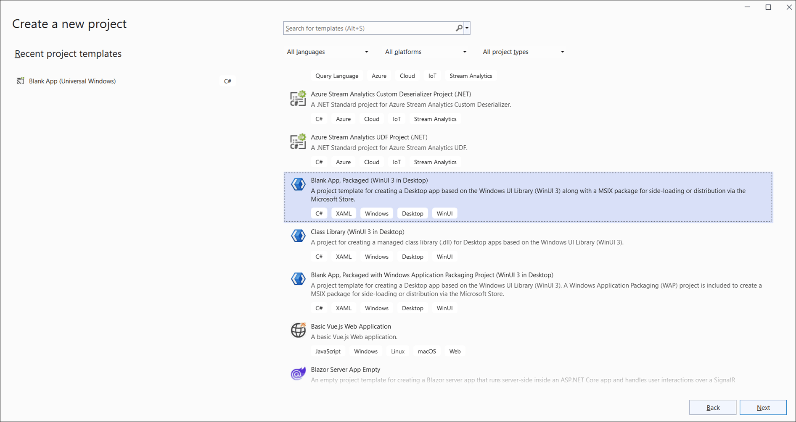
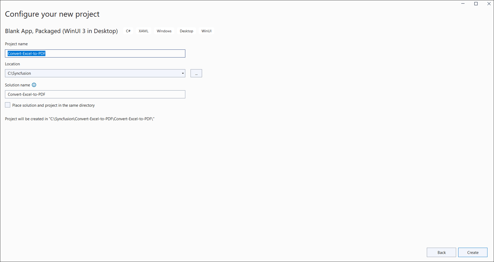
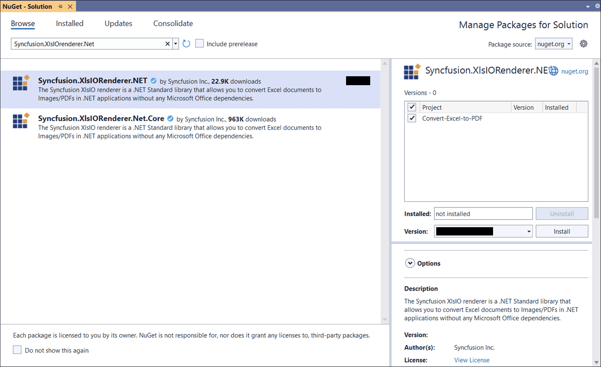
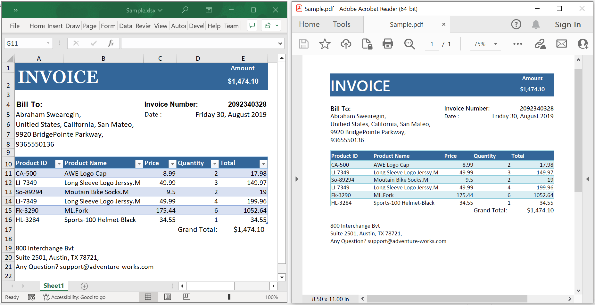

# Convert an Excel document to PDF in WinUI

Syncfusion<sup>&reg;</sup> XlsIO is a [WinUI Excel library](https://www.syncfusion.com/document-processing/excel-framework/winui/excel-library) used to create, read, edit, and convert Excel documents programmatically, without Microsoft Excel or interop dependencies.

## Prerequisites
To use the WinUI 3 project templates, install the Windows App SDK extension for Visual Studio. For more details, refer [here](https://learn.microsoft.com/en-us/windows/apps/windows-app-sdk/set-up-your-development-environment?tabs=cs-vs-community%2Ccpp-vs-community%2Cvs-2022-17-1-a%2Cvs-2022-17-1-b).

## WinUI Desktop app

Step 1: Create a new C# WinUI Desktop app. Select the **Blank App, Packaged (WinUI 3 in Desktop)** project template.



Step 2: Name the project and click **Create**.



Step 3: Install the [Syncfusion.XlsIORenderer.Net](https://www.nuget.org/packages/Syncfusion.XlsIORenderer.Net) NuGet package as a reference to your project from [NuGet.org](https://www.nuget.org/). This package transitively pulls in the required `Syncfusion.XlsIO.Net.Core` and `Syncfusion.Pdf.Net.Core` assemblies.



N> Starting with v16.2.0.x, if you reference Syncfusion<sup>&reg;</sup> assemblies from the trial setup or from the NuGet feed, you must also add the `Syncfusion.Licensing` reference and register a license key. Refer to this [link](https://help.syncfusion.com/common/essential-studio/licensing/overview) to learn how to register the Syncfusion<sup>&reg;</sup> license key. The simplest approach is to add the following call in `App.xaml.cs` before constructing the `ExcelEngine`:
> ```csharp
> Syncfusion.Licensing.SyncfusionLicenseProvider.RegisterLicense("YOUR_LICENSE_KEY");
> ```

Step 4: Add an `InputTemplate.xlsx` file to the project. In **Solution Explorer**, right-click the project, choose **Add → Existing Item**, select `InputTemplate.xlsx`, and set its **Build Action** to **Embedded Resource** in the Properties window. The logical name passed to `GetManifestResourceStream` (below) must match the project's default namespace followed by the file name (e.g. `Convert_Excel_to_PDF.InputTemplate.xlsx`).

Step 5: Add a new button to **MainWindow.xaml** as shown below.


<Window
    x:Class="Convert_Excel_to_PDF.MainWindow"
    xmlns="http://schemas.microsoft.com/winfx/2006/xaml/presentation"
    xmlns:x="http://schemas.microsoft.com/winfx/2006/xaml"
    xmlns:local="using:Convert_Excel_to_PDF"
    xmlns:d="http://schemas.microsoft.com/expression/blend/2008"
    xmlns:mc="http://schemas.openxmlformats.org/markup-compatibility/2006"
    mc:Ignorable="d">

    <StackPanel Orientation="Horizontal" HorizontalAlignment="Center" VerticalAlignment="Center">
        <Button x:Name="myButton" Click="ConvertExceltoPDF">Convert Excel to PDF</Button>
    </StackPanel>
</Window>



Step 6: Add the following namespaces in **MainWindow.xaml.cs**.


using Syncfusion.XlsIO;
using Syncfusion.Pdf;
using Syncfusion.XlsIORenderer;



Step 7: Add the following code in the **ConvertExceltoPDF** handler in **MainWindow.xaml.cs** to convert an Excel document to PDF. Note: `async void` is acceptable in WinUI 3 button-click event handlers; the `FileSavePicker` and `MessageDialog` calls inside `SaveAndLaunch` must be invoked on the UI thread.


private async void ConvertExceltoPDF(object sender, Microsoft.UI.Xaml.RoutedEventArgs e)
{
    using (ExcelEngine excelEngine = new ExcelEngine())
    {
        IApplication application = excelEngine.Excel;
        application.DefaultVersion = ExcelVersion.Xlsx;

        // Load the embedded Excel workbook as a stream.
        Assembly assembly = typeof(App).GetTypeInfo().Assembly;
        using (Stream inputStream = assembly.GetManifestResourceStream("Convert_Excel_to_PDF.InputTemplate.xlsx"))
        {
            IWorkbook workbook = application.Workbooks.Open(inputStream);

            // Initialize the XlsIO renderer.
            XlsIORenderer renderer = new XlsIORenderer();

            // Convert the Excel document to a PDF document.
            PdfDocument pdfDocument = renderer.ConvertToPDF(workbook);

            // Create a MemoryStream to save the converted PDF.
            MemoryStream pdfStream = new MemoryStream();

            // Save the converted PDF document to the MemoryStream.
            pdfDocument.Save(pdfStream);
            pdfStream.Position = 0;

            // Close the workbook and the PDF document to release resources.
            workbook.Close();
            pdfDocument.Close();

            // Save the PDF file or perform any other action with the PDF.
            await SaveHelper.SaveAndLaunch("Sample.pdf", pdfStream);
        }
    }
}



N> For additional control over page size, orientation, and font embedding, pass an `ExcelToPdfConverterSettings` instance to `XlsIORenderer.ConvertToPDF`. See the [Excel-to-PDF conversion options](https://help.syncfusion.com/document-processing/excel/conversions/excel-to-pdf/net/convert-excel-to-pdf-in-winui#excel-to-pdf-conversion-options) for details.

## Save PDF document in WinUI
Add a new C# class file named **SaveHelper** in the project and paste the following code into it. The helper uses a single `FileSavePicker` path (the legacy Windows Phone 8.1 branch is removed because it does not apply to WinUI 3 Desktop).


using System;
using System.IO;
using System.Threading.Tasks;
using System.Collections.Generic;
using System.Diagnostics;
using Windows.Storage;
using Windows.Storage.Pickers;
using Windows.Storage.Streams;
using Windows.UI.Popups;
using WinRT.Interop;

public static class SaveHelper
{
    // Save the PDF and offer to open the saved file in the default viewer.
    public static async Task SaveAndLaunch(string filename, MemoryStream stream)
    {
        // Get the process's main-window handle to open the dialog in the application process.
        IntPtr windowHandle = Process.GetCurrentProcess().MainWindowHandle;

        FileSavePicker savePicker = new FileSavePicker();
        savePicker.DefaultFileExtension = ".pdf";
        savePicker.SuggestedFileName = filename;
        // Save the file as a PDF file.
        savePicker.FileTypeChoices.Add("PDF", new List<string>() { ".pdf" });

        // Required in WinUI 3 Desktop so the picker is parented to the application window.
        InitializeWithWindow.Initialize(savePicker, windowHandle);

        StorageFile storageFile = await savePicker.PickSaveFileAsync();
        if (storageFile != null)
        {
            using (IRandomAccessStream zipStream = await storageFile.OpenAsync(FileAccessMode.ReadWrite))
            {
                // Write the PDF data from memory to the file.
                using Stream outstream = zipStream.AsStreamForWrite();
                outstream.SetLength(0);
                stream.CopyTo(outstream);
                outstream.Flush();
            }

            // Create a message dialog.
            MessageDialog msgDialog = new MessageDialog("Do you want to view the Document?", "File has been converted successfully");
            UICommand yesCmd = new UICommand("Yes");
            msgDialog.Commands.Add(yesCmd);
            UICommand noCmd = new UICommand("No");
            msgDialog.Commands.Add(noCmd);

            // Show the dialog.
            IUICommand cmd = await msgDialog.ShowAsync();
            if (cmd.Label == yesCmd.Label)
            {
                // Launch the saved file in the default viewer.
                await Windows.System.Launcher.LaunchFileAsync(storageFile);
            }
        }
    }
}



A complete working example of how to convert an Excel document to PDF in WinUI is present on [this GitHub page](https://github.com/SyncfusionExamples/XlsIO-Examples/tree/master/Getting%20Started/WinUI/Convert%20Excel%20to%20PDF).

By executing the program, you will get the **PDF document** as shown below.



Click [here](https://www.syncfusion.com/document-processing/excel-framework/winui) to explore the rich set of Syncfusion<sup>&reg;</sup> Excel library (XlsIO) features.

An online sample link to [convert an Excel document to PDF](https://ej2.syncfusion.com/aspnetcore/Excel/ExcelToPDF#/material3) in ASP.NET Core.
