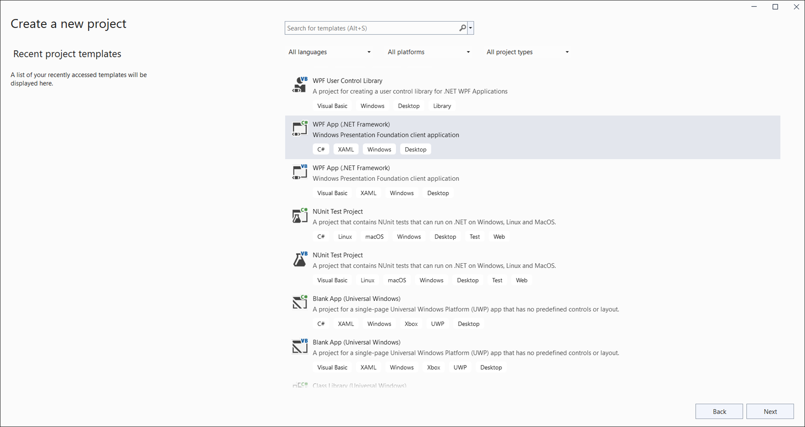
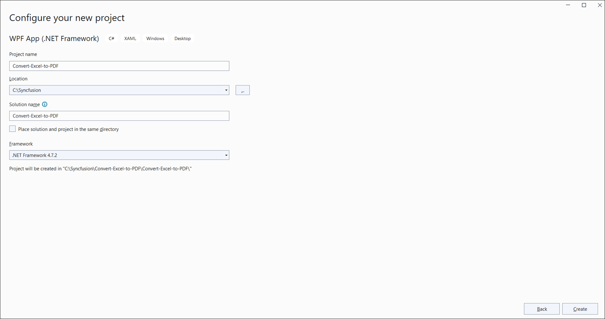
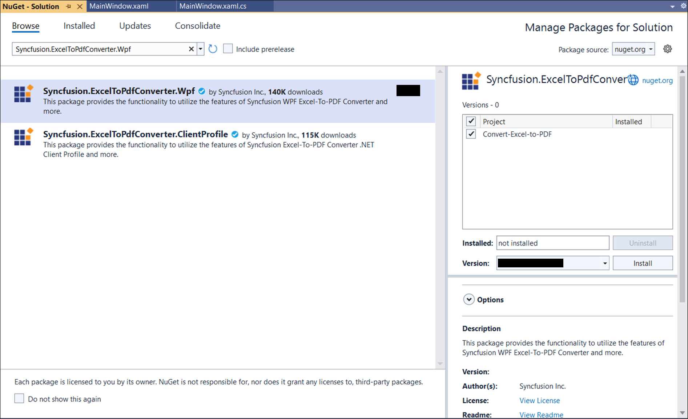

# Convert an Excel document to PDF in WPF

Syncfusion<sup>&reg;</sup> XlsIO is a [.NET Excel Library](https://www.syncfusion.com/document-processing/excel-framework/net/excel-library) used to create, read, edit, and convert Excel documents programmatically, without Microsoft Excel or interop dependencies.

## Steps to convert an Excel document to PDF in WPF

Step 1: Create a new WPF application project.



Step 2: Name the project, choose the framework, and click **Create**.



Step 3: Install the [Syncfusion.ExcelToPdfConverter.Wpf](https://www.nuget.org/packages/Syncfusion.ExcelToPDFConverter.Wpf) NuGet package as a reference to your project from [NuGet.org](https://www.nuget.org/).



N> Starting with v16.2.0.x, if you reference Syncfusion<sup>&reg;</sup> assemblies from the trial setup or from the NuGet feed, you must also add the `Syncfusion.Licensing` reference and register a license key. Refer to this [link](https://help.syncfusion.com/common/essential-studio/licensing/overview) to learn how to register the Syncfusion<sup>&reg;</sup> license key. The simplest approach is to add the following call in `App.xaml.cs` (or in `Main` before `app.Run()`) before constructing the `ExcelEngine`:
> ```csharp
> Syncfusion.Licensing.SyncfusionLicenseProvider.RegisterLicense("YOUR_LICENSE_KEY");
> ```

Step 4: Add a new button to **MainWindow.xaml** (inside the existing `<Grid>`) as shown below.


<Button Click="btnConvert_Click" Margin="0,0,10,12" VerticalAlignment="Bottom" Height="30" BorderBrush="LightBlue" HorizontalAlignment="Right" Width="180">
    <Button.Background>
        <LinearGradientBrush EndPoint="0.5,-0.04" StartPoint="0.5,1.04">
            <GradientStop Color="#FFD9E9F7" Offset="0"/>
            <GradientStop Color="#FFEFF8FF" Offset="1"/>
        </LinearGradientBrush>
    </Button.Background>
    <StackPanel Orientation="Horizontal" Height="23" Margin="0,0,0,-2.52" VerticalAlignment="Bottom" HorizontalAlignment="Right" Width="100">
        <Image Name="image2" Margin="2" HorizontalAlignment="Center" VerticalAlignment="Center" />
        <TextBlock Text="Convert Excel to PDF" Height="15.96" Width="126" Margin="0,4,0,3"/>
    </StackPanel>
</Button>



Step 5: Add the following namespaces in **MainWindow.xaml.cs**.


using Syncfusion.XlsIO;
using Syncfusion.Pdf;
using Syncfusion.ExcelToPdfConverter;



Step 6: Add the following code in the **btnConvert_Click** handler in **MainWindow.xaml.cs** to convert an Excel document to PDF. Place a `Sample.xlsx` file in the project's `bin\Debug` folder (or set its **Copy to Output Directory** property to **Copy if newer**) so the relative path resolves.


private void btnConvert_Click(object sender, RoutedEventArgs e)
{
    using (ExcelEngine excelEngine = new ExcelEngine())
    {
        IApplication application = excelEngine.Excel;
        application.DefaultVersion = ExcelVersion.Xlsx;

        //Open the existing Excel workbook. Adjust the path as required.
        IWorkbook workbook = application.Workbooks.Open("Sample.xlsx");

        //Initialize the Excel-to-PDF converter
        ExcelToPdfConverter converter = new ExcelToPdfConverter(workbook);

        //Convert the Excel document to a PDF document
        PdfDocument pdfDocument = converter.Convert();

        //Save the converted PDF document to the application's working directory
        pdfDocument.Save("Sample.pdf");

        //Close the workbook and the PDF document to release resources
        workbook.Close();
        pdfDocument.Close();

        //Notify the user that the PDF was generated
        MessageBox.Show("Sample.pdf has been saved to " + System.AppDomain.CurrentDomain.BaseDirectory);
    }
}



N> For additional control over page size, orientation, and font embedding, pass an `ExcelToPdfConverterSettings` instance when creating the `ExcelToPdfConverter` and call the `Convert(ExcelToPdfConverterSettings)` overload. See the [Excel-to-PDF conversion settings](https://help.syncfusion.com/document-processing/excel/conversions/excel-to-pdf/net/excel-to-pdf-converter-settings) for details.

A complete working example of how to convert an Excel document to PDF in WPF is present on [this GitHub page](https://github.com/SyncfusionExamples/XlsIO-Examples/tree/master/Getting%20Started/WPF/Convert%20Excel%20to%20PDF).

By executing the program, you will get the **PDF document** as shown below.


Click [here](https://www.syncfusion.com/document-processing/excel-framework/net) to explore the rich set of Syncfusion<sup>&reg;</sup> Excel library (XlsIO) features.

An online sample link to [convert an Excel document to PDF](https://document.syncfusion.com/demos/excel/exceltopdf#/tailwind) in ASP.NET Core.