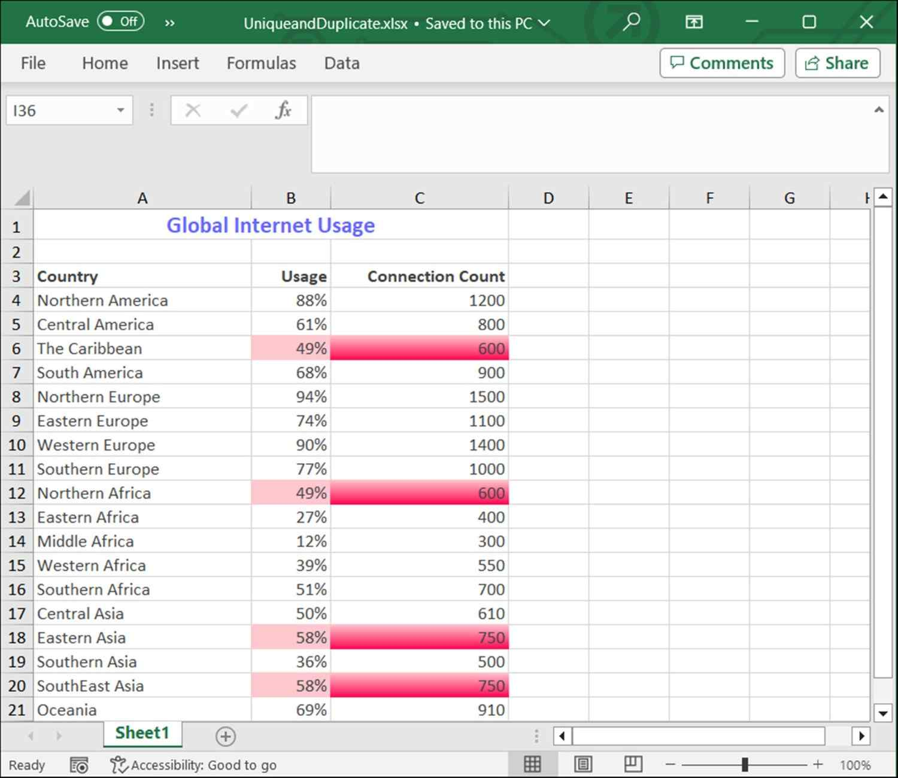

# Highlight Cells in Conditional Formatting

Highlight cell rules are powerful tools for data analysis and presentation, enhancing the ability to quickly interpret and act upon data within worksheets.

## Format Unique and Duplicate Values

Format unique and duplicate values of an Excel range using conditional formatting. The values, **Unique** and **Duplicate** of the enumeration [ExcelCFType](https://help.syncfusion.com/cr/document-processing/Syncfusion.XlsIO.ExcelCFType.html) helps to achieve the requirement.

The following code example illustrates how to format unique and duplicate values using conditional formatting.

  
{% highlight c# tabtitle="C# [Cross-platform]" playgroundButtonLink="https://raw.githubusercontent.com/SyncfusionExamples/XlsIO-Examples/master/Conditional%20Formatting/Unique%20and%20Duplicate/.NET/Unique%20and%20Duplicate/Unique%20and%20Duplicate/Program.cs,180" %}
using (ExcelEngine excelEngine = new ExcelEngine())
{
	IApplication application = excelEngine.Excel;
	application.DefaultVersion = ExcelVersion.Excel2016;
	IWorkbook workbook = application.Workbooks.Create(1);
	IWorksheet worksheet = workbook.Worksheets[0];

	//Fill worksheet with data
	worksheet.Range["A1:B1"].Merge();
	worksheet.Range["A1:B1"].CellStyle.Font.RGBColor = Color.FromArgb(255, 102, 102, 255);
	worksheet.Range["A1:B1"].CellStyle.Font.Size = 14;
	worksheet.Range["A1:B1"].CellStyle.HorizontalAlignment = ExcelHAlign.HAlignCenter;
	worksheet.Range["A1"].Text = "Global Internet Usage";
	worksheet.Range["A1:B1"].CellStyle.Font.Bold = true;

	worksheet.Range["A3:B21"].CellStyle.Font.RGBColor = Color.FromArgb(255, 64, 64, 64);
	worksheet.Range["A3:B3"].CellStyle.Font.Bold = true;
	worksheet.Range["B3"].CellStyle.HorizontalAlignment = ExcelHAlign.HAlignRight;

	worksheet.Range["A3"].Text = "Country";
	worksheet.Range["A4"].Text = "Northern America";
	worksheet.Range["A5"].Text = "Central America";
	worksheet.Range["A6"].Text = "The Caribbean";
	worksheet.Range["A7"].Text = "South America";
	worksheet.Range["A8"].Text = "Northern Europe";
	worksheet.Range["A9"].Text = "Eastern Europe";
	worksheet.Range["A10"].Text = "Western Europe";
	worksheet.Range["A11"].Text = "Southern Europe";
	worksheet.Range["A12"].Text = "Northern Africa";
	worksheet.Range["A13"].Text = "Eastern Africa";
	worksheet.Range["A14"].Text = "Middle Africa";
	worksheet.Range["A15"].Text = "Western Africa";
	worksheet.Range["A16"].Text = "Southern Africa";
	worksheet.Range["A17"].Text = "Central Asia";
	worksheet.Range["A18"].Text = "Eastern Asia";
	worksheet.Range["A19"].Text = "Southern Asia";
	worksheet.Range["A20"].Text = "SouthEast Asia";
	worksheet.Range["A21"].Text = "Oceania";

	worksheet.Range["B3"].Text = "Usage";
	worksheet.SetValue(4, 2, "88%");
    worksheet.SetValue(5, 2, "61%");
    worksheet.SetValue(6, 2, "49%");
    worksheet.SetValue(7, 2, "68%");
    worksheet.SetValue(8, 2, "94%");
    worksheet.SetValue(9, 2, "74%");
    worksheet.SetValue(10, 2, "90%");
    worksheet.SetValue(11, 2, "77%");
    worksheet.SetValue(12, 2, "49%");
    worksheet.SetValue(13, 2, "27%");
    worksheet.SetValue(14, 2, "12%");
    worksheet.SetValue(15, 2, "39%");
    worksheet.SetValue(16, 2, "51%");
    worksheet.SetValue(17, 2, "50%");
    worksheet.SetValue(18, 2, "58%");
    worksheet.SetValue(19, 2, "36%");
    worksheet.SetValue(20, 2, "58%");
    worksheet.SetValue(21, 2, "69%");

	worksheet.SetColumnWidth(1, 23.45);
	worksheet.SetColumnWidth(2, 8.09);

	IConditionalFormats conditionalFormats =
	worksheet.Range["A4:B21"].ConditionalFormats;
	IConditionalFormat condition = conditionalFormats.AddCondition();

	//conditional format to set duplicate format type
	condition.FormatType = ExcelCFType.Duplicate;
	condition.BackColorRGB = Color.FromArgb(255, 255, 199, 206);

	#region Save
	//Saving the workbook
	workbook.SaveAs(Path.GetFullPath("Output/UniqueandDuplicate.xlsx"));
	#endregion
}



using (ExcelEngine excelEngine = new ExcelEngine())
{
  IApplication application = excelEngine.Excel;
  application.DefaultVersion = ExcelVersion.Xlsx;
  IWorkbook workbook = application.Workbooks.Create(1);
  IWorksheet worksheet = workbook.Worksheets[0];

  //Fill worksheet with data
  worksheet.Range["A1:C1"].Merge();
  worksheet.Range["A1:C1"].CellStyle.Font.RGBColor = Color.FromArgb(255, 102, 102, 255);
  worksheet.Range["A1:C1"].CellStyle.Font.Size = 14;
  worksheet.Range["A1:C1"].CellStyle.HorizontalAlignment = ExcelHAlign.HAlignCenter;
  worksheet.Range["A1"].Text = "Global Internet Usage";
  worksheet.Range["A1:C1"].CellStyle.Font.Bold = true;

  worksheet.Range["A3:C21"].CellStyle.Font.RGBColor = Color.FromArgb(255, 64, 64, 64);
  worksheet.Range["A3:C3"].CellStyle.Font.Bold = true;
  worksheet.Range["B3:C3"].CellStyle.HorizontalAlignment = ExcelHAlign.HAlignRight;

  worksheet.Range["A3"].Text = "Country";
  worksheet.Range["A4"].Text = "Northern America";
  worksheet.Range["A5"].Text = "Central America";
  worksheet.Range["A6"].Text = "The Caribbean";
  worksheet.Range["A7"].Text = "South America";
  worksheet.Range["A8"].Text = "Northern Europe";
  worksheet.Range["A9"].Text = "Eastern Europe";
  worksheet.Range["A10"].Text = "Western Europe";
  worksheet.Range["A11"].Text = "Southern Europe";
  worksheet.Range["A12"].Text = "Northern Africa";
  worksheet.Range["A13"].Text = "Eastern Africa";
  worksheet.Range["A14"].Text = "Middle Africa";
  worksheet.Range["A15"].Text = "Western Africa";
  worksheet.Range["A16"].Text = "Southern Africa";
  worksheet.Range["A17"].Text = "Central Asia";
  worksheet.Range["A18"].Text = "Eastern Asia";
  worksheet.Range["A19"].Text = "Southern Asia";
  worksheet.Range["A20"].Text = "SouthEast Asia";
  worksheet.Range["A21"].Text = "Oceania";

  worksheet.Range["B3"].Text = "Usage";
  worksheet.SetValue(4, 2, "88%");
  worksheet.SetValue(5, 2, "61%");
  worksheet.SetValue(6, 2, "49%");
  worksheet.SetValue(7, 2, "68%");
  worksheet.SetValue(8, 2, "94%");
  worksheet.SetValue(9, 2, "74%");
  worksheet.SetValue(10, 2, "90%");
  worksheet.SetValue(11, 2, "77%");
  worksheet.SetValue(12, 2, "49%");
  worksheet.SetValue(13, 2, "27%");
  worksheet.SetValue(14, 2, "12%");
  worksheet.SetValue(15, 2, "39%");
  worksheet.SetValue(16, 2, "51%");
  worksheet.SetValue(17, 2, "50%");
  worksheet.SetValue(18, 2, "58%");
  worksheet.SetValue(19, 2, "36%");
  worksheet.SetValue(20, 2, "58%");
  worksheet.SetValue(21, 2, "69%");

  worksheet.Range["C3"].Text = "Connection Count";
  worksheet.Range["C3"].AutofitColumns();
  worksheet.Range["C4"].Number = 1200;  
  worksheet.Range["C5"].Number = 800;   
  worksheet.Range["C6"].Number = 600;   
  worksheet.Range["C7"].Number = 900;   
  worksheet.Range["C8"].Number = 1500;  
  worksheet.Range["C9"].Number = 1100;  
  worksheet.Range["C10"].Number = 1400; 
  worksheet.Range["C11"].Number = 1000; 
  worksheet.Range["C12"].Number = 600;  
  worksheet.Range["C13"].Number = 400;  
  worksheet.Range["C14"].Number = 300;  
  worksheet.Range["C15"].Number = 550;  
  worksheet.Range["C16"].Number = 700;
  worksheet.Range["C17"].Number = 610; 
  worksheet.Range["C18"].Number = 750; 
  worksheet.Range["C19"].Number = 500;  
  worksheet.Range["C20"].Number = 750;  
  worksheet.Range["C21"].Number = 910;

  worksheet.SetColumnWidth(1, 23.45);
  worksheet.SetColumnWidth(2, 8.09);

  IConditionalFormats conditionalFormats1 =
  worksheet.Range["B4:B21"].ConditionalFormats;
  IConditionalFormat condition1 = conditionalFormats1.AddCondition();

  //Set solid color conditional formatting for duplicate values.
  condition1.FormatType = ExcelCFType.Duplicate;
  condition1.FillPattern = ExcelPattern.Solid;
  condition1.BackColorRGB = Color.FromArgb(255, 255, 199, 206);

  IConditionalFormats conditionalFormats2 =
  worksheet.Range["C4:C21"].ConditionalFormats;
  IConditionalFormat condition2 = conditionalFormats2.AddCondition();

  //Set gradient color conditional formatting for duplicate values.
  condition2.FormatType = ExcelCFType.Duplicate;
  condition2.FillPattern = ExcelPattern.Gradient;
  condition2.BackColorRGB = Color.FromArgb(255, 255, 199, 206);
  condition2.ColorRGB = Color.FromArgb(200, 255, 5, 79);
  condition2.GradientStyle = ExcelGradientStyle.Horizontal;
  condition2.GradientVariant = ExcelGradientVariants.ShadingVariants_1;

  //Saving the workbook
  workbook.SaveAs("Output.xlsx");
}



Using excelEngine As New ExcelEngine()
  Dim application As IApplication = excelEngine.Excel
  application.DefaultVersion = ExcelVersion.Xlsx
  Dim workbook As IWorkbook = application.Workbooks.Create(1)
  Dim worksheet As IWorksheet = workbook.Worksheets(0)

  ' Fill worksheet with data
  worksheet.Range("A1:C1").Merge()
  worksheet.Range("A1:C1").CellStyle.Font.RGBColor = Color.FromArgb(255, 102, 102, 255)
  worksheet.Range("A1:C1").CellStyle.Font.Size = 14
  worksheet.Range("A1:C1").CellStyle.HorizontalAlignment = ExcelHAlign.HAlignCenter
  worksheet.Range("A1").Text = "Global Internet Usage"
  worksheet.Range("A1:C1").CellStyle.Font.Bold = True

  worksheet.Range("A3:C21").CellStyle.Font.RGBColor = Color.FromArgb(255, 64, 64, 64)
  worksheet.Range("A3:C3").CellStyle.Font.Bold = True
  worksheet.Range("B3:C3").CellStyle.HorizontalAlignment = ExcelHAlign.HAlignRight

  worksheet.Range("A3").Text = "Country"
  worksheet.Range("A4").Text = "Northern America"
  worksheet.Range("A5").Text = "Central America"
  worksheet.Range("A6").Text = "The Caribbean"
  worksheet.Range("A7").Text = "South America"
  worksheet.Range("A8").Text = "Northern Europe"
  worksheet.Range("A9").Text = "Eastern Europe"
  worksheet.Range("A10").Text = "Western Europe"
  worksheet.Range("A11").Text = "Southern Europe"
  worksheet.Range("A12").Text = "Northern Africa"
  worksheet.Range("A13").Text = "Eastern Africa"
  worksheet.Range("A14").Text = "Middle Africa"
  worksheet.Range("A15").Text = "Western Africa"
  worksheet.Range("A16").Text = "Southern Africa"
  worksheet.Range("A17").Text = "Central Asia"
  worksheet.Range("A18").Text = "Eastern Asia"
  worksheet.Range("A19").Text = "Southern Asia"
  worksheet.Range("A20").Text = "SouthEast Asia"
  worksheet.Range("A21").Text = "Oceania"

  worksheet.Range("B3").Text = "Usage"
  worksheet.SetValue(4, 2, "88%")
  worksheet.SetValue(5, 2, "61%")
  worksheet.SetValue(6, 2, "49%")
  worksheet.SetValue(7, 2, "68%")
  worksheet.SetValue(8, 2, "94%")
  worksheet.SetValue(9, 2, "74%")
  worksheet.SetValue(10, 2, "90%")
  worksheet.SetValue(11, 2, "77%")
  worksheet.SetValue(12, 2, "49%")
  worksheet.SetValue(13, 2, "27%")
  worksheet.SetValue(14, 2, "12%")
  worksheet.SetValue(15, 2, "39%")
  worksheet.SetValue(16, 2, "51%")
  worksheet.SetValue(17, 2, "50%")
  worksheet.SetValue(18, 2, "58%")
  worksheet.SetValue(19, 2, "36%")
  worksheet.SetValue(20, 2, "58%")
  worksheet.SetValue(21, 2, "69%")

  worksheet.Range("C3").Text = "Connection Count"
  worksheet.Range("C3").AutofitColumns()
  worksheet.Range("C4").Number = 1200
  worksheet.Range("C5").Number = 800
  worksheet.Range("C6").Number = 600
  worksheet.Range("C7").Number = 900
  worksheet.Range("C8").Number = 1500
  worksheet.Range("C9").Number = 1100
  worksheet.Range("C10").Number = 1400
  worksheet.Range("C11").Number = 1000
  worksheet.Range("C12").Number = 600
  worksheet.Range("C13").Number = 400
  worksheet.Range("C14").Number = 300
  worksheet.Range("C15").Number = 550
  worksheet.Range("C16").Number = 700
  worksheet.Range("C17").Number = 610
  worksheet.Range("C18").Number = 750
  worksheet.Range("C19").Number = 500
  worksheet.Range("C20").Number = 750
  worksheet.Range("C21").Number = 910

  worksheet.SetColumnWidth(1, 23.45)
  worksheet.SetColumnWidth(2, 8.09)

  Dim conditionalFormats1 As IConditionalFormats = worksheet.Range("B4:B21").ConditionalFormats
  Dim condition1 As IConditionalFormat = conditionalFormats1.AddCondition()

  ' Set solid color conditional formatting for duplicate values.
  condition1.FormatType = ExcelCFType.Duplicate
  condition1.FillPattern = ExcelPattern.Solid
  condition1.BackColorRGB = Color.FromArgb(255, 255, 199, 206)

  Dim conditionalFormats2 As IConditionalFormats = worksheet.Range("C4:C21").ConditionalFormats
  Dim condition2 As IConditionalFormat = conditionalFormats2.AddCondition()

  ' Set gradient color conditional formatting for duplicate values.
  condition2.FormatType = ExcelCFType.Duplicate
  condition2.FillPattern = ExcelPattern.Gradient
  condition2.BackColorRGB = Color.FromArgb(255, 255, 199, 206)
  condition2.ColorRGB = Color.FromArgb(200, 255, 5, 79)
  condition2.GradientStyle = ExcelGradientStyle.Horizontal
  condition2.GradientVariant = ExcelGradientVariants.ShadingVariants_1

  ' Saving the workbook
  workbook.SaveAs("Output.xlsx")
End Using



A complete working example to format unique and duplicate values in C# is present on [this GitHub page](https://github.com/SyncfusionExamples/XlsIO-Examples/tree/master/Conditional%20Formatting/Unique%20and%20Duplicate/.NET/Unique%20and%20Duplicate).

By executing the program, you will get the Excel file as below

.