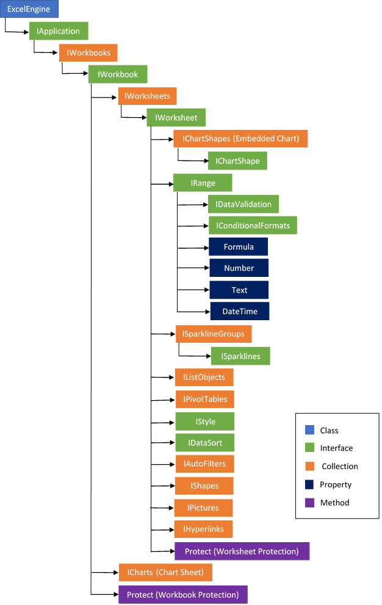

# Document Object Model

When an existing document is opened or a new document is created, the XlsIO library creates a **Document Object Model** (DOM) of the document in main memory. This object model can be used to manipulate the document as needed.

**Object Reference Links**

<table>
<tr>
<th><b>Object</b>  </th>
<th><b>Reference Link</b>  </th>
</tr>
<tbody>
<tr>
<td>ExcelEngine  </td>
<td><a href="https://help.syncfusion.com/cr/document-processing/Syncfusion.XlsIO.ExcelEngine.html">https://help.syncfusion.com/cr/document-processing/Syncfusion.XlsIO.ExcelEngine.html</a>  </td>
</tr>
<tr>
<td>IApplication  </td>
<td><a href="https://help.syncfusion.com/cr/document-processing/Syncfusion.XlsIO.IApplication.html">https://help.syncfusion.com/cr/document-processing/Syncfusion.XlsIO.IApplication.html</a>  </td>
</tr>
<tr>
<td>IWorkbooks  </td>
<td><a href="https://help.syncfusion.com/cr/document-processing/Syncfusion.XlsIO.IWorkbooks.html">https://help.syncfusion.com/cr/document-processing/Syncfusion.XlsIO.IWorkbooks.html</a>  </td>
</tr>
<tr>
<td>IWorkbook  </td>
<td><a href="https://help.syncfusion.com/cr/document-processing/Syncfusion.XlsIO.IWorkbook.html">https://help.syncfusion.com/cr/document-processing/Syncfusion.XlsIO.IWorkbook.html</a>  </td>
</tr>
<tr>
<td>IWorksheets  </td>
<td><a href="https://help.syncfusion.com/cr/document-processing/Syncfusion.XlsIO.IWorksheets.html">https://help.syncfusion.com/cr/document-processing/Syncfusion.XlsIO.IWorksheets.html</a>  </td>
</tr>
<tr>
<td>IWorksheet  </td>
<td><a href="https://help.syncfusion.com/cr/document-processing/Syncfusion.XlsIO.IWorksheet.html">https://help.syncfusion.com/cr/document-processing/Syncfusion.XlsIO.IWorksheet.html</a>  </td>
</tr>
<tr>
<td>IChartShapes (Embedded Chart)  </td>
<td><a href="https://help.syncfusion.com/cr/document-processing/Syncfusion.XlsIO.IChartShapes.html">https://help.syncfusion.com/cr/document-processing/Syncfusion.XlsIO.IChartShapes.html</a>  </td>
</tr>
<tr>
<td>IChartShape  </td>
<td><a href="https://help.syncfusion.com/cr/document-processing/Syncfusion.XlsIO.IChartShape.html">https://help.syncfusion.com/cr/document-processing/Syncfusion.XlsIO.IChartShape.html</a>  </td>
</tr>
<tr>
<td>IRange  </td>
<td><a href="https://help.syncfusion.com/cr/document-processing/Syncfusion.XlsIO.IRange.html">https://help.syncfusion.com/cr/document-processing/Syncfusion.XlsIO.IRange.html</a>  </td>
</tr>
<tr>
<td>IDataValidation  </td>
<td><a href="https://help.syncfusion.com/cr/document-processing/Syncfusion.XlsIO.IDataValidation.html">https://help.syncfusion.com/cr/document-processing/Syncfusion.XlsIO.IDataValidation.html</a>  </td>
</tr>
<tr>
<td>IConditionalFormats  </td>
<td><a href="https://help.syncfusion.com/cr/document-processing/Syncfusion.XlsIO.IConditionalFormats.html">https://help.syncfusion.com/cr/document-processing/Syncfusion.XlsIO.IConditionalFormats.html</a>  </td>
</tr>
<tr>
<td>Formula  </td>
<td><a href="https://help.syncfusion.com/cr/document-processing/Syncfusion.XlsIO.IRange.html#Syncfusion_XlsIO_IRange_Formula">https://help.syncfusion.com/cr/document-processing/Syncfusion.XlsIO.IRange.html#Syncfusion_XlsIO_IRange_Formula</a>  </td>
</tr>
<tr>
<td>Number  </td>
<td><a href="https://help.syncfusion.com/cr/document-processing/Syncfusion.XlsIO.IRange.html#Syncfusion_XlsIO_IRange_Number">https://help.syncfusion.com/cr/document-processing/Syncfusion.XlsIO.IRange.html#Syncfusion_XlsIO_IRange_Number</a>  </td>
</tr>
<tr>
<td>Text  </td>
<td><a href="https://help.syncfusion.com/cr/document-processing/Syncfusion.XlsIO.IRange.html#Syncfusion_XlsIO_IRange_Text">https://help.syncfusion.com/cr/document-processing/Syncfusion.XlsIO.IRange.html#Syncfusion_XlsIO_IRange_Text</a>  </td>
</tr>
<tr>
<td>DateTime  </td>
<td><a href="https://help.syncfusion.com/cr/document-processing/Syncfusion.XlsIO.IRange.html#Syncfusion_XlsIO_IRange_DateTime">https://help.syncfusion.com/cr/document-processing/Syncfusion.XlsIO.IRange.html#Syncfusion_XlsIO_IRange_DateTime</a>  </td>
</tr>
<tr>
<td>ISparklineGroups  </td>
<td><a href="https://help.syncfusion.com/cr/document-processing/Syncfusion.XlsIO.ISparklineGroups.html">https://help.syncfusion.com/cr/document-processing/Syncfusion.XlsIO.ISparklineGroups.html</a>  </td>
</tr>
<tr>
<td>ISparklines  </td>
<td><a href="https://help.syncfusion.com/cr/document-processing/Syncfusion.XlsIO.ISparklines.html">https://help.syncfusion.com/cr/document-processing/Syncfusion.XlsIO.ISparklines.html</a>  </td>
</tr>
<tr>
<td>IListObjects  </td>
<td><a href="https://help.syncfusion.com/cr/document-processing/Syncfusion.XlsIO.IListObjects.html">https://help.syncfusion.com/cr/document-processing/Syncfusion.XlsIO.IListObjects.html</a>  </td>
</tr>
<tr>
<td>IPivotTables  </td>
<td><a href="https://help.syncfusion.com/cr/document-processing/Syncfusion.XlsIO.IPivotTables.html">https://help.syncfusion.com/cr/document-processing/Syncfusion.XlsIO.IPivotTables.html</a>  </td>
</tr>
<tr>
<td>IStyle  </td>
<td><a href="https://help.syncfusion.com/cr/document-processing/Syncfusion.XlsIO.IStyle.html">https://help.syncfusion.com/cr/document-processing/Syncfusion.XlsIO.IStyle.html</a>  </td>
</tr>
<tr>
<td>IDataSort  </td>
<td><a href="https://help.syncfusion.com/cr/document-processing/Syncfusion.XlsIO.IDataSort.html">https://help.syncfusion.com/cr/document-processing/Syncfusion.XlsIO.IDataSort.html</a>  </td>
</tr>
<tr>
<td>IAutoFilters  </td>
<td><a href="https://help.syncfusion.com/cr/document-processing/Syncfusion.XlsIO.IAutoFilters.html">https://help.syncfusion.com/cr/document-processing/Syncfusion.XlsIO.IAutoFilters.html</a>  </td>
</tr>
<tr>
<td>IShapes  </td>
<td><a href="https://help.syncfusion.com/cr/document-processing/Syncfusion.XlsIO.IShapes.html">https://help.syncfusion.com/cr/document-processing/Syncfusion.XlsIO.IShapes.html</a>  </td>
</tr>
<tr>
<td>IPictures  </td>
<td><a href="https://help.syncfusion.com/cr/document-processing/Syncfusion.XlsIO.IPictures.html">https://help.syncfusion.com/cr/document-processing/Syncfusion.XlsIO.IPictures.html</a>  </td>
</tr>
<tr>
<td>IHyperlinks  </td>
<td><a href="https://help.syncfusion.com/cr/document-processing/Syncfusion.XlsIO.IHyperLinks.html">https://help.syncfusion.com/cr/document-processing/Syncfusion.XlsIO.IHyperLinks.html</a>  </td>
</tr>
<tr>
<td>Protect (Worksheet Protection)  </td>
<td><a href="https://help.syncfusion.com/cr/document-processing/Syncfusion.XlsIO.ITabsheet.html#Syncfusion_XlsIO_ITabSheet_Protect_System_String_">https://help.syncfusion.com/cr/document-processing/Syncfusion.XlsIO.ITabsheet.html#Syncfusion_XlsIO_ITabSheet_Protect_System_String_</a>  </td>
</tr>
<tr>
<td>ICharts (Chart Sheet)  </td>
<td><a href="https://help.syncfusion.com/cr/document-processing/Syncfusion.XlsIO.ICharts.html">https://help.syncfusion.com/cr/document-processing/Syncfusion.XlsIO.ICharts.html</a>  </td>
</tr>
<tr>
<td>Protect (Workbook Protection)  </td>
<td><a href="https://help.syncfusion.com/cr/document-processing/Syncfusion.XlsIO.IWorkbook.html#Syncfusion_XlsIO_IWorkbook_Protect_System_Boolean_System_Boolean_">https://help.syncfusion.com/cr/document-processing/Syncfusion.XlsIO.IWorkbook.html#Syncfusion_XlsIO_IWorkbook_Protect_System_Boolean_System_Boolean_</a>  </td>
</tr>
</tbody>
</table>
