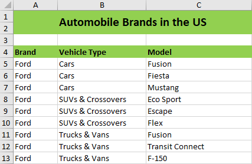
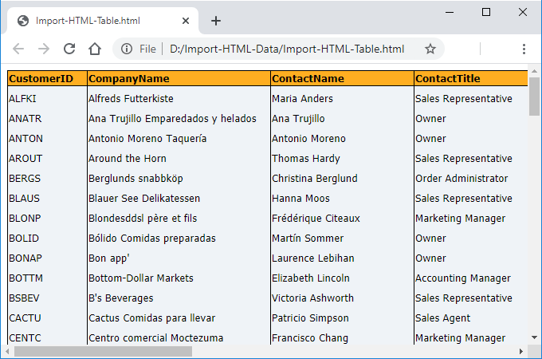
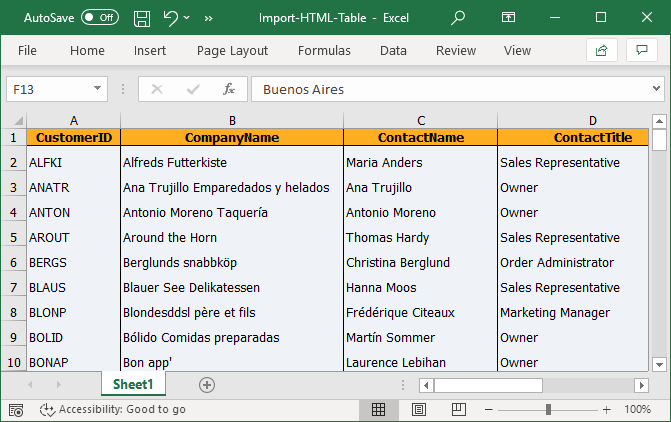

# Import to Excel Document

## DataTable to Excel

The following code example illustrates on how to import a DataTable into an Excel using [ImportDataTable](https://help.syncfusion.com/cr/document-processing/Syncfusion.XlsIO.IWorksheet.html#Syncfusion_XlsIO_IWorksheet_ImportDataTable_System_Data_DataTable_Syncfusion_XlsIO_IName_System_Boolean_System_Int32_System_Int32_) method.

N> XlsIO supports importing of data from data table to worksheet in Windows Forms, WPF, ASP.NET, ASP.NET MVC and ASP.NET Core (2.0 onwards) platforms alone.

  
{% highlight c# tabtitle="C# [Cross-platform]" playgroundButtonLink="https://raw.githubusercontent.com/SyncfusionExamples/XlsIO-Examples/master/Import%20and%20Export%20Data/DataTable%20to%20Worksheet/.NET/DataTable%20to%20Worksheet/DataTable%20to%20Worksheet/Program.cs,180" %}
 using (ExcelEngine excelEngine = new ExcelEngine())
{
	IApplication application = excelEngine.Excel;
	application.DefaultVersion = ExcelVersion.Xlsx;
	IWorkbook workbook = application.Workbooks.Create(1);
	IWorksheet worksheet = workbook.Worksheets[0];

	#region Import from Data Table
	//Initialize the DataTable
	DataTable table = SampleDataTable();
	//Import DataTable to the worksheet
	worksheet.ImportDataTable(table, true, 1, 1);
	#endregion

	#region Save
	//Saving the workbook
	workbook.SaveAs(Path.GetFullPath("Output/ImportDataTable.xlsx"));
	#endregion
}



using (ExcelEngine excelEngine = new ExcelEngine())
{
  IApplication application = excelEngine.Excel;
  application.DefaultVersion = ExcelVersion.Excel2013;
  IWorkbook workbook = application.Workbooks.Create(1);
  IWorksheet worksheet = workbook.Worksheets[0];

  //Initialize the DataTable
  DataTable table = SampleDataTable();
  //Import DataTable to the worksheet.
  worksheet.ImportDataTable(table, true, 1, 1);

  workbook.SaveAs("ImportFromDT.xlsx");
}



Using excelEngine As ExcelEngine = New ExcelEngine()
  Dim application As IApplication = excelEngine.Excel
  application.DefaultVersion = ExcelVersion.Excel2013
  Dim workbook As IWorkbook = application.Workbooks.Create(1)
  Dim worksheet As IWorksheet = workbook.Worksheets(0)

  'Initialize the DataTable
  Dim table As DataTable = sampleDataTable()
  'Import DataTable to the worksheet
  worksheet.ImportDataTable(table, True, 1, 1)

  workbook.SaveAs("ImportFromDT.xlsx")
End Using

  

A complete working example to import data from DataTable to Excel in C# is present on [this GitHub page](https://github.com/SyncfusionExamples/XlsIO-Examples/tree/master/Import%20and%20Export%20Data/DataTable%20to%20Worksheet/.NET/DataTable%20to%20Worksheet).  

N> XlsIO imports the data from data table into Excel worksheet based on the data table column type. So, it is suggested to create the data tables with required column types such as number, text or date time before importing the data table to Excel worksheet.

## DataColumn to Excel

The following code example illustrates how to import DataColumn into an Excel using [ImportDataColumn](https://help.syncfusion.com/cr/document-processing/Syncfusion.XlsIO.IWorksheet.html#Syncfusion_XlsIO_IWorksheet_ImportDataColumn_System_Data_DataColumn_System_Boolean_System_Int32_System_Int32_) method.

N> XlsIO supports importing data column to worksheet in Windows Forms, WPF, ASP.NET, ASP.NET MVC and ASP.NET Core (2.0 onwards) platforms alone.

  
{% highlight c# tabtitle="C# [Cross-platform]" playgroundButtonLink="https://raw.githubusercontent.com/SyncfusionExamples/XlsIO-Examples/master/Import%20and%20Export%20Data/DataColumn%20to%20Worksheet/.NET/DataColumn%20to%20Worksheet/DataColumn%20to%20Worksheet/Program.cs,180" %}
using (ExcelEngine excelEngine = new ExcelEngine())
{
	IApplication application = excelEngine.Excel;
	application.DefaultVersion = ExcelVersion.Xlsx;
	IWorkbook workbook = application.Workbooks.Create(1);
	IWorksheet worksheet = workbook.Worksheets[0];

	#region Import from DataColumn
	//Initialize the DataTable
	DataTable table = SampleDataTable();
	//Import Data Column to the worksheet
	DataColumn column = table.Columns[0];
	worksheet.ImportDataColumn(column, true, 1, 1);
	#endregion

	#region Save
	//Saving the workbook
	workbook.SaveAs(Path.GetFullPath("Output/ImportDataColumn.xlsx"));
	#endregion
}



using (ExcelEngine excelEngine = new ExcelEngine())
{
  IApplication application = excelEngine.Excel;
  application.DefaultVersion = ExcelVersion.Excel2013;
  IWorkbook workbook = application.Workbooks.Create(1);
  IWorksheet worksheet = workbook.Worksheets[0];

  //Initialize the DataTable
  DataTable table = SampleDataTable();
  //Import Data Column to the worksheet
  DataColumn column = table.Columns[0];
  worksheet.ImportDataColumn(column, true, 1, 1);
  
  workbook.SaveAs("ImportFromDT.xlsx");
}



Using excelEngine As ExcelEngine = New ExcelEngine()
  Dim application As IApplication = excelEngine.Excel
  application.DefaultVersion = ExcelVersion.Excel2013
  Dim workbook As IWorkbook = application.Workbooks.Create(1)
  Dim worksheet As IWorksheet = workbook.Worksheets(0)

  'Initialize the DataTable
  Dim table As DataTable = sampleDataTable()
  'Import DataColumn to the worksheet
  Dim column As DataColumn = table.Columns(0)
  worksheet.ImportDataColumn(column, True, 1, 1)

  workbook.SaveAs("ImportFromDT.xlsx")
End Using

  

A complete working example to import data from DataColumn to Excel in C# is present on [this GitHub page](https://github.com/SyncfusionExamples/XlsIO-Examples/tree/master/Import%20and%20Export%20Data/DataColumn%20to%20Worksheet/.NET/DataColumn%20to%20Worksheet).

## DataView to Excel

The following code example illustrates how to import DataView into an Excel using [ImportDataView](https://help.syncfusion.com/cr/document-processing/Syncfusion.XlsIO.IWorksheet.html#Syncfusion_XlsIO_IWorksheet_ImportDataView_System_Data_DataView_System_Boolean_System_Int32_System_Int32_) method.

N> XlsIO supports importing data view to worksheet in Windows Forms, WPF, ASP.NET, ASP.NET MVC and ASP.NET Core (2.0 onwards) platforms alone.

  
{% highlight c# tabtitle="C# [Cross-platform]" playgroundButtonLink="https://raw.githubusercontent.com/SyncfusionExamples/XlsIO-Examples/master/Import%20and%20Export%20Data/DataView%20to%20Worksheet/.NET/DataView%20to%20Worksheet/DataView%20to%20Worksheet/Program.cs,180" %}
using (ExcelEngine excelEngine = new ExcelEngine())
{
	IApplication application = excelEngine.Excel;
	application.DefaultVersion = ExcelVersion.Xlsx;
	IWorkbook workbook = application.Workbooks.Create(1);
	IWorksheet worksheet = workbook.Worksheets[0];

	#region Import from DataView
	//Initialize the DataTable
	DataTable table = SampleDataTable();
	//Import DataView to the worksheet
	DataView view = table.DefaultView;
	worksheet.ImportDataView(view, true, 1, 1);
	#endregion

	#region Save
	//Saving the workbook
	workbook.SaveAs(Path.GetFullPath("Output/ImportDataView.xlsx"));
	#endregion
}



using (ExcelEngine excelEngine = new ExcelEngine())
{
  IApplication application = excelEngine.Excel;
  application.DefaultVersion = ExcelVersion.Excel2013;
  IWorkbook workbook = application.Workbooks.Create(1);
  IWorksheet worksheet = workbook.Worksheets[0];

  //Initialize the DataTable
  DataTable table = SampleDataTable();
  //Import DataView to the worksheet
  DataView view = table.DefaultView;
  worksheet.ImportDataView(view, true, 1, 1);

  workbook.SaveAs("ImportFromDT.xlsx");
}



Using excelEngine As ExcelEngine = New ExcelEngine()
  Dim application As IApplication = excelEngine.Excel
  application.DefaultVersion = ExcelVersion.Excel2013
  Dim workbook As IWorkbook = application.Workbooks.Create(1)
  Dim worksheet As IWorksheet = workbook.Worksheets(0)

  'Initialize the DataTable
  Dim table As DataTable = sampleDataTable()
  'Import DataView to the worksheet
  Dim view As DataView = table.DefaultView
  worksheet.ImportDataView(view, True, 1, 1)

  workbook.SaveAs("ImportFromDT.xlsx")
End Using

 

A complete working example to import data from DataView to Excel in C# is present on [this GitHub page](https://github.com/SyncfusionExamples/XlsIO-Examples/tree/master/Import%20and%20Export%20Data/DataView%20to%20Worksheet/.NET/DataView%20to%20Worksheet).

## Collection Objects to Excel

XlsIO allows you to import data directly from Collection Objects as shown below.

  
{% highlight c# tabtitle="C# [Cross-platform]" playgroundButtonLink="https://raw.githubusercontent.com/SyncfusionExamples/XlsIO-Examples/master/Import%20and%20Export%20Data/CollectionObjects%20to%20Worksheet/.NET/CollectionObjects%20to%20Worksheet/CollectionObjects%20to%20Worksheet/Program.cs,180" %}
using (ExcelEngine excelEngine = new ExcelEngine())
{
	IApplication application = excelEngine.Excel;
	application.DefaultVersion = ExcelVersion.Xlsx;
	IWorkbook workbook = application.Workbooks.Create(1);
	IWorksheet worksheet = workbook.Worksheets[0];

	//Import the data to worksheet
	IList<Customer> reports = GetSalesReports();
	worksheet.ImportData(reports, 2, 1, false);

	#region Save
	//Saving the workbook
	workbook.SaveAs(Path.GetFullPath("Output/ImportCollectionObjects.xlsx"));
	#endregion
}



using (ExcelEngine excelEngine = new ExcelEngine())
{
  IApplication application = excelEngine.Excel;
  application.DefaultVersion = ExcelVersion.Excel2013;
  IWorkbook workbook = application.Workbooks.Create(1);
  IWorksheet worksheet = workbook.Worksheets[0];

  //Import the data to worksheet
  IList<Customer> reports = GetSalesReports();
  worksheet.ImportData(reports, 2, 1, false);

  workbook.SaveAs("ImportFromDT.xlsx");
}



Using excelEngine As ExcelEngine = New ExcelEngine()
  Dim application As IApplication = excelEngine.Excel
  application.DefaultVersion = ExcelVersion.Excel2013
  Dim workbook As IWorkbook = application.Workbooks.Create(1)
  Dim worksheet As IWorksheet = workbook.Worksheets(0)

  'Import the data to worksheet
  Dim reports As IList(Of Customer) = GetSalesReports()
  worksheet.ImportData(reports, 2, 1, False)

  workbook.SaveAs("ImportFromDT.xlsx")
End Using



The following code snippet provides supporting class for the above code. Here, the attributes DisplayNameAttribute and Bindable are used.

* [DisplayNameAttribute](https://docs.microsoft.com/en-us/dotnet/api/system.componentmodel.displaynameattribute?view=netframework-4.7.1) - to customize the column header name while importing.
* [BindableAttribute](https://docs.microsoft.com/en-us/dotnet/api/system.componentmodel.bindableattribute?view=netframework-4.8) - to skip a property while importing.

  

//Gets a list of sales reports
public static List<Customer> GetSalesReports()
{
  List<Customer> reports = new List<Customer>();
  reports.Add(new Customer("Andy Bernard", "45000", "58000"));
  reports.Add(new Customer("Jim Halpert", "34000", "65000"));
  reports.Add(new Customer("Karen Fillippelli", "75000", "64000"));
  reports.Add(new Customer("Phyllis Lapin", "56500", "33600" ));
  reports.Add(new Customer("Stanley Hudson", "46500", "52000"));
  return reports;
}

//Customer details
public class Customer
{
  [DisplayNameAttribute("Sales Person Name")]
  public string SalesPerson { get; set; }
  [Bindable(false)]
  public string SalesJanJun { get; set; }
  public string SalesJulDec { get; set; }

  public Customer(string name, string janToJun, string julToDec)
  {
    SalesPerson = name;
    SalesJanJun = janToJun;
    SalesJulDec = julToDec;
  }
}



//Gets a list of sales reports
public static List<Customer> GetSalesReports()
{
  List<Customer> reports = new List<Customer>();
  reports.Add(new Customer("Andy Bernard", "45000", "58000"));
  reports.Add(new Customer("Jim Halpert", "34000", "65000"));
  reports.Add(new Customer("Karen Fillippelli", "75000", "64000"));
  reports.Add(new Customer("Phyllis Lapin", "56500", "33600" ));
  reports.Add(new Customer("Stanley Hudson", "46500", "52000"));
  return reports;
}

//Customer details
public class Customer
{
  [DisplayNameAttribute("Sales Person Name")]
  public string SalesPerson { get; set; 
  [Bindable(false)]
  public string SalesJanJun { get; set; }
  public string SalesJulDec { get; set; }

  public Customer(string name, string janToJun, string julToDec)
  {
    SalesPerson = name;
    SalesJanJun = janToJun;
    SalesJulDec = julToDec;
  }
}



'Gets a list of sales reports
Public Function GetSalesReports() As List(Of Customer)
  Dim reports As New List(Of Customer)()
  reports.Add(New Customer("Andy Bernard", "45000", "58000"))
  reports.Add(New Customer("Jim Halpert", "34000", "65000"))
  reports.Add(New Customer("Karen Fillippelli", "75000", "64000"))
  reports.Add(New Customer("Phyllis Lapin", "56500", "33600"))
  reports.Add(New Customer("Stanley Hudson", "46500", "52000"))
  Return reports
End Function

'Customer details
Public Class Customer
  Private m_SalesPerson As String
  Private m_SalesJanJun As String	
  Private m_SalesJulDec As String

  <DisplayNameAttribute("Sales Person Name")>
  Public Property SalesPerson() As String
  Get
    Return m_SalesPerson
  End Get	
  Set(value As String)
    m_SalesPerson = Value
  End Set
  End Property

  <Bindable(False)>
  Public Property SalesJanJun() As String
  Get
    Return m_SalesJanJun
  End Get
  Set(value As String)
    m_SalesJanJun = Value
  End Set
  End Property

  Public Property SalesJulDec() As String
  Get
    Return m_SalesJulDec
  End Get
  Set(value As String)
    m_SalesJulDec = Value
  End Set
  End Property

  Public Sub New(name As String, janToJun As String, julToDec As String)
    SalesPerson = name
    SalesJanJun = janToJun
    SalesJulDec = julToDec
  End Sub
End Class

  

A complete working example to import data from Collection Objects to Excel in C# is present on [this GitHub page](https://github.com/SyncfusionExamples/XlsIO-Examples/tree/master/Import%20and%20Export%20Data/CollectionObjects%20to%20Worksheet/.NET/CollectionObjects%20to%20Worksheet).

**Data Options**

[ExcelImportDataOptions](https://help.syncfusion.com/cr/document-processing/Syncfusion.XlsIO.ExcelImportDataOptions.html) is a support class for [ImportData](https://help.syncfusion.com/cr/document-processing/Syncfusion.XlsIO.IWorksheet.html#Syncfusion_XlsIO_IWorksheet_ImportData_System_Collections_IEnumerable_Syncfusion_XlsIO_ExcelImportDataOptions_) method which contains various properties to import data with formatting. 

**ExcelImportDataOptions** class contains the following properties:

FirstRow - Specifies first row from where the data should be imported.
FirstColumn - Specifies first column from where the data should be imported.
IncludeHeader - Specifies whether class properties names must be imported or not.
PreserveTypes - Indicates whether XlsIO should preserve column types from Data. By default, preserve type is TRUE. Setting it to True will import data based on column type, otherwise will import based on value type.

The following code example illustrates how to import collection objects into an Excel using **ImportData** method with **ExcelImportDataOptions** class.

  
{% highlight c# tabtitle="C# [Cross-platform]" playgroundButtonLink="https://raw.githubusercontent.com/SyncfusionExamples/XlsIO-Examples/master/Import%20and%20Export%20Data/Import%20Data%20Options/.NET/Import%20Data%20Options/Import%20Data%20Options/Program.cs,180" %}
using (ExcelEngine excelEngine = new ExcelEngine())
{
	IApplication application = excelEngine.Excel;
	application.DefaultVersion = ExcelVersion.Xlsx;
	IWorkbook workbook = application.Workbooks.Create(1);
	IWorksheet worksheet = workbook.Worksheets[0];

	//Import the data to worksheet with Import Data Options
	IList<Customer> reports = GetSalesReports();

	ExcelImportDataOptions importDataOptions = new ExcelImportDataOptions();
	importDataOptions.FirstRow = 2;
	importDataOptions.FirstColumn = 1;
	importDataOptions.IncludeHeader = false;
	importDataOptions.PreserveTypes = false;

	worksheet.ImportData(reports, importDataOptions);

	#region Save
	//Saving the workbook
	workbook.SaveAs(Path.GetFullPath("Output/ImportDataOptions.xlsx"));
	#endregion
}



using (ExcelEngine excelEngine = new ExcelEngine())
{
  IApplication application = excelEngine.Excel;
  application.DefaultVersion = ExcelVersion.Excel2013;
  IWorkbook workbook = application.Workbooks.Create(1);
  IWorksheet worksheet = workbook.Worksheets[0];

  //Import the data to worksheet with Import Data Options
  IList<Customer> reports = GetSalesReports();

  ExcelImportDataOptions importDataOptions = new ExcelImportDataOptions();
  importDataOptions.FirstRow = 2;
  importDataOptions.FirstColumn = 1;
  importDataOptions.IncludeHeader = false;
  importDataOptions.PreserveTypes = false;

  worksheet.ImportData(reports, importDataOptions);

  workbook.SaveAs("ImportData.xlsx");
}



Using excelEngine As ExcelEngine = New ExcelEngine()
  Dim application As IApplication = excelEngine.Excel
  application.DefaultVersion = ExcelVersion.Excel2013
  Dim workbook As IWorkbook = application.Workbooks.Create(1)
  Dim worksheet As IWorksheet = workbook.Worksheets(0)

  'Import the data to worksheet with Import Data Options
  Dim reports As IList(Of Customer) = GetSalesReports()

  Dim importDataOptions As ExcelImportDataOptions = New ExcelImportDataOptions()
  importDataOptions.FirstRow = 2
  importDataOptions.FirstColumn = 1
  importDataOptions.IncludeHeader = False
  importDataOptions.PreserveTypes = False

  worksheet.ImportData(output, importDataOptions)

  workbook.SaveAs("ImportData.xlsx")
End Using



The following code snippet provides supporting class for the above code.

  

//Gets a list of sales reports
public static List<Customer> GetSalesReports()
{
  List<Customer> reports = new List<Customer>();
  reports.Add(new Customer("Andy Bernard", "45000", "58000"));
  reports.Add(new Customer("Jim Halpert", "34000", "65000"));
  reports.Add(new Customer("Karen Fillippelli", "75000", "64000"));
  reports.Add(new Customer("Phyllis Lapin", "56500", "33600" ));
  reports.Add(new Customer("Stanley Hudson", "46500", "52000"));
  return reports;
}

//Customer details
public class Customer
{
  public string SalesPerson { get; set; }
  public string SalesJanJun { get; set; }
  public string SalesJulDec { get; set; }

  public Customer(string name, string janToJun, string julToDec)
  {
    SalesPerson = name;
    SalesJanJun = janToJun;
    SalesJulDec = julToDec;
  }
}



//Gets a list of sales reports
public static List<Customer> GetSalesReports()
{
  List<Customer> reports = new List<Customer>();
  reports.Add(new Customer("Andy Bernard", "45000", "58000"));
  reports.Add(new Customer("Jim Halpert", "34000", "65000"));
  reports.Add(new Customer("Karen Fillippelli", "75000", "64000"));
  reports.Add(new Customer("Phyllis Lapin", "56500", "33600" ));
  reports.Add(new Customer("Stanley Hudson", "46500", "52000"));
  return reports;
}

//Customer details
public class Customer
{
  public string SalesPerson { get; set; 
  public string SalesJanJun { get; set; }
  public string SalesJulDec { get; set; }

  public Customer(string name, string janToJun, string julToDec)
  {
    SalesPerson = name;
    SalesJanJun = janToJun;
    SalesJulDec = julToDec;
  }
}



'Gets a list of sales reports
Public Function GetSalesReports() As List(Of Customer)
  Dim reports As New List(Of Customer)()
  reports.Add(New Customer("Andy Bernard", "45000", "58000"))
  reports.Add(New Customer("Jim Halpert", "34000", "65000"))
  reports.Add(New Customer("Karen Fillippelli", "75000", "64000"))
  reports.Add(New Customer("Phyllis Lapin", "56500", "33600"))
  reports.Add(New Customer("Stanley Hudson", "46500", "52000"))
  Return reports
End Function

'Customer details
Public Class Customer
  Private m_SalesPerson As String
  Private m_SalesJanJun As String	
  Private m_SalesJulDec As String

  Public Property SalesPerson() As String
  Get
    Return m_SalesPerson
  End Get	
  Set(value As String)
    m_SalesPerson = Value
  End Set
  End Property

  Public Property SalesJanJun() As String
  Get
    Return m_SalesJanJun
  End Get
  Set(value As String)
    m_SalesJanJun = Value
  End Set
  End Property

  Public Property SalesJulDec() As String
  Get
    Return m_SalesJulDec
  End Get
  Set(value As String)
    m_SalesJulDec = Value
  End Set
  End Property

  Public Sub New(name As String, janToJun As String, julToDec As String)
    SalesPerson = name
    SalesJanJun = janToJun
    SalesJulDec = julToDec
  End Sub
End Class



A complete working example to import data to Excel with import data options in C# is present on [this GitHub page](https://github.com/SyncfusionExamples/XlsIO-Examples/tree/master/Import%20and%20Export%20Data/Import%20Data%20Options/.NET/Import%20Data%20Options).

### Nested Collection Objects to Excel

Import hierarchical data from nested collections to Excel helps the user to analyze data in its structure. XlsIO provides more flexible options to analyze such data by importing in different layouts and grouping the imported data.

Data import can be done with the layout options:

* **Default** - Parent records imported in the first row of its collection.
* **Merge** - Parent records imported in merged rows. 
* **Repeat** - Parent records imported in all the rows. 

Imported data can be grouped with the grouping options:

* **Expand** – Imported data will be grouped and expanded.
* **Collapse** – Imported data will be grouped and collapsed at first level, by default.

Let’s see these options in detail along with code examples and screenshots.

**Layout Options**

**Default layout option**

This option adds the property value once per object for the corresponding records in the column while importing.

The following code example illustrates how to import data directly from nested collection objects with default layout option. The input XML file used in the code can be downloaded [here](https://www.syncfusion.com/downloads/support/directtrac/general/ze/ExportData831552872.zip).

  
{% highlight c# tabtitle="C# [Cross-platform]" playgroundButtonLink="https://raw.githubusercontent.com/SyncfusionExamples/XlsIO-Examples/master/Import%20and%20Export%20Data/Layout%20Options/.NET/Layout%20Options/Layout%20Options/Program.cs,180" %}
using System.IO;
using Syncfusion.XlsIO;
using System.Collections.Generic;
using System.Xml.Serialization;
using System.ComponentModel;

namespace Layout_Options
{
    class Program
    {
        static void Main(string[] args)
        {
            ImportData();
        }
        //Main method to import data from nested collection to Excel worksheet. 
        private static void ImportData()
        {
            ExcelEngine excelEngine = new ExcelEngine();
            IApplication application = excelEngine.Excel;
            application.DefaultVersion = ExcelVersion.Xlsx;
            IWorkbook workbook = excelEngine.Excel.Workbooks.Create(1);
            IWorksheet worksheet = workbook.Worksheets[0];

            IList<Brand> vehicles = GetVehicleDetails();

            ExcelImportDataOptions importDataOptions = new ExcelImportDataOptions();

            //Imports from 4th row.
            importDataOptions.FirstRow = 4;

            //Imports column headers.
            importDataOptions.IncludeHeader = true;

            //Set layout options. Available LayoutOptions are Default, Merge and Repeat.
            importDataOptions.NestedDataLayoutOptions = ExcelNestedDataLayoutOptions.Default;

            //Import data from the nested collection.
            worksheet.ImportData(vehicles, importDataOptions);

            //Apply style to headers 
            worksheet["A1:C2"].Merge();
            worksheet["A1"].Text = "Automobile Brands in the US";

            worksheet.UsedRange.AutofitColumns();

            #region Save
            //Saving the workbook
            workbook.SaveAs(Path.GetFullPath("Output/ImportData.xlsx"));
            #endregion
        }
        //Helper method to load data from XML file and add them in collections. 
        private static IList<Brand> GetVehicleDetails()
        {
            XmlSerializer deserializer = new XmlSerializer(typeof(BrandObjects));

            //Read data from XML file. 
            TextReader textReader = new StreamReader(Path.GetFullPath(@"Data/ExportData.xml"));
            BrandObjects brands = (BrandObjects)deserializer.Deserialize(textReader);

            //Initialize parent collection to add data from XML file. 
            List<Brand> list = new List<Brand>();

            string brandName = brands.BrandObject[0].BrandName;
            string vehicleType = brands.BrandObject[0].VahicleType;
            string modelName = brands.BrandObject[0].ModelName;

            //Parent class 
            Brand brand = new Brand(brandName);
            brand.VehicleTypes = new List<VehicleType>();

            VehicleType vehicle = new VehicleType(vehicleType);
            vehicle.Models = new List<Model>();

            Model model = new Model(modelName);
            brand.VehicleTypes.Add(vehicle);

            list.Add(brand);

            foreach (BrandObject brandObj in brands.BrandObject)
            {
                if (brandName == brandObj.BrandName)
                {
                    if (vehicleType == brandObj.VahicleType)
                    {
                        vehicle.Models.Add(new Model(brandObj.ModelName));
                        continue;
                    }
                    else
                    {
                        vehicle = new VehicleType(brandObj.VahicleType);
                        vehicle.Models = new List<Model>();
                        vehicle.Models.Add(new Model(brandObj.ModelName));
                        brand.VehicleTypes.Add(vehicle);
                        vehicleType = brandObj.VahicleType;
                    }
                    continue;
                }
                else
                {
                    brand = new Brand(brandObj.BrandName);
                    vehicle = new VehicleType(brandObj.VahicleType);
                    vehicle.Models = new List<Model>();
                    vehicle.Models.Add(new Model(brandObj.ModelName));
                    brand.VehicleTypes = new List<VehicleType>();
                    brand.VehicleTypes.Add(vehicle);
                    vehicleType = brandObj.VahicleType;
                    list.Add(brand);
                    brandName = brandObj.BrandName;
                }
            }

            textReader.Close();
            return list;
        }
    }
    //Parent Class 
    public class Brand
    {
        private string m_brandName;

        [DisplayNameAttribute("Brand")]
        public string BrandName
        {
            get { return m_brandName; }
            set { m_brandName = value; }
        }

        //Vehicle Types Collection 
        private IList<VehicleType> m_vehicleTypes;

        public IList<VehicleType> VehicleTypes
        {
            get { return m_vehicleTypes; }
            set { m_vehicleTypes = value; }
        }

        public Brand(string brandName)
        {
            m_brandName = brandName;
        }
    }

    //Child Class 
    public class VehicleType
    {
        private string m_vehicleName;

        [DisplayNameAttribute("Vehicle Type")]
        public string VehicleName
        {
            get { return m_vehicleName; }
            set { m_vehicleName = value; }
        }

        //Models collection 
        private IList<Model> m_models;
        public IList<Model> Models
        {
            get { return m_models; }
            set { m_models = value; }
        }

        public VehicleType(string vehicle)
        {
            m_vehicleName = vehicle;
        }
    }

    //Sub-child Class 
    public class Model
    {
        private string m_modelName;

        [DisplayNameAttribute("Model")]
        public string ModelName
        {
            get { return m_modelName; }
            set { m_modelName = value; }
        }

        public Model(string name)
        {
            m_modelName = name;
        }
    }

    //Helper Classes 
    [XmlRootAttribute("BrandObjects")]
    public class BrandObjects
    {
        [XmlElement("BrandObject")]
        public BrandObject[] BrandObject { get; set; }
    }

    public class BrandObject
    {
        public string BrandName { get; set; }
        public string VahicleType { get; set; }
        public string ModelName { get; set; }
    }
}



using Syncfusion.XlsIO;
using System.Collections.Generic;
using System.ComponentModel;
using System.IO;
using System.Xml.Serialization;

namespace ImportFromNestedCollection
{
  class Program
  {
    static void Main(string[] args)
    {
      ImportData();
    }

    //Main method to import data from nested collection to Excel worksheet. 
    private static void ImportData()
    {
      ExcelEngine excelEngine = new ExcelEngine();
      IApplication application = excelEngine.Excel;
      application.DefaultVersion = ExcelVersion.Excel2016;
      IWorkbook workbook = excelEngine.Excel.Workbooks.Create(1);
      IWorksheet worksheet = workbook.Worksheets[0];

      IList<Brand> vehicles = GetVehicleDetails();
      ExcelImportDataOptions importDataOptions = new ExcelImportDataOptions();

      //Imports from 4th row.
      importDataOptions.FirstRow = 4;

      //Imports column headers.
      importDataOptions.IncludeHeader = true;

      //Set layout options.
      importDataOptions.NestedDataLayoutOptions = ExcelNestedDataLayoutOptions.Default;

      //Import data from the nested collection.
      worksheet.ImportData(vehicles, importDataOptions);

      //Apply style to headers 
      worksheet["A1:C2"].Merge();
      worksheet["A1"].Text = "Automobile Brands in the US";

      worksheet.UsedRange.AutofitColumns();

      workbook.SaveAs("ImportData.xlsx");
      workbook.Close();
      excelEngine.Dispose();
    }

    //Helper method to load data from XML file and add them in collections. 
    private static IList<Brand> GetVehicleDetails()
    {
      XmlSerializer deserializer = new XmlSerializer(typeof(BrandObjects));

      //Read data from XML file. 
      TextReader textReader = new StreamReader("../../Data/ExportData.xml");
      BrandObjects brands = (BrandObjects)deserializer.Deserialize(textReader);

      //Initialize parent collection to add data from XML file. 
      List<Brand> list = new List<Brand>();

      string brandName = brands.BrandObject[0].BrandName;
      string vehicleType = brands.BrandObject[0].VahicleType;
      string modelName = brands.BrandObject[0].ModelName;

      //Parent class 
      Brand brand = new Brand(brandName);
      brand.VehicleTypes = new List<VehicleType>();

      VehicleType vehicle = new VehicleType(vehicleType);
      vehicle.Models = new List<Model>();
      Model model = new Model(modelName);
      brand.VehicleTypes.Add(vehicle);

      list.Add(brand);
      foreach (BrandObject brandObj in brands.BrandObject)
      {
        if (brandName == brandObj.BrandName)
        {
          if (vehicleType == brandObj.VahicleType)
          {
            vehicle.Models.Add(new Model(brandObj.ModelName));
            continue;
          }
          else
          {
            vehicle = new VehicleType(brandObj.VahicleType);
            vehicle.Models = new List<Model>();
            vehicle.Models.Add(new Model(brandObj.ModelName));
            brand.VehicleTypes.Add(vehicle);
            vehicleType = brandObj.VahicleType;
          }
          continue;
        }
        else
        {
          brand = new Brand(brandObj.BrandName);
          vehicle = new VehicleType(brandObj.VahicleType);
          vehicle.Models = new List<Model>();
          vehicle.Models.Add(new Model(brandObj.ModelName));
          brand.VehicleTypes = new List<VehicleType>();
          brand.VehicleTypes.Add(vehicle);
          vehicleType = brandObj.VahicleType;
          list.Add(brand);
          brandName = brandObj.BrandName;
        }
      }

      textReader.Close();
      return list;
    }
  }

  //Parent Class 
  public class Brand
  {
    private string m_brandName;

    [DisplayNameAttribute("Brand")]
    public string BrandName
    {
      get { return m_brandName; }
      set { m_brandName = value; }
    }

    //Vehicle Types Collection 
    private IList<VehicleType> m_vehicleTypes;

    public IList<VehicleType> VehicleTypes
    {
      get { return m_vehicleTypes; }
      set { m_vehicleTypes = value; }
    }

    public Brand(string brandName)
    {
      m_brandName = brandName;
    }
  }

  //Child Class 
  public class VehicleType
  {
    private string m_vehicleName;

    [DisplayNameAttribute("Vehicle Type")]
    public string VehicleName
    {
      get { return m_vehicleName; }
      set { m_vehicleName = value; }
    }

    //Models collection 
    private IList<Model> m_models;
    public IList<Model> Models
    {
      get { return m_models; }
      set { m_models = value; }
    }

    public VehicleType(string vehicle)
    {
      m_vehicleName = vehicle;
    }
  }

  //Sub-child Class 
  public class Model
  {
    private string m_modelName;

    [DisplayNameAttribute("Model")]
    public string ModelName
    {
      get { return m_modelName; }
      set { m_modelName = value; }
    }

    public Model(string name)
    {
      m_modelName = name;
    }
  }

  //Helper Classes 
  [XmlRootAttribute("BrandObjects")]
  public class BrandObjects
  {
    [XmlElement("BrandObject")]
    public BrandObject[] BrandObject { get; set; }
  }

  public class BrandObject
  {
    public string BrandName { get; set; }
    public string VahicleType { get; set; }
    public string ModelName { get; set; }
  }
}



Imports Syncfusion.XlsIO
Imports System.Collections.Generic
Imports System.ComponentModel
Imports System.IO
Imports System.Xml.Serialization

Namespace ImportFromNestedCollection
  Class Program
    Private Shared Sub Main(ByVal args As String())
      ImportData()
    End Sub

    'Main method to import data from nested collection to Excel worksheet. 
    Private Shared Sub ImportData()
      Dim excelEngine As ExcelEngine = New ExcelEngine()
      Dim application As IApplication = excelEngine.Excel	
      application.DefaultVersion = ExcelVersion.Excel2016
      Dim workbook As IWorkbook = excelEngine.Excel.Workbooks.Create(1)
      Dim worksheet As IWorksheet = workbook.Worksheets(0)

      Dim vehicles As IList(Of Brand) = GetVehicleDetails()
      Dim importDataOptions As ExcelImportDataOptions = New ExcelImportDataOptions()

      'Imports from 4th row.
      importDataOptions.FirstRow = 4

      'Imports column headers.
      importDataOptions.IncludeHeader = True

      'Set layout options.
      importDataOptions.NestedDataLayoutOptions = ExcelNestedDataLayoutOptions.Default

      'Import data from the nested collection.
      worksheet.ImportData(vehicles, importDataOptions)

      'Apply style to headers 
      worksheet("A1:C2").Merge()
      worksheet("A1").Text = "Automobile Brands in the US"
      worksheet.UsedRange.AutofitColumns()
      workbook.SaveAs("ImportData.xlsx")
      workbook.Close()
      excelEngine.Dispose()
    End Sub

    'Helper method to load data from XML file and add them in collections. 
    Private Shared Function GetVehicleDetails() As IList(Of Brand)
      Dim deserializer As XmlSerializer = New XmlSerializer(GetType(BrandObjects))

      'Read data from XML file. 
      Dim textReader As TextReader = New StreamReader("../../Data/ExportData.xml")
      Dim brands As BrandObjects = CType(deserializer.Deserialize(textReader), BrandObjects)

      'Initialize parent collection to add data from XML file. 
      Dim list As List(Of Brand) = New List(Of Brand)()
      Dim brandName As String = brands.BrandObject(0).BrandName
      Dim vehicleType As String = brands.BrandObject(0).VahicleType
      Dim modelName As String = brands.BrandObject(0).ModelName

      'Parent class 
      Dim brand As Brand = New Brand(brandName)
      brand.VehicleTypes = New List(Of VehicleType)()
      Dim vehicle As VehicleType = New VehicleType(vehicleType)
      vehicle.Models = New List(Of Model)()
      Dim model As Model = New Model(modelName)
      brand.VehicleTypes.Add(vehicle)
      list.Add(brand)

      For Each brandObj As BrandObject In brands.BrandObject
        If brandName = brandObj.BrandName Then
          If vehicleType = brandObj.VahicleType Then
            vehicle.Models.Add(New Model(brandObj.ModelName))
            Continue For
          Else
            vehicle = New VehicleType(brandObj.VahicleType)
            vehicle.Models = New List(Of Model)()
            vehicle.Models.Add(New Model(brandObj.ModelName))
            brand.VehicleTypes.Add(vehicle)
            vehicleType = brandObj.VahicleType
          End If
          Continue For
        Else
          brand = New Brand(brandObj.BrandName)
          vehicle = New VehicleType(brandObj.VahicleType)
          vehicle.Models = New List(Of Model)()
          vehicle.Models.Add(New Model(brandObj.ModelName))
          brand.VehicleTypes = New List(Of VehicleType)()
          brand.VehicleTypes.Add(vehicle)
          vehicleType = brandObj.VahicleType
          list.Add(brand)
          brandName = brandObj.BrandName
        End If
      Next

      textReader.Close()
      Return list
    End Function
  End Class

  'Parent Class 
  Public Class Brand
    Private m_brandName As String

    <DisplayNameAttribute("Brand")>
    Public Property BrandName As String
      Get
        Return m_brandName
      End Get
      Set(ByVal value As String)
        m_brandName = value
      End Set
    End Property

    Private m_vehicleTypes As IList(Of VehicleType)

    Public Property VehicleTypes As IList(Of VehicleType)
      Get
        Return m_vehicleTypes
      End Get
      Set(ByVal value As IList(Of VehicleType))
        m_vehicleTypes = value
      End Set
    End Property

    Public Sub New(ByVal brandName As String)
      m_brandName = brandName
    End Sub
  End Class
 
  'Child Class
  Public Class VehicleType
    Private m_vehicleName As String

    <DisplayNameAttribute("Vehicle Type")>
    Public Property VehicleName As String
      Get
        Return m_vehicleName
      End Get
      Set(ByVal value As String)
        m_vehicleName = value
      End Set
    End Property

    Private m_models As IList(Of Model)

    Public Property Models As IList(Of Model)
      Get
        Return m_models
      End Get
      Set(ByVal value As IList(Of Model))
        m_models = value
      End Set
    End Property

    Public Sub New(ByVal vehicle As String)
      m_vehicleName = vehicle
    End Sub
  End Class
  
  'Sub-child Class 
  Public Class Model
    Private m_modelName As String

    <DisplayNameAttribute("Model")>
    Public Property ModelName As String
      Get
        Return m_modelName
      End Get
      Set(ByVal value As String)
        m_modelName = value
      End Set
    End Property

    Public Sub New(ByVal name As String)
      m_modelName = name
    End Sub
  End Class

  <XmlRootAttribute("BrandObjects")>
  Public Class BrandObjects
    <XmlElement("BrandObject")>
    Public Property BrandObject As BrandObject()
  End Class

  Public Class BrandObject
    Public Property BrandName As String
    Public Property VahicleType As String
    Public Property ModelName As String
  End Class
End Namespace



A complete working example to import data to Excel with layout option in C# is present on [this GitHub page](https://github.com/SyncfusionExamples/XlsIO-Examples/tree/master/Import%20and%20Export%20Data/Layout%20Options/.NET/Layout%20Options).

The following screenshot represents the output document with Default layout option.

**Merge layout option**

This option merges the cells in the column for each object while importing.

The following code example helps to import data with merged cells.

  

importDataOptions.NestedDataLayoutOptions = ExcelNestedDataLayoutOptions.Merge;



importDataOptions.NestedDataLayoutOptions = ExcelNestedDataLayoutOptions.Merge;



importDataOptions.NestedDataLayoutOptions = ExcelNestedDataLayoutOptions.Merge



The following screenshot represents the output document with Merge layout option.

**Repeat layout option**

This option repeats the parent records imported in all the rows.

The following code example helps to import data with repeated rows.

  

importDataOptions.NestedDataLayoutOptions = ExcelNestedDataLayoutOptions.Repeat;



importDataOptions.NestedDataLayoutOptions = ExcelNestedDataLayoutOptions.Repeat;



importDataOptions.NestedDataLayoutOptions = ExcelNestedDataLayoutOptions.Repeat



The following screenshot represents the output document with Repeat layout option.

**Grouping Options**

Hierarchical data imported into Excel worksheet must be shown its structure to analyze more flexible. In addition, if the data is grouped according to its level, it is easier to analyze. XlsIO supports to import hierarchical data from nested collection and group them while importing.

The following are the options that is supported to group on import.

* **Expand** – Imported data will be grouped and expanded.
* **Collapse** – Imported data will be grouped and collapsed at first level, by default.

In addition, [CollapseLevel](https://help.syncfusion.com/cr/document-processing/Syncfusion.XlsIO.ExcelImportDataOptions.html#Syncfusion_XlsIO_ExcelImportDataOptions_CollapseLevel) will group and collapse the mentioned level, upto the maximum of 8 levels.

The following code example illustrates how to import data directly from nested collection objects with collapse group option.

  
{% highlight c# tabtitle="C# [Cross-platform]" playgroundButtonLink="https://raw.githubusercontent.com/SyncfusionExamples/XlsIO-Examples/master/Import%20and%20Export%20Data/Grouping%20Options/.NET/Grouping%20Options/Grouping%20Options/Program.cs,180" %}
using System.IO;
using Syncfusion.XlsIO;
using System.Collections.Generic;
using System.Xml.Serialization;
using System.ComponentModel;

namespace Grouping_Options
{
    class Program
    {
        static void Main(string[] args)
        {
            ImportData();
        }
        //Main method to import data from nested collection to Excel worksheet. 
        private static void ImportData()
        {
            ExcelEngine excelEngine = new ExcelEngine();
            IApplication application = excelEngine.Excel;
            application.DefaultVersion = ExcelVersion.Xlsx;
            IWorkbook workbook = excelEngine.Excel.Workbooks.Create(1);
            IWorksheet worksheet = workbook.Worksheets[0];

            IList<Brand> vehicles = GetVehicleDetails();

            ExcelImportDataOptions importDataOptions = new ExcelImportDataOptions();

            //Imports from 4th row.
            importDataOptions.FirstRow = 4;

            //Imports column headers.
            importDataOptions.IncludeHeader = true;

            //Set layout options.
            importDataOptions.NestedDataLayoutOptions = ExcelNestedDataLayoutOptions.Default;

            //Set grouping option. Available GroupingOptions are Collapse and Expand
            importDataOptions.NestedDataGroupOptions = ExcelNestedDataGroupOptions.Collapse;

            //Set collapse level.
            //GroupingOption must set to ‘Collapse’ before applying ‘CollapseLevel’.
            importDataOptions.CollapseLevel = 2;

            //Import data from the nested collection.
            worksheet.ImportData(vehicles, importDataOptions);

            //Apply style to headers 
            worksheet["A1:C2"].Merge();
            worksheet["A1"].Text = "Automobile Brands in the US";

            worksheet.UsedRange.AutofitColumns();

            #region Save
            //Saving the workbook
            workbook.SaveAs(Path.GetFullPath("Output/ImportData.xlsx"));
            #endregion
        }
        //Helper method to load data from XML file and add them in collections. 
        private static IList<Brand> GetVehicleDetails()
        {
            XmlSerializer deserializer = new XmlSerializer(typeof(BrandObjects));

            //Read data from XML file.
            TextReader textReader = new StreamReader(Path.GetFullPath(@"Data/ExportData.xml"));
            BrandObjects brands = (BrandObjects)deserializer.Deserialize(textReader);

            //Initialize parent collection to add data from XML file. 
            List<Brand> list = new List<Brand>();

            string brandName = brands.BrandObject[0].BrandName;
            string vehicleType = brands.BrandObject[0].VahicleType;
            string modelName = brands.BrandObject[0].ModelName;

            //Parent class 
            Brand brand = new Brand(brandName);
            brand.VehicleTypes = new List<VehicleType>();

            VehicleType vehicle = new VehicleType(vehicleType);
            vehicle.Models = new List<Model>();

            Model model = new Model(modelName);
            brand.VehicleTypes.Add(vehicle);

            list.Add(brand);

            foreach (BrandObject brandObj in brands.BrandObject)
            {
                if (brandName == brandObj.BrandName)
                {
                    if (vehicleType == brandObj.VahicleType)
                    {
                        vehicle.Models.Add(new Model(brandObj.ModelName));
                        continue;
                    }
                    else
                    {
                        vehicle = new VehicleType(brandObj.VahicleType);
                        vehicle.Models = new List<Model>();
                        vehicle.Models.Add(new Model(brandObj.ModelName));
                        brand.VehicleTypes.Add(vehicle);
                        vehicleType = brandObj.VahicleType;
                    }
                    continue;
                }
                else
                {
                    brand = new Brand(brandObj.BrandName);
                    vehicle = new VehicleType(brandObj.VahicleType);
                    vehicle.Models = new List<Model>();
                    vehicle.Models.Add(new Model(brandObj.ModelName));
                    brand.VehicleTypes = new List<VehicleType>();
                    brand.VehicleTypes.Add(vehicle);
                    vehicleType = brandObj.VahicleType;
                    list.Add(brand);
                    brandName = brandObj.BrandName;
                }
            }

            textReader.Close();
            return list;
        }
    }
    //Parent Class 
    public class Brand
    {
        private string m_brandName;

        [DisplayNameAttribute("Brand")]
        public string BrandName
        {
            get { return m_brandName; }
            set { m_brandName = value; }
        }

        //Vehicle Types Collection 
        private IList<VehicleType> m_vehicleTypes;

        public IList<VehicleType> VehicleTypes
        {
            get { return m_vehicleTypes; }
            set { m_vehicleTypes = value; }
        }

        public Brand(string brandName)
        {
            m_brandName = brandName;
        }
    }

    //Child Class 
    public class VehicleType
    {
        private string m_vehicleName;

        [DisplayNameAttribute("Vehicle Type")]
        public string VehicleName
        {
            get { return m_vehicleName; }
            set { m_vehicleName = value; }
        }

        //Models collection 
        private IList<Model> m_models;
        public IList<Model> Models
        {
            get { return m_models; }
            set { m_models = value; }
        }

        public VehicleType(string vehicle)
        {
            m_vehicleName = vehicle;
        }
    }

    //Sub-child Class 
    public class Model
    {
        private string m_modelName;

        [DisplayNameAttribute("Model")]
        public string ModelName
        {
            get { return m_modelName; }
            set { m_modelName = value; }
        }

        public Model(string name)
        {
            m_modelName = name;
        }
    }

    //Helper Classes 
    [XmlRootAttribute("BrandObjects")]
    public class BrandObjects
    {
        [XmlElement("BrandObject")]
        public BrandObject[] BrandObject { get; set; }
    }

    public class BrandObject
    {
        public string BrandName { get; set; }
        public string VahicleType { get; set; }
        public string ModelName { get; set; }
    }
}



using Syncfusion.XlsIO;
using System.Collections.Generic;
using System.ComponentModel;
using System.IO;
using System.Xml.Serialization;

namespace ImportFromNestedCollection
{
  class Program
  {
    static void Main(string[] args)
    {
      ImportData();
    }

    //Main method to import data from nested collection to Excel worksheet. 
    private static void ImportData()
    {
      ExcelEngine excelEngine = new ExcelEngine();
      IApplication application = excelEngine.Excel;
      application.DefaultVersion = ExcelVersion.Excel2016;
      IWorkbook workbook = excelEngine.Excel.Workbooks.Create(1);
      IWorksheet worksheet = workbook.Worksheets[0];

      IList<Brand> vehicles = GetVehicleDetails();
      ExcelImportDataOptions importDataOptions = new ExcelImportDataOptions();

      //Imports from 4th row.
      importDataOptions.FirstRow = 4;

      //Imports column headers.
      importDataOptions.IncludeHeader = true;

      //Set layout options.
      importDataOptions.NestedDataLayoutOptions = ExcelNestedDataLayoutOptions.Default;

      //Set grouping option.
      importDataOptions.NestedDataGroupOptions = ExcelNestedDataGroupOptions.Collapse;

      //Set collapse level.
      //GroupingOption must set to ‘Collapse’ before applying ‘CollapseLevel’.
      importDataOptions.CollapseLevel = 2;

      //Import data from the nested collection.
      worksheet.ImportData(vehicles, importDataOptions);

      //Apply style to headers 
      worksheet["A1:C2"].Merge();
      worksheet["A1"].Text = "Automobile Brands in the US";

      worksheet.UsedRange.AutofitColumns();
      workbook.SaveAs("ImportData.xlsx");
      workbook.Close();
      excelEngine.Dispose();
    }

    //Helper method to load data from XML file and add them in collections. 
    private static IList<Brand> GetVehicleDetails()
    {
      XmlSerializer deserializer = new XmlSerializer(typeof(BrandObjects));

      //Read data from XML file. 
      TextReader textReader = new StreamReader("../../Data/ExportData.xml");
      BrandObjects brands = (BrandObjects)deserializer.Deserialize(textReader);

      //Initialize parent collection to add data from XML file. 
      List<Brand> list = new List<Brand>();

      string brandName = brands.BrandObject[0].BrandName;
      string vehicleType = brands.BrandObject[0].VahicleType;
      string modelName = brands.BrandObject[0].ModelName;

      //Parent class 
      Brand brand = new Brand(brandName);
      brand.VehicleTypes = new List<VehicleType>();

      VehicleType vehicle = new VehicleType(vehicleType);
      vehicle.Models = new List<Model>();

      Model model = new Model(modelName);
      brand.VehicleTypes.Add(vehicle);

      list.Add(brand);

      foreach (BrandObject brandObj in brands.BrandObject)
      {
        if (brandName == brandObj.BrandName)
        {
          if (vehicleType == brandObj.VahicleType)
          {
            vehicle.Models.Add(new Model(brandObj.ModelName));
            continue;
          }
          else
          {
            vehicle = new VehicleType(brandObj.VahicleType);
            vehicle.Models = new List<Model>();
            vehicle.Models.Add(new Model(brandObj.ModelName));
            brand.VehicleTypes.Add(vehicle);
            vehicleType = brandObj.VahicleType;
          }
          continue;
        }
        else
        {
          brand = new Brand(brandObj.BrandName);
          vehicle = new VehicleType(brandObj.VahicleType);
          vehicle.Models = new List<Model>();
          vehicle.Models.Add(new Model(brandObj.ModelName));
          brand.VehicleTypes = new List<VehicleType>();
          brand.VehicleTypes.Add(vehicle);
          vehicleType = brandObj.VahicleType;
          list.Add(brand);
          brandName = brandObj.BrandName;
        }
      }

      textReader.Close();
      return list;
    }
  }

  //Parent Class 
  public class Brand
  {
    private string m_brandName;

    [DisplayNameAttribute("Brand")]
    public string BrandName
    {
      get { return m_brandName; }
      set { m_brandName = value; }
    }

    //Vehicle Types Collection 
    private IList<VehicleType> m_vehicleTypes;

    public IList<VehicleType> VehicleTypes
    {
      get { return m_vehicleTypes; }
      set { m_vehicleTypes = value; }
    }

    public Brand(string brandName)
    {
      m_brandName = brandName;
    }
  }

  //Child Class 
  public class VehicleType
  {
    private string m_vehicleName;

    [DisplayNameAttribute("Vehicle Type")]
    public string VehicleName
    {
      get { return m_vehicleName; }
      set { m_vehicleName = value; }
    }

    //Models collection 
    private IList<Model> m_models;
    public IList<Model> Models
    {
      get { return m_models; }
      set { m_models = value; }
    }

    public VehicleType(string vehicle)
    {
      m_vehicleName = vehicle;
    }
  }

  //Sub-child Class 
  public class Model
  {
    private string m_modelName;

    [DisplayNameAttribute("Model")]
    public string ModelName
    {
      get { return m_modelName; }
      set { m_modelName = value; }
    }

    public Model(string name)
    {
      m_modelName = name;
    }
  }

  //Helper Classes 
  [XmlRootAttribute("BrandObjects")]
  public class BrandObjects
  {
    [XmlElement("BrandObject")]
    public BrandObject[] BrandObject { get; set; }
  }

  public class BrandObject
  {
    public string BrandName { get; set; }
    public string VahicleType { get; set; }
    public string ModelName { get; set; }
  }
}



Imports Syncfusion.XlsIO
Imports System.Collections.Generic
Imports System.ComponentModel
Imports System.IO
Imports System.Xml.Serialization

Namespace ImportFromNestedCollection
  Class Program
    Private Shared Sub Main(ByVal args As String())
      ImportData()
    End Sub

    'Main method to import data from nested collection to Excel worksheet. 
    Private Shared Sub ImportData()
      Dim excelEngine As ExcelEngine = New ExcelEngine()
      Dim application As IApplication = excelEngine.Excel
      application.DefaultVersion = ExcelVersion.Excel2016
      Dim workbook As IWorkbook = excelEngine.Excel.Workbooks.Create(1)
      Dim worksheet As IWorksheet = workbook.Worksheets(0)

      Dim vehicles As IList(Of Brand) = GetVehicleDetails()			
      Dim importDataOptions As ExcelImportDataOptions = New ExcelImportDataOptions()

      'Imports from 4th row.
      importDataOptions.FirstRow = 4

      'Imports column headers.
      importDataOptions.IncludeHeader = True

      'Set layout options.
      importDataOptions.NestedDataLayoutOptions = ExcelNestedDataLayoutOptions.Default

      'Set grouping option.
      importDataOptions.NestedDataGroupOptions = ExcelNestedDataGroupOptions.Collapse

      'Set collapse level.
      'GroupingOption must set to ‘Collapse’ before applying ‘CollapseLevel’.
      importDataOptions.CollapseLevel = 2;

      'Import data from the nested collection.
      worksheet.ImportData(vehicles, importDataOptions)

      'Apply style to headers 
      worksheet("A1:C2").Merge()
      worksheet("A1").Text = "Automobile Brands in the US"			
      worksheet.UsedRange.AutofitColumns()			
      workbook.SaveAs("ImportData.xlsx")			
      workbook.Close()
      excelEngine.Dispose()
    End Sub

    'Helper method to load data from XML file and add them in collections. 
    Private Shared Function GetVehicleDetails() As IList(Of Brand)
      Dim deserializer As XmlSerializer = New XmlSerializer(GetType(BrandObjects))

      'Read data from XML file. 
      Dim textReader As TextReader = New StreamReader("../../Data/ExportData.xml")
      Dim brands As BrandObjects = CType(deserializer.Deserialize(textReader), BrandObjects)

      'Initialize parent collection to add data from XML file. 
      Dim list As List(Of Brand) = New List(Of Brand)()			
      Dim brandName As String = brands.BrandObject(0).BrandName
      Dim vehicleType As String = brands.BrandObject(0).VahicleType
      Dim modelName As String = brands.BrandObject(0).ModelName

      'Parent class 
      Dim brand As Brand = New Brand(brandName)
      brand.VehicleTypes = New List(Of VehicleType)()
      Dim vehicle As VehicleType = New VehicleType(vehicleType)
      vehicle.Models = New List(Of Model)()			
      Dim model As Model = New Model(modelName)
      brand.VehicleTypes.Add(vehicle)			
      list.Add(brand)

      For Each brandObj As BrandObject In brands.BrandObject
        If brandName = brandObj.BrandName Then
          If vehicleType = brandObj.VahicleType Then
            vehicle.Models.Add(New Model(brandObj.ModelName))
            Continue For
          Else
            vehicle = New VehicleType(brandObj.VahicleType)
            vehicle.Models = New List(Of Model)()
            vehicle.Models.Add(New Model(brandObj.ModelName))
            brand.VehicleTypes.Add(vehicle)
            vehicleType = brandObj.VahicleType
          End If
          Continue For
        Else
          brand = New Brand(brandObj.BrandName)
          vehicle = New VehicleType(brandObj.VahicleType)
          vehicle.Models = New List(Of Model)()
          vehicle.Models.Add(New Model(brandObj.ModelName))
          brand.VehicleTypes = New List(Of VehicleType)()
          brand.VehicleTypes.Add(vehicle)
          vehicleType = brandObj.VahicleType
          list.Add(brand)
          brandName = brandObj.BrandName
        End If
      Next

      textReader.Close()
      Return list
    End Function
  End Class

  'Parent Class 
  Public Class Brand
    Private m_brandName As String

    <DisplayNameAttribute("Brand")>
    Public Property BrandName As String
      Get
        Return m_brandName
      End Get
      Set(ByVal value As String)
        m_brandName = value
      End Set
    End Property

    Private m_vehicleTypes As IList(Of VehicleType)

    Public Property VehicleTypes As IList(Of VehicleType)
      Get
        Return m_vehicleTypes
      End Get
      Set(ByVal value As IList(Of VehicleType))
        m_vehicleTypes = value
      End Set
    End Property

    Public Sub New(ByVal brandName As String)
      m_brandName = brandName
    End Sub
  End Class
 
  'Child Class
  Public Class VehicleType
    Private m_vehicleName As String

    <DisplayNameAttribute("Vehicle Type")>
    Public Property VehicleName As String
      Get
        Return m_vehicleName
      End Get
      Set(ByVal value As String)
        m_vehicleName = value
      End Set
    End Property

    Private m_models As IList(Of Model)

    Public Property Models As IList(Of Model)
      Get
        Return m_models
      End Get
      Set(ByVal value As IList(Of Model))
        m_models = value
      End Set
    End Property

    Public Sub New(ByVal vehicle As String)
      m_vehicleName = vehicle
    End Sub
  End Class
  
  'Sub-child Class 
  Public Class Model
    Private m_modelName As String

    <DisplayNameAttribute("Model")>
    Public Property ModelName As String
      Get
        Return m_modelName
      End Get
      Set(ByVal value As String)
        m_modelName = value
      End Set
    End Property

    Public Sub New(ByVal name As String)
      m_modelName = name
    End Sub
  End Class

  <XmlRootAttribute("BrandObjects")>
  Public Class BrandObjects
    <XmlElement("BrandObject")>
    Public Property BrandObject As BrandObject()
  End Class

  Public Class BrandObject
    Public Property BrandName As String
    Public Property VahicleType As String
    Public Property ModelName As String
  End Class
End Namespace



A complete working example to import data to Excel with grouping option in C# is present on [this GitHub page](https://github.com/SyncfusionExamples/XlsIO-Examples/tree/master/Import%20and%20Export%20Data/Grouping%20Options/.NET/Grouping%20Options).

The following screenshot represents the output document of Grouped data imported from nested collection and collapsed at level 2.

**Collection Objects with hyperlink**

XlsIO allows you to import images, data with URLs, and data with mail IDs as hyperlinks from various data sources binded in Collection Objects as shown below

  
{% highlight c# tabtitle="C# [Cross-platform]" playgroundButtonLink=" https://raw.githubusercontent.com/SyncfusionExamples/XlsIO-Examples/master/Import%20and%20Export%20Data/Import%20with%20Hyperlink/.NET/Import%20with%20Hyperlink/Import%20with%20Hyperlink/Program.cs,180" %}
using (ExcelEngine excelEngine = new ExcelEngine())
{
	IApplication application = excelEngine.Excel;
	application.DefaultVersion = ExcelVersion.Xlsx;
	IWorkbook workbook = application.Workbooks.Create(1);
	IWorksheet worksheet = workbook.Worksheets[0];

	//Import the data to worksheet
	IList<Company> reports = GetCompanyDetails();
	worksheet.ImportData(reports, 2, 1, false);

	#region Save
	//Saving the workbook
	workbook.SaveAs(Path.GetFullPath("Output/ImportData.xlsx"));
	#endregion
}



using (ExcelEngine excelEngine = new ExcelEngine())
{
  IApplication application = excelEngine.Excel;
  application.DefaultVersion = ExcelVersion.Excel2013;
  IWorkbook workbook = application.Workbooks.Create(1);
  IWorksheet worksheet = workbook.Worksheets[0];

  //Import the data to worksheet
  IList<Company> reports = GetCompanyDetails();
  worksheet.ImportData(reports, 2, 1, false);

  workbook.SaveAs("ImportFromBO.xlsx");
}



Using excelEngine As ExcelEngine = New ExcelEngine()
  Dim application As IApplication = excelEngine.Excel
  application.DefaultVersion = ExcelVersion.Excel2013
  Dim workbook As IWorkbook = application.Workbooks.Create(1)
  Dim worksheet As IWorksheet = workbook.Worksheets(0)

  'Import the data to worksheet
  Dim reports As IList(Of Company) = GetCompanyDetails()
  worksheet.ImportData(reports, 2, 1, False)

  workbook.SaveAs("ImportFromBO.xlsx")
End Using



The following code snippet provides supporting methods and classes for the previous code.

  

//Gets a list of company details
private List<Company> GetCompanyDetails()
{
  List<Company> companyList = new List<Company>();

  Company company = new Company();
  company.Name = "Syncfusion";
  Hyperlink link = new Hyperlink("https://www.syncfusion.com", "", "", "Syncfusion", ExcelHyperLinkType.Url, null);
  company.Link = link;
  companyList.Add(company);

  company = new Company();
  company.Name = "Microsoft";
  link = new Hyperlink("https://www.microsoft.com", "", "", "Microsoft", ExcelHyperLinkType.Url, null);
  company.Link = link;
  companyList.Add(company);

  company = new Company();
  company.Name = "Google";
  link = new Hyperlink("https://www.google.com", "", "", "Google", ExcelHyperLinkType.Url, null);
  company.Link = link;
  companyList.Add(company);

  return companyList;
}  
public class Hyperlink : IHyperLink
{
  public IApplication Application { get; }
  public object Parent { get;}
  public string Address { get; set; }
  public string Name { get; }
  public IRange Range { get; }
  public string ScreenTip { get; set; }
  public string SubAddress { get; set; }
  public string TextToDisplay { get; set; }
  public ExcelHyperLinkType Type { get; set; }
  public IShape Shape { get; }
  public ExcelHyperlinkAttachedType AttachedType { get; }
  public byte[] Image { get; set; }

  public Hyperlink(string address, string subAddress, string screenTip, string textToDisplay, ExcelHyperLinkType type, byte[] image)
  {
    Address = address;
    ScreenTip = screenTip;
    SubAddress = subAddress;      
    TextToDisplay = textToDisplay;
    Type = type;
    Image = image;
  }
}

public class Company
{
  public string Name { get; set; }
  public Hyperlink Link { get; set; }
}



//Gets a list of company details
private List<Company> GetCompanyDetails()
{
  List<Company> companyList = new List<Company>();

  Company company = new Company();
  company.Name = "Syncfusion";
  Hyperlink link = new Hyperlink("https://www.syncfusion.com", "", "", "Syncfusion", ExcelHyperLinkType.Url, null);
  company.Link = link;
  companyList.Add(company);

  company = new Company();
  company.Name = "Microsoft";
  link = new Hyperlink("https://www.microsoft.com", "", "", "Microsoft", ExcelHyperLinkType.Url, null);
  company.Link = link;
  companyList.Add(company);

  company = new Company();
  company.Name = "Google";
  link = new Hyperlink("https://www.google.com", "", "", "Google", ExcelHyperLinkType.Url, null);
  company.Link = link;
  companyList.Add(company);

  return companyList;
}  
public class Hyperlink : IHyperLink
{
  public IApplication Application { get; }
  public object Parent { get;}
  public string Address { get; set; }
  public string Name { get; }
  public IRange Range { get; }
  public string ScreenTip { get; set; }
  public string SubAddress { get; set; }
  public string TextToDisplay { get; set; }
  public ExcelHyperLinkType Type { get; set; }
  public IShape Shape { get; }
  public ExcelHyperlinkAttachedType AttachedType { get; }
  public byte[] Image { get; set; }

  public Hyperlink(string address, string subAddress, string screenTip, string textToDisplay, ExcelHyperLinkType type, byte[] image)
  {
    Address = address;
    ScreenTip = screenTip;
    SubAddress = subAddress;      
    TextToDisplay = textToDisplay;
    Type = type;
    Image = image;
  }
}

public class Company
{
  public string Name { get; set; }
  public Hyperlink Link { get; set; }
}



'Gets a list of company details
Private Function GetCompanyDetails() As List(Of Company)
  Dim companyList As List(Of Company) = New List(Of Company)()
  Dim company As Company = New Company()
  company.Name = "Syncfusion"
  Dim link As Hyperlink = New Hyperlink("https://www.syncfusion.com", "", "", "Syncfusion", ExcelHyperLinkType.Url, Nothing)
  company.Link = link
  companyList.Add(company)
  company = New Company()
  company.Name = "Microsoft"
  link = New Hyperlink("https://www.microsoft.com", "", "", "Microsoft", ExcelHyperLinkType.Url, Nothing)
  company.Link = link
  companyList.Add(company)
  company = New Company()
  company.Name = "Google"
  link = New Hyperlink("https://www.google.com", "", "", "Google", ExcelHyperLinkType.Url, Nothing)
  company.Link = link
  companyList.Add(company)
  Return companyList
End Function   
Public Class Hyperlink
  Inherits IHyperLink

  Public ReadOnly Property Application As IApplication
  Public ReadOnly Property Parent As Object
  Public Property Address As String
  Public ReadOnly Property Name As String
  Public ReadOnly Property Range As IRange
  Public Property ScreenTip As String
  Public Property SubAddress As String
  Public Property TextToDisplay As String
  Public Property Type As ExcelHyperLinkType
  Public ReadOnly Property Shape As IShape
  Public ReadOnly Property AttachedType As ExcelHyperlinkAttachedType
  Public Property Image As Byte()

  Public Sub New(ByVal address As String, ByVal subAddress As String, ByVal screenTip As String, ByVal textToDisplay As String, ByVal type As ExcelHyperLinkType, ByVal image As Byte())
    Address = address
    ScreenTip = screenTip
    SubAddress = subAddress
    TextToDisplay = textToDisplay
    Type = type
    Image = image
  End Sub
End Class

Public Class Company
  Public Property Name As String
  Public Property Link As Hyperlink
End Class


 

A complete working example to import data from collection objects with hyperlink to Excel in C# is present on [this GitHub page](https://github.com/SyncfusionExamples/XlsIO-Examples/tree/master/Import%20and%20Export%20Data/Import%20with%20Hyperlink/.NET/Import%20with%20Hyperlink).

## Array to Excel

The following code example shows how to import array of data into an Excel using [ImportArray](https://help.syncfusion.com/cr/document-processing/Syncfusion.XlsIO.Implementation.WorksheetImpl.html#Syncfusion_XlsIO_Implementation_WorksheetImpl_ImportArray_System_DateTime___System_Int32_System_Int32_System_Boolean_) method.

  
{% highlight c# tabtitle="C# [Cross-platform]" playgroundButtonLink="https://raw.githubusercontent.com/SyncfusionExamples/XlsIO-Examples/master/Import%20and%20Export%20Data/Array%20to%20Worksheet/.NET/Array%20to%20Worksheet/Array%20to%20Worksheet/Program.cs,180" %}
using (ExcelEngine excelEngine = new ExcelEngine())
{
	IApplication application = excelEngine.Excel;
	application.DefaultVersion = ExcelVersion.Xlsx;
	IWorkbook workbook = application.Workbooks.Create(1);
	IWorksheet worksheet = workbook.Worksheets[0];

	//Initialize the Object Array
	object[] array = new object[4] { "Total Income", "Actual Expense", "Expected Expenses", "Profit" };
	//Import the Object Array to Sheet
	worksheet.ImportArray(array, 1, 1, false);

	#region Save
	//Saving the workbook
	workbook.SaveAs(Path.GetFullPath("Output/ArrayToWorksheet.xlsx"));
	#endregion
}



using (ExcelEngine excelEngine = new ExcelEngine())
{
  IApplication application = excelEngine.Excel;
  application.DefaultVersion = ExcelVersion.Excel2013;
  IWorkbook workbook = application.Workbooks.Create(1);
  IWorksheet worksheet = workbook.Worksheets[0];

  //Initialize the Object Array
  object[] array = new object[4] { "Total Income", "Actual Expense", "Expected Expenses", "Profit" };
  //Import the Object Array to Sheet
  worksheet.ImportArray(array, 1, 1, false);

  workbook.SaveAs("ImportFromDT.xlsx");
}



Using excelEngine As ExcelEngine = New ExcelEngine()
  Dim application As IApplication = excelEngine.Excel
  application.DefaultVersion = ExcelVersion.Excel2013
  Dim workbook As IWorkbook = application.Workbooks.Create(1)
  Dim worksheet As IWorksheet = workbook.Worksheets(0)

  'Initialize the Array Object
  Dim array() As Object = New Object() {"Total Income", "Actual Expense", "Expected Expenses", "Profit"}
  'Import the Array Object to Sheet
  worksheet.ImportArray(array, 1, 1, False)

  workbook.SaveAs("ImportFromDT.xlsx")
End Using

  

A complete working example to import data from array to an Excel in C# is present on [this GitHub page](https://github.com/SyncfusionExamples/XlsIO-Examples/tree/master/Import%20and%20Export%20Data/Array%20to%20Worksheet/.NET/Array%20to%20Worksheet).

## Microsoft Grid Controls to Excel

XlsIO provides support to import data from various Microsoft grid controls with its cell formatting. The supported grid controls are: 

* DataGrid
* GridView
* DataGridView

### DataGrid

Imports data from Microsoft DataGrid control with its header and cell formatting to Excel worksheet. The following code example illustrates how to import data from Microsoft DataGrid control to Excel.
 
N> GetDataTable() method returns DataTable of applicable data to import.



//XlsIO supports importing of data from data grid to worksheet in Windows Forms and WPF platforms alone.



//Initialize DataGrid control
DataGrid dataGrid = new DataGrid();
dataGrid.DataSource = GetDataTable();

ExcelEngine excelEngine = new ExcelEngine();
IApplication application = excelEngine.Excel;
application.DefaultVersion = ExcelVersion.Excel2013;
IWorkbook workbook = application.Workbooks.Create();
IWorksheet worksheet = workbook.Worksheets[0];

//Import data from DataGrid control
worksheet.ImportDataGrid(dataGrid, 1, 1, true, true);

workbook.SaveAs("Output.xlsx");
workbook.Close();
excelEngine.Dispose();



'Initialize DataGrid control
Dim dataGrid As DataGrid = New DataGrid()
dataGrid.DataSource = GetDataTable()

Dim excelEngine As New ExcelEngine()
Dim application As IApplication = excelEngine.Excel
application.DefaultVersion = ExcelVersion.Excel2013
Dim workbook As IWorkbook = application.Workbooks.Create()
Dim worksheet As IWorksheet = workbook.Worksheets(0)

'Import data from DataGrid control
worksheet.ImportDataGrid(dataGrid, 1, 1, True, True)

workbook.SaveAs("Output.xlsx")
workbook.Close()
excelEngine.Dispose()



### GridView

Imports data from Microsoft GridView control with its header and cell formatting to Excel worksheet. The following code example illustrates how to import data from Microsoft GridView control to Excel.



//XlsIO supports importing of data from data view to worksheet in Windows Forms and WPF platforms alone.



//Initialize GridView control
GridView gridView = new GridView();
gridView.DataSource = GetDataTable();
gridView.DataBind();

ExcelEngine excelEngine = new ExcelEngine();
IApplication application = excelEngine.Excel;
application.DefaultVersion = ExcelVersion.Excel2013;
IWorkbook workbook = application.Workbooks.Create();
IWorksheet worksheet = workbook.Worksheets[0];

//Import data from GridView control
worksheet.ImportGridView(gridView, 1, 1, true, true);

workbook.SaveAs("Output.xlsx");
workbook.Close();
excelEngine.Dispose();



'Initialize GridView control
Dim gridView As GridView = New GridView ()
gridView.DataSource = GetDataTable()
gridView.DataBind()

Dim excelEngine As New ExcelEngine()
Dim application As IApplication = excelEngine.Excel
application.DefaultVersion = ExcelVersion.Excel2013
Dim workbook As IWorkbook = application.Workbooks.Create()
Dim worksheet As IWorksheet = workbook.Worksheets(0)

'Import data from GridView control
worksheet.ImportGridView(gridView, 1, 1, True, True)

workbook.SaveAs("Output.xlsx")
workbook.Close()
excelEngine.Dispose()



### DataGridView

Imports data from Microsoft DataGridView control with its header and cell formatting to Excel worksheet. In addition, this API imports sorted data applied in the control. The following code example illustrates how to import data from Microsoft DataGridView control to Excel.
 


//XlsIO supports importing of data from data grid view to worksheet in Windows Forms and WPF platforms alone.



//Initialize DataGridView control
DataGridView dataGridView = new DataGridView();
dataGridView.DataSource = GetDataTable();

//Apply sorting.
dataGridView.Sort(dataGridView.Columns[1], System.ComponentModel.ListSortDirection.Ascending);

ExcelEngine excelEngine = new ExcelEngine();
IApplication application = excelEngine.Excel;
application.DefaultVersion = ExcelVersion.Excel2013;
IWorkbook workbook = application.Workbooks.Create();
IWorksheet worksheet = workbook.Worksheets[0];

//Import data from DataGridView control
worksheet.ImportDataGridView(dataGridView, 1, 1, true, true);

workbook.SaveAs("Output.xlsx");
workbook.Close();
excelEngine.Dispose();



'Initialize DataGridView control
Dim dataGridView As DataGridView = New DataGridView()
dataGridView.DataSource = GetDataTable()

'Apply sorting.
dataGridView.Sort(dataGridView.Columns(1), System.ComponentModel.ListSortDirection.Ascending)

Dim excelEngine As New ExcelEngine()
Dim application As IApplication = excelEngine.Excel
application.DefaultVersion = ExcelVersion.Excel2013
Dim workbook As IWorkbook = application.Workbooks.Create()
Dim worksheet As IWorksheet = workbook.Worksheets(0)

'Import data from DataGridView control
worksheet.ImportDataGridView(dataGridView, 1, 1, True, True)

workbook.SaveAs("Output.xlsx")
workbook.Close()
excelEngine.Dispose()



## HTML Table to Excel

XlsIO supports importing HTML tables into Excel worksheets. The [ImportHtmlTable](https://help.syncfusion.com/cr/document-processing/Syncfusion.XlsIO.Implementation.WorksheetImpl.html#Syncfusion_XlsIO_Implementation_WorksheetImpl_ImportHtmlTable_System_IO_Stream_System_Int32_System_Int32_) method loads an HTML file and imports all the tables in the file to the worksheet.  This import operation includes the table formatting that is defined within the HTML file.

To quickly export an HTML table to Excel with the .NET Excel (XlsIO) Library, please check out this video:


The following code example shows how to import HTML table into an Excel.

{% highlight c# tabtitle="C# [Cross-platform]" playgroundButtonLink="https://raw.githubusercontent.com/SyncfusionExamples/XlsIO-Examples/master/Import%20and%20Export%20Data/HTML%20Table%20to%20Worksheet/.NET/HTML%20Table%20to%20Worksheet/HTML%20Table%20to%20Worksheet/Program.cs,180" %}
using Syncfusion.XlsIO;
using System.IO;

namespace ImportHtml
{
  class ImportHtmlTable
  {
    static void Main(string[] args)
    {
      using (ExcelEngine excelEngine = new ExcelEngine())
		{
			IApplication application = excelEngine.Excel;
			application.DefaultVersion = ExcelVersion.Xlsx;
			IWorkbook workbook = application.Workbooks.Create(1);
			IWorksheet worksheet = workbook.Worksheets[0];

			//Imports HTML table into the worksheet from first row and first column
			worksheet.ImportHtmlTable(Path.GetFullPath(@"Data/InputTemplate.html"), 1, 1);

			#region Save
			//Saving the workbook
			workbook.SaveAs(Path.GetFullPath("Output/HTMLTabletoWorksheet.xlsx"));
			#endregion
		}
    }
  }
}



using Syncfusion.XlsIO;

namespace ImportHtml
{
  class ImportHtmlTable
  {
    static void Main(string[] args)
    {
      using (ExcelEngine excelEngine = new ExcelEngine())
      {
        IApplication application = excelEngine.Excel;
        application.DefaultVersion = ExcelVersion.Xlsx;
        IWorkbook workbook = application.Workbooks.Create(1);
        IWorksheet worksheet = workbook.Worksheets[0];

        //Imports HTML table into the worksheet from first row and first column
        worksheet.ImportHtmlTable("Import-HTML-Table.html", 1, 1);
        workbook.SaveAs("Import-HTML-Table.xlsx");
      }
    }
  }
}



Imports Syncfusion.XlsIO

Module ImportHtmlTable
  Sub Main()
    Using excelEngine As ExcelEngine = New ExcelEngine()
      Dim application As IApplication = excelEngine.Excel
      application.DefaultVersion = ExcelVersion.Xlsx
      Dim workbook As IWorkbook = application.Workbooks.Create(1)
      Dim worksheet As IWorksheet = workbook.Worksheets(0)

      'Imports HTML table into the worksheet from first row and first column
      worksheet.ImportHtmlTable("Import-HTML-Table.html", 1, 1)
      workbook.SaveAs("Import-HTML-Table.xlsx")
    End Using
  End Sub
End Module



A complete working example to import data from HTML table to Excel in C# is present on [this GitHub page](https://github.com/SyncfusionExamples/XlsIO-Examples/tree/master/Import%20and%20Export%20Data/HTML%20Table%20to%20Worksheet/.NET/HTML%20Table%20to%20Worksheet).

The following screenshot represents the image of the input HTML file with a table.

The following screenshot represents the image of the Excel output with data imported from HTML table.

N> Syncfusion&reg; XlsIO supports importing HTML tables with the inline styles alone. HTML documents with embedded styles or style sheets are not supported.

N> Syncfusion&reg; XlsIO depends on the XMLDocument object to load HTML string in which the "<" and "&" symbols are invalid. These symbols needs to be changed as "&lt;" and "&amp;" respectively, to overcome the xml exception.

N> Data formatting can be applied to the Excel cells only after importing the HTML table to Excel.

### HTML Table with Formula to Excel

Syncfusion&reg; XlsIO also supports importing HTML table with formula to Excel. The following code snippet explains this.



worksheet.ImportHtmlTable("Sample.html", 1, 1, HtmlImportOptions.DetectFormulas);



worksheet.ImportHtmlTable("Sample.html", 1, 1, HtmlImportOptions.DetectFormulas);



worksheet.ImportHtmlTable("Sample.html", 1, 1, HtmlImportOptions.DetectFormulas)



## XML Data to Excel

XlsIO supports importing XML data into Excel worksheets. The **ImportXml** method is used to load an XML file and import the data into the worksheet.

The following code example shows how to import XML data into an Excel.



using (ExcelEngine excelEngine = new ExcelEngine())
{
  IApplication application = excelEngine.Excel;
  application.DefaultVersion = ExcelVersion.Xlsx;
  IWorkbook workbook = application.Workbooks.Create(1);
  IWorksheet worksheet = workbook.Worksheets[0];

  //Import Xml data into the worksheet
  FileStream inputStream = new FileStream("../../../Data/XmlFile.xml", FileMode.Open, FileAccess.Read);
  worksheet.ImportXml(inputStream, 1, 6);

  //Saving the workbook
  workbook.SaveAs("Output.xlsx");

  //Dispose stream
  inputStream.Dispose();
}



using (ExcelEngine excelEngine = new ExcelEngine())
{
  IApplication application = excelEngine.Excel;
  application.DefaultVersion = ExcelVersion.Xlsx;
  IWorkbook workbook = application.Workbooks.Create(1);
  IWorksheet worksheet = workbook.Worksheets[0];

  //Import Xml data into the worksheet
  worksheet.ImportXml("../../Data/XmlFile.xml", 1, 6);

  //Saving the workbook 
  workbook.SaveAs("Output.xlsx");
}



Using excelEngine As ExcelEngine = New ExcelEngine()
  Dim application As IApplication = excelEngine.Excel
  application.DefaultVersion = ExcelVersion.Xlsx
  Dim workbook As IWorkbook = application.Workbooks.Create(1)
  Dim worksheet As IWorksheet = workbook.Worksheets(0)

  'Import XML data into the worksheet
  worksheet.ImportXml("../../Data/XmlFile.xml", 1, 6)

  'Save the workbook
  workbook.SaveAs("Output.xlsx")
End Using



### Adding XML Maps to Excel

XlsIO also supports adding XML maps to Excel workbooks, enabling you to map XML elements to cells in a worksheet.

The following code example shows how to add XML maps to an Excel workbook.



using (ExcelEngine excelEngine = new ExcelEngine())
{
  IApplication application = excelEngine.Excel;
  application.DefaultVersion = ExcelVersion.Xlsx;
  IWorkbook workbook = application.Workbooks.Create();
  IWorksheet worksheet = workbook.Worksheets[0];

  //Adding Xml maps to the workbook
  FileStream inputStream = new FileStream("../../../Data/XmlFile.xml", FileMode.Open, FileAccess.Read);
  workbook.XmlMaps.Add(inputStream);

  //Saving the workbook
  workbook.SaveAs("Output.xlsx");

  //Dispose stream
  inputStream.Dispose();
}



using (ExcelEngine excelEngine = new ExcelEngine())
{
  IApplication application = excelEngine.Excel;
  application.DefaultVersion = ExcelVersion.Xlsx;
  IWorkbook workbook = application.Workbooks.Create();
  IWorksheet worksheet = workbook.Worksheets[0];

  //Adding Xml maps to the workbook
  workbook.XmlMaps.Add("../../Data/XmlFile.xml");

  //Saving the workbook
  workbook.SaveAs("Output.xlsx");
}



Using excelEngine As ExcelEngine = New ExcelEngine()
  Dim application As IApplication = excelEngine.Excel
  application.DefaultVersion = ExcelVersion.Xlsx
  Dim workbook As IWorkbook = application.Workbooks.Create()
  Dim worksheet As IWorksheet = workbook.Worksheets(0)

  'Adding XML maps to the workbook
  workbook.XmlMaps.Add("../../Data/XmlFile.xml")

  'Saving the workbook
  workbook.SaveAs("Output.xlsx")
End Using

