# Loading and Saving Excel files in AWS Lambda

Syncfusion&reg; XlsIO is a [.NET Core Excel library](https://www.syncfusion.com/document-processing/excel-framework/net-core) used to create, read, edit and convert Excel documents programmatically without **Microsoft Excel** or interop dependencies. This article explains how to **load and save an Excel file in AWS Lambda** using Syncfusion XlsIO.

## Prerequisites

- An AWS account with permissions to create and invoke Lambda functions.
- Visual Studio 2019 or later with the **AWS Toolkit for Visual Studio** extension installed.
- A Syncfusion&reg; license key. Refer to [How to register the Syncfusion license key](https://help.syncfusion.com/common/essential-studio/licensing/how-to-register-in-an-application) for details.

## Steps to Load and Save an Excel file in AWS Lambda

Step 1: Create a new **AWS Lambda project** as follows.

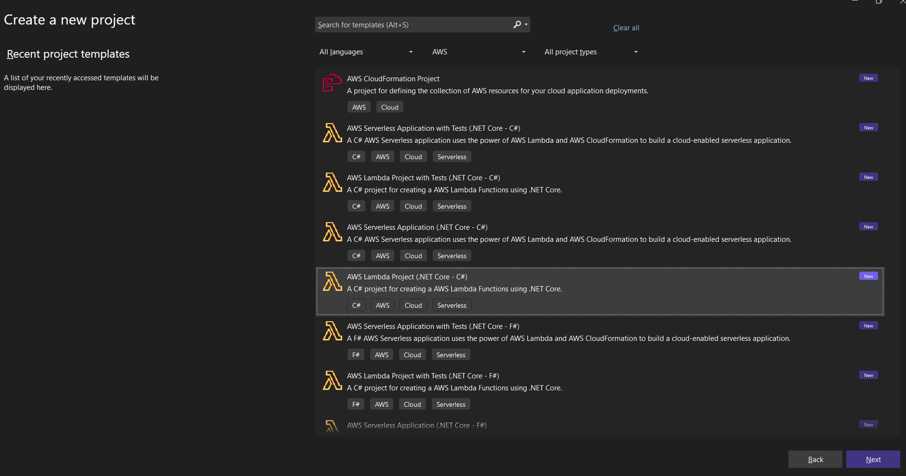

Step 2: Name the application.

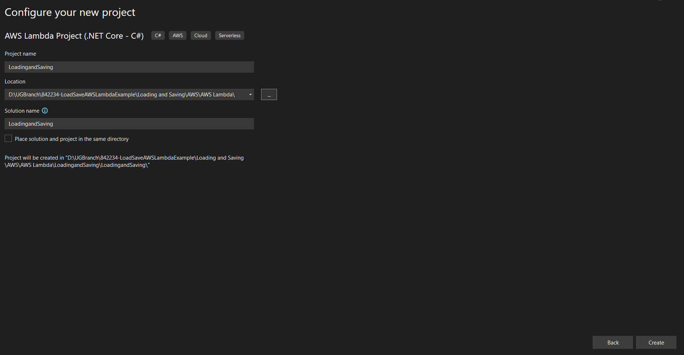

Step 3: Select Blueprint as Empty Function and click **Finish**.

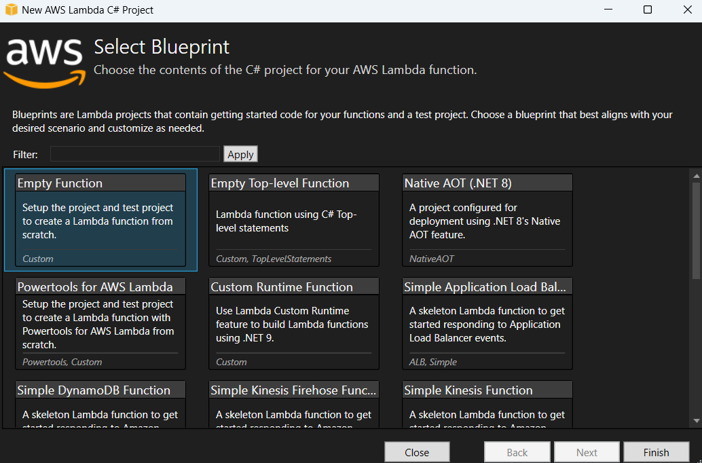

Step 4: Install the [Syncfusion.XlsIO.Net.Core](https://www.nuget.org/packages/Syncfusion.XlsIO.Net.Core) NuGet package as a reference to your project from [NuGet.org](https://www.nuget.org).

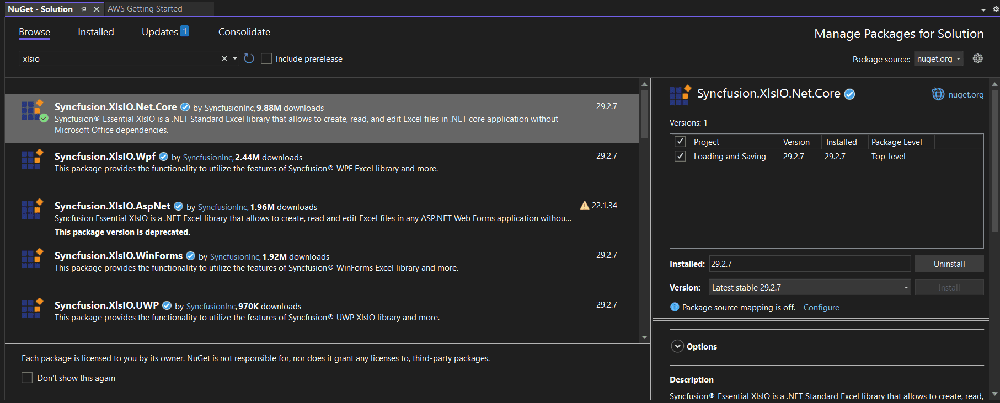

N> Starting with v16.2.0.x, if you reference Syncfusion&reg; assemblies from the trial setup or from the NuGet feed, you must also add the **Syncfusion.Licensing** assembly reference and register a license key in your project. Refer to [How to register the Syncfusion license key](https://help.syncfusion.com/common/essential-studio/licensing/how-to-register-in-an-application) for details.

Step 5: Create a folder named **Data** in the project and copy the required template files (for example, `InputTemplate.xlsx`) into it. Include the files in the project.

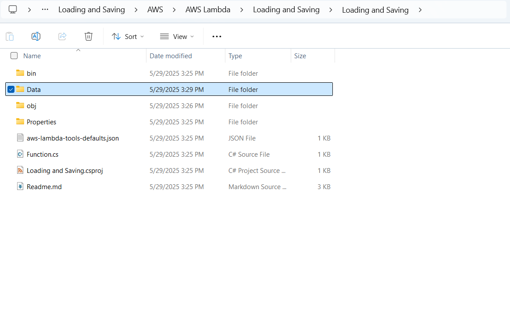

Step 6: Set **Copy to Output Directory** to **Copy if newer** for all the data files so they are included in the deployment bundle.

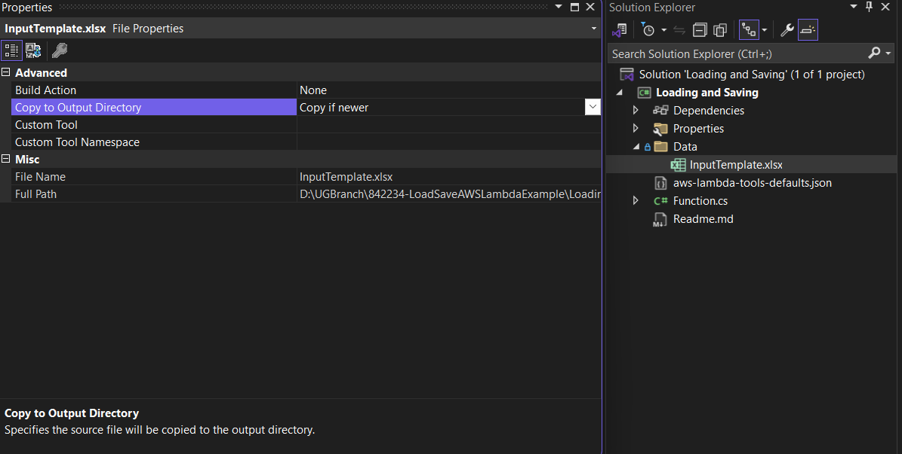

Step 7: Include the following namespaces in **Function.cs** file.



using Syncfusion.XlsIO;



step 8: Add the following code snippet in **Function.cs** to **load and save an Excel document in AWS Lambda**.



using (ExcelEngine excelEngine = new ExcelEngine())
{
  IApplication application = excelEngine.Excel;
  application.DefaultVersion = ExcelVersion.Xlsx;

  string filePath = Path.Combine(Directory.GetCurrentDirectory(), "Data", "InputTemplate.xlsx");
  using FileStream excelStream = new FileStream(filePath, FileMode.Open, FileAccess.Read);
  IWorkbook workbook = application.Workbooks.Open(excelStream);

  //Access first worksheet
  IWorksheet worksheet = workbook.Worksheets[0];

  //Set text in cell A3
  worksheet.Range["A3"].Text = "Hello World";

  //Save to MemoryStream
  MemoryStream outputStream = new MemoryStream();
  workbook.SaveAs(outputStream);
  outputStream.Position = 0;

  //Return as Base64 string
  return Convert.ToBase64String(outputStream.ToArray());
}



Step 9: Right-click the project and select **Publish to AWS Lambda**.

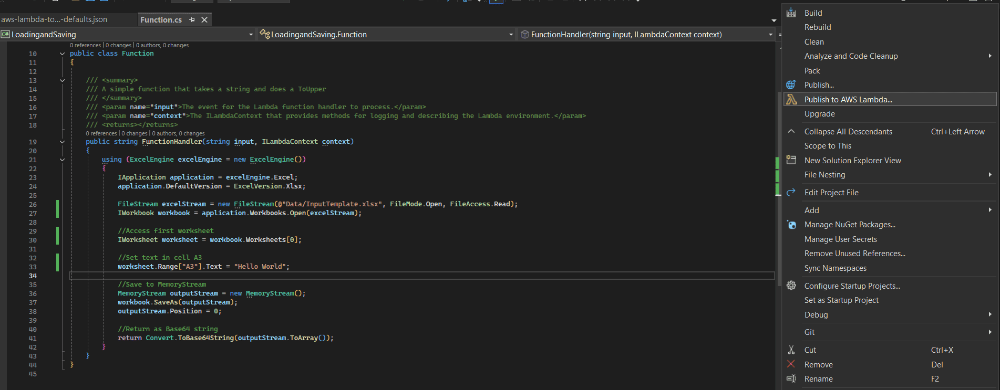

Step 10: In the **Upload Lambda Function** window, create a new AWS profile and enter a name for the Lambda function. Click **Next**.

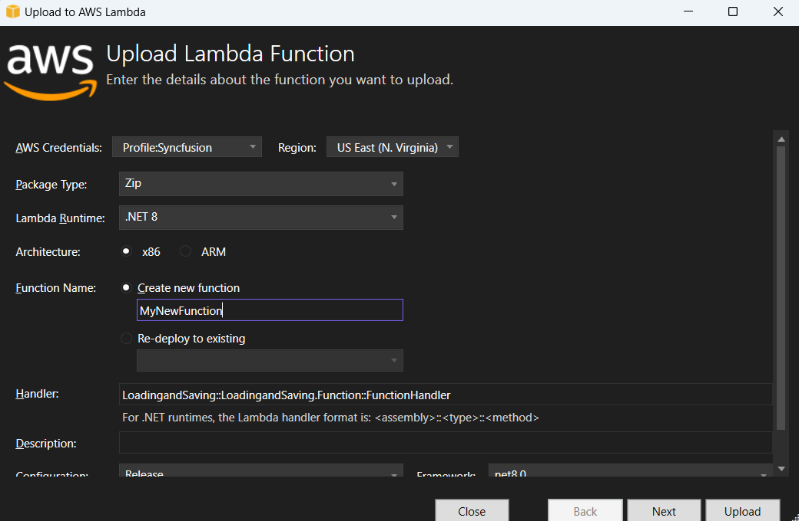

Step 11: In the **Advanced Function Details** window, select a **Role Name** that is backed by an AWS managed policy (for example, `AWSLambdaBasicExecutionRole`). Click **Upload** to deploy the application.

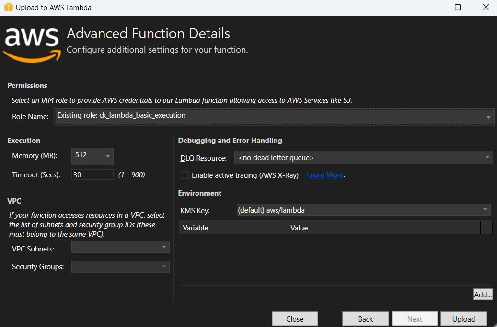

Step 12: After the application is deployed, you can see the published Lambda function in the **AWS Lambda console**.

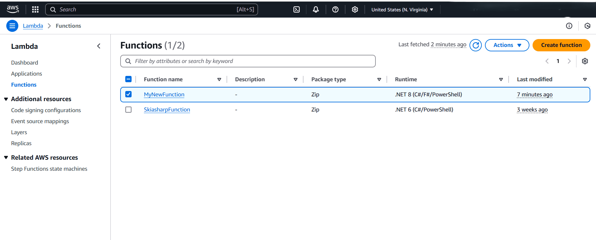

Step 13: Edit Memory size and Timeout as maximum in Basic settings of the AWS Lambda function.

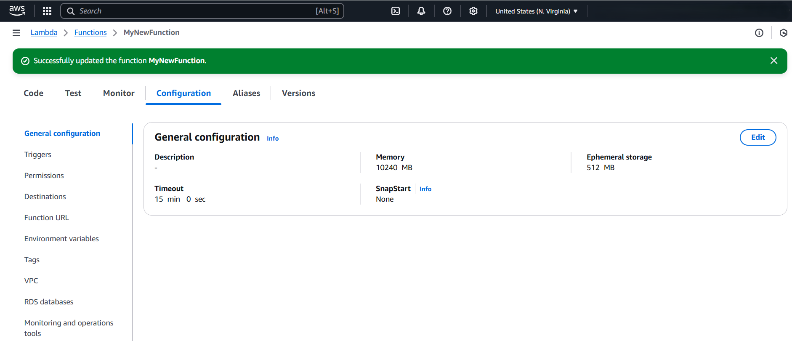

## Steps to post the request to AWS Lambda

The following console application invokes the published AWS Lambda function and writes the returned Excel file to disk.

Step 1: Create a new console project in Visual Studio.

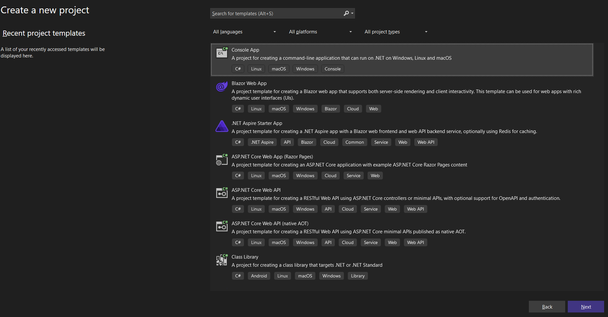

Step 2: Install the following **NuGet packages** in your application from [NuGet.org](https://www.nuget.org/):

* [AWSSDK.Core](https://www.nuget.org/packages/AWSSDK.Core/)
* [AWSSDK.Lambda](https://www.nuget.org/packages/AWSSDK.Lambda/)
* [Newtonsoft.Json](https://www.nuget.org/packages/Newtonsoft.Json/)

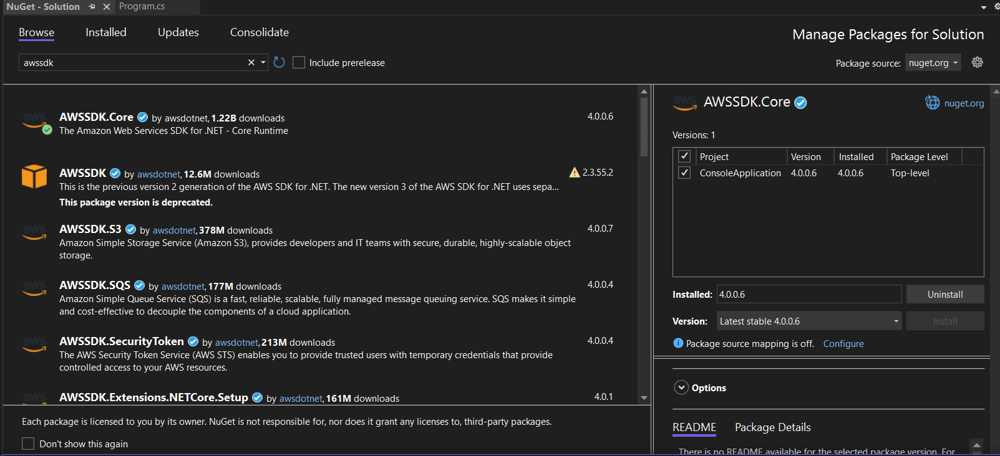
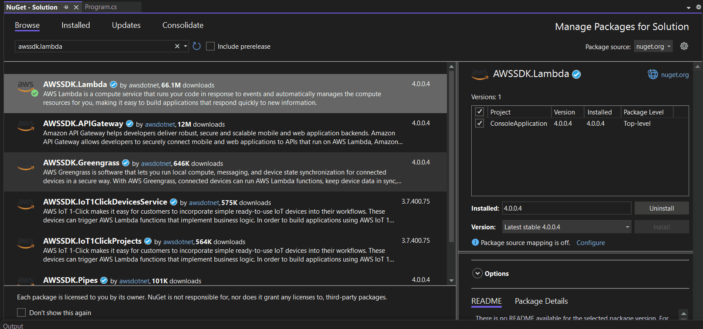
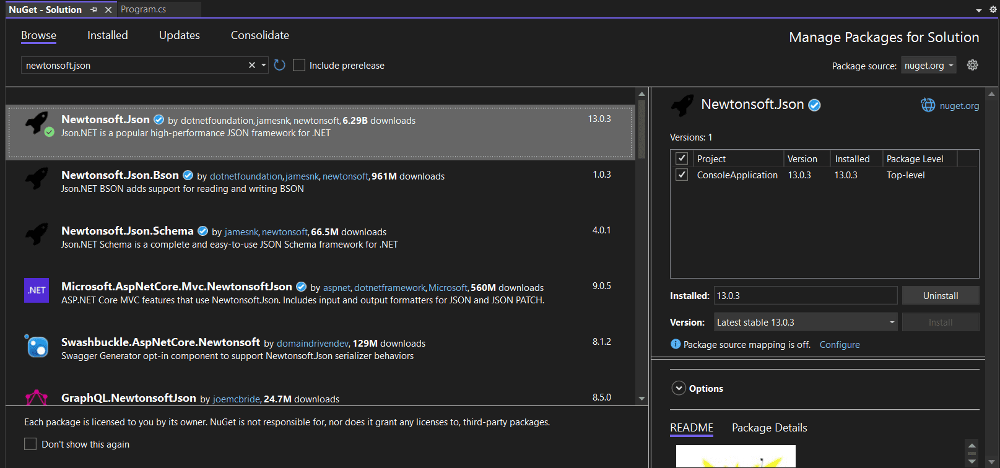

Step 3: Include the following namespaces in **Program.cs**.



using Amazon;
using Amazon.Lambda;
using Amazon.Lambda.Model;
using Newtonsoft.Json;



Step 4: Add the following code snippet in **Program.cs** to invoke the published AWS Lambda function using the function name and access keys.



//Create a new AmazonLambdaClient
AmazonLambdaClient client = new AmazonLambdaClient("awsaccessKeyID", "awsSecreteAccessKey", RegionEndpoint.USEast1);

//Create new InvokeRequest with published function name.
InvokeRequest invoke = new InvokeRequest
{
    FunctionName = "MyNewFunction",
    InvocationType = InvocationType.RequestResponse,
    Payload = "\"Test\""
};

// Get the InvokeResponse from client InvokeRequest.
InvokeResponse response = await client.InvokeAsync(invoke);   

//Read the response stream
var stream = new StreamReader(response.Payload);
JsonReader reader = new JsonTextReader(stream);
var serilizer = new JsonSerializer();
var responseText = serilizer.Deserialize(reader);     

//Convert Base64String into Excel document
byte[] bytes = Convert.FromBase64String(responseText.ToString());         
FileStream fileStream = new FileStream("Sample.xlsx", FileMode.Create);
BinaryWriter writer = new BinaryWriter(fileStream);
writer.Write(bytes, 0, bytes.Length);
writer.Close(); 
var psi = new System.Diagnostics.ProcessStartInfo
{
    FileName = "Sample.xlsx",
    UseShellExecute = true
};
System.Diagnostics.Process.Start(psi);



By executing the program, you will get the **Excel document** as shown below.

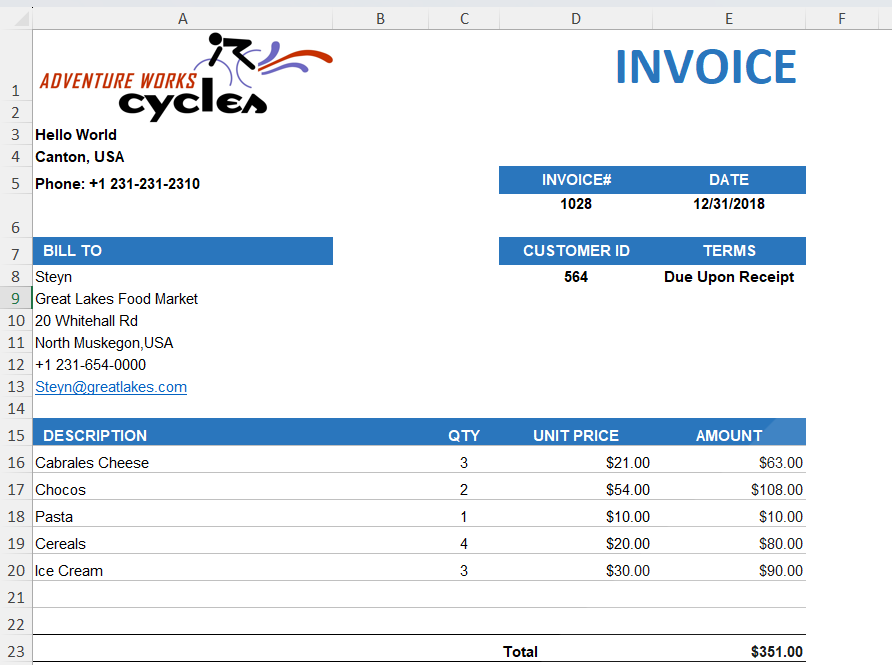

A complete working example of how to load and save an Excel file in AWS Lambda is present on [this GitHub page](https://github.com/SyncfusionExamples/XlsIO-Examples/tree/master/Loading%20and%20Saving/AWS/AWS%20Lambda/LoadingandSaving), you can download the [console application](https://github.com/SyncfusionExamples/XlsIO-Examples/tree/master/Loading%20and%20Saving/AWS/AWS%20Lambda/ConsoleApplication) project here.

Click [here](https://www.syncfusion.com/document-processing/excel-framework/net-core) to explore the rich set of Syncfusion&reg; Excel library (XlsIO) features.

An online sample link to [create an Excel document](https://ej2.syncfusion.com/aspnetcore/Excel/Create#/material3) in ASP.NET Core.