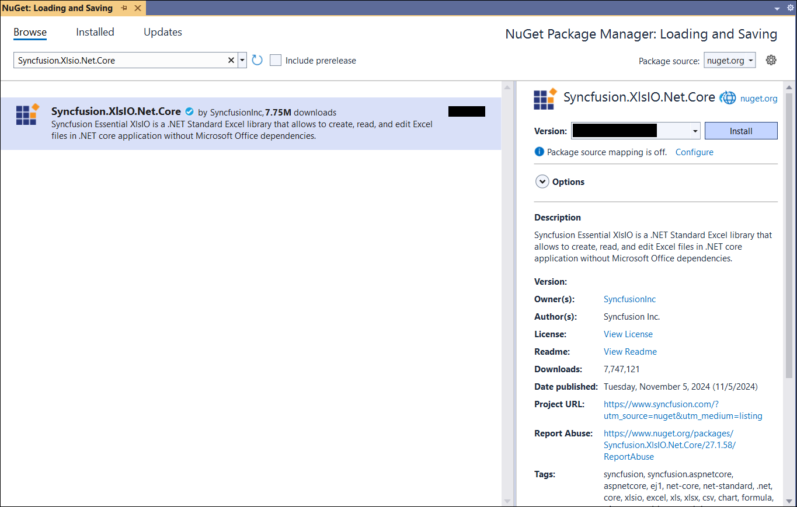
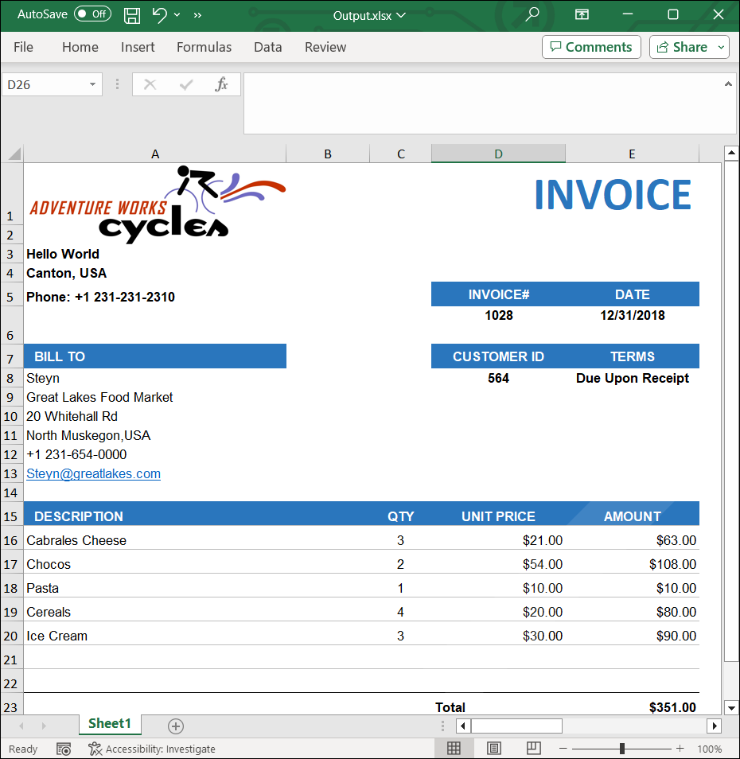

# Loading and Saving Excel files in AWS Lambda

Syncfusion&reg; XlsIO is a [.NET Core Excel library](https://www.syncfusion.com/document-processing/excel-framework/net-core) used to create, read, edit and convert Excel documents programmatically without **Microsoft Excel** or interop dependencies. Using this library, you can **load and save an Excel document in AWS Lambda**.

## Steps to Load and Save an Excel document in AWS Lambda

Step 1: Create a new **AWS Lambda project** as follows.

Step 2: Name the application.

Step 3: Select Blueprint as Empty Function and click **Finish**.

Step 4: Install the [Syncfusion.XlsIO.Net.Core](https://www.nuget.org/packages/Syncfusion.XlsIO.Net.Core) NuGet package as a reference to your project from [NuGet.org](https://www.nuget.org).

N> Starting with v16.2.0.x, if you reference Syncfusion&reg; assemblies from trial setup or from the NuGet feed, you also have to add "Syncfusion.Licensing" assembly reference and include a license key in your projects. Please refer to this [link](https://help.syncfusion.com/common/essential-studio/licensing/overview) to know about registering Syncfusion&reg; license key in your application to use our components.

Step 5: Create a folder and copy the required data files and include the files to the project.

Step 6: Set the **copy to output directory** to **Copy if newer** to all the data files.

Step 7: Include the following namespaces in **Function.cs** file.



using Syncfusion.XlsIO;



step 8: Add the following code snippet in **Function.cs** to **load and save an Excel document in AWS Lambda**.



using (ExcelEngine excelEngine = new ExcelEngine())
{
  IApplication application = excelEngine.Excel;
  application.DefaultVersion = ExcelVersion.Xlsx;

  FileStream excelStream = new FileStream(@"Data/Sample.xlsx", FileMode.Open, FileAccess.Read);
  IWorkbook workbook = application.Workbooks.Open(excelStream);

  //Access first worksheet
  IWorksheet worksheet = workbook.Worksheets[0];

  //Set text in cell A3
  worksheet.Range["A3"].Text = "Hello World";

  //Save to MemoryStream
  MemoryStream outputStream = new MemoryStream();
  workbook.SaveAs(outputStream);
  outputStream.Position = 0;

  //Return as Base64 string
  return Convert.ToBase64String(outputStream.ToArray());
}



Step 9: Right-click the project and select **Publish to AWS Lambda**.

Step 10: Create a new AWS profile in the Upload Lambda Function Window. After creating the profile, add a name for the Lambda function to publish. Then, click **Next**.

Step 11: In the Advanced Function Details window, specify the **Role Name** as based on AWS Managed policy. After selecting the role, click the **Upload** button to deploy your application.

Step 12: After deploying the application, you can see the published Lambda function in **AWS console**.

Step 13: Edit Memory size and Timeout as maximum in Basic settings of the AWS Lambda function.

## Steps to post the request to AWS Lambda

Step 1: Create a new console project.

step 2: Install the following **NuGet packages** in your application from [Nuget.org](https://www.nuget.org/).

* [AWSSDK.Core](https://www.nuget.org/packages/AWSSDK.Core/)
* [AWSSDK.Lambda](https://www.nuget.org/packages/AWSSDK.Lambda/)
* [Newtonsoft.Json](https://www.nuget.org/packages/Newtonsoft.Json/)

Step 3: Include the following namespaces in **Program.cs** file.



using Amazon;
using Amazon.Lambda;
using Amazon.Lambda.Model;
using Newtonsoft.Json;



Step 4: Add the following code snippet in **Program.cs** to invoke the published AWS Lambda function using the function name and access keys.



//Create a new AmazonLambdaClient
AmazonLambdaClient client = new AmazonLambdaClient("awsaccessKeyID", "awsSecreteAccessKey", RegionEndpoint.USEast2);
 
//Create new InvokeRequest with published function name.
InvokeRequest invoke = new InvokeRequest
{
  FunctionName = "MyNewFunction",
  InvocationType = InvocationType.RequestResponse,
  Payload = "\"Test\""
};

//Get the InvokeResponse from client InvokeRequest.
InvokeResponse response = client.Invoke(invoke);
 
//Read the response stream
var stream = new StreamReader(response.Payload);
JsonReader reader = new JsonTextReader(stream);
var serilizer = new JsonSerializer();
var responseText = serilizer.Deserialize(reader);

//Convert Base64String into Excel document
byte[] bytes = Convert.FromBase64String(responseText.ToString());
FileStream fileStream = new FileStream("Sample.xlsx", FileMode.Create);
BinaryWriter writer = new BinaryWriter(fileStream);
writer.Write(bytes, 0, bytes.Length);
writer.Close();
System.Diagnostics.Process.Start("Sample.xlsx");



By executing the program, you will get the **Excel document** as follows.

Click [here](https://www.syncfusion.com/document-processing/excel-framework/net-core) to explore the rich set of Syncfusion&reg; Excel library (XlsIO) features.

An online sample link to [create an Excel document](https://ej2.syncfusion.com/aspnetcore/Excel/Create#/material3) in ASP.NET Core.
