# Loading and Saving Excel files in Azure App Service on Windows

[.NET Excel Library for ASP.NET Core platform](https://www.syncfusion.com/document-processing/excel-framework/net-core/excel-library) can be used to create, read, and edit Excel files in Azure App Service on Windows.

## Prerequisites

* An active Azure subscription with permission to create App Services.
* Visual Studio 2022 (17.0 or later) with the **ASP.NET and web development** workload installed.
* Install the [Syncfusion.XlsIO.Net.Core](https://www.nuget.org/packages/Syncfusion.XlsIO.Net.Core) NuGet package in your project.
* Register your Syncfusion&reg; license key in your project. Refer to the [licensing overview](https://help.syncfusion.com/document-processing/licensing/overview) for details.
* A sample input file (for example, `Data/InputTemplate.xlsx`) added to the project and configured with **Build Action: Content** and **Copy to Output Directory: Copy if newer** so the file is deployed to Azure.

## Steps to Load and Save an Excel document in Azure App Service on Windows

The steps below illustrate how to load and save a simple Invoice-formatted Excel document in Azure App Service on Windows.

Step 1: Create a new ASP.NET Core Web Application (Model-View-Controller).

Step 2: Name the project.

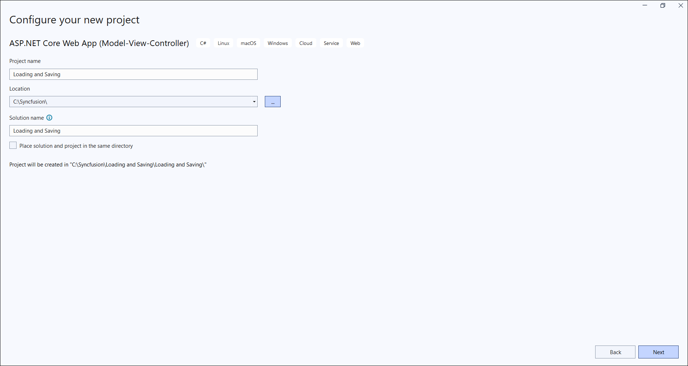

Step 3: Select the framework and click **Create** button.

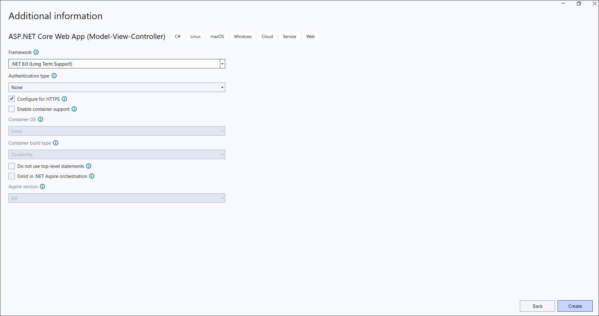

Step 4: Install the [Syncfusion.XlsIO.Net.Core](https://www.nuget.org/packages/Syncfusion.XlsIO.Net.Core) NuGet package as a reference to your ASP.NET Core application from [NuGet.org](https://www.nuget.org).

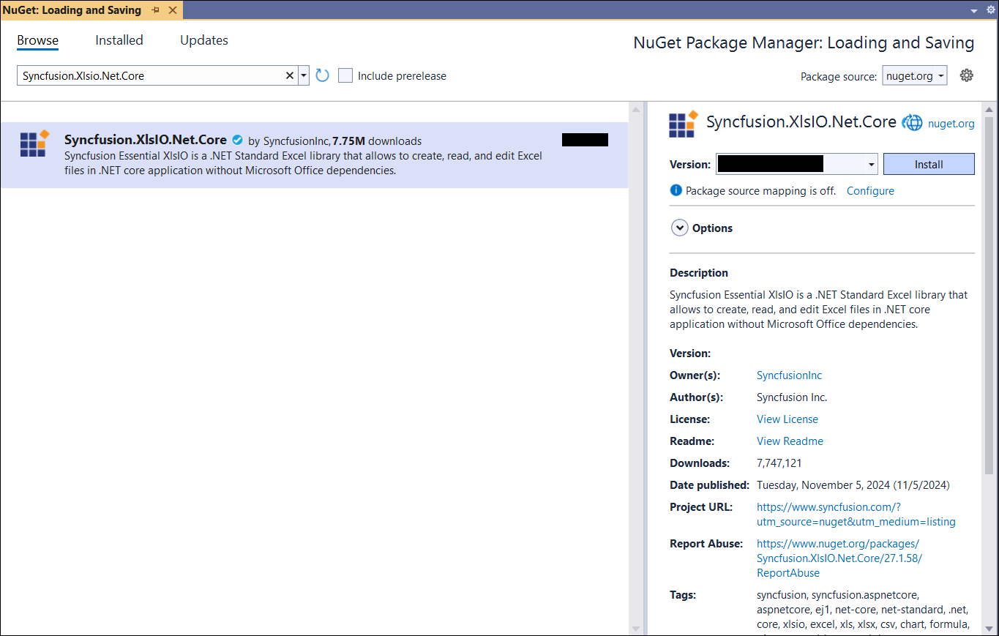

N> Starting with v16.2.0.x, if you reference Syncfusion&reg; assemblies from trial setup or from the NuGet feed, you also have to add the "Syncfusion.Licensing" assembly reference and include a license key in your projects. Please refer to this [link](https://help.syncfusion.com/document-processing/licensing/overview) to know about registering the Syncfusion&reg; license key in your applications to use our components.

Step 5: Include the following namespaces in **HomeController.cs**.

  

using Syncfusion.XlsIO;



Imports Syncfusion.XlsIO

  

Step 6: Add a new button in the **Index.cshtml** as shown below.

  

@{
    Html.BeginForm("LoadingandSaving", "Home", FormMethod.Get);
    {
        

             
            <input type="submit" value="Loading and Saving Document" style="width:230px;height:27px" />
        

    }
    Html.EndForm();
}



@Code
    Html.BeginForm("LoadingandSaving", "Home", FormMethod.Get)
End Code

     
    <input type="submit" value="Loading and Saving Document" style="width:230px;height:27px" />

@Code
    Html.EndForm()
End Code



Step 7: Include the following code snippet in **HomeController.cs** to **load and save an Excel file and download it**.



public ActionResult LoadingandSaving()
{
    // Create an instance of ExcelEngine
    using (ExcelEngine excelEngine = new ExcelEngine())
    {
        IApplication application = excelEngine.Excel;
        application.DefaultVersion = ExcelVersion.Xlsx;

        // Load an existing Excel document
        IWorkbook workbook = application.Workbooks.Open("Data/InputTemplate.xlsx");

        // Access first worksheet from the workbook
        IWorksheet worksheet = workbook.Worksheets[0];

        // Set text in cell A3
        worksheet.Range["A3"].Text = "Hello World";

        // Save the Excel to a MemoryStream
        using (MemoryStream outputStream = new MemoryStream())
        {
            workbook.SaveAs(outputStream);
            outputStream.Position = 0;

            // Download the Excel document in the browser
            return File(outputStream, "application/msexcel", "Output.xlsx");
        }
    }
}



public ActionResult LoadingandSaving()
{
	//Create an instance of ExcelEngine
	using (ExcelEngine excelEngine = new ExcelEngine())
	{
	    IApplication application = excelEngine.Excel;
	    application.DefaultVersion = ExcelVersion.Xlsx;

	    //Load an existing Excel document
		IWorkbook workbook = application.Workbooks.Open("Data/InputTemplate.xlsx");

	    //Access first worksheet from the workbook.
	    IWorksheet worksheet = workbook.Worksheets[0];

	    //Set Text in cell A3.
	    worksheet.Range["A3"].Text = "Hello World";

	    //Save the Excel to MemoryStream 
	    MemoryStream outputStream = new MemoryStream();
	    workbook.SaveAs(outputStream);

	    //Set the position
	    outputStream.Position = 0;

	    //Download the Excel document in the browser.
	    return File(outputStream, "application/msexcel", "Output.xlsx");
	}
}



Public Function LoadingandSaving() As ActionResult
    ' Create an instance of ExcelEngine
    Using excelEngine As New ExcelEngine()
        Dim application As IApplication = excelEngine.Excel
        application.DefaultVersion = ExcelVersion.Xlsx

        ' Load an existing Excel document
        Dim inputStream As New FileStream(Server.MapPath("~/Data/InputTemplate.xlsx"), FileMode.Open, FileAccess.Read)
        Dim workbook As IWorkbook = application.Workbooks.Open(inputStream)

        ' Access first worksheet
        Dim worksheet As IWorksheet = workbook.Worksheets(0)

        ' Set text in cell A3
        worksheet.Range("A3").Text = "Hello World"

        ' Save to a memory stream
        Using outputStream As New MemoryStream()
            workbook.SaveAs(outputStream)
            outputStream.Position = 0

            ' Download the Excel document
            Return File(outputStream, "application/msexcel", "Output.xlsx")
        End Using
    End Using
End Function



## Steps to publish as Azure App Service on Windows

Step 1: Right-click the project and select **Publish** option.

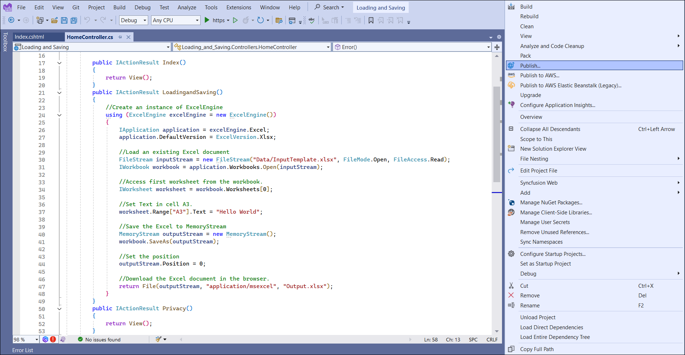

Step 2: Select the publish target as **Azure**.

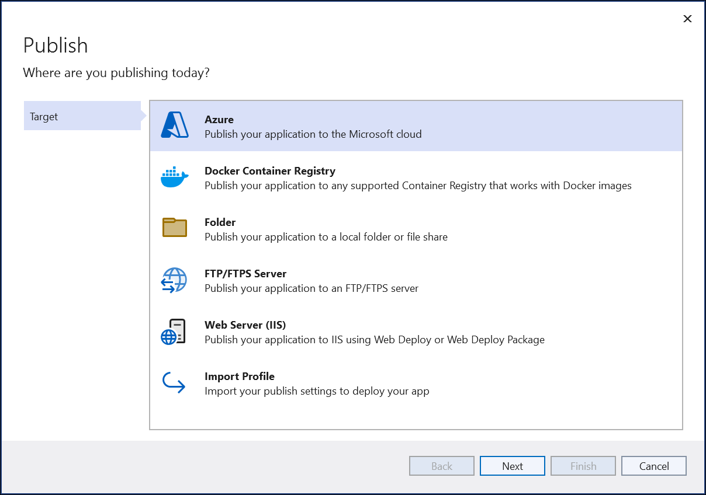

Step 3: Select the Specific target as **Azure App Service (Windows)**.

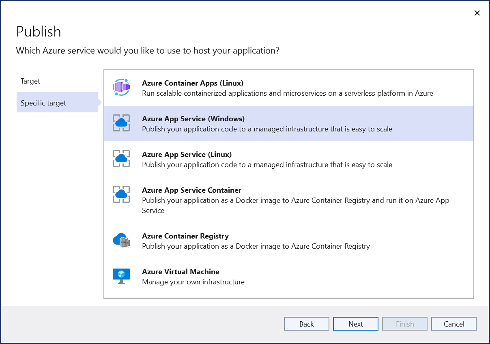

Step 4: To create a new app service, click **Create new** option.

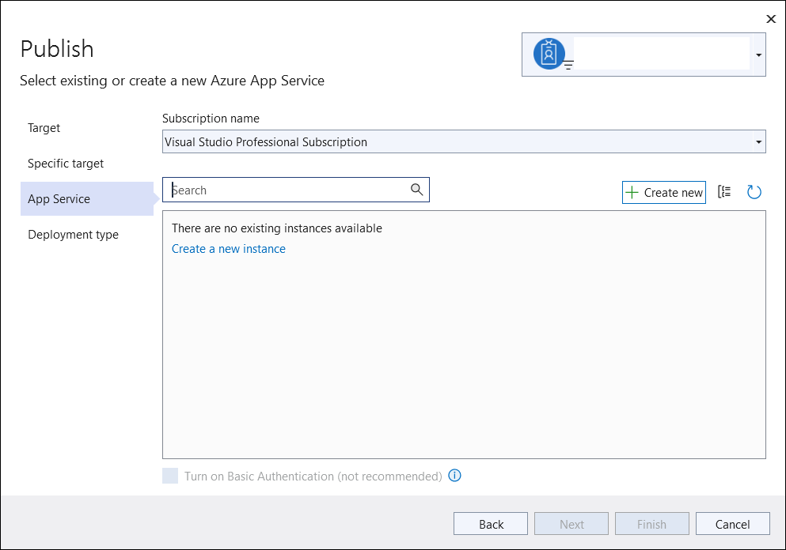

Step 5: Click the **Create** button to proceed with **App Service** creation.

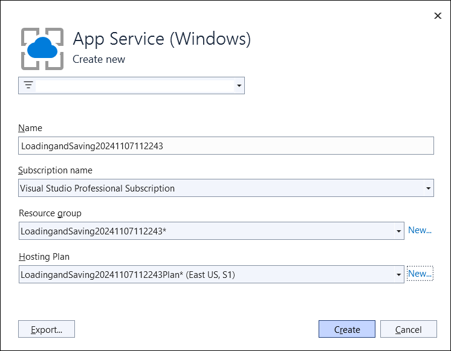

Step 6: Click the **Finish** button to finalize the **App Service** creation.

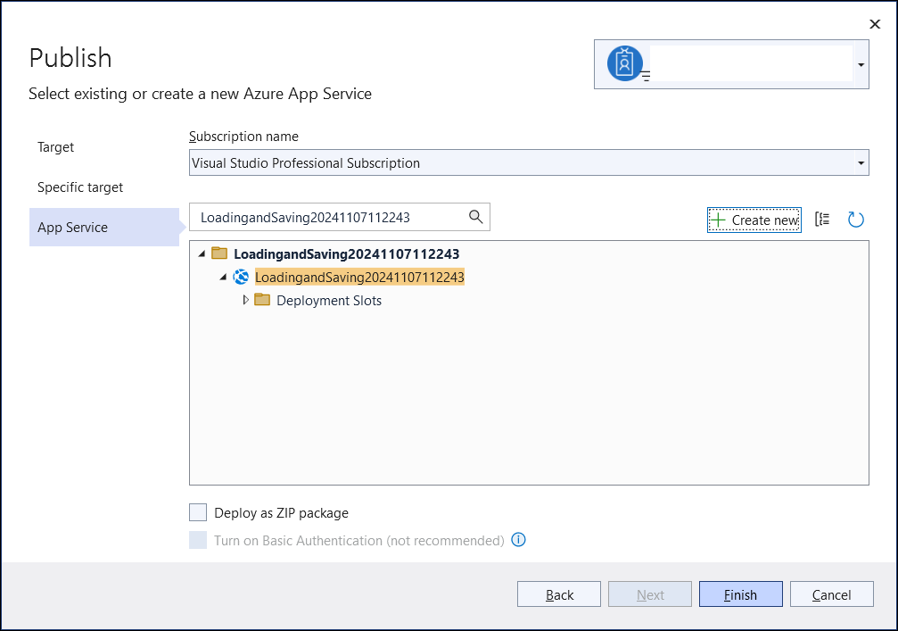

Step 7: Click **Close** button.

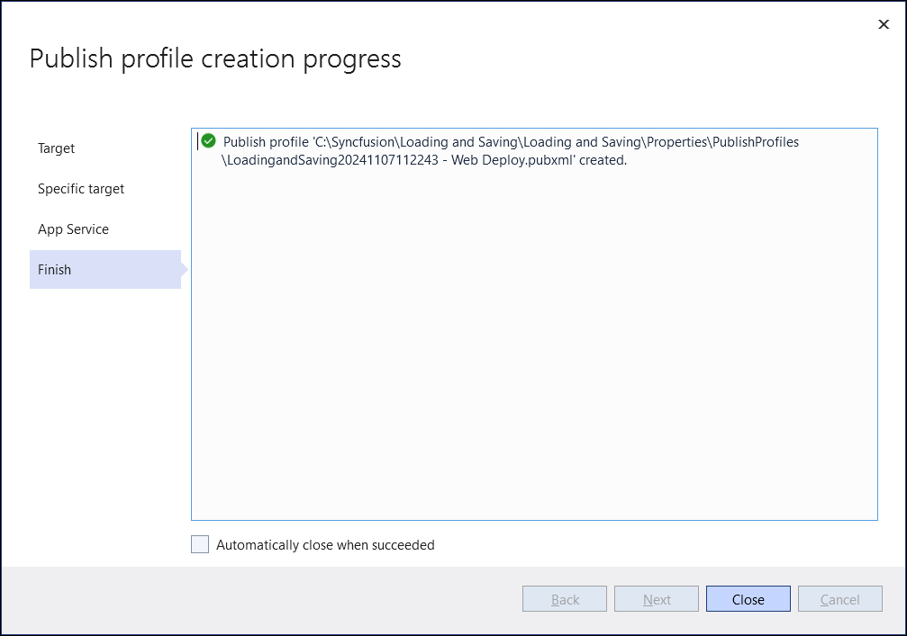

Step 8: Click the **Publish** button.

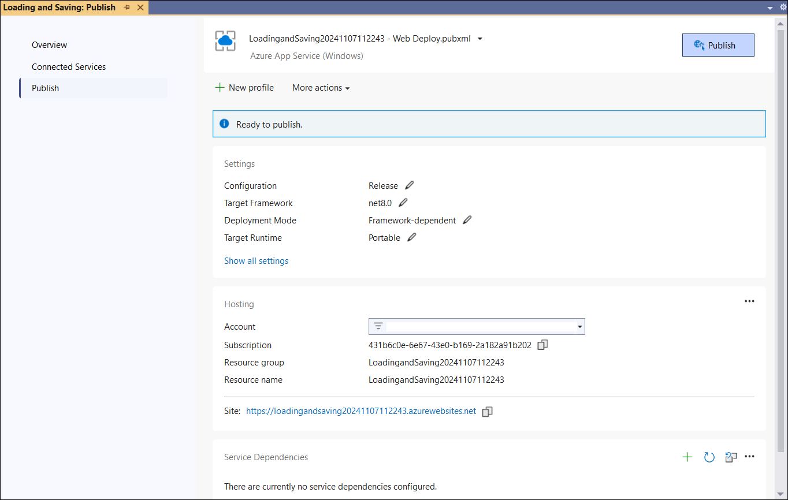

Step 9: The publish has succeeded.

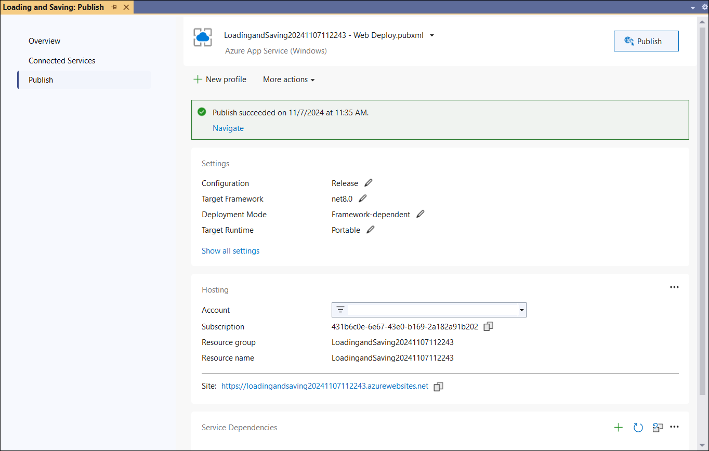

Step 10: The published web page opens in the browser.

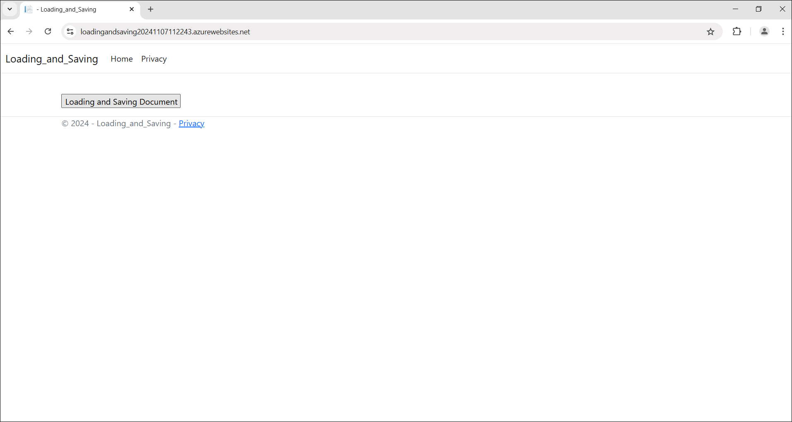

Step 11: Click **Loading and Saving Document** to load and save a simple Excel document. You will get the output Excel document as follows.

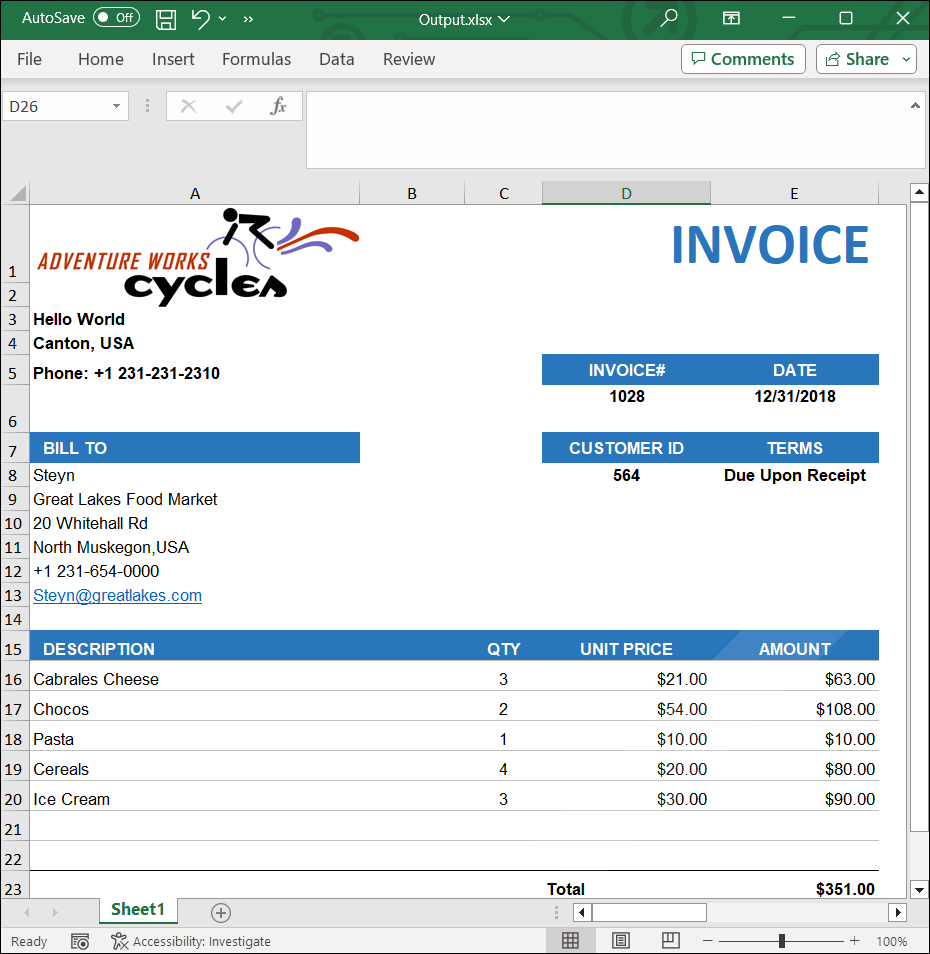

A complete working example of how to load and save an Excel document in Azure App Service on Windows in C# is available on the [SyncfusionExamples/XlsIO-Examples GitHub page](https://github.com/SyncfusionExamples/XlsIO-Examples/tree/master/Loading%20and%20Saving/Azure/Azure%20App%20Service/Loading%20and%20Saving).

Click [here](https://www.syncfusion.com/document-processing/excel-framework/net-core) to explore the rich set of Syncfusion&reg; Excel library (XlsIO) features.

An online sample link to [create an Excel document in ASP.NET Core](https://ej2.syncfusion.com/aspnetcore/Excel/Create#/material3) is also available.

## See Also

* [Create, read, and edit Excel files in ASP.NET Core](https://help.syncfusion.com/document-processing/excel/excel-library/net/create-read-edit-excel-files-in-asp-net-core-c-sharp)
* [Assemblies Required for XlsIO](https://help.syncfusion.com/document-processing/excel/excel-library/net/assemblies-required)
* [NuGet Packages for XlsIO](https://help.syncfusion.com/document-processing/excel/excel-library/net/nuget-packages-required)
* [Licensing Overview](https://help.syncfusion.com/document-processing/licensing/overview)