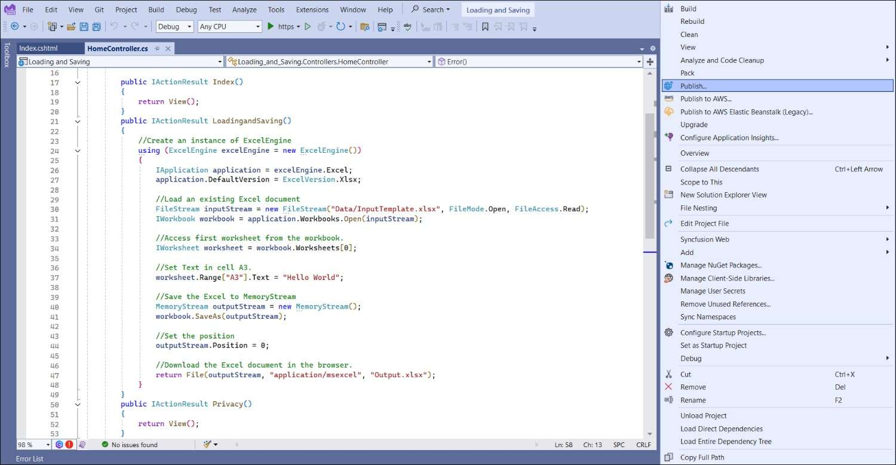

# Loading and Saving Excel files in Azure App Service on Windows

[Syncfusion Excel library for ASP.NET Core platform](https://www.syncfusion.com/document-processing/excel-framework/net-core/excel-library) can be used to create, read, edit Excel files in Azure App Service on Windows.

## Steps to Load and Save an Excel document in Azure App Service on Windows

The below steps illustrates loading and saving a simple Invoice formatted Excel document in Azure App Service Windows.

Step 1: Create a new ASP.NET Core Web Application (Model-View-Controller).

Step 2: Name the project.

Step 3: Select the framework and click **Create** button.

Step 4: Install the [Syncfusion.XlsIO.Net.Core](https://www.nuget.org/packages/Syncfusion.XlsIO.Net.Core) NuGet package as reference to your .NET Standard applications from [NuGet.org](https://www.nuget.org).

N> Starting with v16.2.0.x, if you reference Syncfusion&reg; assemblies from trial setup or from the NuGet feed, you also have to add "Syncfusion.Licensing" assembly reference and include a license key in your projects. Please refer to this [link](https://help.syncfusion.com/common/essential-studio/licensing/overview) to know about registering Syncfusion&reg; license key in your applications to use our components. 

Step 5: Include the following namespaces in **HomeController.cs**.

  

using Syncfusion.XlsIO;



Imports Syncfusion.XlsIO

  

Step 6: Add a new button in the **Index.cshtml** as shown below.

  

@{
    Html.BeginForm("LoadingandSaving", "Home", FormMethod.Get);
    {
        

             
            <input type="submit" value="Loading and Saving Document" style="width:230px;height:27px" />
        

    }
    Html.EndForm();
}



@Code
    Html.BeginForm("LoadingandSaving", "Home", FormMethod.Get)
End Code

     
    <input type="submit" value="Loading and Saving Document" style="width:230px;height:27px" />

@Code
    Html.EndForm()
End Code



Step 7: Include the below code snippet in **HomeController.cs** to **load and save an Excel file and download it**.

  

//Create an instance of ExcelEngine
using (ExcelEngine excelEngine = new ExcelEngine())
{
    IApplication application = excelEngine.Excel;
    application.DefaultVersion = ExcelVersion.Xlsx;

    //Load an existing Excel document
	IWorkbook workbook = application.Workbooks.Open("Data/InputTemplate.xlsx");

    //Access first worksheet from the workbook.
    IWorksheet worksheet = workbook.Worksheets[0];

    //Set Text in cell A3.
    worksheet.Range["A3"].Text = "Hello World";

    //Save the Excel to MemoryStream 
    MemoryStream outputStream = new MemoryStream();
    workbook.SaveAs(outputStream);

    //Set the position
    outputStream.Position = 0;

    //Download the Excel document in the browser.
    return File(outputStream, "application/msexcel", "Output.xlsx");
}



'Create an instance of ExcelEngine
Using excelEngine As New ExcelEngine()
    Dim application As IApplication = excelEngine.Excel
    application.DefaultVersion = ExcelVersion.Xlsx

    'Load an existing Excel document
    Dim inputStream As New FileStream(Server.MapPath("~/Data/Input.xlsx"), FileMode.Open, FileAccess.Read)
    Dim workbook As IWorkbook = application.Workbooks.Open(inputStream)

    'Access first worksheet
    Dim worksheet As IWorksheet = workbook.Worksheets(0)

    'Set text in cell A3
    worksheet.Range("A3").Text = "Hello World"

    'Save to memory stream
    Dim outputStream As New MemoryStream()
    workbook.SaveAs(outputStream)

    'Reset position
    outputStream.Position = 0

    'Download the Excel document
    Return File(outputStream, "application/msexcel", "Output.xlsx")
End Using

 

## Steps to publish as Azure App Service on Windows

Step 1: Right-click the project and select **Publish** option.

Step 2: Select the publish target as **Azure**.

Step 3: Select the Specific target as **Azure App Service (Windows)**.

Step 4: To create a new app service, click **Create new** option.

Step 5: Click the **Create** button to proceed with **App Service** creation.

Step 6: Click the **Finish** button to finalize the **App Service** creation.

Step 7: Click **Close** button.

Step 8: Click the **Publish** button.

Step 9: Now, Publish has been succeeded.

Step 10: Now, the published webpage will open in the browser. 

Step 11: Click **Loading and Saving Document** to load and save a simple Excel document. You will get the output Excel document as follows.

A complete working example of how to load and save an Excel document in Azure App Service on Windows in C# is present on [this GitHub page](https://github.com/SyncfusionExamples/XlsIO-Examples/tree/master/Loading%20and%20Saving/Azure/Azure%20App%20Service/Loading%20and%20Saving).

Click [here](https://www.syncfusion.com/document-processing/excel-framework/net-core) to explore the rich set of Syncfusion&reg; Excel library (XlsIO) features.

An online sample link to [create an Excel document](https://ej2.syncfusion.com/aspnetcore/Excel/Create#/material3) in ASP.NET Core.