# Loading and Saving Excel files in Azure Functions v1

Syncfusion&reg; XlsIO is a [.NET Excel library](https://www.syncfusion.com/document-processing/excel-framework/net) can be used to create, read, edit Excel files in Azure Functions v1.

## Steps to Load and Save an Excel document in Azure Functions v1

The below steps illustrates loading and saving a simple Invoice formatted Excel document in Azure Functions v1.

Step 1: Create a new Azure Functions project.

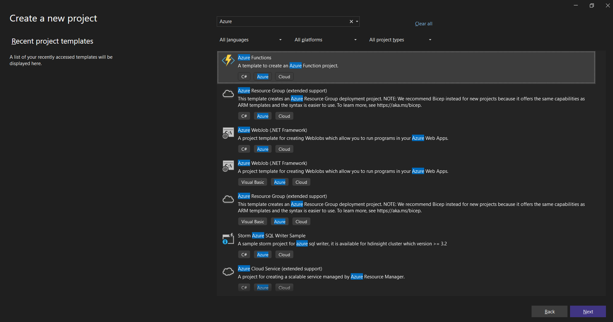

Step 2: Name the project.

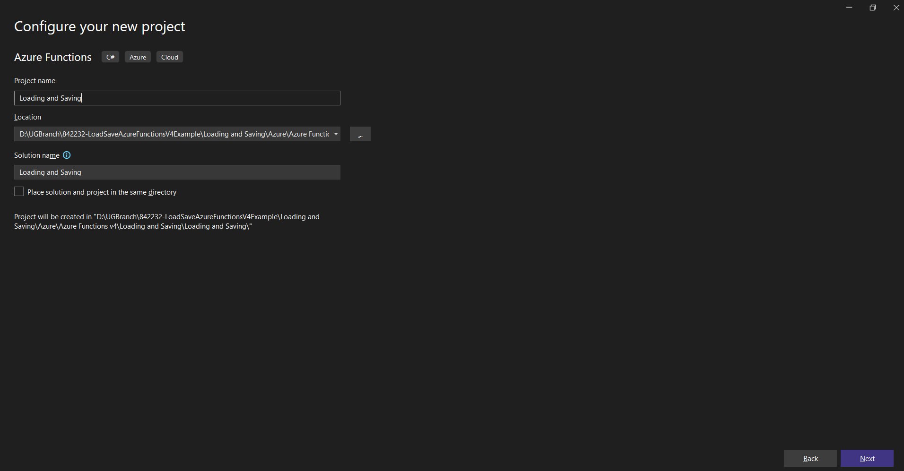

Step 3: Select the framework and click **Create** button.

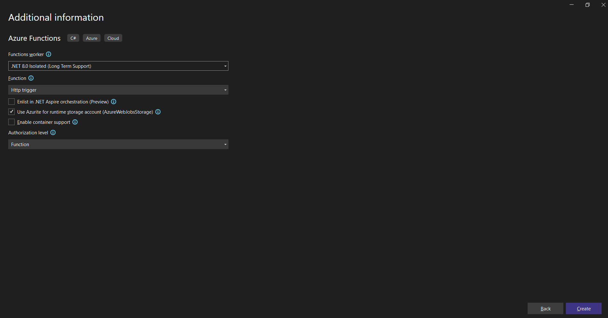

Step 4: Install the [Syncfusion.XlsIO.Net.Core](https://www.nuget.org/packages/Syncfusion.XlsIO.Net.Core) NuGet package as reference to your .NET Standard applications from [NuGet.org](https://www.nuget.org).

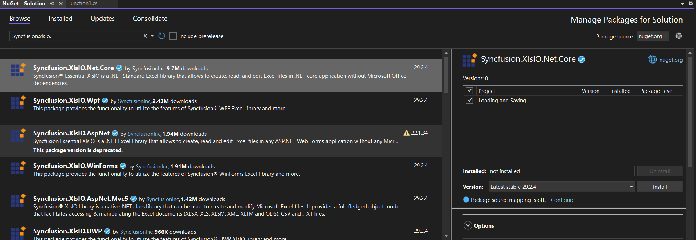

N> Starting with v16.2.0.x, if you reference Syncfusion&reg; assemblies from trial setup or from the NuGet feed, you also have to add "Syncfusion.Licensing" assembly reference and include a license key in your projects. Please refer to this [link](https://help.syncfusion.com/common/essential-studio/licensing/overview) to know about registering Syncfusion&reg; license key in your applications to use our components. 

Step 5: Include the following namespaces in the Function1.cs file.

  

using Syncfusion.XlsIO;

  

Step 6: Add the following code snippet in **Run** method of **Function1** class to perform **Loading and Saving Excel files** in Azure Functions v1.

  

using (ExcelEngine excelEngine = new ExcelEngine())
{
    IApplication application = excelEngine.Excel;
    application.DefaultVersion = ExcelVersion.Xlsx;

    //Load an existing Excel document
    IWorkbook workbook = application.Workbooks.Open("Data/InputTemplate.xlsx");

    //Access first worksheet from the workbook
    IWorksheet worksheet = workbook.Worksheets[0];

    //Set Text in cell A3
    worksheet.Range["A3"].Text = "Hello World";

    MemoryStream outputStream = new MemoryStream();
    workbook.SaveAs(outputStream);
    outputStream.Position = 0;

    //Set headers
    response.Headers.Add("Content-Disposition", "attachment; filename=Output.xlsx");

    //Set the content type as Excel document mime type
    response.Headers.Add("Content-Type", "application/vnd.openxmlformats-officedocument.spreadsheetml.sheet");

    await response.Body.WriteAsync(outputStream.ToArray());

    //Return the response with output Excel document stream
    return response;
}

 

Step 7: Right-click the project and select **Publish** option.

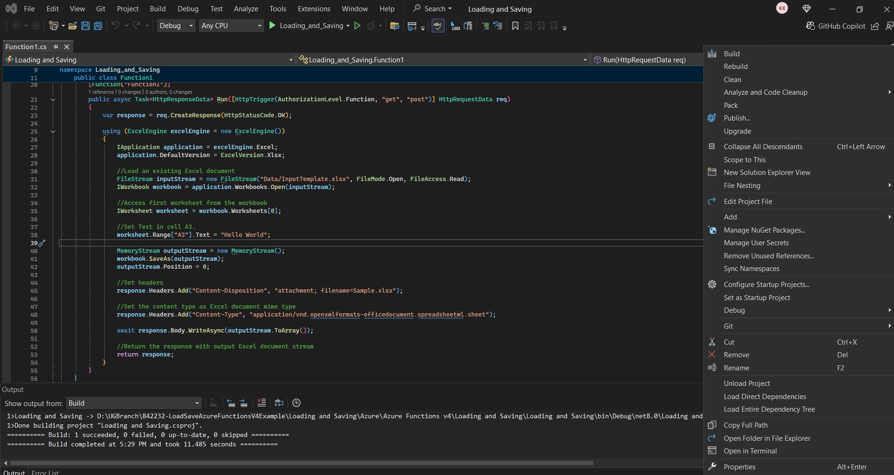

Step 8: Select the publish target as **Azure**.

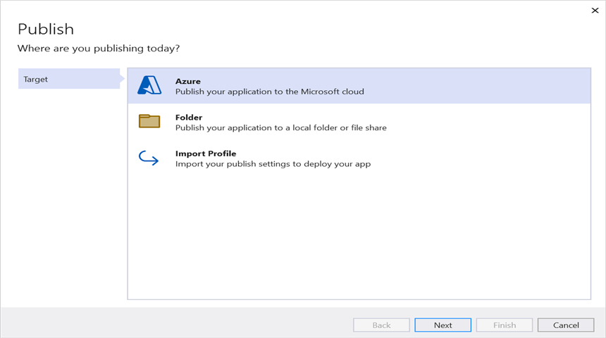

Step 9: Select the Specific target as **Azure Function App (Windows)**.

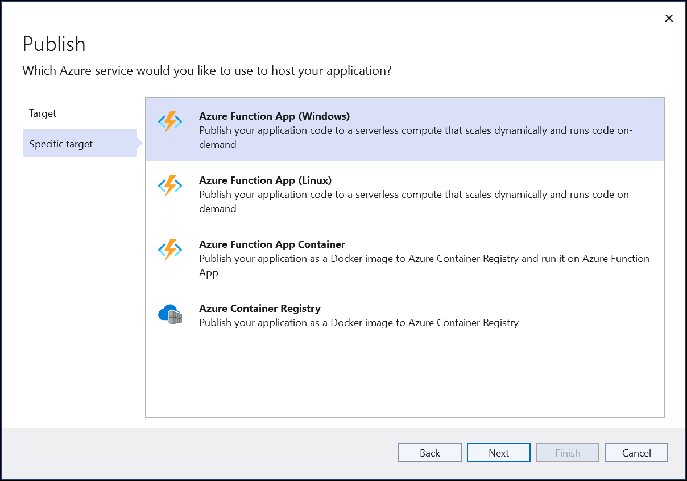

Step 10: Select the **Create new** button.

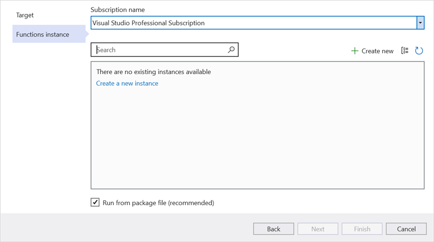

Step 11: Click the **Create** button to proceed with creation. 

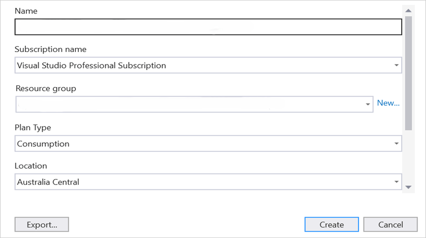

Step 12: Click the **Finish** button to finalize the **Azure Function** creation. 

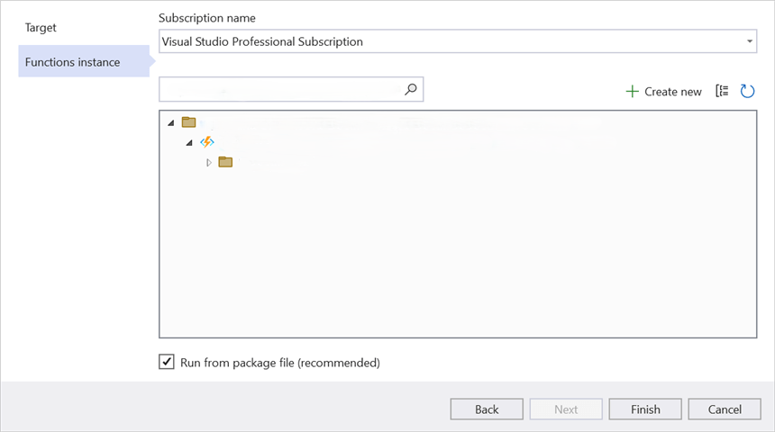

Step 13: Click **Close** button.

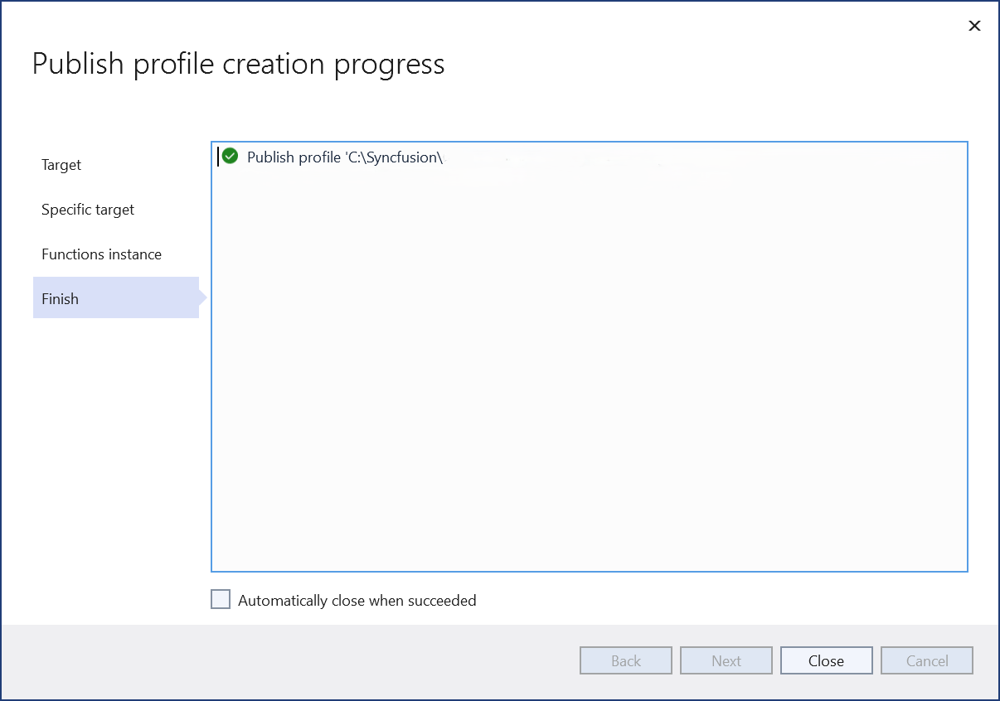

Step 14: Click the **Publish** button.

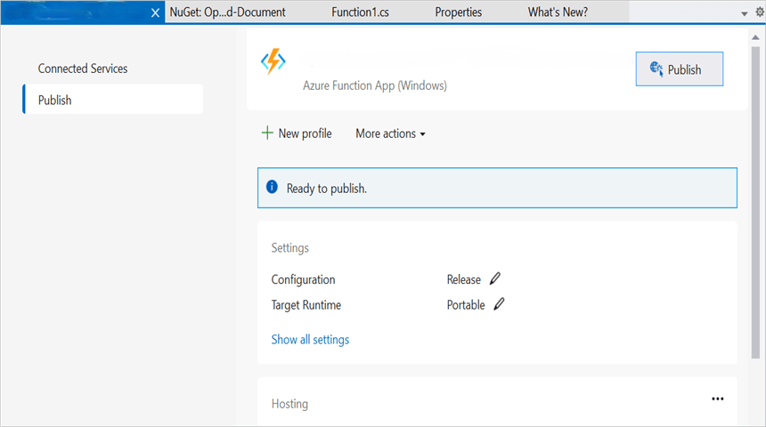

Step 15: Publish has been succeeded.

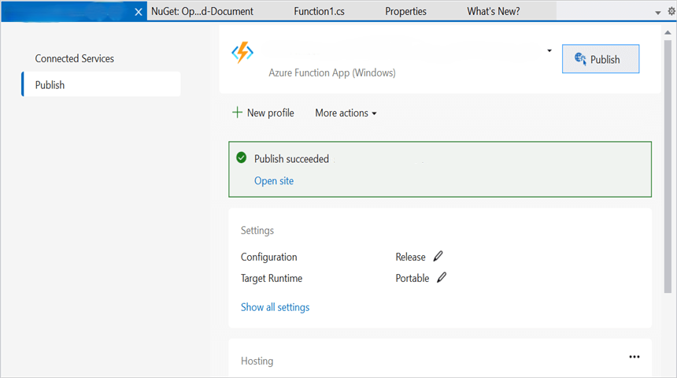

Step 16: Now, go to Azure portal and select the App Services. After running the service, click **Get function URL by copying it**. Then, paste it in the below client sample (which will request the Azure Functions, to perform **Loading and Saving Excel files** using the template Excel document). You will get the output Excel document as follows.   

## Steps to post the request to Azure Functions

Step 1: Create a console application to request the Azure Functions API.

Step 2: Add the following code snippet into **Main** method to post the request to Azure Functions with template Excel document and get the resultant Excel document.


//Reads the template Excel document.
FileStream excelStream = new FileStream("../../Sample.xlsx", FileMode.Open, FileAccess.Read);
excelStream.Position = 0;

//Saves the Excel document in memory stream.
MemoryStream inputStream = new MemoryStream();
excelStream.CopyTo(inputStream);
inputStream.Position = 0;

try
{
  Console.WriteLine("Please enter your Azure Functions URL :");
  string functionURL = Console.ReadLine();

  //Create HttpWebRequest with hosted azure functions URL              
  HttpWebRequest req = (HttpWebRequest)WebRequest.Create(functionURL);

  //Set request method as POST
  req.Method = "POST";

  //Get the request stream to save the Excel document stream
  Stream stream = req.GetRequestStream();

  //Write the Excel document stream into request stream
  stream.Write(inputStream.ToArray(), 0, inputStream.ToArray().Length);

  //Gets the responce from the Azure Functions
  HttpWebResponse res = (HttpWebResponse)req.GetResponse();

  //Saves the Excel stream
  FileStream outStream = File.Create("Sample.xlsx");
  res.GetResponseStream().CopyTo(outStream);

  //Dispose the streams
  inputStream.Dispose();
  outStream.Dispose();
}
catch (Exception ex)
{
    throw;
}

   

A complete working example of how to load and save an Excel document in Azure Functions v1 in C# is present on [this GitHub page](https://github.com/SyncfusionExamples/XlsIO-Examples/tree/master/Loading%20and%20Saving/Azure/Azure%20Functions%20v1/Loading%20and%20Saving).

Click [here](https://www.syncfusion.com/document-processing/excel-framework/net-core) to explore the rich set of Syncfusion&reg; Excel library (XlsIO) features.

An online sample link to [create an Excel document](https://ej2.syncfusion.com/aspnetcore/Excel/Create#/material3) in ASP.NET Core.