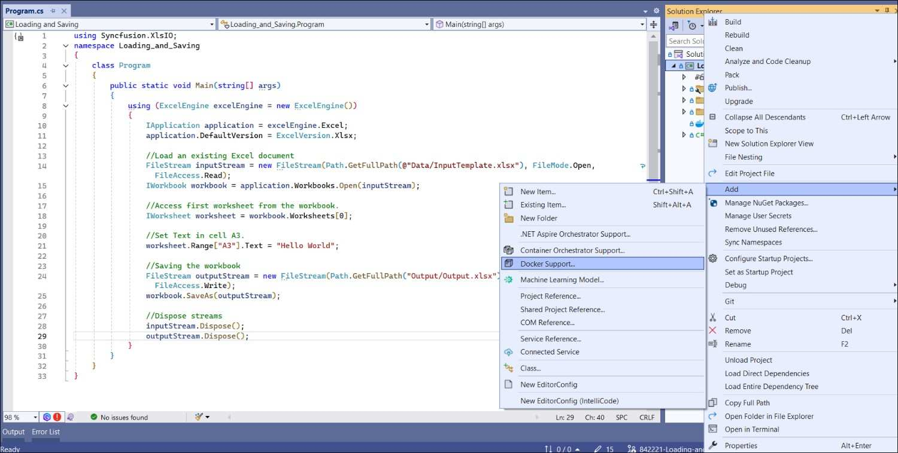
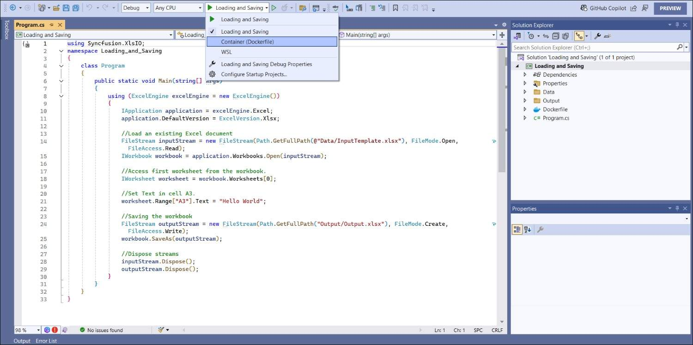

# Loading and Saving Excel files in Docker

[Syncfusion Excel library for ASP.NET Core platform](https://www.syncfusion.com/document-processing/excel-framework/net-core/excel-library) can be used to create, read, edit Excel files in Azure App Service on Windows.

## Steps to Load and Save an Excel document in Docker

The below steps illustrates loading and saving a simple Invoice formatted Excel document in Docker.

Step 1: Create a new C# Console Application project.

Step 2: Name the project.

Step 3: Select the framework and click Create button.

Step 4: Install the [Syncfusion.XlsIO.Net.Core](https://www.nuget.org/packages/Syncfusion.XlsIO.Net.Core) NuGet package as reference to your .NET Standard applications from [NuGet.org](https://www.nuget.org).

N> Starting with v16.2.0.x, if you reference Syncfusion assemblies from trial setup or from the NuGet feed, you also have to add "Syncfusion.Licensing" assembly reference and include a license key in your projects. Please refer to this [link](https://help.syncfusion.com/common/essential-studio/licensing/overview) to know about registering Syncfusion license key in your applications to use our components. 

Step 5: Include the following namespaces in **Program.cs**.

  

using Syncfusion.XlsIO;

  

Step 6: Include the below code snippet in **Program.cs** to **load and save an Excel file in docker**.



using (ExcelEngine excelEngine = new ExcelEngine())
{
    IApplication application = excelEngine.Excel;
    application.DefaultVersion = ExcelVersion.Xlsx;

    //Load an existing Excel document.
    FileStream inputStream = new FileStream(Path.GetFullPath(@"Data/InputTemplate.xlsx"), FileMode.Open, FileAccess.Read);
    IWorkbook workbook = application.Workbooks.Open(inputStream);

    //Access first worksheet from the workbook.
    IWorksheet worksheet = workbook.Worksheets[0];

    //Set Text in cell A3.
    worksheet.Range["A3"].Text = "Hello World";

    //Saving the workbook.
    FileStream outputStream = new FileStream(Path.GetFullPath("Output/Output.xlsx"), FileMode.Create, FileAccess.Write);
    workbook.SaveAs(outputStream);

    //Dispose streams.
    inputStream.Dispose();
    outputStream.Dispose();
}

 

Step 7: Add Docker support to that application by clicking <b>Add -> Docker Support.</b>

Step 8: Choose Linux option in order to run the application in Linux Docker container.

Step 9: Open the **Dockerfile** to see the default Docker commands that are shown below.



FROM mcr.microsoft.com/dotnet/runtime:8.0 AS base
USER $APP_UID
WORKDIR /app

FROM mcr.microsoft.com/dotnet/sdk:8.0 AS build
ARG BUILD_CONFIGURATION=Release
WORKDIR /src
COPY ["Loading and Saving/Loading and Saving.csproj", "Loading and Saving/"]
RUN dotnet restore "./Loading and Saving/Loading and Saving.csproj"
COPY . .
WORKDIR "/src/Loading and Saving"
RUN dotnet build "./Loading and Saving.csproj" -c $BUILD_CONFIGURATION -o /app/build

FROM build AS publish
ARG BUILD_CONFIGURATION=Release
RUN dotnet publish "./Loading and Saving.csproj" -c $BUILD_CONFIGURATION -o /app/publish /p:UseAppHost=false

FROM base AS final
WORKDIR /app
COPY --from=publish /app/publish .
ENTRYPOINT ["dotnet", "Loading and Saving.dll"]



Step 10: Select Docker option and Run the application.

A complete working example of how to load and save an Excel document in docker container is present on [this GitHub page]().

By executing the program, you will get the **Excel document** as follows.

Click [here](https://www.syncfusion.com/document-processing/excel-framework/net-core) to explore the rich set of Syncfusion Excel library (XlsIO) features.

An online sample link to [convert an Excel document to PDF](https://ej2.syncfusion.com/aspnetcore/Excel/ExcelToPDF#/material3) in ASP.NET Core.