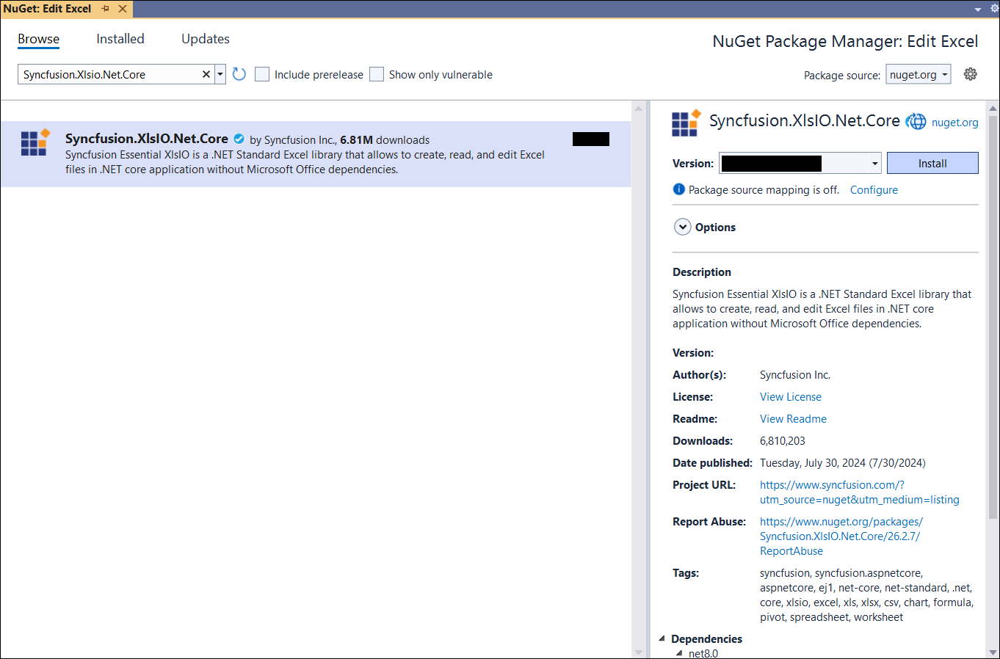
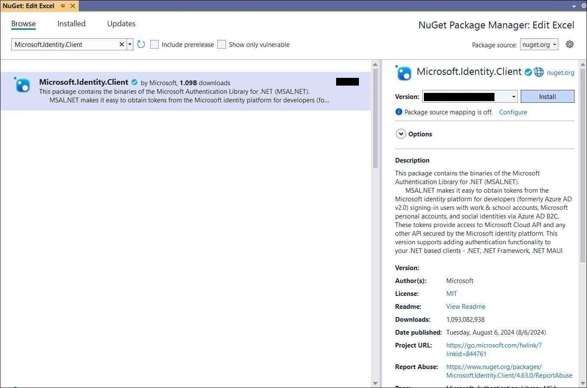
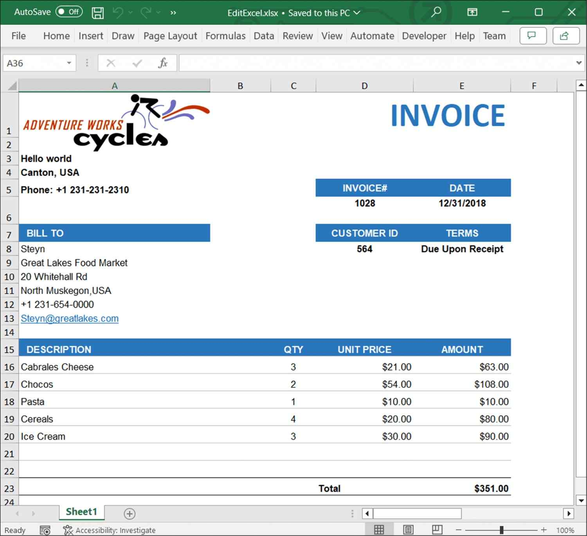
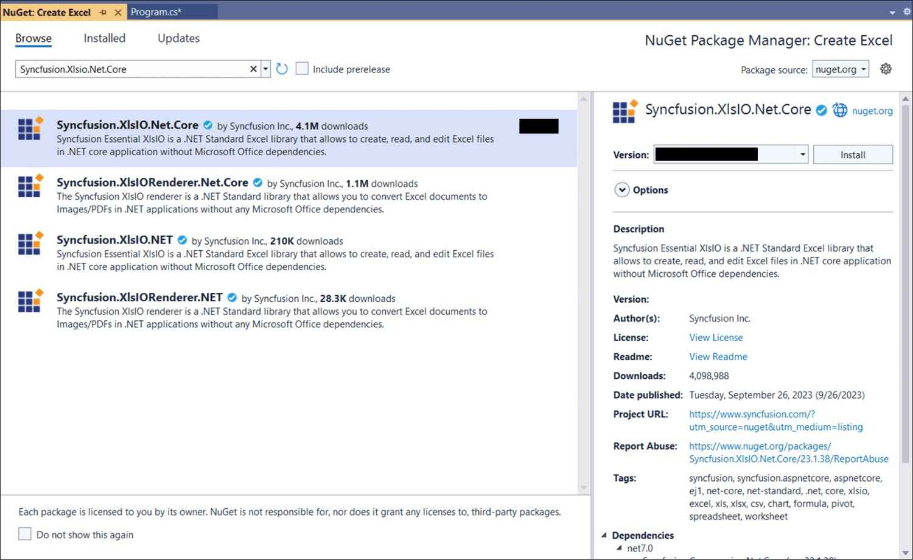
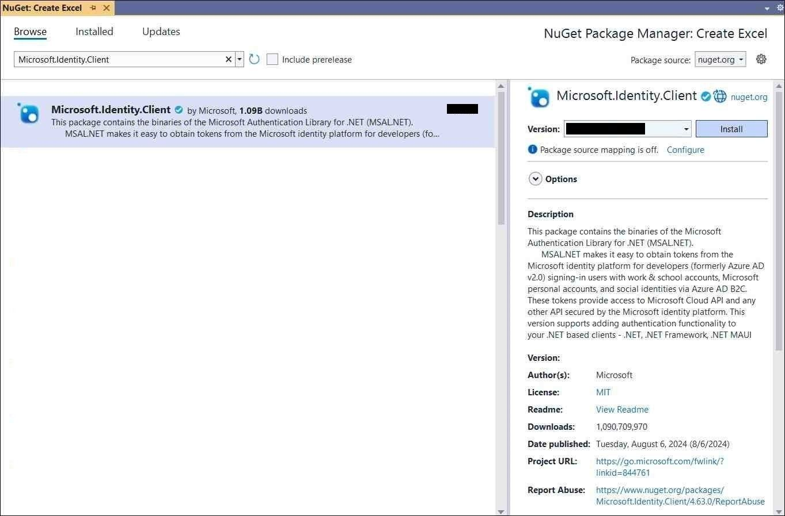

# Loading and Saving Excel document in OneDrive Cloud Storage

## Prerequisites

* **[Microsoft Azure subscription](https://portal.azure.com/#home)** is required. 
* **[Register an application in App Registrations within the Azure portal](https://learn.microsoft.com/en-us/graph/auth-register-app-v2)** is required
* The **Application (client) ID**, **Tenant ID**, and **Client Secret** from the registered app are required for authentication and API access.

## Loading Excel document from OneDrive

Steps to load an Excel document from OneDrive Cloud Storage.

Step 1: Create a new ASP.NET Core Web Application (Model-View-Controller).

Step 2: Name the project.

Step 3: Install the following **Nuget packages** in your application from [NuGet.org](https://www.nuget.org/).
* [Syncfusion.XlsIO.Net.Core](https://www.nuget.org/packages/Syncfusion.XlsIO.Net.Core)
* [Microsoft.Identity.Client](https://www.nuget.org/packages/Microsoft.Identity.Client)

Step 4: Add a new button in the **Index.cshtml** as shown below.
  

@{Html.BeginForm("EditDocument", "Home", FormMethod.Get);
    {
        

            <input type="submit" value="Edit Document" style="width:150px;height:27px" />
        

    }
    Html.EndForm();
}



Step 5: Include the following namespaces in **HomeController.cs**.


using Syncfusion.XlsIO;
using Syncfusion.Drawing;
using Microsoft.Identity.Client;



Step 6: Include the below code snippet in **HomeController.cs** to **load an Excel document from OneDrive Cloud Storage**.



using (ExcelEngine excelEngine = new ExcelEngine())
{
    IApplication application = excelEngine.Excel;
    application.DefaultVersion = ExcelVersion.Xlsx;

    //Download the document from OneDrive
    MemoryStream stream = await DownloadDocumentFromOneDrive();

    //Set the position as '0'
    stream.Position = 0;

    //Load the downloaded document
    IWorkbook workbook = application.Workbooks.Open(stream);

    IWorksheet worksheet = workbook.Worksheets[0];
    worksheet.Range["A3"].Text = "Hello world";

    //Saving the Excel to the MemoryStream 
    MemoryStream outputStream = new MemoryStream();
    workbook.SaveAs(outputStream);

    //Set the position as '0'
    outputStream.Position = 0;

    //Download the Excel file in the browser
    FileStreamResult fileStreamResult = new FileStreamResult(outputStream, "application/excel");
    fileStreamResult.FileDownloadName = "EditExcel.xlsx";
    return fileStreamResult;
}

// Download file from OneDrive
public async Task<MemoryStream> DownloadDocumentFromOneDrive()
{
    //Replace with your application (client) ID, tenant ID, and secret
    string clientId = "your-client-id";
    string tenantId = "your-tenant-id";
    string clientSecret = "your-client-secret";

    //Replace with the user ID (email address) whose OneDrive you want to access
    string userId = "user@example.com";

    //Replace with the OneDrive file path where you want to download the file For ex: "/Template.xlsx"
    string filePath = "FilePath";

    //Initialize the MSAL client
    var confidentialClientApplication = ConfidentialClientApplicationBuilder
        .Create(clientId)
        .WithClientSecret(clientSecret)
        .WithAuthority(new Uri($"https://login.microsoftonline.com/{tenantId}"))
        .Build();

    //Acquire an access token
    string[] scopes = { "https://graph.microsoft.com/.default" };
    var authenticationResult = await confidentialClientApplication
        .AcquireTokenForClient(scopes)
        .ExecuteAsync();

    //Create an HTTP client with the access token
    var httpClient = new HttpClient();
    httpClient.DefaultRequestHeaders.Authorization = new AuthenticationHeaderValue("Bearer", authenticationResult.AccessToken);

    //Construct the OneDrive download URL using user ID and file path
    var downloadUrl = $"https://graph.microsoft.com/v1.0/users/{userId}/drive/root:{filePath}:/content";

    //Download the file from OneDrive
    var response = await httpClient.GetAsync(downloadUrl);
    if (response.IsSuccessStatusCode)
    {
        var stream = new MemoryStream();
        await response.Content.CopyToAsync(stream);

        // Reset the stream position to the beginning
        stream.Position = 0;

        Console.WriteLine("File downloaded successfully.");
        return stream;
    }
    else
    {
        Console.WriteLine($"Failed to download file. Status code: {response.StatusCode}");
        string responseBody = await response.Content.ReadAsStringAsync();
        Console.WriteLine($"Error details: {responseBody}");
        return null;
    }
}



A complete working example of how to load an Excel document from OneDrive Cloud Storage in ASP.NET Core is present on [this GitHub page](https://github.com/SyncfusionExamples/XlsIO-Examples/tree/master/Loading%20and%20Saving/OneDrive/Loading/Edit%20Excel).

By executing the program, you will get the **Excel document** as follows.

## Saving Excel document to OneDrive

Steps to save an Excel document to OneDrive Cloud Storage.

Step 1: Create a new ASP.NET Core Web Application (Model-View-Controller).

Step 2: Name the project.

Step 3: Install the following **Nuget packages** in your application from [NuGet.org](https://www.nuget.org/).
* [Syncfusion.XlsIO.Net.Core](https://www.nuget.org/packages/Syncfusion.XlsIO.Net.Core)
* [Microsoft.Identity.Client](https://www.nuget.org/packages/Microsoft.Identity.Client)

Step 4: Add a new button in the **Index.cshtml** as shown below.
  

@{Html.BeginForm("CreateDocument", "Home", FormMethod.Get);
    {
        

            <input type="submit" value="Upload Document" style="width:150px;height:27px" />
        

    }
    Html.EndForm();
}



Step 5: Include the following namespaces in **HomeController.cs**.


using Syncfusion.XlsIO;
using Syncfusion.Drawing;
using Microsoft.Identity.Client;



Step 6: Include the below code snippet in **HomeController.cs** to **Save an Excel document to OneDrive Cloud Storage**.



//Create an instance of ExcelEngine
using (ExcelEngine excelEngine = new ExcelEngine())
{
    IApplication application = excelEngine.Excel;
    application.DefaultVersion = ExcelVersion.Xlsx;

    //Create a workbook
    IWorkbook workbook = application.Workbooks.Create(1);
    IWorksheet worksheet = workbook.Worksheets[0];

    //Adding a picture
    FileStream imageStream = new FileStream("AdventureCycles-Logo.png", FileMode.Open, FileAccess.Read);
    IPictureShape shape = worksheet.Pictures.AddPicture(1, 1, imageStream, 20, 20);

    //Disable gridlines in the worksheet
    worksheet.IsGridLinesVisible = false;

    //Enter values to the cells from A3 to A5
    worksheet.Range["A3"].Text = "46036 Michigan Ave";
    worksheet.Range["A4"].Text = "Canton, USA";
    worksheet.Range["A5"].Text = "Phone: +1 231-231-2310";

    //Make the text bold
    worksheet.Range["A3:A5"].CellStyle.Font.Bold = true;

    //Merge cells
    worksheet.Range["D1:E1"].Merge();

    //Enter text to the cell D1 and apply formatting.
    worksheet.Range["D1"].Text = "INVOICE";
    worksheet.Range["D1"].CellStyle.Font.Bold = true;
    worksheet.Range["D1"].CellStyle.Font.RGBColor = Color.FromArgb(42, 118, 189);
    worksheet.Range["D1"].CellStyle.Font.Size = 35;

    //Apply alignment in the cell D1
    worksheet.Range["D1"].CellStyle.HorizontalAlignment = ExcelHAlign.HAlignRight;
    worksheet.Range["D1"].CellStyle.VerticalAlignment = ExcelVAlign.VAlignTop;

    //Enter values to the cells from D5 to E8
    worksheet.Range["D5"].Text = "INVOICE#";
    worksheet.Range["E5"].Text = "DATE";
    worksheet.Range["D6"].Number = 1028;
    worksheet.SetValue(6, 5, "12/31/2018");
    worksheet.Range["D7"].Text = "CUSTOMER ID";
    worksheet.Range["E7"].Text = "TERMS";
    worksheet.Range["D8"].Number = 564;
    worksheet.Range["E8"].Text = "Due Upon Receipt";

    //Apply RGB backcolor to the cells from D5 to E8
    worksheet.Range["D5:E5"].CellStyle.Color = Color.FromArgb(42, 118, 189);
    worksheet.Range["D7:E7"].CellStyle.Color = Color.FromArgb(42, 118, 189);

    //Apply known colors to the text in cells D5 to E8
    worksheet.Range["D5:E5"].CellStyle.Font.Color = ExcelKnownColors.White;
    worksheet.Range["D7:E7"].CellStyle.Font.Color = ExcelKnownColors.White;

    //Make the text as bold from D5 to E8
    worksheet.Range["D5:E8"].CellStyle.Font.Bold = true;

    //Apply alignment to the cells from D5 to E8
    worksheet.Range["D5:E8"].CellStyle.HorizontalAlignment = ExcelHAlign.HAlignCenter;
    worksheet.Range["D5:E5"].CellStyle.VerticalAlignment = ExcelVAlign.VAlignCenter;
    worksheet.Range["D7:E7"].CellStyle.VerticalAlignment = ExcelVAlign.VAlignCenter;
    worksheet.Range["D6:E6"].CellStyle.VerticalAlignment = ExcelVAlign.VAlignTop;

    //Enter value and applying formatting in the cell A7
    worksheet.Range["A7"].Text = "  BILL TO";
    worksheet.Range["A7"].CellStyle.Color = Color.FromArgb(42, 118, 189);
    worksheet.Range["A7"].CellStyle.Font.Bold = true;
    worksheet.Range["A7"].CellStyle.Font.Color = ExcelKnownColors.White;

    //Apply alignment
    worksheet.Range["A7"].CellStyle.HorizontalAlignment = ExcelHAlign.HAlignLeft;
    worksheet.Range["A7"].CellStyle.VerticalAlignment = ExcelVAlign.VAlignCenter;

    //Enter values in the cells A8 to A12
    worksheet.Range["A8"].Text = "Steyn";
    worksheet.Range["A9"].Text = "Great Lakes Food Market";
    worksheet.Range["A10"].Text = "20 Whitehall Rd";
    worksheet.Range["A11"].Text = "North Muskegon,USA";
    worksheet.Range["A12"].Text = "+1 231-654-0000";

    //Create a Hyperlink for e-mail in the cell A13
    IHyperLink hyperlink = worksheet.HyperLinks.Add(worksheet.Range["A13"]);
    hyperlink.Type = ExcelHyperLinkType.Url;
    hyperlink.Address = "Steyn@greatlakes.com";
    hyperlink.ScreenTip = "Send Mail";

    //Merge column A and B from row 15 to 22
    worksheet.Range["A15:B15"].Merge();
    worksheet.Range["A16:B16"].Merge();
    worksheet.Range["A17:B17"].Merge();
    worksheet.Range["A18:B18"].Merge();
    worksheet.Range["A19:B19"].Merge();
    worksheet.Range["A20:B20"].Merge();
    worksheet.Range["A21:B21"].Merge();
    worksheet.Range["A22:B22"].Merge();

    //Enter details of products and prices
    worksheet.Range["A15"].Text = "  DESCRIPTION";
    worksheet.Range["C15"].Text = "QTY";
    worksheet.Range["D15"].Text = "UNIT PRICE";
    worksheet.Range["E15"].Text = "AMOUNT";
    worksheet.Range["A16"].Text = "Cabrales Cheese";
    worksheet.Range["A17"].Text = "Chocos";
    worksheet.Range["A18"].Text = "Pasta";
    worksheet.Range["A19"].Text = "Cereals";
    worksheet.Range["A20"].Text = "Ice Cream";
    worksheet.Range["C16"].Number = 3;
    worksheet.Range["C17"].Number = 2;
    worksheet.Range["C18"].Number = 1;
    worksheet.Range["C19"].Number = 4;
    worksheet.Range["C20"].Number = 3;
    worksheet.Range["D16"].Number = 21;
    worksheet.Range["D17"].Number = 54;
    worksheet.Range["D18"].Number = 10;
    worksheet.Range["D19"].Number = 20;
    worksheet.Range["D20"].Number = 30;
    worksheet.Range["D23"].Text = "Total";

    //Apply number format
    worksheet.Range["D16:E22"].NumberFormat = "$.00";
    worksheet.Range["E23"].NumberFormat = "$.00";

    //Apply incremental formula for column Amount by multiplying Qty and UnitPrice
    application.EnableIncrementalFormula = true;
    worksheet.Range["E16:E20"].Formula = "=C16*D16";

    //Formula for Sum the total
    worksheet.Range["E23"].Formula = "=SUM(E16:E22)";

    //Apply borders
    worksheet.Range["A16:E22"].CellStyle.Borders[ExcelBordersIndex.EdgeTop].LineStyle = ExcelLineStyle.Thin;
    worksheet.Range["A16:E22"].CellStyle.Borders[ExcelBordersIndex.EdgeBottom].LineStyle = ExcelLineStyle.Thin;
    worksheet.Range["A16:E22"].CellStyle.Borders[ExcelBordersIndex.EdgeTop].Color = ExcelKnownColors.Grey_25_percent;
    worksheet.Range["A16:E22"].CellStyle.Borders[ExcelBordersIndex.EdgeBottom].Color = ExcelKnownColors.Grey_25_percent;
    worksheet.Range["A23:E23"].CellStyle.Borders[ExcelBordersIndex.EdgeTop].LineStyle = ExcelLineStyle.Thin;
    worksheet.Range["A23:E23"].CellStyle.Borders[ExcelBordersIndex.EdgeBottom].LineStyle = ExcelLineStyle.Thin;
    worksheet.Range["A23:E23"].CellStyle.Borders[ExcelBordersIndex.EdgeTop].Color = ExcelKnownColors.Black;
    worksheet.Range["A23:E23"].CellStyle.Borders[ExcelBordersIndex.EdgeBottom].Color = ExcelKnownColors.Black;

    //Apply font setting for cells with product details
    worksheet.Range["A3:E23"].CellStyle.Font.FontName = "Arial";
    worksheet.Range["A3:E23"].CellStyle.Font.Size = 10;
    worksheet.Range["A15:E15"].CellStyle.Font.Color = ExcelKnownColors.White;
    worksheet.Range["A15:E15"].CellStyle.Font.Bold = true;
    worksheet.Range["D23:E23"].CellStyle.Font.Bold = true;

    //Apply cell color
    worksheet.Range["A15:E15"].CellStyle.Color = Color.FromArgb(42, 118, 189);

    //Apply alignment to cells with product details
    worksheet.Range["A15"].CellStyle.HorizontalAlignment = ExcelHAlign.HAlignLeft;
    worksheet.Range["C15:C22"].CellStyle.HorizontalAlignment = ExcelHAlign.HAlignCenter;
    worksheet.Range["D15:E15"].CellStyle.HorizontalAlignment = ExcelHAlign.HAlignCenter;

    //Apply row height and column width to look good
    worksheet.Range["A1"].ColumnWidth = 36;
    worksheet.Range["B1"].ColumnWidth = 11;
    worksheet.Range["C1"].ColumnWidth = 8;
    worksheet.Range["D1:E1"].ColumnWidth = 18;
    worksheet.Range["A1"].RowHeight = 47;
    worksheet.Range["A2"].RowHeight = 15;
    worksheet.Range["A3:A4"].RowHeight = 15;
    worksheet.Range["A5"].RowHeight = 18;
    worksheet.Range["A6"].RowHeight = 29;
    worksheet.Range["A7"].RowHeight = 18;
    worksheet.Range["A8"].RowHeight = 15;
    worksheet.Range["A9:A14"].RowHeight = 15;
    worksheet.Range["A15:A23"].RowHeight = 18;

    //Saving the Excel to the MemoryStream 
    MemoryStream stream = new MemoryStream();
    workbook.SaveAs(stream);

    //Set the position as '0'.
    stream.Position = 0;

    //Upload the document to OneDrive
    await UploadDocumentToOneDrive(stream);

    return Ok("Excel document uploaded to OneDrive cloud Storage.");
}

// Upload file to OneDrive
public async Task<MemoryStream> UploadDocumentToOneDrive(MemoryStream stream)
{
    //Replace with your application (client) ID, tenant ID, and secret
    string clientId = "your-client-id";
    string tenantId = "your-tenant-id";
    string clientSecret = "your-client-secret";

    //Replace with the user ID (email address) whose OneDrive you want to access
    string userId = "user@example.com";

    //Replace with the OneDrive file path where you want to save the file For ex: "/Template.xlsx"
    string filePath = "FilePath";

    //Initialize the MSAL client
    var confidentialClientApplication = ConfidentialClientApplicationBuilder
        .Create(clientId)
        .WithClientSecret(clientSecret)
        .WithAuthority(new Uri($"https://login.microsoftonline.com/{tenantId}"))
        .Build();

    //Acquire an access token
    string[] scopes = { "https://graph.microsoft.com/.default" };
    var authenticationResult = await confidentialClientApplication
        .AcquireTokenForClient(scopes)
        .ExecuteAsync();

    //Create an HTTP client with the access token
    var httpClient = new HttpClient();
    httpClient.DefaultRequestHeaders.Authorization = new AuthenticationHeaderValue("Bearer", authenticationResult.AccessToken);

    //Upload the file to OneDrive
    var content = new StreamContent(stream);
    content.Headers.ContentType = new MediaTypeHeaderValue("application/octet-stream");

    //Construct the OneDrive upload URL using user ID and file path
    var uploadUrl = $"https://graph.microsoft.com/v1.0/users/{userId}/drive/root:{filePath}:/content";

    using (var response = await httpClient.PutAsync(uploadUrl, content))
    {
        if (response.IsSuccessStatusCode)
        {
            Console.WriteLine("File uploaded successfully.");
        }
        else
        {
            Console.WriteLine($"Failed to upload file. Status code: {response.StatusCode}");
            string responseBody = await response.Content.ReadAsStringAsync();
            Console.WriteLine($"Error details: {responseBody}");
        }
    }
    return stream;
}



A complete working example of how to save an Excel document to OneDrive Cloud Storage in ASP.NET Core is present on [this GitHub page](https://github.com/SyncfusionExamples/XlsIO-Examples/tree/master/Loading%20and%20Saving/OneDrive/Saving/Create%20Excel).

By executing the program, you will get the **Excel document** as follows.

Click [here](https://www.syncfusion.com/document-processing/excel-framework/net-core) to explore the rich set of Syncfusion&reg; Excel library (XlsIO) features.

An online sample link to [create an Excel document](https://ej2.syncfusion.com/aspnetcore/Excel/Create#/material3) in ASP.NET Core.