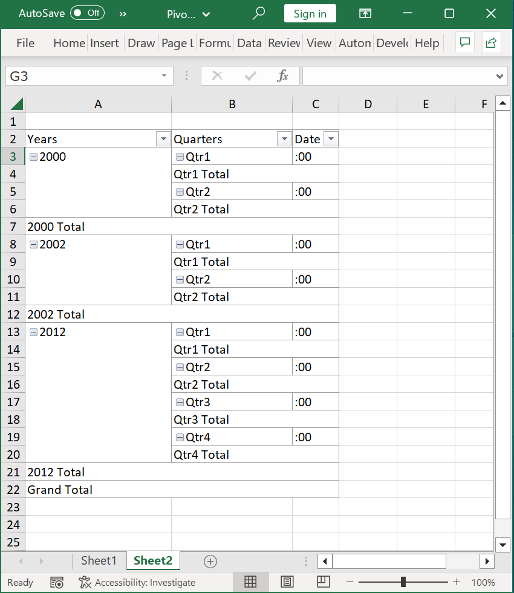

# Grouping in Pivot Table

Date and time fields in the pivot table can be grouped using XlsIO.

XlsIO supports grouping pivot data based on the following categories.

* Date
* Month
* Year
* Quarters
* Hours
* Minutes
* Seconds

## Group

The pivot fields can be grouped by using the [GroupBy](https://help.syncfusion.com/cr/document-processing/Syncfusion.XlsIO.IPivotFieldGroup.html#Syncfusion_XlsIO_IPivotFieldGroup_GroupBy) property in the IPivotField.FieldGroup.

The following code example illustrates how to group pivot fields based on a period.



using (ExcelEngine excelEngine = new ExcelEngine())
{
  IApplication application = excelEngine.Excel;
  application.DefaultVersion = ExcelVersion.Xlsx;
  IWorkbook workbook = application.Workbooks.Open("InputTemplate.xlsx");
  IWorksheet worksheet = workbook.Worksheets[0];
  IWorksheet pivotSheet = workbook.Worksheets.Create();

  IPivotCache cache = workbook.PivotCaches.Add(worksheet["A1:B16"]);
  pivotSheet.PivotTables.Add("PivotTable", pivotSheet["A2"], cache);
  IPivotTable pivotTable = pivotSheet.PivotTables[0];
  pivotTable.Fields[1].Axis = PivotAxisTypes.Row;
  pivotTable.Fields[1].Subtotals = PivotSubtotalTypes.None;
  var field1 = pivotTable.Fields[1].FieldGroup;

  //Apply pivot table grouping
  field1.GroupBy = PivotFieldGroupType.Seconds | PivotFieldGroupType.Years | PivotFieldGroupType.Quarters;

  pivotTable.Options.ShowFieldList = false;
  pivotTable.Options.RowLayout = PivotTableRowLayout.Tabular;

  //Saving the workbook
  workbook.SaveAs("PivotTableGrouping.xlsx");             
}



using (ExcelEngine excelEngine = new ExcelEngine())
{
  IApplication application = excelEngine.Excel;
  application.DefaultVersion = ExcelVersion.Xlsx;   
  IWorkbook workbook = application.Workbooks.Open("InputTemplate.xlsx");
  IWorksheet worksheet = workbook.Worksheets[0];
  IWorksheet pivotSheet = workbook.Worksheets.Create();

  IPivotCache cache = workbook.PivotCaches.Add(worksheet["A1:B16"]);
  pivotSheet.PivotTables.Add("PivotTable1", pivotSheet["A2"], cache);
  IPivotTable pivotTable = pivotSheet.PivotTables[0];
  pivotTable.Fields[1].Axis = PivotAxisTypes.Row;
  pivotTable.Fields[1].Subtotals = PivotSubtotalTypes.None;
  var field1 = pivotTable.Fields[1].FieldGroup;

  //Apply pivot table grouping
  field1.GroupBy = PivotFieldGroupType.Seconds | PivotFieldGroupType.Years | PivotFieldGroupType.Quarters;

  pivotTable.Options.ShowFieldList = false;
  pivotTable.Options.RowLayout = PivotTableRowLayout.Tabular;             

  //Saving the workbook   
  workbook.SaveAs("PivotTableGrouping.xlsx");              
}



Using excelEngine As ExcelEngine = New ExcelEngine()
  Dim application As IApplication = excelEngine.Excel
  application.DefaultVersion = ExcelVersion.Xlsx
  Dim workbook As IWorkbook = application.Workbooks.Open("InputTemplate.xlsx")
  Dim worksheet As IWorksheet = workbook.Worksheets(0)
  Dim pivotSheet As IWorksheet = workbook.Worksheets.Create()

  Dim cache As IPivotCache = workbook.PivotCaches.Add(worksheet("A1:B16"))
  pivotSheet.PivotTables.Add("PivotTable1", pivotSheet("A2"), cache)
  Dim pivotTable As IPivotTable = pivotSheet.PivotTables(0)
  pivotTable.Fields(1).Axis = PivotAxisTypes.Row
  pivotTable.Fields(1).Subtotals = PivotSubtotalTypes.None
  Dim field1 = pivotTable.Fields(1).FieldGroup

  'Apply pivot table grouping
  field1.GroupBy = PivotFieldGroupType.Seconds Or PivotFieldGroupType.Years Or PivotFieldGroupType.Quarters

  pivotTable.Options.ShowFieldList = False
  pivotTable.Options.RowLayout = PivotTableRowLayout.Tabular

  'Saving the workbook
  workbook.SaveAs("PivotTableGrouping.xlsx")
End Using




By executing the program, you will get the Excel file as below

## Ungroup

The grouping in the pivot table can be removed by making the [GroupBy](https://help.syncfusion.com/cr/document-processing/Syncfusion.XlsIO.IPivotFieldGroup.html#Syncfusion_XlsIO_IPivotFieldGroup_GroupBy) property value None.

The following code example illustrates how to remove grouping from the pivot table.



using (ExcelEngine excelEngine = new ExcelEngine())
{
  IApplication application = excelEngine.Excel;
  application.DefaultVersion = ExcelVersion.Xlsx;
  IWorkbook workbook = application.Workbooks.Open("InputTemplate.xlsx");
  IWorksheet worksheet = workbook.Worksheets[0];

  IPivotTable pivotTable = worksheet.PivotTables[0];
  pivotTable.Fields[0].Axis = PivotAxisTypes.Row;
  pivotTable.Fields[0].Subtotals = PivotSubtotalTypes.None;
  var field1 = pivotTable.Fields[1].FieldGroup;

  //Remove pivot table grouping
  field1.GroupBy = PivotFieldGroupType.None;

  //Saving the workbook 
  workbook.SaveAs("PivotTableUnGrouping.xlsx");             
}



 using (ExcelEngine excelEngine = new ExcelEngine())
 {
  IApplication application = excelEngine.Excel;
  application.DefaultVersion = ExcelVersion.Xlsx;               
  IWorkbook workbook = application.Workbooks.Open("InputTemplate.xlsx");
  IWorksheet worksheet = workbook.Worksheets[0];

  IPivotTable pivotTable = worksheet.PivotTables[0];
  pivotTable.Fields[0].Axis = PivotAxisTypes.Row;
  pivotTable.Fields[0].Subtotals = PivotSubtotalTypes.None;
  var field1 = pivotTable.Fields[1].FieldGroup;

  //Remove pivot table grouping
  field1.GroupBy = PivotFieldGroupType.None;

  //Saving the workbook
  workbook.SaveAs("PivotTableUnGrouping.xlsx");                
 }



Using excelEngine As ExcelEngine = New ExcelEngine()
  Dim application As IApplication = excelEngine.Excel
  application.DefaultVersion = ExcelVersion.Xlsx
  Dim workbook As IWorkbook = application.Workbooks.Open("InputTemplate.xlsx")
  Dim worksheet As IWorksheet = workbook.Worksheets(0)

  Dim pivotTable As IPivotTable = worksheet.PivotTables(0)
  pivotTable.Fields(0).Axis = PivotAxisTypes.Row
  pivotTable.Fields(0).Subtotals = PivotSubtotalTypes.None
  Dim field1 = pivotTable.Fields(1).FieldGroup

  'Remove pivot table grouping
  field1.GroupBy = PivotFieldGroupType.None

  'Saving the workbook
  workbook.SaveAs("PivotTableUnGrouping.xlsx")
End Using



## Expand or collapse

XlsIO allows you to expand and collapse the [PivotFieldItems](https://help.syncfusion.com/cr/document-processing/Syncfusion.XlsIO.IPivotFieldItems.html) or simply the pivot table rows using [IsHiddenDetails](https://help.syncfusion.com/cr/document-processing/Syncfusion.XlsIO.Implementation.PivotTables.PivotItemOptions.html#Syncfusion_XlsIO_Implementation_PivotTables_PivotItemOptions_IsHiddenDetails) of [PivotItemOptions](https://help.syncfusion.com/cr/document-processing/Syncfusion.XlsIO.Implementation.PivotTables.PivotItemOptions.html).

The following code example illustrates how to expand or collapse rows in the pivot table.


{% highlight c# tabtitle="C# [Cross-platform]" playgroundButtonLink="https://raw.githubusercontent.com/SyncfusionExamples/XlsIO-Examples/master/Pivot%20Table/Expand%20or%20Collapse%20Pivot%20Rows/.NET/Expand%20or%20Collapse%20Pivot%20Rows/Expand%20or%20Collapse%20Pivot%20Rows/Program.cs,180" %}
using (ExcelEngine excelEngine = new ExcelEngine())
{
	IApplication application = excelEngine.Excel;
	application.DefaultVersion = ExcelVersion.Xlsx;
	IWorkbook workbook = application.Workbooks.Open(Path.GetFullPath(@"Data/InputTemplate.xlsx"));
	IWorksheet worksheet = workbook.Worksheets[0];
	IWorksheet pivotSheet = workbook.Worksheets[1];

	//Create pivot cache with the given data range
	IPivotCache cache = workbook.PivotCaches.Add(worksheet["A1:H50"]);

	//Create "PivotTable1" with the cache at the specified range
	IPivotTable pivotTable = pivotSheet.PivotTables.Add("PivotTable1", pivotSheet["A1"], cache);

	//Add pivot table fields (Row and Column fields)
	pivotTable.Fields[0].Axis = PivotAxisTypes.Row;
	pivotTable.Fields[1].Axis = PivotAxisTypes.Row;

	//Add data field
	IPivotField field = pivotTable.Fields[2];
	pivotTable.DataFields.Add(field, "Sum", PivotSubtotalTypes.Sum);

	//Initialize PivotItemOptions
	PivotItemOptions options = new PivotItemOptions();
	options.IsHiddenDetails = false;

	//Collapsing the first and second items of the first pivot field using PivotItemOptions
	(pivotTable.Fields[0] as PivotFieldImpl).AddItemOption(0, options);
	(pivotTable.Fields[0] as PivotFieldImpl).AddItemOption(1, options);

	#region Save
	//Saving the workbook
	workbook.SaveAs(Path.GetFullPath("Output/ExpandOrCollapse.xlsx"));
	#endregion
}



using (ExcelEngine excelEngine = new ExcelEngine())
{
  IApplication application = excelEngine.Excel;
  application.DefaultVersion = ExcelVersion.Xlsx;
  IWorkbook workbook = application.Workbooks.Open("InputTemplate.xlsx");
  IWorksheet worksheet = workbook.Worksheets[0];

  //Create pivot cache with the given data range
  IPivotCache cache = workbook.PivotCaches.Add(worksheet["A1:C13"]);

  //Create "PivotTable1" with the cache at the specified range
  IPivotTable pivotTable = worksheet.PivotTables.Add("PivotTable1", worksheet["E1"], cache);

  //Add pivot table fields (Row and Column fields)
  pivotTable.Fields[0].Axis = PivotAxisTypes.Row;
  pivotTable.Fields[1].Axis = PivotAxisTypes.Row;

  //Add data field
  IPivotField field = pivotTable.Fields[2];
  pivotTable.DataFields.Add(field, "Sum", PivotSubtotalTypes.Sum);

  //Initialize PivotItemOptions
  PivotItemOptions options = new PivotItemOptions();
  options.IsHiddenDetails = false;

  //Collapsing the first and second items of the first pivot field using PivotItemOptions
  (pivotTable.Fields[0] as PivotFieldImpl).AddItemOption(0, options);
  (pivotTable.Fields[0] as PivotFieldImpl).AddItemOption(1, options);

  workbook.SaveAs("Output.xlsx");
}



Using excelEngine As ExcelEngine = New ExcelEngine()
  Dim application As IApplication = excelEngine.Excel
  application.DefaultVersion = ExcelVersion.Xlsx
  Dim workbook As IWorkbook = application.Workbooks.Open("InputTemplate.xlsx")
  Dim worksheet As IWorksheet = workbook.Worksheets(0)

  'Create pivot cache with the given data range
  Dim cache As IPivotCache = workbook.PivotCaches.Add(worksheet("A1:C13"))

  'Create "PivotTable1" with the cache at the specified range
  Dim pivotTable As IPivotTable = worksheet.PivotTables.Add("PivotTable1", worksheet("E1"), cache)

  'Add pivot table fields (Row and Column fields)
  pivotTable.Fields(0).Axis = PivotAxisTypes.Row
  pivotTable.Fields(1).Axis = PivotAxisTypes.Row

  'Add data field
  Dim field As IPivotField = pivotTable.Fields(2)
  pivotTable.DataFields.Add(field, "Sum", PivotSubtotalTypes.Sum)

  'Initialize PivotItemOptions
  Dim options As PivotItemOptions = New PivotItemOptions
  options.IsHiddenDetails = False

  'Collapsing the first and second items of the first pivot field using PivotItemOptions
  CType(pivotTable.Fields(0), PivotFieldImpl).AddItemOption(0, options)
  CType(pivotTable.Fields(0), PivotFieldImpl).AddItemOption(1, options)

  workbook.SaveAs("Output.xlsx")
End Using



A complete working example to expand or collapse rows in pivot table in C# is present on [this GitHub page](https://github.com/SyncfusionExamples/XlsIO-Examples/tree/master/Pivot%20Table/Expand%20or%20Collapse%20Pivot%20Rows/.NET/Expand%20or%20Collapse%20Pivot%20Rows).