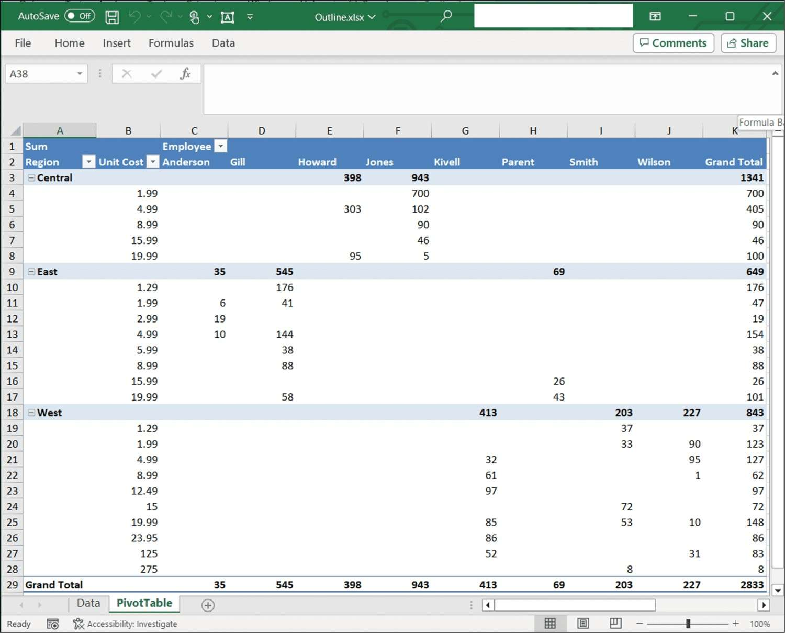

# Pivot Table Layout in Excel

The [PivotTableRowLayout](https://help.syncfusion.com/cr/file-formats/Syncfusion.XlsIO.PivotTableRowLayout.html) enumeration can be used to set the pivot table row layout to Compact, Tabular, or Outline.

## Compact Layout

The following code example illustrates how to apply a compact layout to a pivot table.


{% highlight c# tabtitle="C# [Cross-platform]" playgroundButtonLink="https://raw.githubusercontent.com/SyncfusionExamples/XlsIO-Examples/master/Pivot%20Table/Compact%20Layout/.NET/Compact%20Layout/Compact%20Layout/Program.cs,180" %}
using (ExcelEngine excelEngine = new ExcelEngine())
{
	IApplication application = excelEngine.Excel;
	application.DefaultVersion = ExcelVersion.Xlsx;
	IWorkbook workbook = application.Workbooks.Open(Path.GetFullPath(@"Data/InputTemplate.xlsx"));
	IWorksheet worksheet = workbook.Worksheets[1];
	IPivotTable pivotTable = worksheet.PivotTables[0];

	//Set PivotTableRowLayout
	pivotTable.Options.RowLayout = PivotTableRowLayout.Compact;

	//Set BuiltInStyle
	pivotTable.BuiltInStyle = PivotBuiltInStyles.PivotStyleMedium9;

	#region Save
	//Saving the workbook
	workbook.SaveAs(Path.GetFullPath("Output/Output.xlsx"));
	#endregion
}



using (ExcelEngine excelEngine = new ExcelEngine())
{
    IApplication application = excelEngine.Excel;
    application.DefaultVersion = ExcelVersion.Xlsx;
    IWorkbook workbook = application.Workbooks.Open("InputTemplate.xlsx");
    IWorksheet worksheet = workbook.Worksheets[1];
    IPivotTable pivotTable = worksheet.PivotTables[0];

    //Set PivotTableRowLayout
    pivotTable.Options.RowLayout = PivotTableRowLayout.Compact;

    //Set BuiltInStyle
    pivotTable.BuiltInStyle = PivotBuiltInStyles.PivotStyleMedium9;

    workbook.SaveAs("Output.xlsx");
}



Using excelEngine As New ExcelEngine()
    Dim application As IApplication = excelEngine.Excel
    application.DefaultVersion = ExcelVersion.Xlsx
    Dim workbook As IWorkbook = application.Workbooks.Open("InputTemplate.xlsx")
    Dim worksheet As IWorksheet = workbook.Worksheets(1)
    Dim pivotTable As IPivotTable = worksheet.PivotTables(0)

    'Set PivotTableRowLayout
    pivotTable.Options.RowLayout = PivotTableRowLayout.Compact

    'Set BuiltInStyle
    pivotTable.BuiltInStyle = PivotBuiltInStyles.PivotStyleMedium9

    workbook.SaveAs("Output.xlsx")
End Using

  

A complete working example to apply a compact layout to a pivot table in C# is present on [this GitHub page](https://github.com/SyncfusionExamples/XlsIO-Examples/tree/master/Pivot%20Table/Compact%20Layout/.NET/Compact%20Layout).

By executing the program, you will get the Excel file as below

## Tabular Layout

The following code example illustrates how to apply a tabular layout to a pivot table.


{% highlight c# tabtitle="C# [Cross-platform]" playgroundButtonLink="https://raw.githubusercontent.com/SyncfusionExamples/XlsIO-Examples/master/Pivot%20Table/Tabular%20Layout/.NET/Tabular%20Layout/Tabular%20Layout/Program.cs,180" %}
using (ExcelEngine excelEngine = new ExcelEngine())
{
	IApplication application = excelEngine.Excel;
	application.DefaultVersion = ExcelVersion.Xlsx;
	IWorkbook workbook = application.Workbooks.Open(Path.GetFullPath(@"Data/InputTemplate.xlsx"));
	IWorksheet worksheet = workbook.Worksheets[1];
	IPivotTable pivotTable = worksheet.PivotTables[0];

	//Set PivotTableRowLayout
	pivotTable.Options.RowLayout = PivotTableRowLayout.Tabular;

	//Set BuiltInStyle
	pivotTable.BuiltInStyle = PivotBuiltInStyles.PivotStyleMedium9;

	#region Save
	//Saving the workbook
	workbook.SaveAs(Path.GetFullPath("Output/Output.xlsx"));
	#endregion
}



using (ExcelEngine excelEngine = new ExcelEngine())
{
    IApplication application = excelEngine.Excel;
    application.DefaultVersion = ExcelVersion.Xlsx;
    IWorkbook workbook = application.Workbooks.Open("InputTemplate.xlsx");
    IWorksheet worksheet = workbook.Worksheets[1];
    IPivotTable pivotTable = worksheet.PivotTables[0];

    //Set PivotTableRowLayout
    pivotTable.Options.RowLayout = PivotTableRowLayout.Tabular;

    //Set BuiltInStyle
    pivotTable.BuiltInStyle = PivotBuiltInStyles.PivotStyleMedium9;

    workbook.SaveAs("Output.xlsx");
}



Using excelEngine As New ExcelEngine()
    Dim application As IApplication = excelEngine.Excel
    application.DefaultVersion = ExcelVersion.Xlsx
    Dim workbook As IWorkbook = application.Workbooks.Open("InputTemplate.xlsx")
    Dim worksheet As IWorksheet = workbook.Worksheets(1)
    Dim pivotTable As IPivotTable = worksheet.PivotTables(0)

    'Set PivotTableRowLayout
    pivotTable.Options.RowLayout = PivotTableRowLayout.Tabular

    'Set BuiltInStyle
    pivotTable.BuiltInStyle = PivotBuiltInStyles.PivotStyleMedium9

    workbook.SaveAs("Output.xlsx")
End Using

  

A complete working example to apply a tabular layout to a pivot table in C# is present on [this GitHub page](https://github.com/SyncfusionExamples/XlsIO-Examples/tree/master/Pivot%20Table/Tabular%20Layout/.NET/Tabular%20Layout).

By executing the program, you will get the Excel file as below

## Outline Layout

The following code example illustrates how to apply a outline layout to a pivot table.


{% highlight c# tabtitle="C# [Cross-platform]" playgroundButtonLink="https://raw.githubusercontent.com/SyncfusionExamples/XlsIO-Examples/master/Pivot%20Table/Outline%20Layout/.NET/Outline%20Layout/Outline%20Layout/Program.cs,180" %}
using (ExcelEngine excelEngine = new ExcelEngine())
{
	IApplication application = excelEngine.Excel;
	application.DefaultVersion = ExcelVersion.Xlsx;
	IWorkbook workbook = application.Workbooks.Open(Path.GetFullPath(@"Data/InputTemplate.xlsx"));
	IWorksheet worksheet = workbook.Worksheets[1];
	IPivotTable pivotTable = worksheet.PivotTables[0];

	//Set PivotTableRowLayout
	pivotTable.Options.RowLayout = PivotTableRowLayout.Outline;

	//Set BuiltInStyle
	pivotTable.BuiltInStyle = PivotBuiltInStyles.PivotStyleMedium9;

	#region Save
	//Saving the workbook
	workbook.SaveAs(Path.GetFullPath("Output/Output.xlsx"));
	#endregion
}



using (ExcelEngine excelEngine = new ExcelEngine())
{
    IApplication application = excelEngine.Excel;
    application.DefaultVersion = ExcelVersion.Xlsx;
    IWorkbook workbook = application.Workbooks.Open("InputTemplate.xlsx");
    IWorksheet worksheet = workbook.Worksheets[1];
    IPivotTable pivotTable = worksheet.PivotTables[0];

    //Set PivotTableRowLayout
    pivotTable.Options.RowLayout = PivotTableRowLayout.Outline;

    //Set BuiltInStyle
    pivotTable.BuiltInStyle = PivotBuiltInStyles.PivotStyleMedium9;

    workbook.SaveAs("Output.xlsx");
}



Using excelEngine As New ExcelEngine()
    Dim application As IApplication = excelEngine.Excel
    application.DefaultVersion = ExcelVersion.Xlsx
    Dim workbook As IWorkbook = application.Workbooks.Open("InputTemplate.xlsx")
    Dim worksheet As IWorksheet = workbook.Worksheets(1)
    Dim pivotTable As IPivotTable = worksheet.PivotTables(0)

    'Set PivotTableRowLayout
    pivotTable.Options.RowLayout = PivotTableRowLayout.Outline

    'Set BuiltInStyle
    pivotTable.BuiltInStyle = PivotBuiltInStyles.PivotStyleMedium9

    workbook.SaveAs("Output.xlsx")
End Using

  

A complete working example to apply a outline layout to a pivot table in C# is present on [this GitHub page](https://github.com/SyncfusionExamples/XlsIO-Examples/tree/master/Pivot%20Table/Outline%20Layout/.NET/Outline%20Layout).

By executing the program, you will get the Excel file as below

## Classic Layout

For classic layout, you can set the [ShowGridDropZone](https://help.syncfusion.com/cr/file-formats/Syncfusion.XlsIO.Implementation.PivotTables.PivotTableOptions.html#Syncfusion_XlsIO_Implementation_PivotTables_PivotTableOptions_ShowGridDropZone) property to true as below.

The following code example illustrates how to apply a classic layout to a pivot table.


{% highlight c# tabtitle="C# [Cross-platform]" playgroundButtonLink="https://raw.githubusercontent.com/SyncfusionExamples/XlsIO-Examples/master/Pivot%20Table/Classic%20Layout/.NET/Classic%20Layout/Classic%20Layout/Program.cs,180" %}
using (ExcelEngine excelEngine = new ExcelEngine())
{
	IApplication application = excelEngine.Excel;
	application.DefaultVersion = ExcelVersion.Xlsx;
	IWorkbook workbook = application.Workbooks.Open(Path.GetFullPath(@"Data/InputTemplate.xlsx"));
	IWorksheet worksheet = workbook.Worksheets[1];
	IPivotTable pivotTable = worksheet.PivotTables[0];

	//Set classic layout
	(pivotTable.Options as PivotTableOptions).ShowGridDropZone = true;

	#region Save
	//Saving the workbook
	workbook.SaveAs(Path.GetFullPath("Output/ClassicLayout.xlsx"));
	#endregion
}



using (ExcelEngine excelEngine = new ExcelEngine())
{
  IApplication application = excelEngine.Excel;
  application.DefaultVersion = ExcelVersion.Xlsx;

  IWorkbook workbook = application.Workbooks.Open("InputTemplate.xlsx");
  IWorksheet worksheet = workbook.Worksheets[1];
  IPivotTable pivotTable = worksheet.PivotTables[0];

  //Set PivotTableRowLayout
  pivotTable.Options.RowLayout = PivotTableRowLayout.Tabular;

  //Set classic layout
  (pivotTable.Options as PivotTableOptions).ShowGridDropZone = true; 

  workbook.SaveAs("PivotTable_ClassicLayout.xlsx");

  //No exception will be thrown if there are unsaved workbooks
  excelEngine.ThrowNotSavedOnDestroy = false;
}



Using excelEngine As ExcelEngine = New ExcelEngine()
  Dim application As IApplication = excelEngine.Excel
  application.DefaultVersion = ExcelVersion.Xlsx

  Dim workbook As IWorkbook = application.Workbooks.Open("InputTemplate.xlsx")
  Dim sheet As IWorksheet = workbook.Worksheets(1)
  Dim pivotTable As IPivotTable = sheet.PivotTables(0)

  'Set PivotTableRowLayout
  pivotTable.Options.RowLayout = PivotTableRowLayout.Tabular

  'Set classic layout
  (TryCast(pivotTable.Options, PivotTableOptions)).ShowGridDropZone = True

  workbook.SaveAs("PivotTable_ClassicLayout.xlsx")
End Using



A complete working example to layout a pivot table classically in C# is present on [this GitHub page](https://github.com/SyncfusionExamples/XlsIO-Examples/tree/master/Pivot%20Table/Classic%20Layout/.NET/Classic%20Layout).