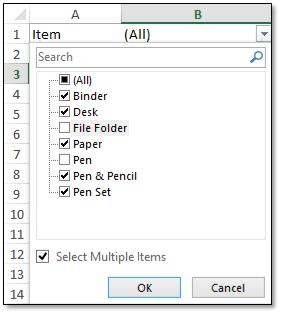
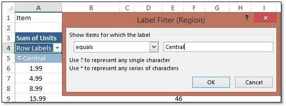
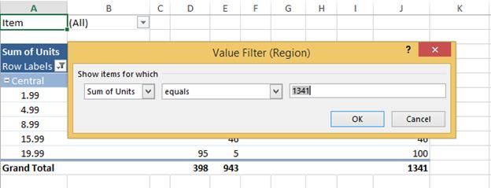

# Sorting and Filtering

## Sorting

Pivot field [AutoSort](https://help.syncfusion.com/cr/document-processing/Syncfusion.XlsIO.IPivotField.html#Syncfusion_XlsIO_IPivotField_AutoSort_Syncfusion_XlsIO_PivotFieldSortType_System_Int32_) allows you to sort the pivot row or column fields based on the data field values. You can perform the sorting in following direction:

* Top to Bottom
* Left to Right 

### Sort a Pivot Table Field Top to Bottom

Top to Bottom sorting can sort the pivot table column field values based on the sort type. To apply Top to Bottom sorting in pivot table, you should apply the sorting in pivot row field by [AutoSort](https://help.syncfusion.com/cr/document-processing/Syncfusion.XlsIO.IPivotField.html#Syncfusion_XlsIO_IPivotField_AutoSort_Syncfusion_XlsIO_PivotFieldSortType_System_Int32_) method. 

The following code example illustrates how to apply Top to Bottom sorting to a pivot table.


{% highlight c# tabtitle="C# [Cross-platform]" playgroundButtonLink="https://raw.githubusercontent.com/SyncfusionExamples/XlsIO-Examples/master/Pivot%20Table/Sort%20Top%20to%20Bottom/.NET/Sort%20Top%20to%20Bottom/Sort%20Top%20to%20Bottom/Program.cs,180" %}
using (ExcelEngine excelEngine = new ExcelEngine())
{
	IApplication application = excelEngine.Excel;
	application.DefaultVersion = ExcelVersion.Xlsx;
	IWorkbook workbook = application.Workbooks.Open(Path.GetFullPath(@"Data/InputTemplate.xlsx"));
	IWorksheet sheet = workbook.Worksheets[1];
	IPivotTable pivotTable = sheet.PivotTables[0];

	// Pivot Top to Bottom sorting.
	IPivotField rowField = pivotTable.RowFields[0];
	rowField.AutoSort(PivotFieldSortType.Ascending, 1);

	#region Save
	//Saving the workbook
	workbook.SaveAs(Path.GetFullPath("Output/PivotSort.xlsx"));
	#endregion
}



using (ExcelEngine excelEngine = new ExcelEngine())
{
  IApplication application = excelEngine.Excel;
  application.DefaultVersion = ExcelVersion.Xlsx;
  IWorkbook workbook = application.Workbooks.Open("InputTemplate.xlsx");
  IWorksheet sheet = workbook.Worksheets[1];
  IPivotTable pivotTable = sheet.PivotTables[0];

  // Pivot Top to Bottom sorting.
  IPivotField rowField = pivotTable.RowFields[0];
  rowField.AutoSort(PivotFieldSortType.Ascending, 1);

  workbook.SaveAs("PivotFieldAutoSort.xlsx");
  excelEngine.ThrowNotSavedOnDestroy = false;
}



Using excelEngine As ExcelEngine = New ExcelEngine()
  Dim application As IApplication = excelEngine.Excel
  application.DefaultVersion = ExcelVersion.Xlsx
  Dim workbook As IWorkbook = application.Workbooks.Open("InputTemplate.xlsx")
  Dim sheet As IWorksheet = workbook.Worksheets(1)
  Dim pivotTable As IPivotTable = sheet.PivotTables(0)

  ' Pivot Top to Bottom sorting.
  Dim rowField As IPivotField = pivotTable.RowFields(0)
  rowField.AutoSort(PivotFieldSortType.Ascending, 1)

  workbook.SaveAs("PivotTableCalculate.xlsx")
  excelEngine.ThrowNotSavedOnDestroy = False
End Using

 

A complete working example for top to bottom sort in pivot table in C# is present on [this GitHub page](https://github.com/SyncfusionExamples/XlsIO-Examples/tree/master/Pivot%20Table/Sort%20Top%20to%20Bottom/.NET/Sort%20Top%20to%20Bottom). 

### Sort a Pivot Table Field Left to Right

Left to Right sorting can sort the pivot table row field values based on the sort type. To apply Left to Right sorting in pivot table, you should apply the sorting in pivot column field by [AutoSort](https://help.syncfusion.com/cr/document-processing/Syncfusion.XlsIO.IPivotField.html#Syncfusion_XlsIO_IPivotField_AutoSort_Syncfusion_XlsIO_PivotFieldSortType_System_Int32_) method. 

The following code example illustrates how to apply Left to Right sorting to a pivot table.


{% highlight c# tabtitle="C# [Cross-platform]" playgroundButtonLink="https://raw.githubusercontent.com/SyncfusionExamples/XlsIO-Examples/master/Pivot%20Table/Sort%20Left%20to%20Right/.NET/Sort%20Left%20to%20Right/Sort%20Left%20to%20Right/Program.cs,180" %}
using (ExcelEngine excelEngine = new ExcelEngine())
{
	IApplication application = excelEngine.Excel;
	application.DefaultVersion = ExcelVersion.Xlsx;
	IWorkbook workbook = application.Workbooks.Open(Path.GetFullPath(@"Data/InputTemplate.xlsx"));
	IWorksheet sheet = workbook.Worksheets[1];
	IPivotTable pivotTable = sheet.PivotTables[0];

	// Pivot table Left to Right sorting.
	IPivotField columnField = pivotTable.ColumnFields[0];
	columnField.AutoSort(PivotFieldSortType.Descending, 1);

	#region Save
	//Saving the workbook
	workbook.SaveAs(Path.GetFullPath("Output/PivotSort.xlsx"));
	#endregion
}



using (ExcelEngine excelEngine = new ExcelEngine())
{
  IApplication application = excelEngine.Excel;
  application.DefaultVersion = ExcelVersion.Xlsx;
  IWorkbook workbook = application.Workbooks.Open("InputTemplate.xlsx");
  IWorksheet sheet = workbook.Worksheets[1];
  IPivotTable pivotTable = sheet.PivotTables[0];

  // Pivot table Left to Right sorting.
  IPivotField columnField = pivotTable.ColumnFields[0];
  columnField.AutoSort(PivotFieldSortType.Ascending, 1);

  workbook.SaveAs("PivotFieldAutoSort.xlsx");
  excelEngine.ThrowNotSavedOnDestroy = false;
}



Using excelEngine As ExcelEngine = New ExcelEngine()
  Dim application As IApplication = excelEngine.Excel
  application.DefaultVersion = ExcelVersion.Xlsx
  Dim workbook As IWorkbook = application.Workbooks.Open("InputTemplate.xlsx")
  Dim sheet As IWorksheet = workbook.Worksheets(1)
  Dim pivotTable As IPivotTable = sheet.PivotTables(0)

  ' Pivot table Left to Right sorting.
  Dim rowField As columnField = pivotTable.ColumnFields(0)
  columnField.AutoSort(PivotFieldSortType.Ascending, 1)

  workbook.SaveAs("PivotTableCalculate.xlsx")
  excelEngine.ThrowNotSavedOnDestroy = False
End Using



A complete working example for left to right sort in pivot table in C# is present on [this GitHub page](https://github.com/SyncfusionExamples/XlsIO-Examples/tree/master/Pivot%20Table/Sort%20Left%20to%20Right/.NET/Sort%20Left%20to%20Right). 

N> [IsRefreshOnLoad](https://help.syncfusion.com/cr/file-formats/Syncfusion.XlsIO.Implementation.PivotTables.PivotCacheImpl.html#Syncfusion_XlsIO_Implementation_PivotTables_PivotCacheImpl_IsRefreshOnLoad) property of [PivotCacheImpl](https://help.syncfusion.com/cr/file-formats/Syncfusion.XlsIO.Implementation.PivotTables.PivotCacheImpl.html) is set as true when applying [AutoSort](https://help.syncfusion.com/cr/document-processing/Syncfusion.XlsIO.IPivotField.html#Syncfusion_XlsIO_IPivotField_AutoSort_Syncfusion_XlsIO_PivotFieldSortType_System_Int32_) to pivot fields.

## Filtering

The filtered data of a pivot table displays only the subset of data that meets the specified criteria. This can be achieved in XlsIO using the [IPivotFilters](https://help.syncfusion.com/cr/file-formats/Syncfusion.XlsIO.IPivotFilters.html) interface.

### Applying page filters

The page field filter or report filter can filter the pivot table based on the page field items. The following code snippet illustrates how to apply multiple filters to the page field items.



//Set field axis to page
pivotTable.Fields[4].Axis = PivotAxisTypes.Page;

//Apply page field filter
IPivotField pageField = pivotTable.Fields[4];

//Select multiple items in page field to filter
pageField.Items[1].Visible = false;
pageField.Items[2].Visible = false; 



//Set field axis to page
pivotTable.Fields[4].Axis = PivotAxisTypes.Page;

//Apply page field filter
IPivotField pageField = pivotTable.Fields[4];

//Select multiple items in page field to filter
pageField.Items[1].Visible = false;
pageField.Items[2].Visible = false;



'Set field axis to page
pivotTable.Fields(4).Axis = PivotAxisTypes.Page

'Apply page field filter
Dim pageField As IPivotField = pivotTable.Fields(4)

'Select multiple items in page field to filter
pageField.Items(1).Visible = False
pageField.Items(2).Visible = False

  

### Applying row or column filters

The row and column field filters can filter the pivot table based on labels, values, and items of the fields. The following code example illustrates how to apply these filters to a pivot table.

**Label** **Filter** 



//Apply row field filter
IPivotField rowField = pivotTable.Fields[2];

//Applying Label based row field filter
rowField.PivotFilters.Add(PivotFilterType.CaptionEqual, null, "Central", null);



//Apply row field filter
IPivotField rowField = pivotTable.Fields[2];

//Applying Label based row field filter
rowField.PivotFilters.Add(PivotFilterType.CaptionEqual, null, "Central", null);



'Apply row field filter
Dim rowField As IPivotField = pivotTable.Fields(2)

'Applying Label based row field filter
rowField.PivotFilters.Add(PivotFilterType.CaptionEqual, Nothing, "Central", Nothing)

  

**Value** **Filter** 



IPivotField field = pivotTable.Fields[2];

//Apply value filter
field.PivotFilters.Add(PivotFilterType.ValueLessThan, field, "1341", null);



IPivotField field = pivotTable.Fields[2];

//Apply value filter
field.PivotFilters.Add(PivotFilterType.ValueLessThan, field, "1341", null);



'Apply row field filter
Dim field As IPivotField = pivotTable.Fields(2)

'Applying value filter
field.PivotFilters.Add(PivotFilterType. ValueLessThan, field, "1341", Nothing)

  

The complete code snippet illustrating the above options is shown below.


{% highlight c# tabtitle="C# [Cross-platform]" playgroundButtonLink="https://raw.githubusercontent.com/SyncfusionExamples/XlsIO-Examples/master/Pivot%20Table/Pivot%20Filter/.NET/Pivot%20Filter/Pivot%20Filter/Program.cs,180" %}
using (ExcelEngine excelEngine = new ExcelEngine())
{
	IApplication application = excelEngine.Excel;
	application.DefaultVersion = ExcelVersion.Xlsx;
	IWorkbook workbook = application.Workbooks.Open(Path.GetFullPath(@"Data/InputTemplate.xlsx"));
	IWorksheet worksheet = workbook.Worksheets[0];
	IWorksheet pivotSheet = workbook.Worksheets[1];

	IPivotCache cache = workbook.PivotCaches.Add(worksheet["A1:H50"]);

	IPivotTable pivotTable = pivotSheet.PivotTables.Add("PivotTable1", pivotSheet["A1"], cache);
	pivotTable.Fields[4].Axis = PivotAxisTypes.Page;
	pivotTable.Fields[2].Axis = PivotAxisTypes.Row;
	pivotTable.Fields[6].Axis = PivotAxisTypes.Row;
	pivotTable.Fields[3].Axis = PivotAxisTypes.Column;

	IPivotField dataField = pivotSheet.PivotTables[0].Fields[5];
	pivotTable.DataFields.Add(dataField, "Sum of Units", PivotSubtotalTypes.Sum);

	//Apply page filter
	pivotTable.Fields[4].Axis = PivotAxisTypes.Page;

	IPivotField pageField = pivotTable.Fields[4];

	pageField.Items[1].Visible = false;
	pageField.Items[2].Visible = false;

	//Apply label filter
	IPivotField rowField = pivotTable.Fields[2];
	rowField.PivotFilters.Add(PivotFilterType.CaptionEqual, null, "East", null);

	//Apply item filter
	IPivotField colField = pivotTable.Fields[3];
	colField.Items[0].Visible = false;
	colField.Items[1].Visible = false;

	//Apply value filter
	IPivotField field = pivotTable.Fields[2];
	field.PivotFilters.Add(PivotFilterType.ValueLessThan, field, "1341", null);

	pivotTable.BuiltInStyle = PivotBuiltInStyles.PivotStyleMedium2;
	pivotSheet.Activate();

	#region Save
	//Saving the workbook
	workbook.SaveAs(Path.GetFullPath("Output/PivotFilter.xlsx"));
	#endregion
}



using (ExcelEngine excelEngine = new ExcelEngine())
{
  IApplication application = excelEngine.Excel;
  application.DefaultVersion = ExcelVersion.Excel2013;
  IWorkbook workbook = application.Workbooks.Open("PivotData.xlsx");
  IWorksheet worksheet = workbook.Worksheets[0];
  IWorksheet pivotSheet = workbook.Worksheets[1];

  IPivotCache cache = workbook.PivotCaches.Add(worksheet["A1:H50"]);
  IPivotTable pivotTable = pivotSheet.PivotTables.Add("PivotTable1", pivotSheet["A1"], cache);
  pivotTable.Fields[4].Axis = PivotAxisTypes.Page;
  pivotTable.Fields[2].Axis = PivotAxisTypes.Row;
  pivotTable.Fields[6].Axis = PivotAxisTypes.Row;
  pivotTable.Fields[3].Axis = PivotAxisTypes.Column;

  IPivotField dataField = pivotSheet.PivotTables[0].Fields[5];
  pivotTable.DataFields.Add(dataField, "Sum of Units", PivotSubtotalTypes.Sum);

  //Apply page filter
  pivotTable.Fields[4].Axis = PivotAxisTypes.Page;

  IPivotField pageField = pivotTable.Fields[4];
  pageField.Items[1].Visible = false;
  pageField.Items[2].Visible = false;

  //Apply label filter
  IPivotField rowField = pivotTable.Fields[2];
  rowField.PivotFilters.Add(PivotFilterType.CaptionEqual, null, "East", null);

  //Apply item filter
  IPivotField colField = pivotTable.Fields[3];
  colField.Items[0].Visible = false;
  colField.Items[1].Visible = false;

  //Apply value filter
  IPivotField field = pivotTable.Fields[2];
  field.PivotFilters.Add(PivotFilterType.ValueLessThan, field, "1341", null);

  pivotTable.BuiltInStyle = PivotBuiltInStyles.PivotStyleMedium2;
  pivotSheet.Activate();

  workbook.SaveAs("PivotTable.xlsx");

  //No exception will be thrown if there are unsaved workbooks.
  excelEngine.ThrowNotSavedOnDestroy = false;
}



Using excelEngine As ExcelEngine = New ExcelEngine()
  Dim application As IApplication = excelEngine.Excel
  application.DefaultVersion = ExcelVersion.Excel2013
  Dim workbook As IWorkbook = application.Workbooks.Open("PivotData.xlsx")
  Dim worksheet As IWorksheet = workbook.Worksheets(0)
  Dim pivotSheet As IWorksheet = workbook.Worksheets(1)

  Dim cache As IPivotCache = workbook.PivotCaches.Add(worksheet("A1:H50"))
  Dim pivotTable As IPivotTable = pivotSheet.PivotTables.Add("PivotTable1", pivotSheet("A1"), cache)
  pivotTable.Fields(4).Axis = PivotAxisTypes.Page
  pivotTable.Fields(2).Axis = PivotAxisTypes.Row
  pivotTable.Fields(6).Axis = PivotAxisTypes.Row
  pivotTable.Fields(3).Axis = PivotAxisTypes.Column

  Dim dataField As IPivotField = pivotSheet.PivotTables(0).Fields(5)
  pivotTable.DataFields.Add(dataField, "Sum of Units", PivotSubtotalTypes.Sum)

  'Applying page filter
  pivotTable.Fields(4).Axis = PivotAxisTypes.Page

  Dim pageField As IPivotField = pivotTable.Fields(4)
  pageField.Items(1).Visible = False
  pageField.Items(2).Visible = False

  'Apply label filter
  Dim rowField As IPivotField = pivotTable.Fields(2)
  rowField.PivotFilters.Add(PivotFilterType.CaptionEqual, Nothing, "East", Nothing)

  'Apply item filter
  Dim colField As IPivotField = pivotTable.Fields(3)
  colField.Items(0).Visible = False
  colField.Items(1).Visible = False

  'Applying value filter
  Dim field As IPivotField = pivotTable.Fields(2)
  field.PivotFilters.Add(PivotFilterType.ValueLessThan, field, "1341", Nothing)

  pivotTable.BuiltInStyle = PivotBuiltInStyles.PivotStyleMedium2
  pivotSheet.Activate()

  workbook.SaveAs("PivotTable.xlsx")

  'No exception will be thrown if there are unsaved workbooks
  excelEngine.ThrowNotSavedOnDestroy = False
End Using

 

A complete working example to apply pivot filter in C# is present on [this GitHub page](https://github.com/SyncfusionExamples/XlsIO-Examples/tree/master/Pivot%20Table/Pivot%20Filter/.NET/Pivot%20Filter). 