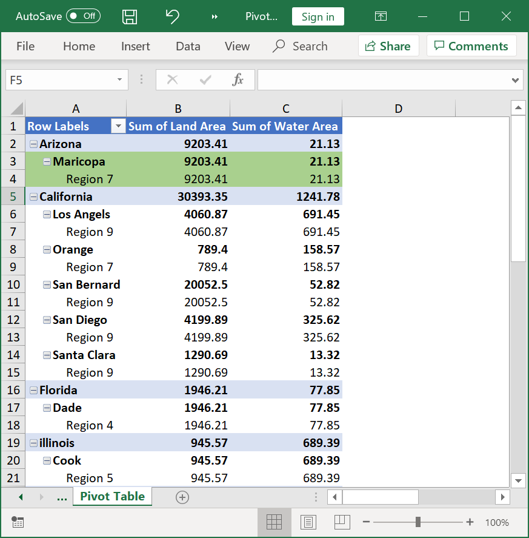

# Styles and formatting

## Pivot Table Style

XlsIO supports 85 built-in styles of Microsoft Excel used to create a table with rich formatting using the [PivotBuiltInStyles](https://help.syncfusion.com/cr/document-processing/Syncfusion.XlsIO.PivotBuiltInStyles.html) property as follows.

The following code example illustrates how to apply built-in style to pivot table.


{% highlight c# tabtitle="C# [Cross-platform]" playgroundButtonLink="https://raw.githubusercontent.com/SyncfusionExamples/XlsIO-Examples/master/Pivot%20Table/Format%20Pivot%20Table/.NET/Format%20Pivot%20Table/Format%20Pivot%20Table/Program.cs,180" %}
using (ExcelEngine excelEngine = new ExcelEngine())
{
	IApplication application = excelEngine.Excel;
	application.DefaultVersion = ExcelVersion.Xlsx;
	IWorkbook workbook = application.Workbooks.Open(Path.GetFullPath(@"Data/InputTemplate.xlsx"));
	IWorksheet worksheet = workbook.Worksheets[1];
	IPivotTable pivotTable = worksheet.PivotTables[0];

	//Set BuiltInStyle
	pivotTable.BuiltInStyle = PivotBuiltInStyles.PivotStyleDark12;

	#region Save
	//Saving the workbook
	workbook.SaveAs(Path.GetFullPath("Output/PivotTable.xlsx"));
	#endregion
}



using (ExcelEngine excelEngine = new ExcelEngine())
{
  IApplication application = excelEngine.Excel;
  application.DefaultVersion = ExcelVersion.Xlsx;
  IWorkbook workbook = application.Workbooks.Open("InputTemplate.xlsx");
  IWorksheet worksheet = workbook.Worksheets[1];
  IPivotTable pivotTable = worksheet.PivotTables[0];

  //Set BuiltInStyle
  pivotTable.BuiltInStyle = PivotBuiltInStyles.PivotStyleDark12;

  workbook.SaveAs("PivotTable_Style.xlsx");

  //No exception will be thrown if there are unsaved workbooks
  excelEngine.ThrowNotSavedOnDestroy = false;
}



Using excelEngine As ExcelEngine = New ExcelEngine()
  Dim application As IApplication = excelEngine.Excel
  application.DefaultVersion = ExcelVersion.Xlsx
  Dim workbook As IWorkbook = application.Workbooks.Open("InputTemplate.xlsx")
  Dim sheet As IWorksheet = workbook.Worksheets(1)
  Dim pivotTable As IPivotTable = sheet.PivotTables(0)

  'Set BuiltInStyle
  pivotTable.BuiltInStyle = PivotBuiltInStyles.PivotStyleDark12

  workbook.SaveAs("PivotTable_Style.xlsx")

  'No exception will be thrown if there are unsaved workbooks
  excelEngine.ThrowNotSavedOnDestroy = False
End Using

 

A complete working example to apply built-in style to pivot table in C# is present on [this GitHub page](https://github.com/SyncfusionExamples/XlsIO-Examples/tree/master/Pivot%20Table/Format%20Pivot%20Table/.NET/Format%20Pivot%20Table).

## Pivot Cell Formatting

When you apply the cell formatting to pivot table cells, Microsoft Excel maintains the formatting information in pivot table and shows the cell formatting on pivot table cells from that pivot formats. XlsIO supports to apply cell formatting to pivot table range cells. You can apply all the cell formatting using [IPivotTable](https://help.syncfusion.com/cr/file-formats/Syncfusion.XlsIO.IPivotTable.html) [GetCellFormat](https://help.syncfusion.com/cr/file-formats/Syncfusion.XlsIO.IPivotTable.html#Syncfusion_XlsIO_IPivotTable_GetCellFormat_System_String_) method and [IPivotCellFormat](https://help.syncfusion.com/cr/document-processing/Syncfusion.XlsIO.IPivotCellFormat.html) interface.

The following code example illustrates how to apply cell formatting to pivot table cells.


{% highlight c# tabtitle="C# [Cross-platform]" playgroundButtonLink="https://raw.githubusercontent.com/SyncfusionExamples/XlsIO-Examples/master/Pivot%20Table/Format%20Pivot%20Cell/.NET/Format%20Pivot%20Cell/Format%20Pivot%20Cell/Program.cs,180" %}
using (ExcelEngine excelEngine = new ExcelEngine())
{
	IApplication application = excelEngine.Excel;
	application.DefaultVersion = ExcelVersion.Xlsx;
	IWorkbook workbook = application.Workbooks.Open(Path.GetFullPath(@"Data/InputTemplate.xlsx"));
	IWorksheet worksheet = workbook.Worksheets[1];

	IPivotTable pivotTable = worksheet.PivotTables[0];
	//Get the cell format for pivot range.
	IPivotCellFormat cellFormat = pivotTable.GetCellFormat("A4:J5");
	cellFormat.BackColor = ExcelKnownColors.Green;

	#region Save
	//Saving the workbook
	workbook.SaveAs(Path.GetFullPath("Output/PivotCellFormat.xlsx"));
	#endregion
}



using (ExcelEngine engine = new ExcelEngine())
{
  IApplication application = engine.Excel;
  IWorkbook workbook = application.Workbooks.Open("InputTemplate.xlsx");
  IWorksheet worksheet = workbook.Worksheets[0];

  IPivotTable pivotTable = worksheet.PivotTables[0];
  //Get the cell format for "A1" pivot range.
  IPivotCellFormat cellFormat = pivotTable.GetCellFormat("A3:C4");
  cellFormat.BackColor = ExcelKnownColors.Green;

  workbook.SaveAs("PivotFormat.xlsx");
}



Using excelEngine As ExcelEngine = New ExcelEngine()
  Dim application As IApplication = excelEngine.Excel
  Dim workbook As IWorkbook = application.Workbooks.Open("InputTemplate.xlsx")
  Dim pivotSheet As IWorksheet = workbook.Worksheets(0)

  Dim pivotTable As IPivotTable = worksheet.PivotTables(0)
  'Get the cell format for "A1" pivot range.
  Dim cellFormat As IPivotCellFormat = pivotTable.GetCellFormat("A3:C4")
  cellFormat.BackColor = ExcelKnownColors.Green

  workbook.SaveAs("PivotFormat.xlsx")
End Using



A complete working example to apply cell formatting to pivot table cells in C# is present on [this GitHub page](https://github.com/SyncfusionExamples/XlsIO-Examples/tree/master/Pivot%20Table/Format%20Pivot%20Cell/.NET/Format%20Pivot%20Cell). 

By executing the program, you will get the Excel file as below

