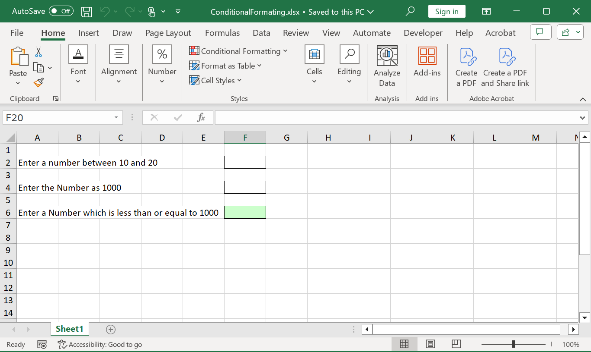

# Working with Conditional Formatting

Conditional formatting allows to format the contents of a cell dynamically. This can be defined and applied in XlsIO through the [IConditionalFormat](https://help.syncfusion.com/cr/document-processing/Syncfusion.XlsIO.IConditionalFormat.html) interface.

To quickly learn How to Apply Conditional Formatting in Excel Using .NET Excel Library, check out this video:


## Create a Conditional Format 

The [IConditionalFormats](https://help.syncfusion.com/cr/document-processing/Syncfusion.XlsIO.IConditionalFormats.html) represents a collection of conditional formats for a single [IRange](https://help.syncfusion.com/cr/document-processing/Syncfusion.XlsIO.IRange.html). One or more conditional formats can be added to the range as follows.

  

//Applying conditional formatting to "A1"
IConditionalFormats condition = worksheet.Range["A1"].ConditionalFormats;
IConditionalFormat condition1 = condition.AddCondition();



//Applying conditional formatting to "A1"
IConditionalFormats condition = worksheet.Range["A1"].ConditionalFormats;
IConditionalFormat condition1 = condition.AddCondition();



'Applying conditional formatting to "A1"
Dim condition As IConditionalFormats = worksheet.Range("A1").ConditionalFormats
Dim condition1 As IConditionalFormat = condition.AddCondition()


  

The target range should meet the criteria, which is set using the **IConditionalFormat** interface. The  desired format type is set through the [ExcelCFType](https://help.syncfusion.com/cr/document-processing/Syncfusion.XlsIO.ExcelCFType.html) enumerator, which are the supported conditional format types in XlsIO. Refer to the following code.

  

//Represents conditional format rule that the value in target range should be between 10 and 20
condition1.FormatType = ExcelCFType.CellValue;
condition1.Operator = ExcelComparisonOperator.Between;
condition1.FirstFormula = "10";
condition1.SecondFormula = "20";
worksheet.Range["A1"].Text = "Enter a number between 10 and 20";



//Represents conditional format rule that the value in target range should be between 10 and 20
condition1.FormatType = ExcelCFType.CellValue;
condition1.Operator = ExcelComparisonOperator.Between;
condition1.FirstFormula = "10";
condition1.SecondFormula = "20";
worksheet.Range["A1"].Text = "Enter a number between 10 and 20";



'Represents conditional format rule that the value in target range should be between 10 and 20
condition1.FormatType = ExcelCFType.CellValue
condition1.Operator = ExcelComparisonOperator.Between
condition1.FirstFormula = "10"
condition1.SecondFormula = "20"
worksheet.Range("A1").Text = "Enter a number between 10 and 20"

  

When the criteria set for the target range is satisfied, the defined formats (like the one below) are applied in the order of priority. For more details about conditional format priority, see [Manage conditional formatting rule precedence](https://support.microsoft.com/en-us/office/video-manage-conditional-formatting-6b69364e-dc79-4fe4-bd94-1883e40848f9).

  

//Setting format properties to be applied when the above condition is met
condition1.BackColor = ExcelKnownColors.Light_orange;
condition1.IsBold = true;
condition1.IsItalic = true;



//Setting format properties to be applied when the above condition is met
condition1.BackColor = ExcelKnownColors.Light_orange;
condition1.IsBold = true;
condition1.IsItalic = true;



'Setting format properties to be applied when the above condition is met
condition1.BackColor = ExcelKnownColors.Light_orange
condition1.IsBold = True
condition1.IsItalic = True

  

The following code example illustrates how to create and applies various different conditional formats for different ranges.

  
{% highlight c# tabtitle="C# [Cross-platform]" playgroundButtonLink="https://raw.githubusercontent.com/SyncfusionExamples/XlsIO-Examples/master/Conditional%20Formatting/Create%20Conditional%20Format/.NET/Create%20Conditional%20Format/Create%20Conditional%20Format/Program.cs,180" %}
using (ExcelEngine excelEngine = new ExcelEngine())
{
	IApplication application = excelEngine.Excel;
	application.DefaultVersion = ExcelVersion.Xlsx;
	IWorkbook workbook = application.Workbooks.Create(1);
	IWorksheet worksheet = workbook.Worksheets[0];

	//Applying conditional formatting to "F2"
	IConditionalFormats condition = worksheet.Range["F2"].ConditionalFormats;
	IConditionalFormat condition1 = condition.AddCondition();

	//Represents conditional format rule that the value in target range should be between 10 and 20
	condition1.FormatType = ExcelCFType.CellValue;
	condition1.Operator = ExcelComparisonOperator.Between;
	condition1.FirstFormula = "10";
	condition1.SecondFormula = "20";
	worksheet.Range["A2"].Text = "Enter a number between 10 and 20";
	worksheet.Range["F2"].BorderAround(ExcelLineStyle.Thin);

	//Setting back color and font style to be applied for target range
	condition1.BackColor = ExcelKnownColors.Light_orange;
	condition1.IsBold = true;
	condition1.IsItalic = true;

	//Applying conditional formatting to "F4"
	condition = worksheet.Range["F4"].ConditionalFormats;
	IConditionalFormat condition2 = condition.AddCondition();

	//Represents conditional format rule that the cell value should be 1000
	condition2.FormatType = ExcelCFType.CellValue;
	condition2.Operator = ExcelComparisonOperator.Equal;
	condition2.FirstFormula = "1000";
	worksheet.Range["A4"].Text = "Enter the Number as 1000";
	worksheet.Range["F4"].BorderAround(ExcelLineStyle.Thin);

	//Setting fill pattern and back color to target range
	condition2.FillPattern = ExcelPattern.LightUpwardDiagonal;
	condition2.BackColor = ExcelKnownColors.Yellow;

	//Applying conditional formatting to "F6"
	condition = worksheet.Range["F6"].ConditionalFormats;
	IConditionalFormat condition3 = condition.AddCondition();

	//Setting conditional format rule that the cell value for target range should be less than or equal to 1000
	condition3.FormatType = ExcelCFType.CellValue;
	condition3.Operator = ExcelComparisonOperator.LessOrEqual;
	condition3.FirstFormula = "1000";
	worksheet.Range["A6"].Text = "Enter a Number which is less than or equal to 1000";
	worksheet.Range["F6"].BorderAround(ExcelLineStyle.Thin);

	//Setting back color to target range
	condition3.BackColor = ExcelKnownColors.Light_green;

	#region Save
	//Saving the workbook
	workbook.SaveAs(Path.GetFullPath("Output/ConditionalFormat.xlsx"));
	#endregion
}



using (ExcelEngine excelEngine = new ExcelEngine())
{
  IApplication application = excelEngine.Excel;
  application.DefaultVersion = ExcelVersion.Excel2013;
  IWorkbook workbook = application.Workbooks.Create(1);
  IWorksheet worksheet = workbook.Worksheets[0];

  //Applying conditional formatting to "F2"
  IConditionalFormats condition = worksheet.Range["F2"].ConditionalFormats;
  IConditionalFormat condition1 = condition.AddCondition();

  //Represents conditional format rule that the value in target range should be between 10 and 20
  condition1.FormatType = ExcelCFType.CellValue;
  condition1.Operator = ExcelComparisonOperator.Between;
  condition1.FirstFormula = "10";
  condition1.SecondFormula = "20";
  worksheet.Range["A2"].Text = "Enter a number between 10 and 20";
  worksheet.Range["F2"].BorderAround(ExcelLineStyle.Thin);

  //Setting back color and font style to be applied for target range
  condition1.BackColor = ExcelKnownColors.Light_orange;
  condition1.IsBold = true;
  condition1.IsItalic = true;

  //Applying conditional formatting to "F4"
  condition = worksheet.Range["F4"].ConditionalFormats;
  IConditionalFormat condition2 = condition.AddCondition();

  //Represents conditional format rule that the cell value should be 1000
  condition2.FormatType = ExcelCFType.CellValue;
  condition2.Operator = ExcelComparisonOperator.Equal;
  condition2.FirstFormula = "1000";
  worksheet.Range["A4"].Text = "Enter the Number as 1000";
  worksheet.Range["F4"].BorderAround(ExcelLineStyle.Thin);

  //Setting fill pattern and back color to target range
  condition2.FillPattern = ExcelPattern.LightUpwardDiagonal;
  condition2.BackColor = ExcelKnownColors.Yellow;

  //Applying conditional formatting to "F6"
  condition = worksheet.Range["F6"].ConditionalFormats;
  IConditionalFormat condition3 = condition.AddCondition();

  //Setting conditional format rule that the cell value for target range should be less than or equal to 1000
  condition3.FormatType = ExcelCFType.CellValue;
  condition3.Operator = ExcelComparisonOperator.LessOrEqual;
  condition3.FirstFormula = "1000";
  worksheet.Range["A6"].Text = "Enter a Number which is less than or equal to 1000";
  worksheet.Range["F6"].BorderAround(ExcelLineStyle.Thin);

  //Setting back color to target range
  condition3.BackColor = ExcelKnownColors.Light_green;

  workbook.SaveAs("ConditionalFormatting.xlsx");
}



Using excelEngine As ExcelEngine = New ExcelEngine()
  Dim application As IApplication = excelEngine.Excel
  application.DefaultVersion = ExcelVersion.Excel2013
  Dim workbook As IWorkbook = application.Workbooks.Create(1)
  Dim worksheet As IWorksheet = workbook.Worksheets(0)

  'Applying conditional formatting to "F2"
  Dim condition As IConditionalFormats = worksheet.Range("F2").ConditionalFormats
  Dim condition1 As IConditionalFormat = condition.AddCondition()

  'Represents conditional format rule that the value in target range should be between 10 and 20
  condition1.FormatType = ExcelCFType.CellValue
  condition1.Operator = ExcelComparisonOperator.Between
  condition1.FirstFormula = "10"
  condition1.SecondFormula = "20"
  worksheet.Range("A2").Text = "Enter a number between 10 and 20"
  worksheet.Range["F2"].BorderAround(ExcelLineStyle.Thin)

  'Setting back color and font style to be applied for target range
  condition1.BackColor = ExcelKnownColors.Light_orange
  condition1.IsBold = True
  condition1.IsItalic = True

  'Applying conditional formatting to "F4"
  condition = worksheet.Range("F4").ConditionalFormats
  Dim condition2 As IConditionalFormat = condition.AddCondition()

  'Represents conditional format rule that the cell value should be 1000
  condition2.FormatType = ExcelCFType.CellValue
  condition2.Operator = ExcelComparisonOperator.Equal
  condition2.FirstFormula = "1000"
  worksheet.Range("A4").Text = "Enter the Number as 1000"
  worksheet.Range["F4"].BorderAround(ExcelLineStyle.Thin)

  'Setting fill pattern and back color to target range
  condition2.FillPattern = ExcelPattern.LightUpwardDiagonal
  condition2.BackColor = ExcelKnownColors.Yellow

  'Applying conditional formatting to "F6"
  condition = worksheet.Range("F6").ConditionalFormats
  Dim condition3 As IConditionalFormat = condition.AddCondition()

  'Setting conditional format rule that the cell value for target range should be less than or equal to 1000
  condition3.FormatType = ExcelCFType.CellValue
  condition3.Operator = ExcelComparisonOperator.LessOrEqual
  condition3.FirstFormula = "1000"
  worksheet.Range("A6").Text = "Enter a Number which is less than or equal to 1000"
  worksheet.Range["F6"].BorderAround(ExcelLineStyle.Thin)

  'Setting back color to target range
  condition3.BackColor = ExcelKnownColors.Light_green

  workbook.SaveAs("ConditionalFormatting.xlsx")
End Using



A complete working example to create conditional formatting in C# is present on [this GitHub page](https://github.com/SyncfusionExamples/XlsIO-Examples/tree/master/Conditional%20Formatting/Create%20Conditional%20Format/.NET/Create%20Conditional%20Format).

N> Excel allows the addition of a maximum of three conditions for the same cell in the Biff8 format and XlsIO. However, this restriction is removed from the Excel 2007 formats.

N> The conditional formats for a single range should be added in descending order in XlsIO.

By executing the program, you will get the Excel file as below

## Reading an Existing Conditional Format

XlsIO also reads conditional formats from an existing Excel workbook. 

The following code example illustrates how to read an existing conditional formatting.

  
{% highlight c# tabtitle="C# [Cross-platform]" playgroundButtonLink="https://raw.githubusercontent.com/SyncfusionExamples/XlsIO-Examples/master/Conditional%20Formatting/Read%20Conditional%20Format/.NET/Read%20Conditional%20Format/Read%20Conditional%20Format/Program.cs,180" %}
using (ExcelEngine excelEngine = new ExcelEngine())
{
	IApplication application = excelEngine.Excel;
	application.DefaultVersion = ExcelVersion.Xlsx;
	IWorkbook workbook = application.Workbooks.Open(Path.GetFullPath(@"Data/InputTemplate.xlsx"), ExcelOpenType.Automatic);
	IWorksheet worksheet = workbook.Worksheets[0];

	//Read conditional formatting settings 
	string formatType = worksheet.Range["A1"].ConditionalFormats[0].FormatType.ToString();
	string cfOperator = worksheet.Range["A1"].ConditionalFormats[0].Operator.ToString();

  workbook.SaveAs("Output.xlsx");
}



using (ExcelEngine excelEngine = new ExcelEngine())
{
  IApplication application = excelEngine.Excel;
  application.DefaultVersion = ExcelVersion.Excel2013;
  IWorkbook workbook = application.Workbooks.Open("Sample.xlsx", ExcelOpenType.Automatic);
  IWorksheet worksheet = workbook.Worksheets[0];

  //Read conditional formatting settings 
  string formatType = worksheet.Range["A1"].ConditionalFormats[0].FormatType.ToString();
  string cfOperator = worksheet.Range["A1"].ConditionalFormats[0].Operator.ToString();
  string backColor = worksheet.Range["A1"].ConditionalFormats[0].BackColor.ToString();

  workbook.SaveAs("Output.xlsx");
}



Using excelEngine As ExcelEngine = New ExcelEngine()
  Dim application As IApplication = excelEngine.Excel
  application.DefaultVersion = ExcelVersion.Excel2013
  Dim workbook As IWorkbook = application.Workbooks.Open("Sample.xlsx", ExcelOpenType.Automatic)
  Dim worksheet As IWorksheet = workbook.Worksheets(0)

  'Read conditional formatting settings
  Dim formatType As String = worksheet.Range("A1").ConditionalFormats(0).FormatType.ToString()
  Dim cfOperator As String = worksheet.Range("A1").ConditionalFormats(0).Operator.ToString()
  Dim backColor As String = worksheet.Range("A1").ConditionalFormats(0).BackColor.ToString()

  workbook.SaveAs("Output.xlsx")
End Using



A complete working example to read an existing conditional formatting in C# is present on [this GitHub page](https://github.com/SyncfusionExamples/XlsIO-Examples/tree/master/Conditional%20Formatting/Read%20Conditional%20Format/.NET/Read%20Conditional%20Format).

## Removing Conditional Formats

All the conditional formats for a specified range can be removed using the [Remove](https://help.syncfusion.com/cr/document-processing/Syncfusion.XlsIO.IConditionalFormats.html#Syncfusion_XlsIO_IConditionalFormats_Remove) method. 

The following code example illustrates how to remove conditional formats.

  
{% highlight c# tabtitle="C# [Cross-platform]" playgroundButtonLink="https://raw.githubusercontent.com/SyncfusionExamples/XlsIO-Examples/master/Conditional%20Formatting/Remove%20Conditional%20Format/.NET/Remove%20Conditional%20Format/Program.cs,180" %}
using (ExcelEngine excelEngine = new ExcelEngine())
{
	IApplication application = excelEngine.Excel;
	application.DefaultVersion = ExcelVersion.Xlsx;

	IWorkbook workbook = application.Workbooks.Open(Path.GetFullPath(@"Data/InputTemplate.xlsx"), ExcelOpenType.Automatic);
	IWorksheet worksheet = workbook.Worksheets[0];

	//Removing conditional format for a specified range 
	worksheet.Range["E5"].ConditionalFormats.Remove();

	#region Save
	//Saving the workbook
	workbook.SaveAs(Path.GetFullPath("Output/RemoveConditionalFormat.xlsx"));
	#endregion
}



using (ExcelEngine excelEngine = new ExcelEngine())
{
  IApplication application = excelEngine.Excel;
  application.DefaultVersion = ExcelVersion.Excel2013;
  IWorkbook workbook = application.Workbooks.Open("Sample.xlsx", ExcelOpenType.Automatic);
  IWorksheet worksheet = workbook.Worksheets[0];

  //Removing conditional format for a specified range
  worksheet.Range["E5"].ConditionalFormats.Remove();

  workbook.SaveAs("Output.xlsx");
}



Using excelEngine As ExcelEngine = New ExcelEngine()
  Dim application As IApplication = excelEngine.Excel
  application.DefaultVersion = ExcelVersion.Excel2013
  Dim workbook As IWorkbook = application.Workbooks.Open("Sample.xlsx", ExcelOpenType.Automatic)
  Dim worksheet As IWorksheet = workbook.Worksheets(0)

  'Removing conditional format for a specified range
  worksheet.Range("E5").ConditionalFormats.Remove()

  workbook.SaveAs("Output.xlsx")
End Using



A complete working example to remove conditional formatting in C# is present on [this GitHub page](https://github.com/SyncfusionExamples/XlsIO-Examples/tree/master/Conditional%20Formatting/Remove%20Conditional%20Format/.NET).

### Removing Conditional Formats at specified index value

A particular conditional format at the specified range can be removed by using the [RemoveAt](https://help.syncfusion.com/cr/document-processing/Syncfusion.XlsIO.IConditionalFormats.html#Syncfusion_XlsIO_IConditionalFormats_RemoveAt_System_Int32_) method.

The following code example illustrates how to remove conditional formats at specified index value.

  
{% highlight c# tabtitle="C# [Cross-platform]" playgroundButtonLink="https://raw.githubusercontent.com/SyncfusionExamples/XlsIO-Examples/master/Conditional%20Formatting/Remove%20at%20Index/.NET/Remove%20at%20Index/Remove%20at%20Index/Program.cs,180" %}
using (ExcelEngine excelEngine = new ExcelEngine())
{
	IApplication application = excelEngine.Excel;
	application.DefaultVersion = ExcelVersion.Xlsx;
	IWorkbook workbook = application.Workbooks.Open(Path.GetFullPath(@"Data/InputTemplate.xlsx"), ExcelOpenType.Automatic);
	IWorksheet worksheet = workbook.Worksheets[0];

	//Removing first conditional Format at the specified Range
	worksheet.UsedRange.ConditionalFormats.RemoveAt(0);

	#region Save
	//Saving the workbook
	workbook.SaveAs(Path.GetFullPath("Output/RemoveConditionalFormat.xlsx"));
	#endregion
}



using (ExcelEngine excelEngine = new ExcelEngine())
{
  IApplication application = excelEngine.Excel;
  application.DefaultVersion = ExcelVersion.Excel2013;
  IWorkbook workbook = application.Workbooks.Open("Sample.xlsx", ExcelOpenType.Automatic);
  IWorksheet worksheet = workbook.Worksheets[0];

  //Removing first conditional Format at the specified Range
  worksheet.Range["E5"].ConditionalFormats.RemoveAt(0);

  workbook.SaveAs("Output.xlsx");
}



Using excelEngine As ExcelEngine = New ExcelEngine()
  Dim application As IApplication = excelEngine.Excel
  application.DefaultVersion = ExcelVersion.Excel2013
  Dim workbook As IWorkbook = application.Workbooks.Open("Sample.xlsx", ExcelOpenType.Automatic)
  Dim worksheet As IWorksheet = workbook.Worksheets(0)

  'Removing first conditional Format at the specified Range
  worksheet.Range("E5").ConditionalFormats.RemoveAt(0)

  workbook.SaveAs("Output.xlsx")
End Using



A complete working example to remove conditional formats at specified index in C# is present on [this GitHub page](https://github.com/SyncfusionExamples/XlsIO-Examples/tree/master/Conditional%20Formatting/Remove%20at%20Index/.NET/Remove%20at%20Index).

### Removing Conditional Formats from entire sheet

The following code example illustrates how to remove conditional formats from entire sheet.

  
{% highlight c# tabtitle="C# [Cross-platform]" playgroundButtonLink="https://raw.githubusercontent.com/SyncfusionExamples/XlsIO-Examples/master/Conditional%20Formatting/Remove%20all%20Conditional%20Formats/.NET/Remove%20all%20Conditional%20Formats/Remove%20all%20Conditional%20Formats/Program.cs,180" %}
using (ExcelEngine excelEngine = new ExcelEngine())
{
	IApplication application = excelEngine.Excel;
	application.DefaultVersion = ExcelVersion.Xlsx;
	IWorkbook workbook = application.Workbooks.Open(Path.GetFullPath(@"Data/InputTemplate.xlsx"), ExcelOpenType.Automatic);
	IWorksheet worksheet = workbook.Worksheets[0];

	//Removing Conditional Formatting Settings From Entire Sheet
	worksheet.UsedRange.Clear(ExcelClearOptions.ClearConditionalFormats);

	#region Save
	//Saving the workbook
	workbook.SaveAs(Path.GetFullPath("Output/RemoveAll.xlsx"));
	#endregion
}



using (ExcelEngine excelEngine = new ExcelEngine())
{
  IApplication application = excelEngine.Excel;
  application.DefaultVersion = ExcelVersion.Excel2013;
  IWorkbook workbook = application.Workbooks.Open("Sample.xlsx", ExcelOpenType.Automatic);
  IWorksheet worksheet = workbook.Worksheets[0];

  //Removing Conditional Formatting Settings From Entire Sheet
  worksheet.UsedRange.Clear(ExcelClearOptions.ClearConditionalFormats);

  workbook.SaveAs("Output.xlsx");
}



Using excelEngine As ExcelEngine = New ExcelEngine()
  Dim application As IApplication = excelEngine.Excel
  application.DefaultVersion = ExcelVersion.Excel2013
  Dim workbook As IWorkbook = application.Workbooks.Open("Sample.xlsx", ExcelOpenType.Automatic)
  Dim worksheet As IWorksheet = workbook.Worksheets(0)

  'Removing Conditional Formatting Settings From Entire Sheet
  worksheet.UsedRange.Clear(ExcelClearOptions.ClearConditionalFormats)

  workbook.SaveAs("Output.xlsx")
End Using



A complete working example to remove conditional formats in entire worksheet in C# is present on [this GitHub page](https://github.com/SyncfusionExamples/XlsIO-Examples/tree/master/Conditional%20Formatting/Remove%20all%20Conditional%20Formats/.NET/Remove%20all%20Conditional%20Formats).

## Using FormulaR1C1 property in Conditional Formats

XlsIO sets the formula for the conditional format in R1C1-style notation. 

The following code example illustrates how to use formula in Conditional Format.

  
{% highlight c# tabtitle="C# [Cross-platform]" playgroundButtonLink="https://raw.githubusercontent.com/SyncfusionExamples/XlsIO-Examples/master/Conditional%20Formatting/Conditional%20Format%20with%20R1C1/.NET/Conditional%20Format%20with%20R1C1/Conditional%20Format%20with%20R1C1/Program.cs,180" %}
using (ExcelEngine excelEngine = new ExcelEngine())
{
	IApplication application = excelEngine.Excel;
	application.DefaultVersion = ExcelVersion.Xlsx;
	IWorkbook workbook = application.Workbooks.Create(1);
	IWorksheet worksheet = workbook.Worksheets[0];

	//Using FormulaR1C1 property in Conditional Formatting 
	IConditionalFormats condition = worksheet.Range["E5:E18"].ConditionalFormats;
	IConditionalFormat condition1 = condition.AddCondition();
	condition1.FirstFormulaR1C1 = "=R[1]C[0]";
	condition1.SecondFormulaR1C1 = "=R[1]C[1]";

	#region Save
	//Saving the workbook
	workbook.SaveAs(Path.GetFullPath("Output/ConditionalFormat.xlsx"));
	#endregion
}



using (ExcelEngine excelEngine = new ExcelEngine())
{
  IApplication application = excelEngine.Excel;
  application.DefaultVersion = ExcelVersion.Excel2013;
  IWorkbook workbook = application.Workbooks.Create(1);
  IWorksheet worksheet = workbook.Worksheets[0];

  //Using FormulaR1C1 property in Conditional Formatting
  IConditionalFormats condition = worksheet.Range["E5:E18"].ConditionalFormats;
  IConditionalFormat condition1 = condition.AddCondition();
  condition1.FirstFormulaR1C1 = "=R[1]C[0]";
  condition1.SecondFormulaR1C1 = "=R[1]C[1]";

  workbook.SaveAs("Output.xlsx");
}



Using excelEngine As ExcelEngine = New ExcelEngine()
  Dim application As IApplication = excelEngine.Excel
  application.DefaultVersion = ExcelVersion.Excel2013
  Dim workbook As IWorkbook = application.Workbooks.Create(1)
  Dim worksheet As IWorksheet = workbook.Worksheets(0)

  'Using FormulaR1C1 property in Conditional Formatting
  Dim condition As IConditionalFormats = worksheet.Range("E5:E18").ConditionalFormats
  Dim condition1 As IConditionalFormat = condition.AddCondition()
  condition1.FirstFormulaR1C1 = "=R[1]C[0]"
  condition1.SecondFormulaR1C1 = "=R[1]C[1]"

  workbook.SaveAs("Output.xlsx")
End Using



A complete working example to create conditional formats with formula in C# is present on [this GitHub page](https://github.com/SyncfusionExamples/XlsIO-Examples/tree/master/Conditional%20Formatting/Conditional%20Format%20with%20R1C1/.NET/Conditional%20Format%20with%20R1C1).

## Types of Conditional Formatting

### Highlight Cells

These are conditional formatting rules that apply specific formatting to cells based on their values. Examples include highlighting cells that contain certain text, numbers within a specific range, dates before or after a given date, or values that are duplicates or unique. These rules help in quickly identifying and emphasizing important data points.

With the Syncfusion&reg; Excel Library, you can highlight cells in conditional formatting using C#. Click [here](https://help.syncfusion.com/document-processing/excel/excel-library/net/conditional-formatting/highlight-cells) for more details.

### Top/Bottom

These conditional formatting rules are used to highlight cells that contain the highest or lowest values in a dataset. Formatting the top 10 items, bottom 10%, or the highest and lowest values based on specified criteria helps in easily spotting extremes in data, such as best-performing sales figures or lowest test scores.

With the Syncfusion&reg; Excel Library, you can add top and bottom rules in conditional formatting using C#. Click [here](https://help.syncfusion.com/document-processing/excel/excel-library/net/conditional-formatting/top-bottom) for more details.

### Data Bars

These conditional formatting rules add horizontal bars to cells to visually represent the cell values. The length of the bar corresponds to the value in the cell, making it easy to compare values across a range. Data bars provide a quick visual summary of data distribution and relative magnitudes.

With the Syncfusion&reg; Excel Library, you can add data bar in conditional formatting using C#. Click [here](https://help.syncfusion.com/document-processing/excel/excel-library/net/conditional-formatting/data-bars) for more details.

### Color Scales

These conditional formatting rules apply a gradient of colors to cells based on their values. Each color represents a different value range, allowing for a visual representation of data trends and variations. For example, a green-yellow-red scale can indicate low, medium, and high values, respectively.

With the Syncfusion&reg; Excel Library, you can add color scales in conditional formatting using C#. Click [here](https://help.syncfusion.com/document-processing/excel/excel-library/net/conditional-formatting/color-scales) for more details.

### Icon Sets

These are collections of icons that are applied to cells based on their values. Icons, such as arrows, traffic lights, or symbols, visually indicate different data levels or conditions. For example, arrows might show upward or downward trends, and traffic lights can indicate performance status.

With the Syncfusion&reg; Excel Library, you can add icon sets in conditional formatting using C#. Click [here](https://help.syncfusion.com/document-processing/excel/excel-library/net/conditional-formatting/icon-sets) for more details.

#### Custom Icon Sets

Similar to standard icon sets, custom icon sets allow users to define their own icons and the value ranges that trigger each icon. This offers more flexibility and customization, enabling tailored visual representations of data according to specific criteria or business needs.

## See Also

* [How to set criteria for icon set conditional formats in Excel using XlsIO?](https://support.syncfusion.com/kb/article/7422/how-to-set-criteria-for-icon-set-conditional-formats-in-excel-using-xlsio)
* [Can we set multiple conditional formatting using XlsIO?](https://support.syncfusion.com/kb/article/2610/can-we-set-multiple-conditional-formatting-using-xlsio)
* [Set conditional formatting for text in C#, VB.NET](https://support.syncfusion.com/kb/article/2611/set-conditional-formatting-for-text-in-c-vb-net)
* [How to set conditional formatting for numbers?](https://support.syncfusion.com/kb/article/2621/how-to-set-conditional-formatting-for-numbers)
* [Blog: Excel conditional formatting in C# and VB.NET](https://www.syncfusion.com/document-processing/excel-framework/net/excel-library/conditional-formatting)