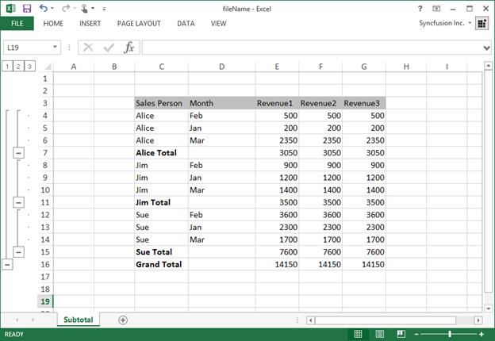

# Worksheet Rows and Columns Manipulation

The Essential&reg; XlsIO provides rows and columns manipulation options equivalent to Excel such as insertion, deletion, hiding, adjusting dimensions, grouping, sub-totaling and more through [IWorksheet](https://help.syncfusion.com/cr/document-processing/Syncfusion.XlsIO.IWorksheet.html) interface.

## Insert Rows and Columns 

The following code snippet illustrates how to insert rows and columns in a worksheet.

  
{% highlight c# tabtitle="C# [Cross-platform]" playgroundButtonLink="https://raw.githubusercontent.com/SyncfusionExamples/XlsIO-Examples/master/Format%20rows%20and%20columns/Insert%20Rows%20and%20Columns/.NET/Insert%20Rows%20and%20Columns/Insert%20Rows%20and%20Columns/Program.cs,180" %}
using (ExcelEngine excelEngine = new ExcelEngine())
{
	IApplication application = excelEngine.Excel;
	application.DefaultVersion = ExcelVersion.Xlsx;
	IWorkbook workbook = application.Workbooks.Open(Path.GetFullPath(@"Data/InputTemplate.xlsx"));
	IWorksheet worksheet = workbook.Worksheets[0];

	#region Insert Rows
	//Insert a row
	worksheet.InsertRow(3, 1, ExcelInsertOptions.FormatAsBefore);

	//Insert multiple rows
	worksheet.InsertRow(10, 3, ExcelInsertOptions.FormatAsAfter);
	#endregion

	#region Insert Columns
	//Insert a column
	worksheet.InsertColumn(2, 1, ExcelInsertOptions.FormatAsAfter);

	//Insert multiple columns
	worksheet.InsertColumn(9, 2, ExcelInsertOptions.FormatAsBefore);
	#endregion

	#region Save
	//Saving the workbook
	workbook.SaveAs(Path.GetFullPath("Output/InsertRowsandColumns.xlsx"));
	#endregion
}



using (ExcelEngine excelEngine = new ExcelEngine())
{
  IApplication application = excelEngine.Excel;
  application.DefaultVersion = ExcelVersion.Xlsx;
  IWorkbook workbook = application.Workbooks.Open("Sample.xlsx");
  IWorksheet worksheet = workbook.Worksheets[0];

  //Insert a row
  worksheet.InsertRow(3, 1, ExcelInsertOptions.FormatAsBefore);
  //Inserting a column
  worksheet.InsertColumn(2, 1, ExcelInsertOptions.FormatAsAfter);

  workbook.SaveAs("Book1.xlsx");
}



Using excelEngine As ExcelEngine = New ExcelEngine()
  Dim application As IApplication = excelEngine.Excel
  application.DefaultVersion = ExcelVersion.Xlsx
  Dim workbook As IWorkbook = application.Workbooks.Open("Sample.xlsx")
  Dim worksheet As IWorksheet = workbook.Worksheets(0)

  'Inserting a row
  worksheet.InsertRow(3, 1, ExcelInsertOptions.FormatAsBefore)
  'Inserting a column
  worksheet.InsertColumn(2, 1, ExcelInsertOptions.FormatAsAfter)

  workbook.SaveAs("Book1.xlsx")
End Using



A complete working example to insert rows and columns in an Excel worksheet in C# is present on [this GitHub page](https://github.com/SyncfusionExamples/XlsIO-Examples/tree/master/Format%20rows%20and%20columns/Insert%20Rows%20and%20Columns/.NET/Insert%20Rows%20and%20Columns).

N> Row and Column index of Insert methods are "one based".

To know more about insert rows and columns, refer to the [WorksheetImpl](https://help.syncfusion.com/cr/document-processing/Syncfusion.XlsIO.Implementation.WorksheetImpl.html) in API section.

## Delete Rows and Columns 

The following code shows how to delete rows and columns.

  
{% highlight c# tabtitle="C# [Cross-platform]" playgroundButtonLink="https://raw.githubusercontent.com/SyncfusionExamples/XlsIO-Examples/master/Format%20rows%20and%20columns/Delete%20Rows%20and%20Columns/.NET/Delete%20Rows%20and%20Columns/Delete%20Rows%20and%20Columns/Program.cs,180" %}
using (ExcelEngine excelEngine = new ExcelEngine())
{
	IApplication application = excelEngine.Excel;
	application.DefaultVersion = ExcelVersion.Xlsx;
	IWorkbook workbook = application.Workbooks.Open(Path.GetFullPath(@"Data/InputTemplate.xlsx"));
	IWorksheet worksheet = workbook.Worksheets[0];

	#region Delete Rows
	//Delete a row
	worksheet.DeleteRow(3);

	//Delete multiple rows
	worksheet.DeleteRow(10, 3);
	#endregion

	#region Delete Columns
	//Delete a column
	worksheet.DeleteColumn(2);

	//Delete multiple columns
	worksheet.DeleteColumn(3, 2);
	#endregion

	#region Save
	//Saving the workbook
	workbook.SaveAs(Path.GetFullPath("Output/DeleteRowsandColumns.xlsx"));
	#endregion
}



using (ExcelEngine excelEngine = new ExcelEngine())
{
  IApplication application = excelEngine.Excel;
  application.DefaultVersion = ExcelVersion.Xlsx;
  IWorkbook workbook = application.Workbooks.Open("Sample.xlsx");
  IWorksheet worksheet = workbook.Worksheets[0];

  //Delete a row
  worksheet.DeleteRow(3);
  //Delete a column
  worksheet.DeleteColumn(2);

  workbook.SaveAs("Book1.xlsx");
}



Using excelEngine As ExcelEngine = New ExcelEngine()
  Dim application As IApplication = excelEngine.Excel
  application.DefaultVersion = ExcelVersion.Xlsx
  Dim workbook As IWorkbook = application.Workbooks.Open("Sample.xlsx")
  Dim worksheet As IWorksheet = workbook.Worksheets(0)

  'Delete a row
  worksheet.DeleteRow(3)
  'Delete a column
  worksheet.DeleteColumn(2)

  workbook.SaveAs("Book1.xlsx")
End Using



A complete working example to delete rows and columns in an Excel worksheet in C# is present on [this GitHub page](https://github.com/SyncfusionExamples/XlsIO-Examples/tree/master/Format%20rows%20and%20columns/Delete%20Rows%20and%20Columns/.NET/Delete%20Rows%20and%20Columns).

T>To extract values little faster or to delete a larger number of rows and columns, use Un-Safe code option of [IApplication](https://help.syncfusion.com/cr/document-processing/Syncfusion.XlsIO.IApplication.html) interface as follows

  

//XlsIO supports DataProviderType of IApplication in Windows Forms, WPF and UWP platforms alone.



application.DataProviderType = ExcelDataProviderType.Unsafe;



application.DataProviderType = ExcelDataProviderType.Unsafe

  
  
### Move Rows and Columns 

In addition, cells can be deleted by shifting other cells in a row or column towards up/left by one step. This can be done by using the [Clear](https://help.syncfusion.com/cr/document-processing/Syncfusion.XlsIO.IRange.html#Syncfusion_XlsIO_IRange_Clear) method as shown in the following code.

  
{% highlight c# tabtitle="C# [Cross-platform]" playgroundButtonLink="https://raw.githubusercontent.com/SyncfusionExamples/XlsIO-Examples/master/Format%20rows%20and%20columns/Move%20Rows%20and%20Columns/.NET/Move%20Rows%20and%20Columns/Move%20Rows%20and%20Columns/Program.cs,180" %}
using (ExcelEngine excelEngine = new ExcelEngine())
{
	IApplication application = excelEngine.Excel;
	application.DefaultVersion = ExcelVersion.Xlsx;
	IWorkbook workbook = application.Workbooks.Open(Path.GetFullPath(@"Data/InputTemplate.xlsx"));
	IWorksheet worksheet = workbook.Worksheets[0];

	#region Move Rows
	//Shifts cells toward Up after deletion
	worksheet.Range["A4:A8"].Clear(ExcelMoveDirection.MoveUp);
	#endregion

	#region Move Columns
	//Shifts cells towards Left after deletion
	worksheet.Range["B1:E1"].Clear(ExcelMoveDirection.MoveLeft);
	#endregion

	#region Save
	//Saving the workbook
	workbook.SaveAs(Path.GetFullPath("Output/MoveRowsandColumns.xlsx"));
	#endregion
}



using (ExcelEngine excelEngine = new ExcelEngine())
{
  IApplication application = excelEngine.Excel;
  application.DefaultVersion = ExcelVersion.Xlsx;
  IWorkbook workbook = application.Workbooks.Open("Sample.xlsx");
  IWorksheet worksheet = workbook.Worksheets[0];

  //Shifts cells towards Left after deletion
  worksheet.Range["A1:E1"].Clear(ExcelMoveDirection.MoveLeft);
  //Shifts cells toward Up after deletion
  worksheet.Range["A1:A6"].Clear(ExcelMoveDirection.MoveUp);

  workbook.SaveAs("Book1.xlsx");
}



Using excelEngine As ExcelEngine = New ExcelEngine()
  Dim application As IApplication = excelEngine.Excel
  application.DefaultVersion = ExcelVersion.Xlsx
  Dim workbook As IWorkbook = application.Workbooks.Open("Sample.xlsx")
  Dim worksheet As IWorksheet = workbook.Worksheets(0)

  'Shifts cells towards Left after deletion
  worksheet.Range("A1:E1").Clear(ExcelMoveDirection.MoveLeft)
  'Shifts cells towards Up after deletion
  worksheet.Range("A1:A6").Clear(ExcelMoveDirection.MoveUp)

  workbook.SaveAs("Book1.xlsx")
End Using



A complete working example to move rows and columns in an Excel worksheet in C# is present on [this GitHub page](https://github.com/SyncfusionExamples/XlsIO-Examples/tree/master/Format%20rows%20and%20columns/Move%20Rows%20and%20Columns/.NET/Move%20Rows%20and%20Columns).

N> Deletion by using above method is more efficient than looping.
N> Row/Column index of these methods are "one based".

## Show or Hide Rows and Columns 

Visibility of rows and columns can be set by using the [ShowRow](https://help.syncfusion.com/cr/document-processing/Syncfusion.XlsIO.IWorksheet.html#Syncfusion_XlsIO_IWorksheet_ShowRow_System_Int32_System_Boolean_) and [ShowColumn](https://help.syncfusion.com/cr/document-processing/Syncfusion.XlsIO.IWorksheet.html#Syncfusion_XlsIO_IWorksheet_ShowColumn_System_Int32_System_Boolean_) methods as shown as follows.

  
{% highlight c# tabtitle="C# [Cross-platform]" playgroundButtonLink="https://raw.githubusercontent.com/SyncfusionExamples/XlsIO-Examples/master/Format%20rows%20and%20columns/Hide%20Rows%20and%20Columns/.NET/Hide%20Rows%20and%20Columns/Hide%20Rows%20and%20Columns/Program.cs,180" %}
using (ExcelEngine excelEngine = new ExcelEngine())
{
	IApplication application = excelEngine.Excel;
	application.DefaultVersion = ExcelVersion.Xlsx;
	IWorkbook workbook = application.Workbooks.Open(Path.GetFullPath(@"Data/InputTemplate.xlsx"));
	IWorksheet worksheet = workbook.Worksheets[0];

	#region Hide Row and Column
	//Hiding the first column and second row
	worksheet.ShowColumn(1, false);
	worksheet.ShowRow(2, false);
	#endregion

	#region Save
	//Saving the workbook
	workbook.SaveAs(Path.GetFullPath("Output/HideRowsandColumns.xlsx"));
	#endregion
}



using (ExcelEngine excelEngine = new ExcelEngine())
{
  IApplication application = excelEngine.Excel;
  application.DefaultVersion = ExcelVersion.Xlsx;
  IWorkbook workbook = application.Workbooks.Open("Sample.xlsx");
  IWorksheet worksheet = workbook.Worksheets[0];

  //Hiding the first column and second row
  worksheet.ShowColumn(1, false);
  worksheet.ShowRow(2, false);

  workbook.SaveAs("Book1.xlsx");
}



Using excelEngine As ExcelEngine = New ExcelEngine()
  Dim application As IApplication = excelEngine.Excel
  application.DefaultVersion = ExcelVersion.Xlsx
  Dim workbook As IWorkbook = application.Workbooks.Open("Sample.xlsx")
  Dim worksheet As IWorksheet = workbook.Worksheets(0)

  'Hiding the first column and second row
  worksheet.ShowColumn(1, False)
  worksheet.ShowRow(2, False)

  workbook.SaveAs("Book1.xlsx")
End Using



A complete working example to hide rows and columns in an Excel worksheet in C# is present on [this GitHub page](https://github.com/SyncfusionExamples/XlsIO-Examples/tree/master/Format%20rows%20and%20columns/Hide%20Rows%20and%20Columns/.NET/Hide%20Rows%20and%20Columns).

## Show or Hide Specific Range

The Essential&reg; XlsIO allows to set visibility for a specific range through [ShowRange](https://help.syncfusion.com/cr/document-processing/Syncfusion.XlsIO.IWorksheet.html#Syncfusion_XlsIO_IWorksheet_ShowRange_Syncfusion_XlsIO_IRange___System_Boolean_). The following code snippet shows how to set the visibility of a range.

  
{% highlight c# tabtitle="C# [Cross-platform]" playgroundButtonLink="https://raw.githubusercontent.com/SyncfusionExamples/XlsIO-Examples/master/Format%20rows%20and%20columns/Hide%20Range/.NET/Hide%20Range/Hide%20Range/Program.cs,180" %}
using (ExcelEngine excelEngine = new ExcelEngine())
{
	IApplication application = excelEngine.Excel;
	application.DefaultVersion = ExcelVersion.Xlsx;
	IWorkbook workbook = application.Workbooks.Create(1);
	IWorksheet worksheet = workbook.Worksheets[0];

	IRange range = worksheet.Range["D4"];

	#region Hide single cell
	//Hiding the range ‘D4’
	worksheet.ShowRange(range, false);
	#endregion

	IRange firstRange = worksheet.Range["F6:I9"];
	IRange secondRange = worksheet.Range["C15:G20"];
	RangesCollection rangeCollection = new RangesCollection(application, worksheet);
	rangeCollection.Add(firstRange);
	rangeCollection.Add(secondRange);

	#region Hide multiple cells
	//Hiding a collection of ranges
	worksheet.ShowRange(rangeCollection, false);
	#endregion

	#region Save
	//Saving the workbook
	workbook.SaveAs(Path.GetFullPath("Output/HideRange.xlsx"));
	#endregion
}



using (ExcelEngine excelEngine = new ExcelEngine())
{
  IApplication application = excelEngine.Excel;
  application.DefaultVersion = ExcelVersion.Xlsx;
  IWorkbook workbook = application.Workbooks.Create(1);
  IWorksheet worksheet = workbook.Worksheets[0];
  IRange range = worksheet[1, 4];

  //Hiding the range ‘D1’
  worksheet.ShowRange(range, false);
  IRange firstRange = worksheet[1, 1, 3, 3];
  IRange secondRange = worksheet[5, 5, 7, 7];
  RangesCollection rangeCollection = new RangesCollection(application, worksheet);
  rangeCollection.Add(firstRange);
  rangeCollection.Add(secondRange);

  //Hiding a collection of ranges
  worksheet.ShowRange(rangeCollection, false);

  workbook.SaveAs("Book1.xlsx");
}



Using excelEngine As ExcelEngine = New ExcelEngine()
  Dim application As IApplication = excelEngine.Excel
  application.DefaultVersion = ExcelVersion.Xlsx
  Dim workbook As IWorkbook = application.Workbooks.Create(1)
  Dim worksheet As IWorksheet = workbook.Worksheets(0)
  Dim range As IRange = worksheet(1, 4)

  'Hiding the range ‘D1’
  worksheet.ShowRange(range, False)
  Dim firstRange As IRange = worksheet(1, 1, 3, 3)
  Dim secondRange As IRange = worksheet(5, 5, 7, 7)
  Dim rangeCollection As RangesCollection = New RangesCollection(application, worksheet)
  rangeCollection.Add(firstRange)
  rangeCollection.Add(secondRange)

  'Hiding a collection of ranges
  worksheet.ShowRange(rangeCollection, False)

  workbook.SaveAs("Book1.xlsx")
End Using



A complete working example to hide specific range in an Excel worksheet in C# is present on [this GitHub page](https://github.com/SyncfusionExamples/XlsIO-Examples/tree/master/Format%20rows%20and%20columns/Hide%20Range/.NET/Hide%20Range).

N> Resetting column width manually or through AutoFit, for the columns hidden using [ShowColumn](https://help.syncfusion.com/cr/document-processing/Syncfusion.XlsIO.IWorksheet.html#Syncfusion_XlsIO_IWorksheet_ShowColumn_System_Int32_System_Boolean_)/[HideColumn](https://help.syncfusion.com/cr/document-processing/Syncfusion.XlsIO.IWorksheet.html#Syncfusion_XlsIO_IWorksheet_HideColumn_System_Int32_) methods will make the hidden columns visible.
N> Resetting row height manually or through AutoFit,  for the rows hidden using [ShowRow](https://help.syncfusion.com/cr/document-processing/Syncfusion.XlsIO.IWorksheet.html#Syncfusion_XlsIO_IWorksheet_ShowRow_System_Int32_System_Boolean_) /[HideRow](https://help.syncfusion.com/cr/document-processing/Syncfusion.XlsIO.IWorksheet.html#Syncfusion_XlsIO_IWorksheet_HideRow_System_Int32_) methods will make the hidden rows visible.

## Adjust Row Height and Column Width 

Rows and columns can be [resized](https://support.microsoft.com/en-us/office/change-the-column-width-and-row-height-72f5e3cc-994d-43e8-ae58-9774a0905f46?ui=en-us&rs=en-us&ad=us) based on its contents. The XlsIO allows to resize rows and columns in the following ways:

* Resize a specific row or column
* Resize a range of rows or columns

### Resize a specific row or column

A single row or column can be resized by the [SetRowHeight](https://help.syncfusion.com/cr/document-processing/Syncfusion.XlsIO.IWorksheet.html#Syncfusion_XlsIO_IWorksheet_SetRowHeight_System_Int32_System_Double_) and [SetColumnWidth](https://help.syncfusion.com/cr/document-processing/Syncfusion.XlsIO.IWorksheet.html#Syncfusion_XlsIO_IWorksheet_SetColumnWidth_System_Int32_System_Double_) methods of [IWorksheet](https://help.syncfusion.com/cr/document-processing/Syncfusion.XlsIO.IWorksheet.html). Similarly, the height and width of a single row or column can be accessed using the [GetRowHeight](https://help.syncfusion.com/cr/document-processing/Syncfusion.XlsIO.IWorksheet.html#Syncfusion_XlsIO_IWorksheet_GetRowHeight_System_Int32_) or [GetColumnWidth](https://help.syncfusion.com/cr/document-processing/Syncfusion.XlsIO.IWorksheet.html#Syncfusion_XlsIO_IWorksheet_GetColumnWidth_System_Int32_).

The following code snippet shows how to resize a single row and column.

  
{% highlight c# tabtitle="C# [Cross-platform]" playgroundButtonLink="https://raw.githubusercontent.com/SyncfusionExamples/XlsIO-Examples/master/Format%20rows%20and%20columns/Resize%20Rows%20and%20Columns/.NET/Resize%20Rows%20and%20Columns/Resize%20Rows%20and%20Columns/Program.cs,180" %}
using (ExcelEngine excelEngine = new ExcelEngine())
{
	IApplication application = excelEngine.Excel;
	application.DefaultVersion = ExcelVersion.Xlsx;
	IWorkbook workbook = application.Workbooks.Open(Path.GetFullPath(@"Data/InputTemplate.xlsx"));
	IWorksheet worksheet = workbook.Worksheets[0];

	#region Resize rows
	//Modifying the row height of one row
	worksheet.SetRowHeight(2, 100);

	//Modifying the row height of multiple rows
	worksheet.Range["A5:A10"].RowHeight = 40;
	#endregion

	#region Resize columns
	//Modifying the column width of one column
	worksheet.SetColumnWidth(2, 50);

	//Modifying the column width of multiple columns
	worksheet.Range["D1:G1"].ColumnWidth = 5;
	#endregion

	#region Save
	//Saving the workbook
	workbook.SaveAs(Path.GetFullPath("Output/ResizeRowsandColumns.xlsx"));
	#endregion
}



using (ExcelEngine excelEngine = new ExcelEngine())
{
  IApplication application = excelEngine.Excel;
  application.DefaultVersion = ExcelVersion.Xlsx;
  IWorkbook workbook = application.Workbooks.Create(1);
  IWorksheet worksheet = workbook.Worksheets[0];

  //Modifying the row height
  worksheet.SetRowHeight(2, 25);
  //Modifying the column width
  worksheet.SetColumnWidth(1, 20);

  workbook.SaveAs("Book1.xlsx");
}



Using excelEngine As ExcelEngine = New ExcelEngine()
  Dim application As IApplication = excelEngine.Excel
  application.DefaultVersion = ExcelVersion.Xlsx
  Dim workbook As IWorkbook = application.Workbooks.Create(1)
  Dim worksheet As IWorksheet = workbook.Worksheets(0)

  'Modifying the row height
  worksheet.SetRowHeight(2, 25)
  'Modifying the column width
  worksheet.SetColumnWidth(1, 20)

  workbook.SaveAs("Book1.xlsx")
End Using



### Resize a range of rows or columns

Multiple rows or columns can be resized and accessed by using the [RowHeight](https://help.syncfusion.com/cr/document-processing/Syncfusion.XlsIO.IRange.html#Syncfusion_XlsIO_IRange_RowHeight) and [ColumnWidth](https://help.syncfusion.com/cr/document-processing/Syncfusion.XlsIO.IRange.html#Syncfusion_XlsIO_IRange_ColumnWidth) properties of [IRange](https://help.syncfusion.com/cr/document-processing/Syncfusion.XlsIO.IRange.html). The following code snippet shows how to resize multiple rows and columns.

  
{% highlight c# tabtitle="C# [Cross-platform]" playgroundButtonLink="https://raw.githubusercontent.com/SyncfusionExamples/XlsIO-Examples/master/Format%20rows%20and%20columns/Resize%20Rows%20and%20Columns/.NET/Resize%20Rows%20and%20Columns/Resize%20Rows%20and%20Columns/Program.cs,180" %}
using (ExcelEngine excelEngine = new ExcelEngine())
{
	IApplication application = excelEngine.Excel;
	application.DefaultVersion = ExcelVersion.Xlsx;
	IWorkbook workbook = application.Workbooks.Open(Path.GetFullPath(@"Data/InputTemplate.xlsx"));
	IWorksheet worksheet = workbook.Worksheets[0];

	#region Resize rows
	//Modifying the row height of one row
	worksheet.SetRowHeight(2, 100);

	//Modifying the row height of multiple rows
	worksheet.Range["A5:A10"].RowHeight = 40;
	#endregion

	#region Resize columns
	//Modifying the column width of one column
	worksheet.SetColumnWidth(2, 50);

	//Modifying the column width of multiple columns
	worksheet.Range["D1:G1"].ColumnWidth = 5;
	#endregion

	#region Save
	//Saving the workbook
	workbook.SaveAs(Path.GetFullPath("Output/ResizeRowsandColumns.xlsx"));
	#endregion
}



using (ExcelEngine excelEngine = new ExcelEngine())
{
  IApplication application = excelEngine.Excel;
  application.DefaultVersion = ExcelVersion.Xlsx;
  IWorkbook workbook = application.Workbooks.Create(1);
  IWorksheet worksheet = workbook.Worksheets[0];

  //Modifying the row height
  worksheet.Range["A2:A6"].RowHeight = 25;
  //Modifying the column width
  worksheet.Range["A1:D1"].ColumnWidth = 20;

  workbook.SaveAs("Book1.xlsx");
}



Using excelEngine As ExcelEngine = New ExcelEngine()
  Dim application As IApplication = excelEngine.Excel
  application.DefaultVersion = ExcelVersion.Xlsx
  Dim workbook As IWorkbook = application.Workbooks.Create(1)
  Dim worksheet As IWorksheet = workbook.Worksheets(0)

  'Modifying the row height
  worksheet.Range("A2:A6").RowHeight = 25
  'Modifying the column width
  worksheet.Range("A1:D1").ColumnWidth = 20

  workbook.SaveAs("Book1.xlsx")
End Using



A complete working example to resize rows and columns in an Excel worksheet in C# is present on [this GitHub page](https://github.com/SyncfusionExamples/XlsIO-Examples/tree/master/Format%20rows%20and%20columns/Resize%20Rows%20and%20Columns/.NET/Resize%20Rows%20and%20Columns).

N> If a column width or a row height is 0, then the column or row is hidden.
N> Column width and row height can also be set in pixels, by using the [SetColumnWidthInPixels](https://help.syncfusion.com/cr/document-processing/Syncfusion.XlsIO.IWorksheet.html#Syncfusion_XlsIO_IWorksheet_SetColumnWidthInPixels_System_Int32_System_Int32_) and [SetRowHeightInPixels](https://help.syncfusion.com/cr/document-processing/Syncfusion.XlsIO.IWorksheet.html#Syncfusion_XlsIO_IWorksheet_SetRowHeightInPixels_System_Int32_System_Double_) methods of [IWorksheet](https://help.syncfusion.com/cr/document-processing/Syncfusion.XlsIO.IWorksheet.html) respectively.

## Auto-Fit Rows and Columns

The XlsIO allows to auto-size the width and height of a cell to fit its content. This section demonstrates various methods to auto-fit rows and columns of a worksheet.

### Auto-Fit a Single Row or Column

The following code snippet shows how a row and a column is re-sized to its content.

  
{% highlight c# tabtitle="C# [Cross-platform]" playgroundButtonLink="https://raw.githubusercontent.com/SyncfusionExamples/XlsIO-Examples/master/Format%20rows%20and%20columns/Autofit%20Rows%20and%20Columns/.NET/Autofit%20Rows%20and%20Columns/Autofit%20Rows%20and%20Columns/Program.cs,180" %}
using (ExcelEngine excelEngine = new ExcelEngine())
{
	IApplication application = excelEngine.Excel;
	application.DefaultVersion = ExcelVersion.Xlsx;
	IWorkbook workbook = application.Workbooks.Open(Path.GetFullPath(@"Data/InputTemplate.xlsx"));
	IWorksheet worksheet = workbook.Worksheets[0];

	#region Autofit Rows
	//Autofit applied to a single row
	worksheet.AutofitRow(3);

	//Autofit applied to multiple rows
	worksheet.Range["6:10"].AutofitRows();
	#endregion

	#region Autofit Columns
	//Autofit applied to a single column
	worksheet.AutofitColumn(2);

	//Autofit applied to multiple columns
	worksheet.Range["E:G"].AutofitColumns();
	#endregion

	#region Save
	//Saving the workbook
	workbook.SaveAs(Path.GetFullPath("Output/AutofitRowsandColumns.xlsx"));
	#endregion
}



using (ExcelEngine excelEngine = new ExcelEngine())
{
  IApplication application = excelEngine.Excel;
  application.DefaultVersion = ExcelVersion.Xlsx;
  IWorkbook workbook = application.Workbooks.Create(1);
  IWorksheet worksheet = workbook.Worksheets[0];

  worksheet.Range["A1"].Text = "This is a long text";
  worksheet.Range["A1"].WrapText = true;

  //AutoFit applied to a single row
  worksheet.AutofitRow(1);
  worksheet.Range["A3"].Text = "This is a long text";

  //AutoFit applied to a single column
  worksheet.AutofitColumn(3);

  workbook.SaveAs("Book1.xlsx");
}



Using excelEngine As ExcelEngine = New ExcelEngine()
  Dim application As IApplication = excelEngine.Excel
  application.DefaultVersion = ExcelVersion.Xlsx
  Dim workbook As IWorkbook = application.Workbooks.Create(1)
  Dim worksheet As IWorksheet = workbook.Worksheets(0)

  worksheet.Range("A1").Text = "This is a long text"
  worksheet.Range("A1").WrapText = True

  'AutoFit applied to a single row
  worksheet.AutofitRow(1)
  worksheet.Range("A3").Text = "This is a long text"

  'AutoFit applied to a single column
  worksheet.AutofitColumn(3)

  workbook.SaveAs("Book1.xlsx")
End Using



N> 1) Row and Column indexes are "one based".
N> 2) The [Rows](https://help.syncfusion.com/cr/document-processing/Syncfusion.XlsIO.IWorksheet.html#Syncfusion_XlsIO_IWorksheet_Rows) and [Columns](https://help.syncfusion.com/cr/document-processing/Syncfusion.XlsIO.IWorksheet.html#Syncfusion_XlsIO_IWorksheet_Columns) API contains only the used rows and columns collection. So, when you access a row or column based on an index, it will use the index as a position in the rows and columns collection.

There is an alternative way to auto-fit row or column by accessing the row or column, which is shown in the following code snippet.

  

//AutoFit applied to first row
worksheet.Rows[0].AutofitRows();
//AutoFit applied to first column
worksheet.Columns[0].AutofitColumns();



//AutoFit applied to first row
worksheet.Rows[0].AutofitRows();
//AutoFit applied to first column
worksheet.Columns[0].AutofitColumns();



'AutoFit applied to first row
worksheet.Rows(0).AutofitRows()
'AutoFit applied to first column
worksheet.Columns(0).AutofitColumns()

  

N> Here column and row indexes are "zero based".

### Auto-Fit Multiple Rows or Columns

Multiple rows or columns can be auto fitted based on the range specified. This is depicted in the following code.

  
{% highlight c# tabtitle="C# [Cross-platform]" playgroundButtonLink="https://raw.githubusercontent.com/SyncfusionExamples/XlsIO-Examples/master/Format%20rows%20and%20columns/Autofit%20Rows%20and%20Columns/.NET/Autofit%20Rows%20and%20Columns/Autofit%20Rows%20and%20Columns/Program.cs,180" %}
using (ExcelEngine excelEngine = new ExcelEngine())
{
	IApplication application = excelEngine.Excel;
	application.DefaultVersion = ExcelVersion.Xlsx;
	IWorkbook workbook = application.Workbooks.Open(Path.GetFullPath(@"Data/InputTemplate.xlsx"));
	IWorksheet worksheet = workbook.Worksheets[0];

	#region Autofit Rows
	//Autofit applied to a single row
	worksheet.AutofitRow(3);

	//Autofit applied to multiple rows
	worksheet.Range["6:10"].AutofitRows();
	#endregion

	#region Autofit Columns
	//Autofit applied to a single column
	worksheet.AutofitColumn(2);

	//Autofit applied to multiple columns
	worksheet.Range["E:G"].AutofitColumns();
	#endregion

	#region Save
	//Saving the workbook
	workbook.SaveAs(Path.GetFullPath("Output/AutofitRowsandColumns.xlsx"));
	#endregion
}



using (ExcelEngine excelEngine = new ExcelEngine())
{
  IApplication application = excelEngine.Excel;
  application.DefaultVersion = ExcelVersion.Xlsx;
  IWorkbook workbook = application.Workbooks.Create(1);
  IWorksheet worksheet = workbook.Worksheets[0];

  //Assigning text to cells
  worksheet.Range["A1:D1"].Text = "This is the Long Text";
  worksheet.Range["A2:A5"].Text = "This is the Long Text using AutoFit Columns and Rows";
  worksheet.Range["A2:A5"].WrapText = true;

  //Auto-Fit the range
  worksheet.Range["A1:C1"].AutofitColumns();
  worksheet.Range["A2:A5"].AutofitRows();

  //Auto-fits all the columns used in the worksheet
  worksheet.UsedRange.AutofitColumns();

  workbook.SaveAs("Book1.xlsx");
}



Using excelEngine As ExcelEngine = New ExcelEngine()
  Dim application As IApplication = excelEngine.Excel
  application.DefaultVersion = ExcelVersion.Xlsx
  Dim workbook As IWorkbook = application.Workbooks.Create(1)
  Dim worksheet As IWorksheet = workbook.Worksheets(0)

  'Assigning text to cells
  worksheet.Range("A1:D1").Text = "This is the Long Text"
  worksheet.Range("A2:A5").Text = "This is the Long Text using AutoFit Columns and Rows"
  worksheet.Range("A2:A5").WrapText = True

  'Auto-Fit the range
  worksheet.Range("A1:C1").AutofitColumns()
  worksheet.Range("A2:A5").AutofitRows()
  'Auto-fits all the columns used in the worksheet
  worksheet.UsedRange.AutofitColumns()

  workbook.SaveAs("Book1.xlsx")
End Using



A complete working example to autofit rows and columns in an Excel worksheet in C# is present on [this GitHub page](https://github.com/SyncfusionExamples/XlsIO-Examples/tree/master/Format%20rows%20and%20columns/Autofit%20Rows%20and%20Columns/.NET/Autofit%20Rows%20and%20Columns).

N> 1) If a Range is text wrapped, the [AutoFitColumn](https://help.syncfusion.com/cr/document-processing/Syncfusion.XlsIO.IWorksheet.html#Syncfusion_XlsIO_IWorksheet_AutofitColumn_System_Int32_) method will not be applied on it.
N> 2) If a Range is merged, the Auto-Fit methods will not be applied on it. Note that this is the behavior of Excel as well.
N> 3) Auto fitting is a time consuming process so, it might cause performance issues when used excessively.
N> 4) When using [AutoFitRows](https://help.syncfusion.com/cr/document-processing/Syncfusion.XlsIO.IRange.html#Syncfusion_XlsIO_IRange_AutofitRows) or [AutofitColumns](https://help.syncfusion.com/cr/document-processing/Syncfusion.XlsIO.IRange.html#Syncfusion_XlsIO_IRange_AutofitColumns), the hidden rows or columns in the range will be adjusted based on the cell content which makes the row height or column width increase from zero. So, the hidden rows or columns will be visible. This is the behavior of XlsIO.

## Group or Ungroup Rows and Columns 

Rows and columns can be grouped or ungrouped to summarize the data, which is given in the following code snippet.

  
{% highlight c# tabtitle="C# [Cross-platform]" playgroundButtonLink="https://raw.githubusercontent.com/SyncfusionExamples/XlsIO-Examples/master/Format%20rows%20and%20columns/Group%20Rows%20and%20Columns/.NET/Group%20Rows%20and%20Columns/Group%20Rows%20and%20Columns/Program.cs,180" %}
using (ExcelEngine excelEngine = new ExcelEngine())
{
	IApplication application = excelEngine.Excel;
	application.DefaultVersion = ExcelVersion.Xlsx;
	IWorkbook workbook = application.Workbooks.Open(Path.GetFullPath(@"Data/InputTemplate - ToGroup.xlsx"));
	IWorksheet worksheet = workbook.Worksheets[0];

	#region Group Rows
	//Group Rows
	worksheet.Range["A3:A7"].Group(ExcelGroupBy.ByRows, true);
	worksheet.Range["A11:A16"].Group(ExcelGroupBy.ByRows);
	#endregion

	#region Group Columns
	//Group Columns
	worksheet.Range["C1:D1"].Group(ExcelGroupBy.ByColumns, false);
	worksheet.Range["F1:G1"].Group(ExcelGroupBy.ByColumns);
	#endregion

	#region Save
	//Saving the workbook
	workbook.SaveAs(Path.GetFullPath("Output/GroupRowsandColumns.xlsx"));
	#endregion
}



using (ExcelEngine excelEngine = new ExcelEngine())
{
  IApplication application = excelEngine.Excel;
  application.DefaultVersion = ExcelVersion.Xlsx;
  IWorkbook workbook = application.Workbooks.Open("Sample.xlsx");
  IWorksheet worksheet = workbook.Worksheets[0];

  //Group Rows
  worksheet.Range["A1:A3"].Group(ExcelGroupBy.ByRows, true);
  worksheet.Range["A4:A6"].Group(ExcelGroupBy.ByRows);
  //Group Columns
  worksheet.Range["A1:B1"].Group(ExcelGroupBy.ByColumns, false);
  worksheet.Range["C1:F1"].Group(ExcelGroupBy.ByColumns);

  //Ungroup Rows
  worksheet.Range["A1:A3"].Ungroup(ExcelGroupBy.ByRows);
  //Ungroup Columns
  worksheet.Range["C1:F1"].Ungroup(ExcelGroupBy.ByColumns);

  workbook.SaveAs("Book1.xlsx");
}



Using excelEngine As ExcelEngine = New ExcelEngine()
  Dim application As IApplication = excelEngine.Excel
  application.DefaultVersion = ExcelVersion.Xlsx
  Dim workbook As IWorkbook = application.Workbooks.Open("Sample.xlsx")
  Dim worksheet As IWorksheet = workbook.Worksheets(0)

  'Group Rows
  worksheet.Range("A1:A3").Group(ExcelGroupBy.ByRows, True)
  worksheet.Range("A4:A6").Group(ExcelGroupBy.ByRows)
  'Group Columns
  worksheet.Range("A1:B1").Group(ExcelGroupBy.ByColumns, False)
  worksheet.Range("C1:F1").Group(ExcelGroupBy.ByColumns)

  'Ungroup Rows
  worksheet.Range("A1:A3").Ungroup(ExcelGroupBy.ByRows)
  'Ungroup Columns
  worksheet.Range("C1:F1").Ungroup(ExcelGroupBy.ByColumns)

  workbook.SaveAs("Book1.xlsx")
End Using



A complete working example to group rows and columns in an Excel worksheet in C# is present on [this GitHub page](https://github.com/SyncfusionExamples/XlsIO-Examples/tree/master/Format%20rows%20and%20columns/Group%20Rows%20and%20Columns/.NET/Group%20Rows%20and%20Columns).

A complete working example to ungroup rows and columns in an Excel worksheet in C# is present on [this GitHub page](https://github.com/SyncfusionExamples/XlsIO-Examples/tree/master/Format%20rows%20and%20columns/Ungroup%20Rows%20and%20Columns/.NET/Ungroup%20Rows%20and%20Columns).

### Expand or Collapse Groups

Groups can be expanded and collapsed using the [ExpandGroup](https://help.syncfusion.com/cr/document-processing/Syncfusion.XlsIO.IRange.html#Syncfusion_XlsIO_IRange_ExpandGroup_Syncfusion_XlsIO_ExcelGroupBy_) and [CollapseGroup](https://help.syncfusion.com/cr/document-processing/Syncfusion.XlsIO.IRange.html#Syncfusion_XlsIO_IRange_CollapseGroup_Syncfusion_XlsIO_ExcelGroupBy_) methods of [IRange](https://help.syncfusion.com/cr/document-processing/Syncfusion.XlsIO.IRange.html), which is given in the following code snippet.

  
{% highlight c# tabtitle="C# [Cross-platform]" playgroundButtonLink="https://raw.githubusercontent.com/SyncfusionExamples/XlsIO-Examples/master/Format%20rows%20and%20columns/Expand%20or%20Collapse%20Groups/.NET/Expand%20or%20Collapse%20Groups/Expand%20or%20Collapse%20Groups/Program.cs,180" %}
using System.IO;
using Syncfusion.XlsIO;
namespace Expand_or_Collapse_Groups
{
    class Program
    {
        static void Main(string[] args)
        {
            ExpandandCollapse obj = new ExpandandCollapse();

            obj.ExpandGroups();
            obj.CollapseGroups();
        }
    }
    public class ExpandandCollapse
    {
        public void ExpandGroups()
        {
            using (ExcelEngine excelEngine = new ExcelEngine())
            {
                IApplication application = excelEngine.Excel;
                application.DefaultVersion = ExcelVersion.Xlsx;
                IWorkbook workbook = application.Workbooks.Open(Path.GetFullPath(@"Data/InputTemplate - To Expand.xlsx"));
                IWorksheet worksheet = workbook.Worksheets[0];

                #region Expand Groups
                //Expand row groups
                worksheet.Range["A3:A7"].ExpandGroup(ExcelGroupBy.ByRows, ExpandCollapseFlags.ExpandParent);
                worksheet.Range["A11:A16"].ExpandGroup(ExcelGroupBy.ByRows);

                //Expand column groups
                worksheet.Range["C1:D1"].ExpandGroup(ExcelGroupBy.ByColumns, ExpandCollapseFlags.ExpandParent);
                worksheet.Range["F1:G1"].ExpandGroup(ExcelGroupBy.ByColumns);
                #endregion

                #region Save
                //Saving the workbook
                workbook.SaveAs(Path.GetFullPath("Output/ExpandGroups.xlsx"));
                #endregion
            }
        }
        public void CollapseGroups()
        {
            using (ExcelEngine excelEngine = new ExcelEngine())
            {
                IApplication application = excelEngine.Excel;
                application.DefaultVersion = ExcelVersion.Xlsx;
                IWorkbook workbook = application.Workbooks.Open(Path.GetFullPath(@"Data/InputTemplate - To Collapse.xlsx"));
                IWorksheet worksheet = workbook.Worksheets[0];

                #region Collapse Groups
                //Collapse row groups
                worksheet.Range["A3:A7"].CollapseGroup(ExcelGroupBy.ByRows);
                worksheet.Range["A11:A16"].CollapseGroup(ExcelGroupBy.ByRows);

                //Collapse column groups
                worksheet.Range["C1:D1"].CollapseGroup(ExcelGroupBy.ByColumns);
                worksheet.Range["F1:G1"].CollapseGroup(ExcelGroupBy.ByColumns);
                #endregion

                #region Save
                //Saving the workbook
                workbook.SaveAs(Path.GetFullPath("Output/CollapseGroups.xlsx"));
                #endregion
            }
        }
    }
}



using (ExcelEngine excelEngine = new ExcelEngine())
{
  IApplication application = excelEngine.Excel;
  application.DefaultVersion = ExcelVersion.Xlsx;
  IWorkbook workbook = application.Workbooks.Open("Sample.xlsx");
  IWorksheet worksheet = workbook.Worksheets[0];

  //Expand group with flag set to expand parent
  worksheet.Range["A5:A15"].ExpandGroup(ExcelGroupBy.ByRows, ExpandCollapseFlags.ExpandParent);

  //Collapse group
  worksheet.Range["A5:A15"].CollapseGroup(ExcelGroupBy.ByRows);

  workbook.SaveAs("Book1.xlsx");
}



Using excelEngine As ExcelEngine = New ExcelEngine()
  Dim application As IApplication = excelEngine.Excel
  application.DefaultVersion = ExcelVersion.Xlsx
  Dim workbook As IWorkbook = application.Workbooks.Open("Sample.xlsx")
  Dim worksheet As IWorksheet = workbook.Worksheets(0)

  'Expand group with flag set to expand parent
  worksheet.Range("A5:A15").ExpandGroup(ExcelGroupBy.ByRows, ExpandCollapseFlags.ExpandParent)

  'Collapse group
  worksheet.Range("A5:A15").CollapseGroup(ExcelGroupBy.ByRows)

  workbook.SaveAs("Book1.xlsx")
End Using



A complete working example to expand or collapse groups in an Excel worksheet in C# is present on [this GitHub page](https://github.com/SyncfusionExamples/XlsIO-Examples/tree/master/Format%20rows%20and%20columns/Expand%20or%20Collapse%20Groups/.NET/Expand%20or%20Collapse%20Groups).

### Subtotal

The XlsIO supports subtotaling a group to quickly calculate rows of related data by inserting subtotals and totals. 

Various Subtotal options like __Summary__ __below__ __data__, __Replace__ __current__ __subtotals__, __Page__ __break__ __between__ __groups__ can be used to customize data.

The following code shows how to add subtotal for a given range.

  

using (ExcelEngine excelEngine = new ExcelEngine())
{
  IApplication application = excelEngine.Excel;
  application.DefaultVersion = ExcelVersion.Xlsx;
  IWorkbook workbook = application.Workbooks.Open("Sample.xlsx");
  IWorksheet worksheet = workbook.Worksheets[0];

  //Set the range for subtotaling
  IRange range = worksheet.Range["C3:G12"];

  //Perform subtotals for the range with every change in first column and subtotals to be included for specified list of columns
  range.SubTotal(0, ConsolidationFunction.Sum, new int[] { 2, 3, 4 });

  //Saving the workbook 
  workbook.SaveAs("Book1.xlsx");
}



using (ExcelEngine excelEngine = new ExcelEngine())
{
  IApplication application = excelEngine.Excel;
  application.DefaultVersion = ExcelVersion.Xlsx;
  IWorkbook workbook = application.Workbooks.Open("Sample.xlsx");
  IWorksheet worksheet = workbook.Worksheets[0];

  //Set the range for subtotaling
  IRange range = worksheet.Range["C3:G12"];

  //Perform subtotals for the range with every change in first column and subtotals to be included for specified list of columns
  range.SubTotal(0, ConsolidationFunction.Sum, new int[] { 2, 3, 4 });

  workbook.SaveAs("Book1.xlsx");
}



Using excelEngine As ExcelEngine = New ExcelEngine()
  Dim application As IApplication = excelEngine.Excel
  application.DefaultVersion = ExcelVersion.Xlsx
  Dim workbook As IWorkbook = application.Workbooks.Open("Sample.xlsx")
  Dim worksheet As IWorksheet = workbook.Worksheets(0)

  'Set the range for subtotaling
  Dim range As IRange = worksheet("C3:G12")

  'Perform subtotals for the range with every change in first column and subtotals to be included for specified list of columns
  range.SubTotal(0, ConsolidationFunction.Sum, New Integer() {4})

  workbook.SaveAs("Book1.xlsx")
End Using



N> Here column and row indexes are "zero based".

The screenshot of the output with SubTotal generated from the previous code.

N> Summary of a group can be shown above the rows and left of the column using the [IsSummaryRowBelow](https://help.syncfusion.com/cr/document-processing/Syncfusion.XlsIO.IPageSetup.html#Syncfusion_XlsIO_IPageSetup_IsSummaryRowBelow) and [IsSummaryColumnRight](https://help.syncfusion.com/cr/document-processing/Syncfusion.XlsIO.IPageSetup.html#Syncfusion_XlsIO_IPageSetup_IsSummaryColumnRight) properties of [IPageSetup](https://help.syncfusion.com/cr/document-processing/Syncfusion.XlsIO.IPageSetup.html) interface. By default, these properties are set to TRUE.
