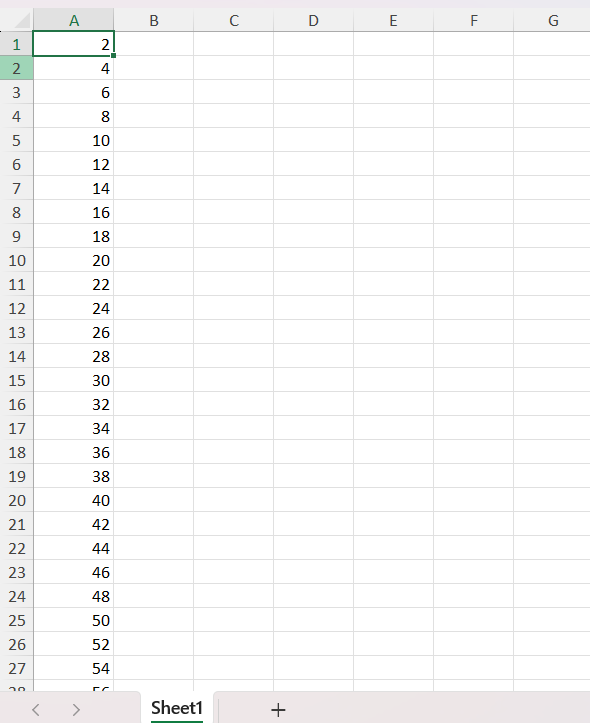

# Auto Fill

 The **Auto Fill** enables users to programmatically populate a range of Excel cells based on defined patterns, sequences, or trends. This helps reduce manual data entry by automatically generating values using built-in logic.

## Types

### Copy

The **Copy** option repeats the exact values from the source range without applying any pattern or increment. This option is useful when the same content needs to be duplicated across the destination range while preserving the original data.

  

//Define the source range
IRange source = worksheet["A1:A3"];

//Define the destination range
IRange destinationRange = worksheet["A4:A100"];

//Auto fill using the copy option
source.AutoFill(destinationRange, ExcelAutoFillType.FillCopy);



//Define the source range
IRange source = worksheet["A1:A3"];

//Define the destination range
IRange destinationRange = worksheet["A4:A100"];

//Auto fill using the copy option
source.AutoFill(destinationRange, ExcelAutoFillType.FillCopy);



'Define the source range
Dim source As IRange = worksheet("A1:A3")

'Define the destination range
Dim destinationRange As IRange = worksheet("A4:A100")

'Auto fill using the copy option
source.AutoFill(destinationRange, ExcelAutoFillType.FillCopy)


  

### Series

The **Series** option populates the destination range with values that follow a defined sequence or step based on the source pattern. It is useful for generating structured data and enables efficient expansion of sequential values.

  

//Define the source range
IRange source = worksheet["A1:A3"];

//Define the destination range
IRange destinationRange = worksheet["A4:A100"];

//Auto fill using the series option
source.AutoFill(destinationRange, ExcelAutoFillType.FillSeries);



//Define the source range
IRange source = worksheet["A1:A3"];

//Define the destination range
IRange destinationRange = worksheet["A4:A100"];

//Auto fill using the series option
source.AutoFill(destinationRange, ExcelAutoFillType.FillSeries);



'Define the source range
Dim source As IRange = worksheet("A1:A3")

'Define the destination range
Dim destinationRange As IRange = worksheet("A4:A100")

'Auto fill using the series option
source.AutoFill(destinationRange, ExcelAutoFillType.FillSeries)


  

### Formats

The **Formats** option copies only the formatting from the source range to the destination range without affecting the existing values. It is useful for maintaining a uniform appearance and enables efficient application of styles across large data ranges.

  

//Define the source range
IRange source = worksheet["A1:A3"];

//Define the destination range
IRange destinationRange = worksheet["A4:A100"];

//Auto fill using the formats option
source.AutoFill(destinationRange, ExcelAutoFillType.FillFormats);



//Define the source range
IRange source = worksheet["A1:A3"];

//Define the destination range
IRange destinationRange = worksheet["A4:A100"];

//Auto fill using the formats option
source.AutoFill(destinationRange, ExcelAutoFillType.FillFormats);



'Define the source range
Dim source As IRange = worksheet("A1:A3")

'Define the destination range
Dim destinationRange As IRange = worksheet("A4:A100")

'Auto fill using the formats option
source.AutoFill(destinationRange, ExcelAutoFillType.FillFormats)


  

### Values

The **Values** option populates only the values from the source range to the destination range without carrying over any formatting. It is useful for preserving raw data while extending it consistently across cells, enabling pattern-based filling without altering the existing cell styles. 

  

//Define the source range
IRange source = worksheet["A1:A3"];

//Define the destination range
IRange destinationRange = worksheet["A4:A100"];

//Auto fill using the values option
source.AutoFill(destinationRange, ExcelAutoFillType.FillValues);



//Define the source range
IRange source = worksheet["A1:A3"];

//Define the destination range
IRange destinationRange = worksheet["A4:A100"];

//Auto fill using the values option
source.AutoFill(destinationRange, ExcelAutoFillType.FillValues);



'Define the source range
Dim source As IRange = worksheet("A1:A3")

'Define the destination range
Dim destinationRange As IRange = worksheet("A4:A100")

'Auto fill using the values option
source.AutoFill(destinationRange, ExcelAutoFillType.FillValues)


  

### DateTime

The **Days, Weekdays, Months, and Years** options populate the destination range with date values by incrementing the corresponding part of the date from the source range. These options allow you to extend dates by individual days, skip weekends (weekdays), or increment by months or years. They are useful for generating timelines, schedules, or date-based reports with consistent and structured date progression.

#### Days

  

//Define the source range
IRange source = worksheet["A1:A3"];

//Define the destination range
IRange destinationRange = worksheet["A4:A100"];

//Auto fill using the days option
source.AutoFill(destinationRange, ExcelAutoFillType.FillDays);



//Define the source range
IRange source = worksheet["A1:A3"];

//Define the destination range
IRange destinationRange = worksheet["A4:A100"];

//Auto fill using the days option
source.AutoFill(destinationRange, ExcelAutoFillType.FillDays);



'Define the source range
Dim source As IRange = worksheet("A1:A3")

'Define the destination range
Dim destinationRange As IRange = worksheet("A4:A100")

'Auto fill using the days option
source.AutoFill(destinationRange, ExcelAutoFillType.FillDays)


  

Like this, you can use the **FillWeekdays, FillMonths, and FillYears** options to populate the destination range by incrementing only the weekday, month, or year part of the date, respectively. These options are useful for generating workday schedules, monthly plans, or yearly summaries while maintaining a consistent date progression pattern. The usage remains the same as shown in the FillDays example, only the ExcelAutoFillType value needs to be changed.

### Linear Trend

The **Linear Trend** option fills the destination range by calculating and applying a constant difference between values in the source range. It is useful for generating values that follow a straight-line progression and enables efficient creation of forecast or analytical data series.

  

//Define the source range
IRange source = worksheet["A1:A3"];

//Define the destination range
IRange destinationRange = worksheet["A4:A100"];

//Auto fill using the linear trend option
source.AutoFill(destinationRange, ExcelAutoFillType.LinearTrend);



//Define the source range
IRange source = worksheet["A1:A3"];

//Define the destination range
IRange destinationRange = worksheet["A4:A100"];

//Auto fill using the linear trend option
source.AutoFill(destinationRange, ExcelAutoFillType.LinearTrend);



'Define the source range
Dim source As IRange = worksheet("A1:A3")

'Define the destination range
Dim destinationRange As IRange = worksheet("A4:A100")

'Auto fill using the linear trend option
source.AutoFill(destinationRange, ExcelAutoFillType.LinearTrend)


  

### Growth Trend

The **Growth Trend** option fills the destination range by applying a constant multiplication factor between values in the source range. It is useful for generating values that follow an exponential progression and enables efficient creation of growth-based forecasts or analytical data series.

  

//Define the source range
IRange source = worksheet["A1:A3"];

//Define the destination range
IRange destinationRange = worksheet["A4:A100"];

//Auto fill using the growth trend option
source.AutoFill(destinationRange, ExcelAutoFillType.GrowthTrend);



//Define the source range
IRange source = worksheet["A1:A3"];

//Define the destination range
IRange destinationRange = worksheet["A4:A100"];

//Auto fill using the growth trend option
source.AutoFill(destinationRange, ExcelAutoFillType.GrowthTrend);



'Define the source range
Dim source As IRange = worksheet("A1:A3")

'Define the destination range
Dim destinationRange As IRange = worksheet("A4:A100")

'Auto fill using the growth trend option
source.AutoFill(destinationRange, ExcelAutoFillType.GrowthTrend)


  

## Number Series

The following code example illustrates how to auto fill a series in a worksheet.

  
{% highlight c# tabtitle="C# [Cross-platform]" playgroundButtonLink="https://raw.githubusercontent.com/SyncfusionExamples/XlsIO-Examples/master/Worksheet%20Features/Auto%20Fill/.NET/AutoFillUsingFillSeries/AutoFillUsingFillSeries/Program.cs,180" %}
using (ExcelEngine excelEngine = new ExcelEngine())
{
    IApplication application = excelEngine.Excel;
    application.DefaultVersion = ExcelVersion.Xlsx;
    IWorkbook workbook = application.Workbooks.Create(1);
    IWorksheet worksheet = workbook.Worksheets[0];

    //Assign values to the cells
    worksheet["A1"].Number = 2;
    worksheet["A2"].Number = 4;
    worksheet["A3"].Number = 6;

    //Define the source range
    IRange source = worksheet["A1:A3"];

    //Define the destination range
    IRange destinationRange = worksheet["A4:A100"];

    //Auto fill using the series option
    source.AutoFill(destinationRange, ExcelAutoFillType.FillSeries);

    //Saving the workbook
    workbook.SaveAs(Path.GetFullPath("Output/Output.xlsx"));
}



using (ExcelEngine excelEngine = new ExcelEngine())
{
    IApplication application = excelEngine.Excel;
    application.DefaultVersion = ExcelVersion.Xlsx;
    IWorkbook workbook = application.Workbooks.Create(1);
    IWorksheet worksheet = workbook.Worksheets[0];

    //Assign values to the cells
    worksheet["A1"].Number = 2;
    worksheet["A2"].Number = 4;
    worksheet["A3"].Number = 6;

    //Define the source range
    IRange source = worksheet["A1:A3"];

    //Define the destination range
    IRange destinationRange = worksheet["A4:A100"];

    //Auto fill using the series option
    source.AutoFill(destinationRange, ExcelAutoFillType.FillSeries);

    //Saving the workbook
    workbook.SaveAs("Output.xlsx");
}



Using excelEngine As New ExcelEngine()
    Dim application As IApplication = excelEngine.Excel
    application.DefaultVersion = ExcelVersion.Xlsx
    Dim workbook As IWorkbook = application.Workbooks.Create(1)
    Dim worksheet As IWorksheet = workbook.Worksheets(0)

    'Assign values to the cells
    worksheet("A1").Number = 2
    worksheet("A2").Number = 4
    worksheet("A3").Number = 6

    'Define the source range
    Dim source As IRange = worksheet("A1:A3")

    'Define the destination range
    Dim destinationRange As IRange = worksheet("A4:A100")

    'Auto fill using the series option
    source.AutoFill(destinationRange, ExcelAutoFillType.FillSeries)

    'Saving the workbook
    workbook.SaveAs("Output.xlsx")
End Using



A complete working example of how to auto fill a series in a worksheet using C# is present on <a href="https://github.com/SyncfusionExamples/XlsIO-Examples/tree/master/Worksheet%20Features/Auto%20Fill/.NET/AutoFillUsingFillSeries">this GitHub page</a>.

By executing the program, you will get the Excel file as below

