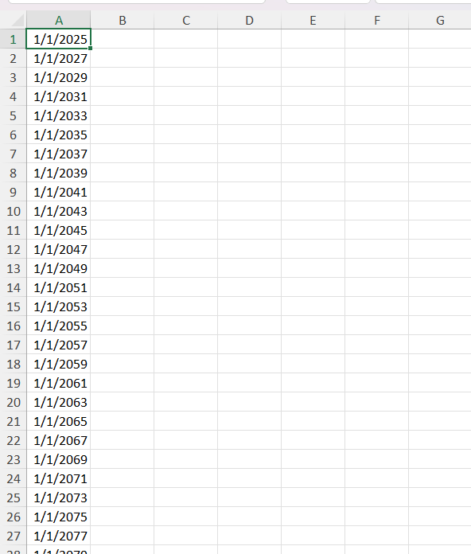
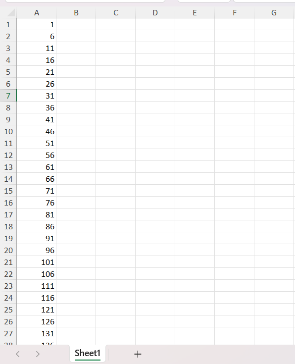
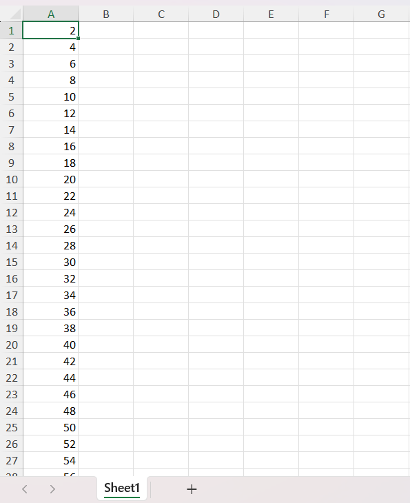

# Fill Series Feature in Excel Document

The **Fill Series** feature in the XlsIO library allows users to programmatically fill a range with a sequence of values based on the specified direction (row or column), series type, step value, and stop value.

## Types

### Linear

The **Linear** type generates a sequence of values with a constant step between each entry, based on the specified direction - row or column. Users can define both the step value and stop value to control the progression. When the Trend option is enabled, the step and stop values are ignored, and values are calculated based on linear regression.

  

//Define the range
IRange range = worksheet["A1:A100"];

//Fill series using the linear option, step value and stop value
range.FillSeries(ExcelSeriesBy.Columns, ExcelFillSeries.Linear, 1, 100);



//Define the range
IRange range = worksheet["A1:A100"];

//Fill series using the linear option, step value and stop value
range.FillSeries(ExcelSeriesBy.Columns, ExcelFillSeries.Linear, 1, 100);



'Define the range
Dim range As IRange = worksheet("A1:A100")

'Fill series using the linear option, step value and stop value
range.FillSeries(ExcelSeriesBy.Columns, ExcelFillSeries.Linear, 1, 100)


  

### Growth

The **Growth** type generates a sequence of values with a constant multiplication factor between each entry, based on the specified direction - row or column. Users can define both the step value (as a growth factor) and stop value to control the progression. When the Trend option is enabled, the step and stop values are ignored, and values are calculated based on exponential regression.

  

//Define the range
IRange range = worksheet["A1:A100"];

//Fill series using the growth option, step value and stop value
range.FillSeries(ExcelSeriesBy.Columns, ExcelFillSeries.Growth, 2, 100);



//Define the range
IRange range = worksheet["A1:A100"];

//Fill series using the growth option, step value and stop value
range.FillSeries(ExcelSeriesBy.Columns, ExcelFillSeries.Growth, 2, 100);



'Define the range
Dim range As IRange = worksheet("A1:A100")

'Fill series using the growth option, step value and stop value
range.FillSeries(ExcelSeriesBy.Columns, ExcelFillSeries.Growth, 2, 100)


  

### DateTime

The **Days, Weekdays, Months, and Years** options generate date sequences by incrementing the corresponding part of the date based on the specified direction (row or column). These types do not support the **Trend** option. They are useful for creating structured date progressions such as schedules, timelines, or calendars.

#### Days

  
         
//Define the range
IRange range = worksheet["A1:A100"];

//Fill series using the days option, step value and stop value
range.FillSeries(ExcelSeriesBy.Columns, ExcelFillSeries.Days, 2, new DateTime(2026, 1, 1));



//Define the range
IRange range = worksheet["A1:A100"];

//Fill series using the days option, step value and stop value
range.FillSeries(ExcelSeriesBy.Columns, ExcelFillSeries.Days, 2, new DateTime(2026, 1, 1));



'Define the range
Dim range As IRange = worksheet("A1:A100")

'Fill series using the days option, step value and stop value
range.FillSeries(ExcelSeriesBy.Columns, ExcelFillSeries.Days, 2, New DateTime(2026, 1, 1))


  

Like this, you can use the **Weekdays, Months, and Years** options to populate the destination range by incrementing only the weekday, month, or year part of the date, respectively. These options are useful for generating workday schedules, monthly plans, or yearly summaries while maintaining a consistent date progression pattern. The usage remains the same as shown in the Days example, only the ExcelFillSeries type value needs to be changed.

### Auto Fill

The **Auto Fill** option automatically extends patterns from the source range into the destination range based on the specified direction (row or column). It does not support the **Trend** option. 

  

//Define the range
IRange range = worksheet["A1:A100"];

//Fill series using the auto fill option
range.FillSeries(ExcelSeriesBy.Columns, ExcelFillSeries.AutoFill, 0, 0);



//Define the range
IRange range = worksheet["A1:A100"];

//Fill series using the auto fill option
range.FillSeries(ExcelSeriesBy.Columns, ExcelFillSeries.AutoFill, 0, 0);



'Define the range
Dim range As IRange = worksheet("A1:A100")

'Fill series using the auto fill option
range.FillSeries(ExcelSeriesBy.Columns, ExcelFillSeries.AutoFill, 0, 0)


  

## DateTime Series

The following code example illustrates how to fill a date series in a worksheet.

  
{% highlight c# tabtitle="C# [Cross-platform]" playgroundButtonLink="https://raw.githubusercontent.com/SyncfusionExamples/XlsIO-Examples/master/Worksheet%20Features/Fill%20Series/.NET/DateTimeFillSeries/DateTimeFillSeries/Program.cs,180" %}
using (ExcelEngine excelEngine = new ExcelEngine())
{
    IApplication application = excelEngine.Excel;
    application.DefaultVersion = ExcelVersion.Xlsx;
    IWorkbook workbook = application.Workbooks.Create(1);
    IWorksheet worksheet = workbook.Worksheets[0];

    //Assign datetime value to the cell
    worksheet["A1"].DateTime = new DateTime(2025, 1, 1);

    //Define the range
    IRange range = worksheet["A1:A50"];

    //Fill series using the years option, step value and stop value
    range.FillSeries(ExcelSeriesBy.Columns, ExcelFillSeries.Years, 2, new DateTime(2100, 1, 1));

    //Saving the workbook 
    workbook.SaveAs(Path.GetFullPath("Output/Output.xlsx"));
}



using (ExcelEngine excelEngine = new ExcelEngine())
{
    IApplication application = excelEngine.Excel;
    application.DefaultVersion = ExcelVersion.Xlsx;
    IWorkbook workbook = application.Workbooks.Create(1);
    IWorksheet worksheet = workbook.Worksheets[0];

    //Assign datetime value to the cell
    worksheet["A1"].DateTime = new DateTime(2025, 1, 1);

    //Define the range
    IRange range = worksheet["A1:A50"];

    //Fill series using the years option, step value and stop value
    range.FillSeries(ExcelSeriesBy.Columns, ExcelFillSeries.Years, 2, new DateTime(2100, 1, 1));

    //Saving the workbook
    workbook.SaveAs("Output.xlsx");
}



Using excelEngine As New ExcelEngine()
    Dim application As IApplication = excelEngine.Excel
    application.DefaultVersion = ExcelVersion.Xlsx
    Dim workbook As IWorkbook = application.Workbooks.Create(1)
    Dim worksheet As IWorksheet = workbook.Worksheets(0)

    'Assign datetime value to the cell
    worksheet("A1").DateTime = New DateTime(2025, 1, 1)

    'Define the range
    Dim range As IRange = worksheet("A1:A50")

    'Fill series using the years option, step value and stop value
    range.FillSeries(ExcelSeriesBy.Columns, ExcelFillSeries.Years, 2, New DateTime(2100, 1, 1))

    'Saving the workbook
    workbook.SaveAs("Output.xlsx")
End Using



A complete working example of how to fill a date series in a worksheet using C# is present on <a href="https://github.com/SyncfusionExamples/XlsIO-Examples/tree/master/Worksheet%20Features/Fill%20Series/.NET/DateTimeFillSeries">this GitHub page</a>.

By executing the program, you will get the Excel file as below

## Number Series

The following code example illustrates how to fill a number series in a worksheet.

  
{% highlight c# tabtitle="C# [Cross-platform]" playgroundButtonLink="https://raw.githubusercontent.com/SyncfusionExamples/XlsIO-Examples/master/Worksheet%20Features/Fill%20Series/.NET/NumberFillSeries/NumberFillSeries/Program.cs,180" %}
using (ExcelEngine excelEngine = new ExcelEngine())
{
    IApplication application = excelEngine.Excel;
    application.DefaultVersion = ExcelVersion.Xlsx;
    IWorkbook workbook = application.Workbooks.Create(1);
    IWorksheet worksheet = workbook.Worksheets[0];

    //Assign value to the cell
    worksheet["A1"].Number = 1;

    //Define the range
    IRange range = worksheet["A1:A100"];

    //Fill series using the linear option, step value and stop value
    range.FillSeries(ExcelSeriesBy.Columns, ExcelFillSeries.Linear, 5, 1000);

    //Saving the workbook 
    workbook.SaveAs(Path.GetFullPath("Output/Output.xlsx"));
}



using (ExcelEngine excelEngine = new ExcelEngine())
{
    IApplication application = excelEngine.Excel;
    application.DefaultVersion = ExcelVersion.Xlsx;
    IWorkbook workbook = application.Workbooks.Create(1);
    IWorksheet worksheet = workbook.Worksheets[0];

    //Assign value to the cell
    worksheet["A1"].Number = 1;

    //Define the range
    IRange range = worksheet["A1:A100"];

    //Fill series using the linear option, step value and stop value
    range.FillSeries(ExcelSeriesBy.Columns, ExcelFillSeries.Linear, 5, 1000);

    //Saving the workbook
    workbook.SaveAs("Output.xlsx");
}



Using excelEngine As New ExcelEngine()
    Dim application As IApplication = excelEngine.Excel
    application.DefaultVersion = ExcelVersion.Xlsx
    Dim workbook As IWorkbook = application.Workbooks.Create(1)
    Dim worksheet As IWorksheet = workbook.Worksheets(0)

    'Assign value to the cell
    worksheet("A1").Number = 1

    'Define the range
    Dim range As IRange = worksheet("A1:A100")

    'Fill series using the linear option, step value and stop value
    range.FillSeries(ExcelSeriesBy.Columns, ExcelFillSeries.Linear, 5, 1000)

    'Saving the workbook
    workbook.SaveAs("Output.xlsx")
End Using



A complete working example of how to fill a number series in a worksheet using C# is present on <a href="https://github.com/SyncfusionExamples/XlsIO-Examples/tree/master/Worksheet%20Features/Fill%20Series/.NET/NumberFillSeries">this GitHub page</a>.

By executing the program, you will get the Excel file as below

## Trend

The following code example illustrates how to fill series by enabling trend.

   
{% highlight c# tabtitle="C# [Cross-platform]" playgroundButtonLink="https://raw.githubusercontent.com/SyncfusionExamples/XlsIO-Examples/master/Worksheet%20Features/Fill%20Series/.NET/FillSeriesByEnablingTrend/FillSeriesByEnablingTrend/Program.cs,180" %}
using (ExcelEngine excelEngine = new ExcelEngine())
{
    IApplication application = excelEngine.Excel;
    application.DefaultVersion = ExcelVersion.Xlsx;
    IWorkbook workbook = application.Workbooks.Create(1);
    IWorksheet worksheet = workbook.Worksheets[0];

    //Assign values to the cells
    worksheet["A1"].Number = 2;
    worksheet["A2"].Number = 4;
    worksheet["A3"].Number = 6;

    //Define the range
    IRange range = worksheet["A1:A100"];

    //Fill series using the linear option by enabling trend
    range.FillSeries(ExcelSeriesBy.Columns, ExcelFillSeries.Linear, true);

    //Saving the workbook 
    workbook.SaveAs(Path.GetFullPath("Output/Output.xlsx"));
}



using (ExcelEngine excelEngine = new ExcelEngine())
{
    IApplication application = excelEngine.Excel;
    application.DefaultVersion = ExcelVersion.Xlsx;
    IWorkbook workbook = application.Workbooks.Create(1);
    IWorksheet worksheet = workbook.Worksheets[0];

    //Assign values to the cells
    worksheet["A1"].Number = 2;
    worksheet["A2"].Number = 4;
    worksheet["A3"].Number = 6;

    //Define the range
    IRange range = worksheet["A1:A100"];

    //Fill series using the linear option by enabling trend
    range.FillSeries(ExcelSeriesBy.Columns, ExcelFillSeries.Linear, true);

    //Saving the workbook
    workbook.SaveAs("Output.xlsx");
}



Using excelEngine As New ExcelEngine()
    Dim application As IApplication = excelEngine.Excel
    application.DefaultVersion = ExcelVersion.Xlsx
    Dim workbook As IWorkbook = application.Workbooks.Create(1)
    Dim worksheet As IWorksheet = workbook.Worksheets(0)

    'Assign values to the cells
    worksheet("A1").Number = 2
    worksheet("A2").Number = 4
    worksheet("A3").Number = 6

    'Define the range
    Dim range As IRange = worksheet("A1:A100")

    'Fill series using the linear option by enabling trend
    range.FillSeries(ExcelSeriesBy.Columns, ExcelFillSeries.Linear, True)

    'Saving the workbook
    workbook.SaveAs("Output.xlsx")
End Using



A complete working example of how to fill series by enabling trend in a worksheet using C# is present on <a href="https://github.com/SyncfusionExamples/XlsIO-Examples/tree/master/Worksheet%20Features/Fill%20Series/.NET/FillSeriesByEnablingTrend">this GitHub page</a>.

By executing the program, you will get the Excel file as below

