---
title: Create, read, edit Excel files in AWS Elastic Beanstalk | Syncfusion
description: This page explains how to create, read, and edit Excel files in AWS Elastic Beanstalk using the .NET Excel Library.
platform: document-processing
control: XlsIO
documentation: UG
---

# Create, read, and edit Excel files in AWS Elastic Beanstalk

Syncfusion&reg; XlsIO is a [.NET Core Excel library](https://www.syncfusion.com/document-processing/excel-framework/net-core/excel-library) that can be used to create, read, and edit Excel files. This library supports manipulating Excel documents in AWS Elastic Beanstalk.

## Prerequisites

Before you begin, ensure the following:

* An active **AWS account** with permissions to create Elastic Beanstalk applications, environments, and S3 buckets. If you do not have one, see [Create an AWS account](https://aws.amazon.com/free/).
* **AWS CLI** installed and configured with your credentials — see [AWS CLI quick start](https://docs.aws.amazon.com/cli/latest/userguide/getting-started-quickstart.html).
* **Visual Studio 2022** with the **AWS Toolkit for Visual Studio** extension installed (required for the **Publish to AWS Elastic Beanstalk** menu option) — see [AWS Toolkit for Visual Studio](https://aws.amazon.com/visualstudio/).
* A **Syncfusion license key**. Register it in `Program.cs` (see the snippet in Step 2a below) or store it in an **Elastic Beanstalk environment property** (for example, `SYNCFUSION_LICENSE_KEY`) and load it via `Environment.GetEnvironmentVariable` — see the [Syncfusion licensing overview](https://help.syncfusion.com/common/essential-studio/licensing/overview).

## Steps to create an Excel document in AWS Elastic Beanstalk

Step 1: Create a new ASP.NET Core Web application (Model-View-Controller) project.

Step 2: Install the [Syncfusion.XlsIO.Net.Core](https://www.nuget.org/packages/Syncfusion.XlsIO.Net.Core) NuGet package as a reference to your project from [NuGet.org](https://www.nuget.org/).

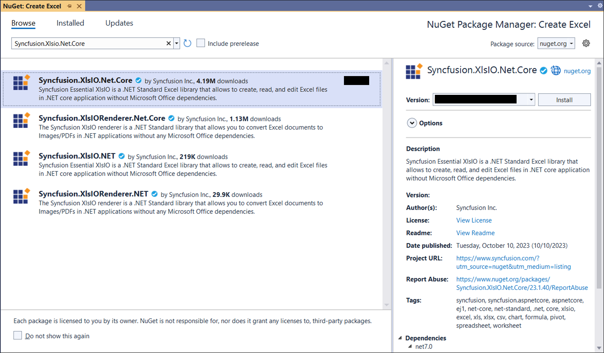

N> Starting with v16.2.0.x, if you reference Syncfusion&reg; assemblies from trial setup or from the NuGet feed, you also have to add "Syncfusion.Licensing" assembly reference and include a license key in your projects. Please refer to this [link](https://help.syncfusion.com/common/essential-studio/licensing/overview) to know about registering Syncfusion&reg; license key in your application to use our components.

Step 2a: Register your Syncfusion license key in **Program.cs** (before `app.Run()`). Replace the placeholder with your actual key.



Syncfusion.Licensing.SyncfusionLicenseProvider.RegisterLicense("YOUR_LICENSE_KEY");



For production deployments to Elastic Beanstalk, store the key in an **environment property** (for example, `SYNCFUSION_LICENSE_KEY`) and read it via `Environment.GetEnvironmentVariable` so the key is not committed to source control.

Step 3: Include the following namespaces in the **HomeController.cs** file.




using Syncfusion.XlsIO;
using Syncfusion.Drawing;
using System.IO;




Step 4: A default action method named `Index` is present in **HomeController.cs**. Right-click the `Index` method and select **Go To View** to open the associated view page **Index.cshtml**.

Step 5: Add a new button in the **Index.cshtml** as shown below.




@{
    Html.BeginForm("CreatExcelDocument", "Home", FormMethod.Get);
    {
        

           <input type="submit" value="Create Excel document" style="width:200px;height:27px" />
        

    }
    Html.EndForm();
}




Step 6: Add a new action method **CreateExcelDocument** in **HomeController.cs** and include the following code snippet to **create an Excel document** and download it.

N> The code below assumes the following action method signature. Place the body inside the `CreateExcelDocument` method:



public FileContentResult CreateExcelDocument()
{
    // ... place the snippet below inside this method ...
}



N> The image file (`AdventureCycles-Logo.png`) is read from the working directory. On AWS Elastic Beanstalk, the working directory is typically `/var/app/current/`. Add the file to the project's root or `wwwroot/` (set **Copy to Output Directory** to **Copy if newer**) so it is included in the deployment package.



//Create an instance of ExcelEngine
using (ExcelEngine excelEngine = new ExcelEngine())
{
    IApplication application = excelEngine.Excel;  
    application.DefaultVersion = ExcelVersion.Xlsx;
    
    //Create a workbook
    IWorkbook workbook = application.Workbooks.Create(1);
    IWorksheet worksheet = workbook.Worksheets[0];
    
    //Adding a picture (wrap in using for proper disposal)
    using (FileStream imageStream = new FileStream("AdventureCycles-Logo.png", FileMode.Open, FileAccess.Read))
    {
        IPictureShape shape = worksheet.Pictures.AddPicture(1, 1, imageStream, 20, 20);
    }
    
    //Disable gridlines in the worksheet
    worksheet.IsGridLinesVisible = false;
    
    //Enter values to the cells from A3 to A5
    worksheet.Range["A3"].Text = "46036 Michigan Ave";
    worksheet.Range["A4"].Text = "Canton, USA";
    worksheet.Range["A5"].Text = "Phone: +1 231-231-2310";
    
    //Make the text bold
    worksheet.Range["A3:A5"].CellStyle.Font.Bold = true;
    
    //Merge cells
    worksheet.Range["D1:E1"].Merge();
    
    //Enter text to the cell D1 and apply formatting.
    worksheet.Range["D1"].Text = "INVOICE";
    worksheet.Range["D1"].CellStyle.Font.Bold = true;
    worksheet.Range["D1"].CellStyle.Font.RGBColor = Color.FromArgb(42, 118, 189);
    worksheet.Range["D1"].CellStyle.Font.Size = 35;
    
    //Apply alignment in the cell D1
    worksheet.Range["D1"].CellStyle.HorizontalAlignment = ExcelHAlign.HAlignRight;
    worksheet.Range["D1"].CellStyle.VerticalAlignment = ExcelVAlign.VAlignTop;
    
    //Enter values to the cells from D5 to E8
    worksheet.Range["D5"].Text = "INVOICE#";
    worksheet.Range["E5"].Text = "DATE";
    worksheet.Range["D6"].Number = 1028;
    worksheet.Range["E6"].Value = "12/31/2018";
    worksheet.Range["D7"].Text = "CUSTOMER ID";
    worksheet.Range["E7"].Text = "TERMS";
    worksheet.Range["D8"].Number = 564;
    worksheet.Range["E8"].Text = "Due Upon Receipt";
    
    //Apply RGB backcolor to the cells from D5 to E8
    worksheet.Range["D5:E5"].CellStyle.Color = Color.FromArgb(42, 118, 189);
    worksheet.Range["D7:E7"].CellStyle.Color = Color.FromArgb(42, 118, 189);
    
    //Apply known colors to the text in cells D5 to E8
    worksheet.Range["D5:E5"].CellStyle.Font.Color = ExcelKnownColors.White;
    worksheet.Range["D7:E7"].CellStyle.Font.Color = ExcelKnownColors.White;
    
    //Make the text as bold from D5 to E8
    worksheet.Range["D5:E8"].CellStyle.Font.Bold = true;
    
    //Apply alignment to the cells from D5 to E8
    worksheet.Range["D5:E8"].CellStyle.HorizontalAlignment = ExcelHAlign.HAlignCenter;
    worksheet.Range["D5:E5"].CellStyle.VerticalAlignment = ExcelVAlign.VAlignCenter;
    worksheet.Range["D7:E7"].CellStyle.VerticalAlignment = ExcelVAlign.VAlignCenter;
    worksheet.Range["D6:E6"].CellStyle.VerticalAlignment = ExcelVAlign.VAlignTop;
    
    //Enter value and applying formatting in the cell A7
    worksheet.Range["A7"].Text = "  BILL TO";
    worksheet.Range["A7"].CellStyle.Color = Color.FromArgb(42, 118, 189);
    worksheet.Range["A7"].CellStyle.Font.Bold = true;
    worksheet.Range["A7"].CellStyle.Font.Color = ExcelKnownColors.White;
    
    //Apply alignment
    worksheet.Range["A7"].CellStyle.HorizontalAlignment = ExcelHAlign.HAlignLeft;
    worksheet.Range["A7"].CellStyle.VerticalAlignment = ExcelVAlign.VAlignCenter;
    
    //Enter values in the cells A8 to A12
    worksheet.Range["A8"].Text = "Steyn";
    worksheet.Range["A9"].Text = "Great Lakes Food Market";
    worksheet.Range["A10"].Text = "20 Whitehall Rd";
    worksheet.Range["A11"].Text = "North Muskegon,USA";
    worksheet.Range["A12"].Text = "+1 231-654-0000";
    
    //Create a Hyperlink for e-mail in the cell A13
    IHyperLink hyperlink = worksheet.HyperLinks.Add(worksheet.Range["A13"]);
    hyperlink.Type = ExcelHyperLinkType.Url;
    hyperlink.Address = "Steyn@greatlakes.com";
    hyperlink.ScreenTip = "Send Mail";
    
    //Merge column A and B from row 15 to 22
    worksheet.Range["A15:B15"].Merge();
    worksheet.Range["A16:B16"].Merge();
    worksheet.Range["A17:B17"].Merge();
    worksheet.Range["A18:B18"].Merge();
    worksheet.Range["A19:B19"].Merge();
    worksheet.Range["A20:B20"].Merge();
    worksheet.Range["A21:B21"].Merge();
    worksheet.Range["A22:B22"].Merge();
    
    //Enter details of products and prices
    worksheet.Range["A15"].Text = "  DESCRIPTION";
    worksheet.Range["C15"].Text = "QTY";
    worksheet.Range["D15"].Text = "UNIT PRICE";
    worksheet.Range["E15"].Text = "AMOUNT";
    worksheet.Range["A16"].Text = "Cabrales Cheese";
    worksheet.Range["A17"].Text = "Chocos";
    worksheet.Range["A18"].Text = "Pasta";
    worksheet.Range["A19"].Text = "Cereals";
    worksheet.Range["A20"].Text = "Ice Cream";
    worksheet.Range["C16"].Number = 3;
    worksheet.Range["C17"].Number = 2;
    worksheet.Range["C18"].Number = 1;
    worksheet.Range["C19"].Number = 4;
    worksheet.Range["C20"].Number = 3;
    worksheet.Range["D16"].Number = 21;
    worksheet.Range["D17"].Number = 54;
    worksheet.Range["D18"].Number = 10;
    worksheet.Range["D19"].Number = 20;
    worksheet.Range["D20"].Number = 30;
    worksheet.Range["D23"].Text = "Total";
    
    //Apply number format
    worksheet.Range["D16:E22"].NumberFormat = "$0.00";
    worksheet.Range["E23"].NumberFormat = "$0.00";
    
    //Apply incremental formula for column Amount by multiplying Qty and UnitPrice
    application.EnableIncrementalFormula = true;
    worksheet.Range["E16:E20"].Formula = "=C16*D16";
    
    //Formula for Sum the total
    worksheet.Range["E23"].Formula = "=SUM(E16:E22)";
    
    //Apply borders
    worksheet.Range["A16:E22"].CellStyle.Borders[ExcelBordersIndex.EdgeTop].LineStyle = ExcelLineStyle.Thin;
    worksheet.Range["A16:E22"].CellStyle.Borders[ExcelBordersIndex.EdgeBottom].LineStyle = ExcelLineStyle.Thin;
    worksheet.Range["A16:E22"].CellStyle.Borders[ExcelBordersIndex.EdgeTop].Color = ExcelKnownColors.Grey_25_percent;
    worksheet.Range["A16:E22"].CellStyle.Borders[ExcelBordersIndex.EdgeBottom].Color = ExcelKnownColors.Grey_25_percent;
    worksheet.Range["A23:E23"].CellStyle.Borders[ExcelBordersIndex.EdgeTop].LineStyle = ExcelLineStyle.Thin;
    worksheet.Range["A23:E23"].CellStyle.Borders[ExcelBordersIndex.EdgeBottom].LineStyle = ExcelLineStyle.Thin;
    worksheet.Range["A23:E23"].CellStyle.Borders[ExcelBordersIndex.EdgeTop].Color = ExcelKnownColors.Black;
    worksheet.Range["A23:E23"].CellStyle.Borders[ExcelBordersIndex.EdgeBottom].Color = ExcelKnownColors.Black;
    
    //Apply font setting for cells with product details
    worksheet.Range["A3:E23"].CellStyle.Font.FontName = "Arial";
    worksheet.Range["A3:E23"].CellStyle.Font.Size = 10;
    worksheet.Range["A15:E15"].CellStyle.Font.Color = ExcelKnownColors.White;
    worksheet.Range["A15:E15"].CellStyle.Font.Bold = true;
    worksheet.Range["D23:E23"].CellStyle.Font.Bold = true;
    
    //Apply cell color
    worksheet.Range["A15:E15"].CellStyle.Color = Color.FromArgb(42, 118, 189);
    
    //Apply alignment to cells with product details
    worksheet.Range["A15"].CellStyle.HorizontalAlignment = ExcelHAlign.HAlignLeft;
    worksheet.Range["C15:C22"].CellStyle.HorizontalAlignment = ExcelHAlign.HAlignCenter;
    worksheet.Range["D15:E15"].CellStyle.HorizontalAlignment = ExcelHAlign.HAlignCenter;
    
    //Apply row height and column width to look good
    worksheet.Range["A1"].ColumnWidth = 36;
    worksheet.Range["B1"].ColumnWidth = 11;
    worksheet.Range["C1"].ColumnWidth = 8;
    worksheet.Range["D1:E1"].ColumnWidth = 18;
    worksheet.Range["A1"].RowHeight = 47;
    worksheet.Range["A2"].RowHeight = 15;
    worksheet.Range["A3:A4"].RowHeight = 15;
    worksheet.Range["A5"].RowHeight = 18;
    worksheet.Range["A6"].RowHeight = 29;
    worksheet.Range["A7"].RowHeight = 18;
    worksheet.Range["A8"].RowHeight = 15;
    worksheet.Range["A9:A14"].RowHeight = 15;
    worksheet.Range["A15:A23"].RowHeight = 18;  
    
    //Saving the Excel to the MemoryStream 
    MemoryStream stream = new MemoryStream();
    workbook.SaveAs(stream);

    //Set the position as '0'.
    stream.Position = 0;

    //Download Excel document in the browser.
    return File(stream.ToArray(), "application/vnd.openxmlformats-officedocument.spreadsheetml.sheet", "Sample.xlsx");
}




## Steps to publish as AWS Elastic Beanstalk

Step 1: Right-click the project and select **Publish to AWS Elastic Beanstalk (Legacy)** option.

N> The **Publish to AWS Elastic Beanstalk (Legacy)** option uses the older deployment workflow. For new projects, Microsoft and AWS recommend the current **Publish to AWS Elastic Beanstalk** option (without "Legacy"), which uses the .NET 8 on Linux platform branch by default. If you choose the Linux platform, the working directory is `/var/app/current/`. If you choose the Windows Server platform, the working directory is `C:\inetpub\wwwroot\`.

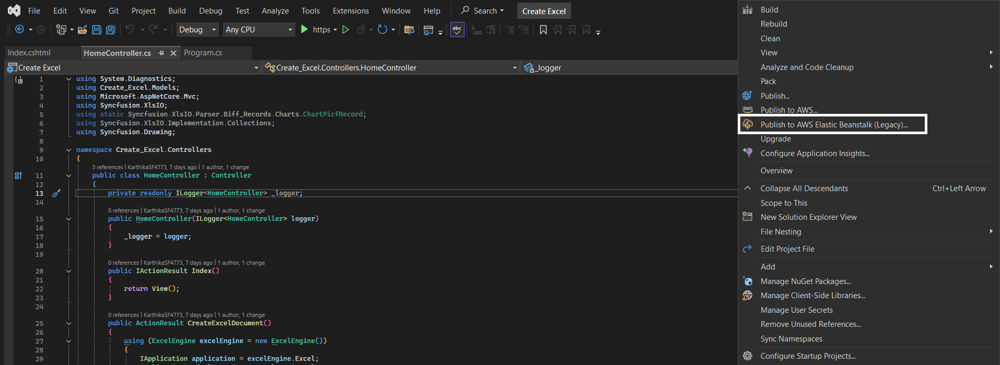

Step 2: Select the **Deployment Target** as **Create a new application environment** and click **Next** button.
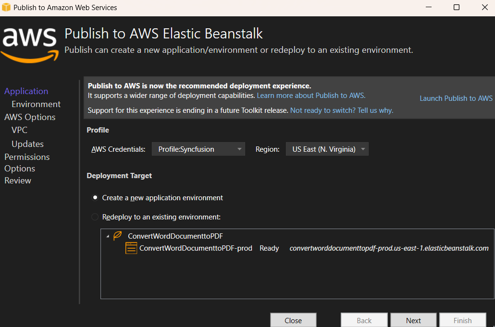

Step 3: Choose the **Environment Name** from the dropdown list; the **URL** is automatically assigned. Check that the URL is available. If available, click **Next**; otherwise, change the **URL** and try again. 
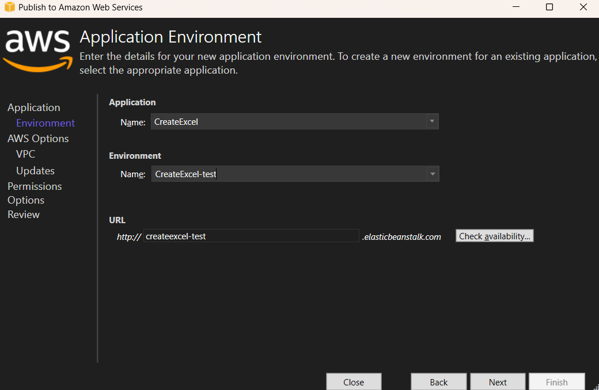

Step 4: Select the instance type in **t3a.micro** from the dropdown list and click next.
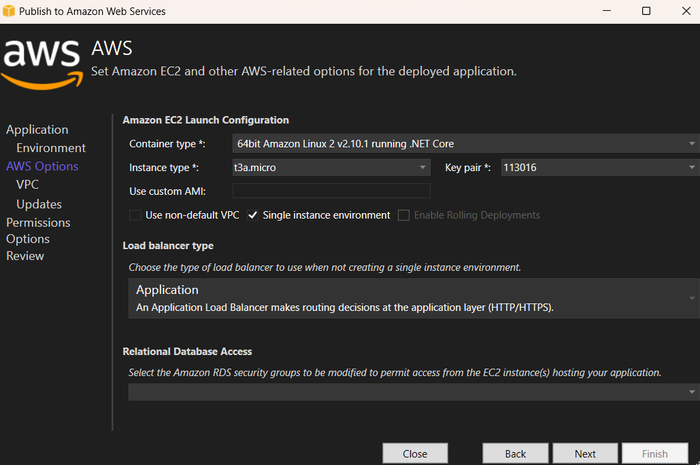

Step 5: Click the **Next** button to proceed further.
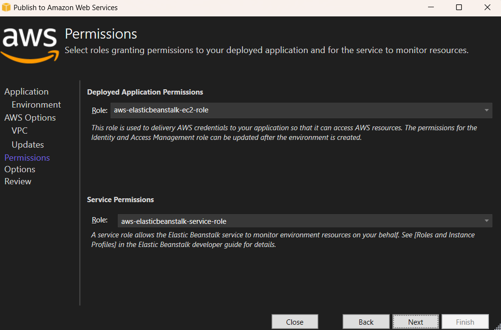

Step 6: Click the **Next** button.
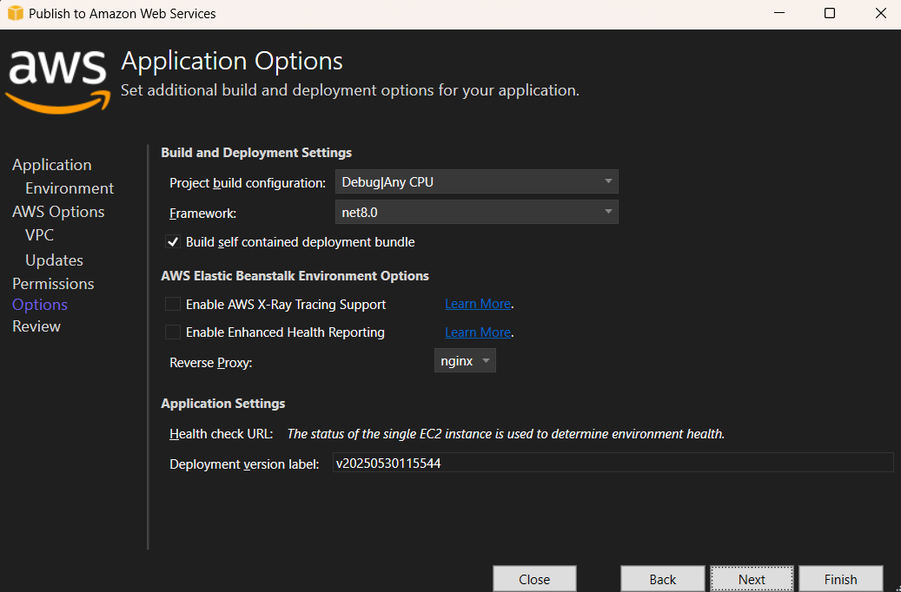

Step 7: Click the **Deploy** button to deploy the sample on AWS Elastic Beanstalk.
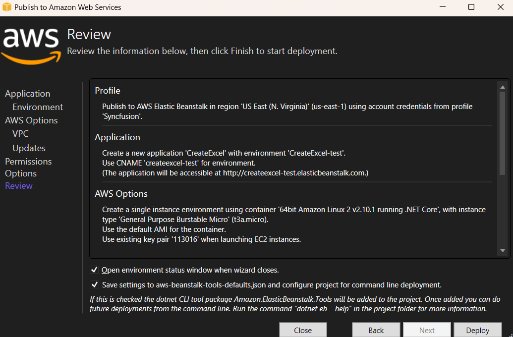

Step 8: After changing the status from **Updating** to **Environment is healthy**, click the **URL**.
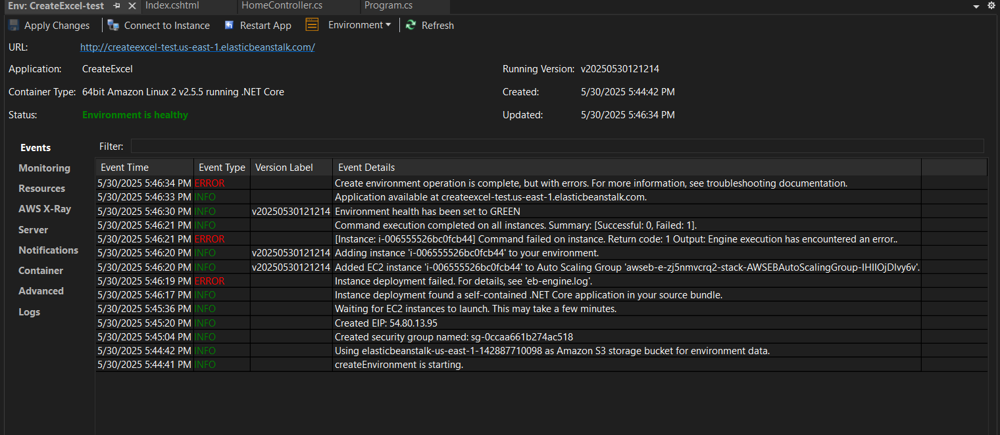

Step 9: After opening the provided **URL**, click **Create Document** button to download the Excel document.
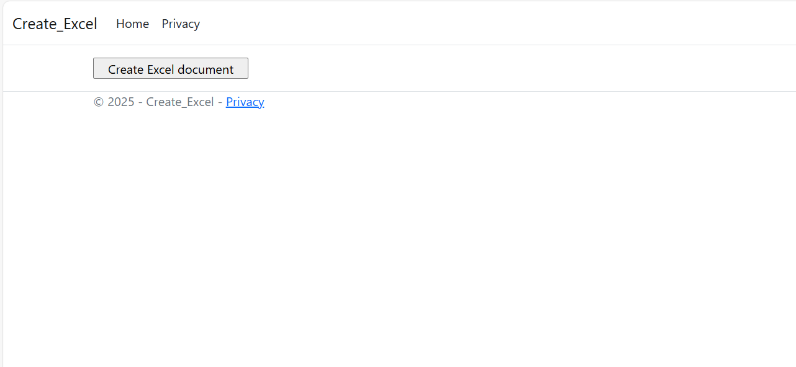

You can download a complete working sample from [GitHub](https://github.com/SyncfusionExamples/XlsIO-Examples/tree/master/Getting%20Started/AWS/AWS%20Elastic%20Beanstalk/Create%20Excel).

By executing the program, you will get the **Excel document** as follows.

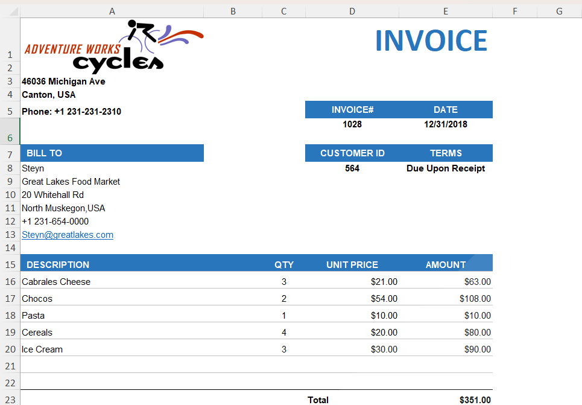

## Read and Edit an Excel File

The following code snippet illustrates how to read and edit an Excel file in AWS Elastic Beanstalk.

N> The code below reads `Data/InputTemplate.xlsx` from the working directory. Add the file to the project's `Data/` folder (set **Copy to Output Directory** to **Copy if newer**) so it is included in the deployment package. On AWS Elastic Beanstalk, the working directory is typically `/var/app/current/` (Linux) or `C:\inetpub\wwwroot\` (Windows Server).

The snippet below assumes the following action method signature. Place the body inside the `ReadAndEditExcel` method:



public FileContentResult ReadAndEditExcel()
{
    // ... place the snippet below inside this method ...
}





using (ExcelEngine excelEngine = new ExcelEngine())
{
    //Instantiate the Excel application object
    IApplication application = excelEngine.Excel;

    //Assigns default application version
    application.DefaultVersion = ExcelVersion.Xlsx;

    //A existing workbook is opened.
    IWorkbook workbook = application.Workbooks.Open("Data/InputTemplate.xlsx");

    //Access first worksheet from the workbook.
    IWorksheet worksheet = workbook.Worksheets[0];

    //Set Text in cell A3.
    worksheet.Range["A3"].Text = "Hello World";

    //Saving the Excel to the MemoryStream (wrap in using for proper disposal)
    using (MemoryStream stream = new MemoryStream())
    {
        workbook.SaveAs(stream);

        //Set the position as '0'.
        stream.Position = 0;

        //Download Excel document in the browser.
        return File(stream.ToArray(), "application/vnd.openxmlformats-officedocument.spreadsheetml.sheet", "Sample.xlsx");
    }
}




You can download a complete working sample from [GitHub](https://github.com/SyncfusionExamples/XlsIO-Examples/tree/master/Getting%20Started/AWS/AWS%20Elastic%20Beanstalk/EditExcel).

Click [here](https://www.syncfusion.com/document-processing/excel-framework/net-core) to explore the rich set of Syncfusion&reg; Excel library (XlsIO) features.

An online sample link to [create an Excel document](https://ej2.syncfusion.com/aspnetcore/Excel/Create#/material3) in ASP.NET Core.