# Create, read, and edit Excel files in Azure App Service on Windows

[Syncfusion Excel library for ASP.NET Core platform](https://www.syncfusion.com/document-processing/excel-framework/net-core/excel-library) can be used to create, read, edit Excel files in Azure App Service on Windows.

## Create a simple Excel report

The below steps illustrates creating a simple Invoice formatted Excel document in Azure App Service Windows.

Step 1: Create a new ASP.NET Core Web Application (Model-View-Controller).

Step 2: Name the project.

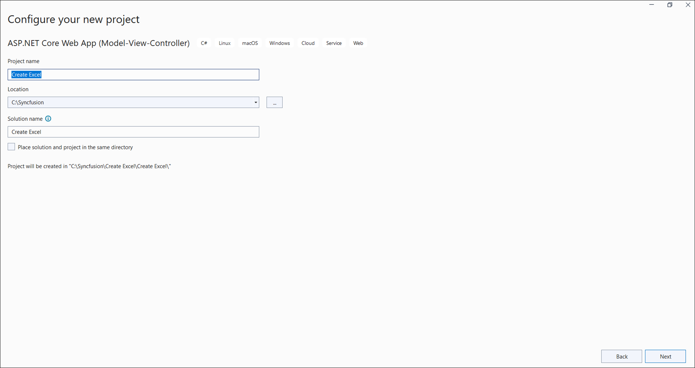

Step 3: Select the framework and click **Create** button.

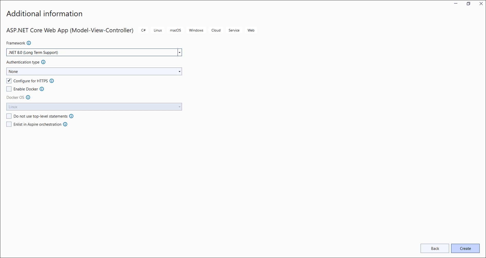

Step 4: Install the [Syncfusion.XlsIO.Net.Core](https://www.nuget.org/packages/Syncfusion.XlsIO.Net.Core) NuGet package as reference to your .NET Standard applications from [NuGet.org](https://www.nuget.org).

N> Starting with v16.2.0.x, if you reference Syncfusion assemblies from trial setup or from the NuGet feed, you also have to add "Syncfusion.Licensing" assembly reference and include a license key in your projects. Please refer to this [link](https://help.syncfusion.com/common/essential-studio/licensing/overview) to know about registering Syncfusion license key in your applications to use our components. 

Step 5: Include the following namespaces in **HomeController.cs**.

  

using Syncfusion.XlsIO;
using System.IO;
using Syncfusion.Drawing;



Imports Syncfusion.XlsIO
Imports System.IO
Imports Syncfusion.Drawing

  

{{ codesnippet1 | OrderList_Indent_Level_1 }}

Step 6: Add a new button in the **Index.cshtml** as shown below.

  

@{Html.BeginForm("CreateDocument", "Home", FormMethod.Get);
    {
        

            <input type="submit" value="Create Document" style="width:150px;height:27px" />
        

    }
    Html.EndForm();
}



{{ codesnippet2 | OrderList_Indent_Level_1 }}

Step 7: Include the below code snippet in **HomeController.cs** to **create an Excel file and download it**.

  

//Create an instance of ExcelEngine
using (ExcelEngine excelEngine = new ExcelEngine())
{
  IApplication application = excelEngine.Excel;  
  application.DefaultVersion = ExcelVersion.Xlsx;
  
  //Create a workbook
  IWorkbook workbook = application.Workbooks.Create(1);
  IWorksheet worksheet = workbook.Worksheets[0];
  
  //Adding a picture
  FileStream imageStream = new FileStream("AdventureCycles-Logo.png", FileMode.Open, FileAccess.Read);
  IPictureShape shape = worksheet.Pictures.AddPicture(1, 1, imageStream, 20, 20);
  
  //Disable gridlines in the worksheet
  worksheet.IsGridLinesVisible = false;
  
  //Enter values to the cells from A3 to A5
  worksheet.Range["A3"].Text = "46036 Michigan Ave";
  worksheet.Range["A4"].Text = "Canton, USA";
  worksheet.Range["A5"].Text = "Phone: +1 231-231-2310";
  
  //Make the text bold
  worksheet.Range["A3:A5"].CellStyle.Font.Bold = true;
  
  //Merge cells
  worksheet.Range["D1:E1"].Merge();
  
  //Enter text to the cell D1 and apply formatting.
  worksheet.Range["D1"].Text = "INVOICE";
  worksheet.Range["D1"].CellStyle.Font.Bold = true;
  worksheet.Range["D1"].CellStyle.Font.RGBColor = Color.FromArgb(42, 118, 189);
  worksheet.Range["D1"].CellStyle.Font.Size = 35;
  
  //Apply alignment in the cell D1
  worksheet.Range["D1"].CellStyle.HorizontalAlignment = ExcelHAlign.HAlignRight;
  worksheet.Range["D1"].CellStyle.VerticalAlignment = ExcelVAlign.VAlignTop;
  
  //Enter values to the cells from D5 to E8
  worksheet.Range["D5"].Text = "INVOICE#";
  worksheet.Range["E5"].Text = "DATE";
  worksheet.Range["D6"].Number = 1028;
  worksheet.Range["E6"].Value = "12/31/2018";
  worksheet.Range["D7"].Text = "CUSTOMER ID";
  worksheet.Range["E7"].Text = "TERMS";
  worksheet.Range["D8"].Number = 564;
  worksheet.Range["E8"].Text = "Due Upon Receipt";
  
  //Apply RGB backcolor to the cells from D5 to E8
  worksheet.Range["D5:E5"].CellStyle.Color = Color.FromArgb(42, 118, 189);
  worksheet.Range["D7:E7"].CellStyle.Color = Color.FromArgb(42, 118, 189);
  
  //Apply known colors to the text in cells D5 to E8
  worksheet.Range["D5:E5"].CellStyle.Font.Color = ExcelKnownColors.White;
  worksheet.Range["D7:E7"].CellStyle.Font.Color = ExcelKnownColors.White;
  
  //Make the text as bold from D5 to E8
  worksheet.Range["D5:E8"].CellStyle.Font.Bold = true;
  
  //Apply alignment to the cells from D5 to E8
  worksheet.Range["D5:E8"].CellStyle.HorizontalAlignment = ExcelHAlign.HAlignCenter;
  worksheet.Range["D5:E5"].CellStyle.VerticalAlignment = ExcelVAlign.VAlignCenter;
  worksheet.Range["D7:E7"].CellStyle.VerticalAlignment = ExcelVAlign.VAlignCenter;
  worksheet.Range["D6:E6"].CellStyle.VerticalAlignment = ExcelVAlign.VAlignTop;
  
  //Enter value and applying formatting in the cell A7
  worksheet.Range["A7"].Text = "  BILL TO";
  worksheet.Range["A7"].CellStyle.Color = Color.FromArgb(42, 118, 189);
  worksheet.Range["A7"].CellStyle.Font.Bold = true;
  worksheet.Range["A7"].CellStyle.Font.Color = ExcelKnownColors.White;
  
  //Apply alignment
  worksheet.Range["A7"].CellStyle.HorizontalAlignment = ExcelHAlign.HAlignLeft;
  worksheet.Range["A7"].CellStyle.VerticalAlignment = ExcelVAlign.VAlignCenter;
  
  //Enter values in the cells A8 to A12
  worksheet.Range["A8"].Text = "Steyn";
  worksheet.Range["A9"].Text = "Great Lakes Food Market";
  worksheet.Range["A10"].Text = "20 Whitehall Rd";
  worksheet.Range["A11"].Text = "North Muskegon,USA";
  worksheet.Range["A12"].Text = "+1 231-654-0000";
  
  //Create a Hyperlink for e-mail in the cell A13
  IHyperLink hyperlink = worksheet.HyperLinks.Add(worksheet.Range["A13"]);
  hyperlink.Type = ExcelHyperLinkType.Url;
  hyperlink.Address = "Steyn@greatlakes.com";
  hyperlink.ScreenTip = "Send Mail";
  
  //Merge column A and B from row 15 to 22
  worksheet.Range["A15:B15"].Merge();
  worksheet.Range["A16:B16"].Merge();
  worksheet.Range["A17:B17"].Merge();
  worksheet.Range["A18:B18"].Merge();
  worksheet.Range["A19:B19"].Merge();
  worksheet.Range["A20:B20"].Merge();
  worksheet.Range["A21:B21"].Merge();
  worksheet.Range["A22:B22"].Merge();
  
  //Enter details of products and prices
  worksheet.Range["A15"].Text = "  DESCRIPTION";
  worksheet.Range["C15"].Text = "QTY";
  worksheet.Range["D15"].Text = "UNIT PRICE";
  worksheet.Range["E15"].Text = "AMOUNT";
  worksheet.Range["A16"].Text = "Cabrales Cheese";
  worksheet.Range["A17"].Text = "Chocos";
  worksheet.Range["A18"].Text = "Pasta";
  worksheet.Range["A19"].Text = "Cereals";
  worksheet.Range["A20"].Text = "Ice Cream";
  worksheet.Range["C16"].Number = 3;
  worksheet.Range["C17"].Number = 2;
  worksheet.Range["C18"].Number = 1;
  worksheet.Range["C19"].Number = 4;
  worksheet.Range["C20"].Number = 3;
  worksheet.Range["D16"].Number = 21;
  worksheet.Range["D17"].Number = 54;
  worksheet.Range["D18"].Number = 10;
  worksheet.Range["D19"].Number = 20;
  worksheet.Range["D20"].Number = 30;
  worksheet.Range["D23"].Text = "Total";
  
  //Apply number format
  worksheet.Range["D16:E22"].NumberFormat = "$.00";
  worksheet.Range["E23"].NumberFormat = "$.00";
  
  //Apply incremental formula for column Amount by multiplying Qty and UnitPrice
  application.EnableIncrementalFormula = true;
  worksheet.Range["E16:E20"].Formula = "=C16*D16";
  
  //Formula for Sum the total
  worksheet.Range["E23"].Formula = "=SUM(E16:E22)";
  
  //Apply borders
  worksheet.Range["A16:E22"].CellStyle.Borders[ExcelBordersIndex.EdgeTop].LineStyle = ExcelLineStyle.Thin;
  worksheet.Range["A16:E22"].CellStyle.Borders[ExcelBordersIndex.EdgeBottom].LineStyle = ExcelLineStyle.Thin;
  worksheet.Range["A16:E22"].CellStyle.Borders[ExcelBordersIndex.EdgeTop].Color = ExcelKnownColors.Grey_25_percent;
  worksheet.Range["A16:E22"].CellStyle.Borders[ExcelBordersIndex.EdgeBottom].Color = ExcelKnownColors.Grey_25_percent;
  worksheet.Range["A23:E23"].CellStyle.Borders[ExcelBordersIndex.EdgeTop].LineStyle = ExcelLineStyle.Thin;
  worksheet.Range["A23:E23"].CellStyle.Borders[ExcelBordersIndex.EdgeBottom].LineStyle = ExcelLineStyle.Thin;
  worksheet.Range["A23:E23"].CellStyle.Borders[ExcelBordersIndex.EdgeTop].Color = ExcelKnownColors.Black;
  worksheet.Range["A23:E23"].CellStyle.Borders[ExcelBordersIndex.EdgeBottom].Color = ExcelKnownColors.Black;
  
  //Apply font setting for cells with product details
  worksheet.Range["A3:E23"].CellStyle.Font.FontName = "Arial";
  worksheet.Range["A3:E23"].CellStyle.Font.Size = 10;
  worksheet.Range["A15:E15"].CellStyle.Font.Color = ExcelKnownColors.White;
  worksheet.Range["A15:E15"].CellStyle.Font.Bold = true;
  worksheet.Range["D23:E23"].CellStyle.Font.Bold = true;
  
  //Apply cell color
  worksheet.Range["A15:E15"].CellStyle.Color = Color.FromArgb(42, 118, 189);
  
  //Apply alignment to cells with product details
  worksheet.Range["A15"].CellStyle.HorizontalAlignment = ExcelHAlign.HAlignLeft;
  worksheet.Range["C15:C22"].CellStyle.HorizontalAlignment = ExcelHAlign.HAlignCenter;
  worksheet.Range["D15:E15"].CellStyle.HorizontalAlignment = ExcelHAlign.HAlignCenter;
  
  //Apply row height and column width to look good
  worksheet.Range["A1"].ColumnWidth = 36;
  worksheet.Range["B1"].ColumnWidth = 11;
  worksheet.Range["C1"].ColumnWidth = 8;
  worksheet.Range["D1:E1"].ColumnWidth = 18;
  worksheet.Range["A1"].RowHeight = 47;
  worksheet.Range["A2"].RowHeight = 15;
  worksheet.Range["A3:A4"].RowHeight = 15;
  worksheet.Range["A5"].RowHeight = 18;
  worksheet.Range["A6"].RowHeight = 29;
  worksheet.Range["A7"].RowHeight = 18;
  worksheet.Range["A8"].RowHeight = 15;
  worksheet.Range["A9:A14"].RowHeight = 15;
  worksheet.Range["A15:A23"].RowHeight = 18;  
  
  //Saving the Excel to the MemoryStream 
  MemoryStream stream = new MemoryStream();  
  workbook.SaveAs(stream);
  
  //Set the position as '0'.
  stream.Position = 0;
  
  //Download the Excel file in the browser
  FileStreamResult fileStreamResult = new FileStreamResult(stream, "application/excel");  
  fileStreamResult.FileDownloadName = "Output.xlsx";  
  return fileStreamResult;
}



'Create an instance of ExcelEngine
Using excelEngine As ExcelEngine = New ExcelEngine()

  Dim application As IApplication = excelEngine.Excel  
  application.DefaultVersion = ExcelVersion.Xlsx
  
  'Create a workbook
  Dim workbook As IWorkbook = application.Workbooks.Create(1)
  Dim worksheet As IWorksheet = workbook.Worksheets(0)
  
  'Adding a picture
  Dim imageStream As FileStream = New FileStream("AdventureCycles-Logo.png", FileMode.Open, FileAccess.Read)
  Dim shape As IPictureShape = worksheet.Pictures.AddPicture(1, 1, imageStream, 20, 20)
  
  'Disable gridlines in the worksheet
  worksheet.IsGridLinesVisible = False
  
  'Enter values to the cells from A3 to A5
  worksheet.Range("A3").Text = "46036 Michigan Ave"
  worksheet.Range("A4").Text = "Canton, USA"
  worksheet.Range("A5").Text = "Phone: +1 231-231-2310"
  
  'Make the text bold
  worksheet.Range("A3:A5").CellStyle.Font.Bold = True
  
  'Merge cells
  worksheet.Range("D1:E1").Merge()
  
  'Enter text to the cell D1 and apply formatting.
  worksheet.Range("D1").Text = "INVOICE"
  worksheet.Range("D1").CellStyle.Font.Bold = True
  worksheet.Range("D1").CellStyle.Font.RGBColor = Color.FromArgb(42, 118, 189)
  worksheet.Range("D1").CellStyle.Font.Size = 35
  
  'Apply alignment in the cell D1
  worksheet.Range("D1").CellStyle.HorizontalAlignment = ExcelHAlign.HAlignRight
  worksheet.Range("D1").CellStyle.VerticalAlignment = ExcelVAlign.VAlignTop
  
  'Enter values to the cells from D5 to E8
  worksheet.Range("D5").Text = "INVOICE#"
  worksheet.Range("E5").Text = "DATE"
  worksheet.Range("D6").Number = 1028
  worksheet.Range("E6").Value = "12/31/2018"
  worksheet.Range("D7").Text = "CUSTOMER ID"
  worksheet.Range("E7").Text = "TERMS"
  worksheet.Range("D8").Number = 564
  worksheet.Range("E8").Text = "Due Upon Receipt"
  
  'Apply RGB back color to the cells from D5 to E8
  worksheet.Range("D5:E5").CellStyle.Color = Color.FromArgb(42, 118, 189)
  worksheet.Range("D7:E7").CellStyle.Color = Color.FromArgb(42, 118, 189)
  
  'Apply known colors to the text in cells D5 to E8
  worksheet.Range("D5:E5").CellStyle.Font.Color = ExcelKnownColors.White
  worksheet.Range("D7:E7").CellStyle.Font.Color = ExcelKnownColors.White
  
  'Make the text as bold from D5 to E8
  worksheet.Range("D5:E8").CellStyle.Font.Bold = True
  
  'Apply alignment to the cells from D5 to E8
  worksheet.Range("D5:E8").CellStyle.HorizontalAlignment = ExcelHAlign.HAlignCenter
  worksheet.Range("D5:E5").CellStyle.VerticalAlignment = ExcelVAlign.VAlignCenter
  worksheet.Range("D7:E7").CellStyle.VerticalAlignment = ExcelVAlign.VAlignCenter
  worksheet.Range("D6:E6").CellStyle.VerticalAlignment = ExcelVAlign.VAlignTop
  
  'Enter value and applying formatting in the cell A7
  worksheet.Range("A7").Text = "  BILL TO"
  worksheet.Range("A7").CellStyle.Color = Color.FromArgb(42, 118, 189)
  worksheet.Range("A7").CellStyle.Font.Bold = True
  worksheet.Range("A7").CellStyle.Font.Color = ExcelKnownColors.White
  
  'Apply alignment
  worksheet.Range("A7").CellStyle.HorizontalAlignment = ExcelHAlign.HAlignLeft
  worksheet.Range("A7").CellStyle.VerticalAlignment = ExcelVAlign.VAlignCenter
  
  'Enter values in the cells A8 to A12
  worksheet.Range("A8").Text = "Steyn"
  worksheet.Range("A9").Text = "Great Lakes Food Market"
  worksheet.Range("A10").Text = "20 Whitehall Rd"
  worksheet.Range("A11").Text = "North Muskegon,USA"
  worksheet.Range("A12").Text = "+1 231-654-0000"
  
  'Create a Hyperlink for e-mail in the cell A13
  Dim hyperlink As IHyperLink = worksheet.HyperLinks.Add(worksheet.Range("A13"))
  hyperlink.Type = ExcelHyperLinkType.Url
  hyperlink.Address = "Steyn@greatlakes.com"
  hyperlink.ScreenTip = "Send Mail"
  
  'Merge column A and B from row 15 to 22
  worksheet.Range("A15:B15").Merge()
  worksheet.Range("A16:B16").Merge()
  worksheet.Range("A17:B17").Merge()
  worksheet.Range("A18:B18").Merge()
  worksheet.Range("A19:B19").Merge()
  worksheet.Range("A20:B20").Merge()
  worksheet.Range("A21:B21").Merge()
  worksheet.Range("A22:B22").Merge()
  
  'Enter details of products and prices
  worksheet.Range("A15").Text = "  DESCRIPTION"
  worksheet.Range("C15").Text = "QTY"
  worksheet.Range("D15").Text = "UNIT PRICE"
  worksheet.Range("E15").Text = "AMOUNT"
  worksheet.Range("A16").Text = "Cabrales Cheese"
  worksheet.Range("A17").Text = "Chocos"
  worksheet.Range("A18").Text = "Pasta"
  worksheet.Range("A19").Text = "Cereals"
  worksheet.Range("A20").Text = "Ice Cream"
  worksheet.Range("C16").Number = 3
  worksheet.Range("C17").Number = 2
  worksheet.Range("C18").Number = 1
  worksheet.Range("C19").Number = 4
  worksheet.Range("C20").Number = 3
  worksheet.Range("D16").Number = 21
  worksheet.Range("D17").Number = 54
  worksheet.Range("D18").Number = 10
  worksheet.Range("D19").Number = 20
  worksheet.Range("D20").Number = 30
  worksheet.Range("D23").Text = "Total"
  
  'Apply number format
  worksheet.Range("D16:E22").NumberFormat = "$.00"
  worksheet.Range("E23").NumberFormat = "$.00"
  
  'Apply incremental formula for column Amount by multiplying Qty and UnitPrice
  application.EnableIncrementalFormula = True
  worksheet.Range("E16:E20").Formula = "=C16*D16"
  
  'Formula for Sum the total
  worksheet.Range("E23").Formula = "=SUM(E16:E22)"
  
  'Apply borders
  worksheet.Range("A16:E22").CellStyle.Borders(ExcelBordersIndex.EdgeTop).LineStyle = ExcelLineStyle.Thin
  worksheet.Range("A16:E22").CellStyle.Borders(ExcelBordersIndex.EdgeBottom).LineStyle = ExcelLineStyle.Thin
  worksheet.Range("A16:E22").CellStyle.Borders(ExcelBordersIndex.EdgeTop).Color = ExcelKnownColors.Grey_25_percent
  worksheet.Range("A16:E22").CellStyle.Borders(ExcelBordersIndex.EdgeBottom).Color = ExcelKnownColors.Grey_25_percent
  worksheet.Range("A23:E23").CellStyle.Borders(ExcelBordersIndex.EdgeTop).LineStyle = ExcelLineStyle.Thin
  worksheet.Range("A23:E23").CellStyle.Borders(ExcelBordersIndex.EdgeBottom).LineStyle = ExcelLineStyle.Thin
  worksheet.Range("A23:E23").CellStyle.Borders(ExcelBordersIndex.EdgeTop).Color = ExcelKnownColors.Black
  worksheet.Range("A23:E23").CellStyle.Borders(ExcelBordersIndex.EdgeBottom).Color = ExcelKnownColors.Black
  
  'Apply font setting for cells with product details
  worksheet.Range("A3:E23").CellStyle.Font.FontName = "Arial"
  worksheet.Range("A3:E23").CellStyle.Font.Size = 10
  worksheet.Range("A15:E15").CellStyle.Font.Color = ExcelKnownColors.White
  worksheet.Range("A15:E15").CellStyle.Font.Bold = True
  worksheet.Range("D23:E23").CellStyle.Font.Bold = True
  
  'Apply cell color
  worksheet.Range("A15:E15").CellStyle.Color = Color.FromArgb(42, 118, 189)
  
  'Apply alignment to cells with product details
  worksheet.Range("A15").CellStyle.HorizontalAlignment = ExcelHAlign.HAlignLeft
  worksheet.Range("C15:C22").CellStyle.HorizontalAlignment = ExcelHAlign.HAlignCenter
  worksheet.Range("D15:E15").CellStyle.HorizontalAlignment = ExcelHAlign.HAlignCenter
  
  'Apply row height and column width to look good
  worksheet.Range("A1").ColumnWidth = 36
  worksheet.Range("B1").ColumnWidth = 11
  worksheet.Range("C1").ColumnWidth = 8
  worksheet.Range("D1:E1").ColumnWidth = 18
  worksheet.Range("A1").RowHeight = 47
  worksheet.Range("A2").RowHeight = 15
  worksheet.Range("A3:A4").RowHeight = 15
  worksheet.Range("A5").RowHeight = 18
  worksheet.Range("A6").RowHeight = 29
  worksheet.Range("A7").RowHeight = 18
  worksheet.Range("A8").RowHeight = 15
  worksheet.Range("A9:A14").RowHeight = 15
  worksheet.Range("A15:A23").RowHeight = 18
  
  'Saving the Excel to the MemoryStream 			
  Dim stream As MemoryStream = New MemoryStream()
  workbook.SaveAs(stream)
  
  'Set the position as '0'.
  stream.Position = 0
  
  'Download the Excel file in the browser
  Dim fileStreamResult As FileStreamResult = New FileStreamResult(stream, "application/excel")
  fileStreamResult.FileDownloadName = "Output.xlsx"
  Return fileStreamResult
End Using

 

{{ codesnippet3 | OrderList_Indent_Level_1 }}

## Steps to publish as Azure App Service on Windows

Step 1: Right-click the project and select **Publish** option.

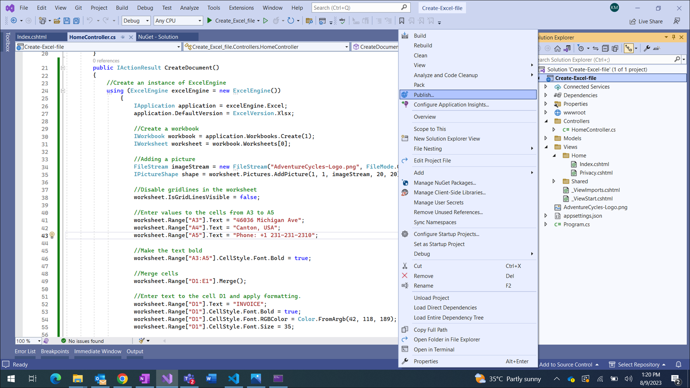

Step 2: Select the publish target as **Azure**.

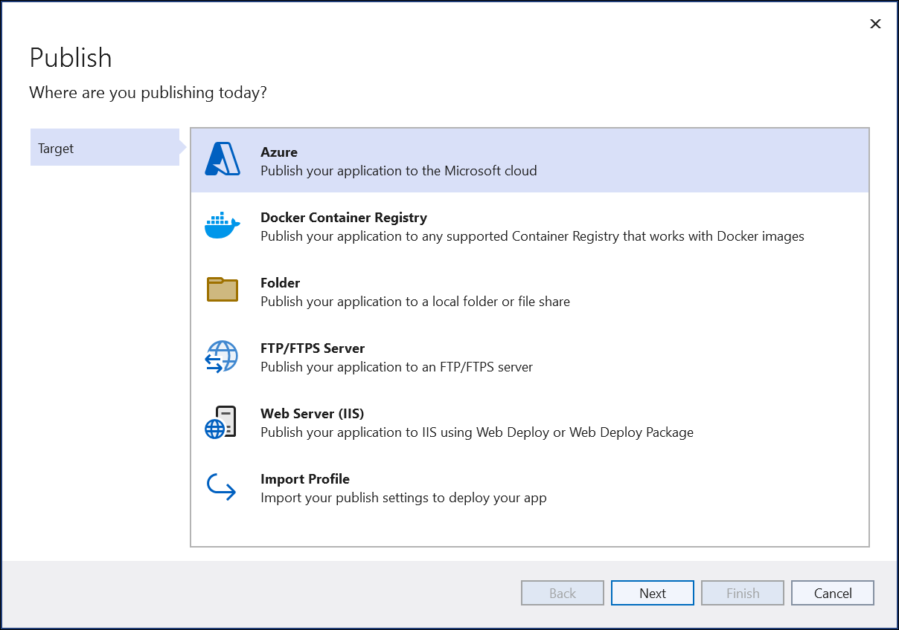

Step 3: Select the Specific target as **Azure App Service (Windows)**.

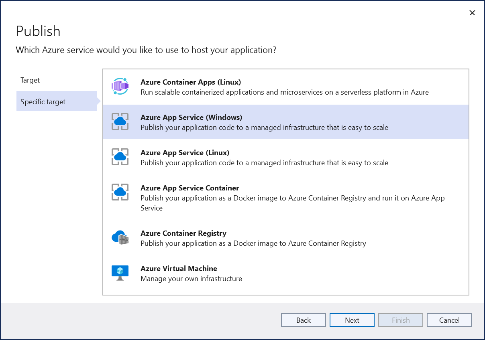

Step 4: To create a new app service, click **Create new** option.

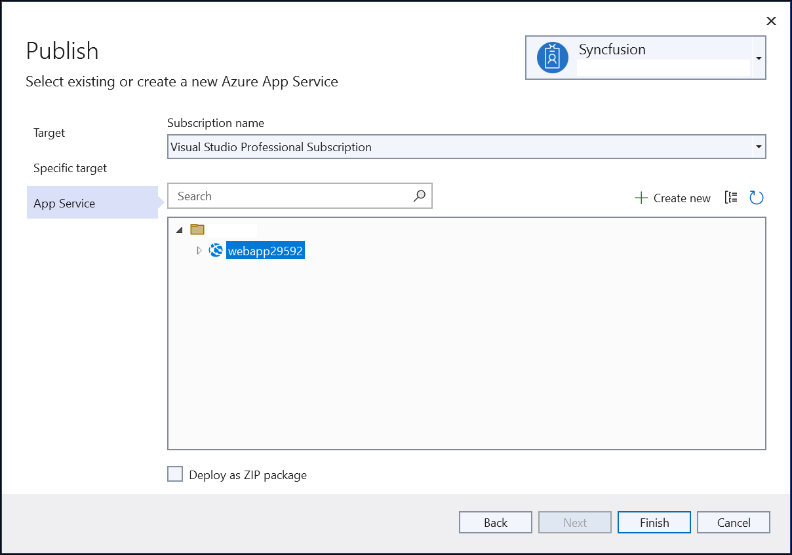

Step 5: Click the **Create** button to proceed with **App Service** creation.

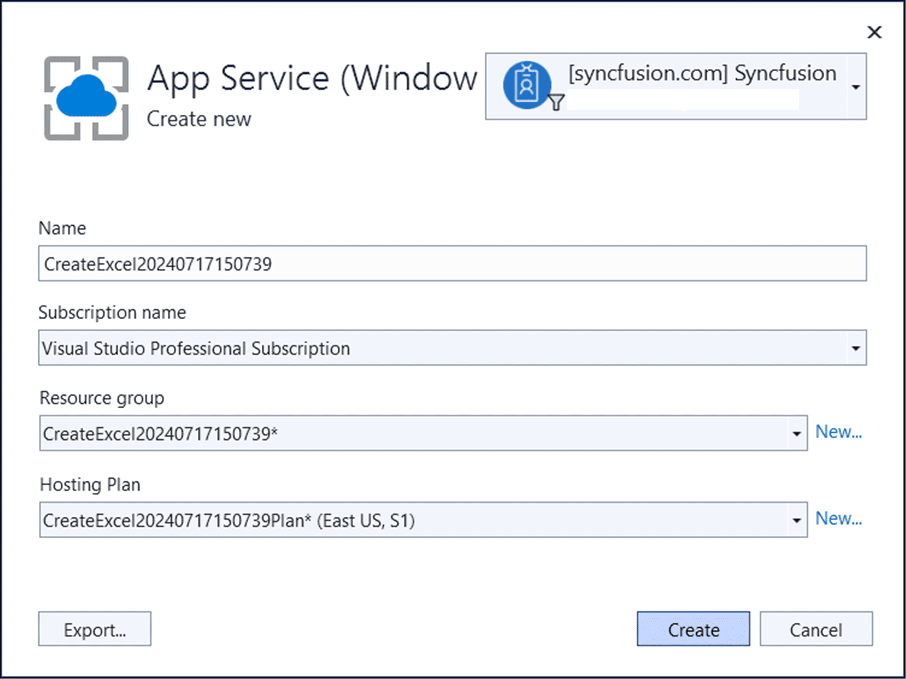

Step 6: Click the **Finish** button to finalize the **App Service** creation.

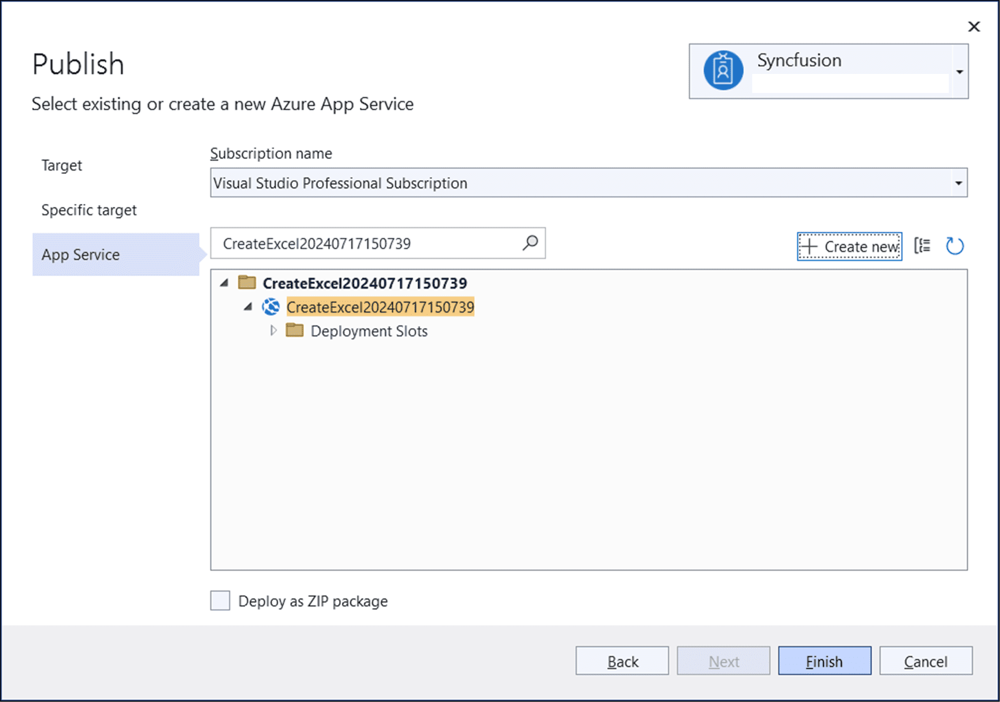

Step 7: Click **Close** button.

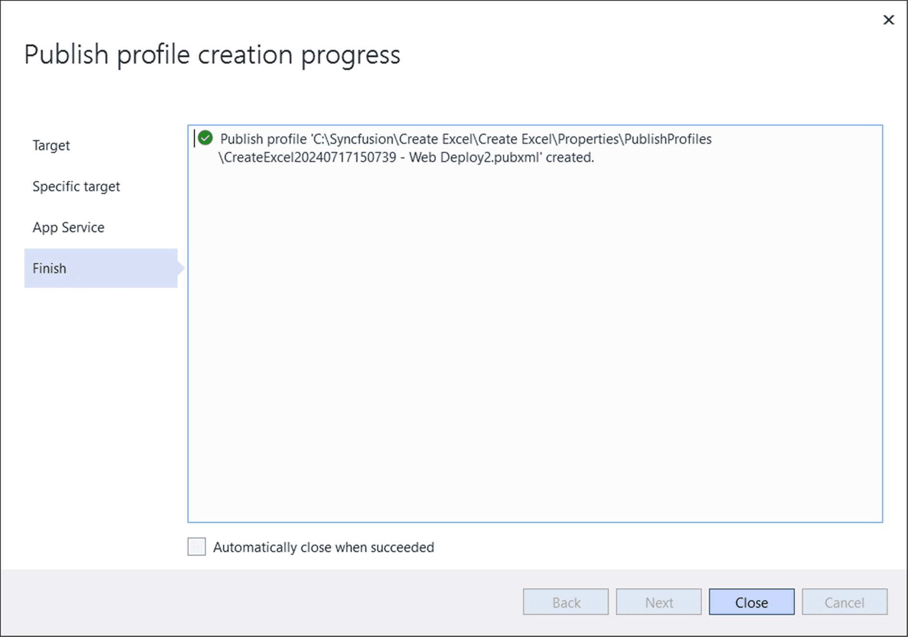

Step 8: Click the **Publish** button.

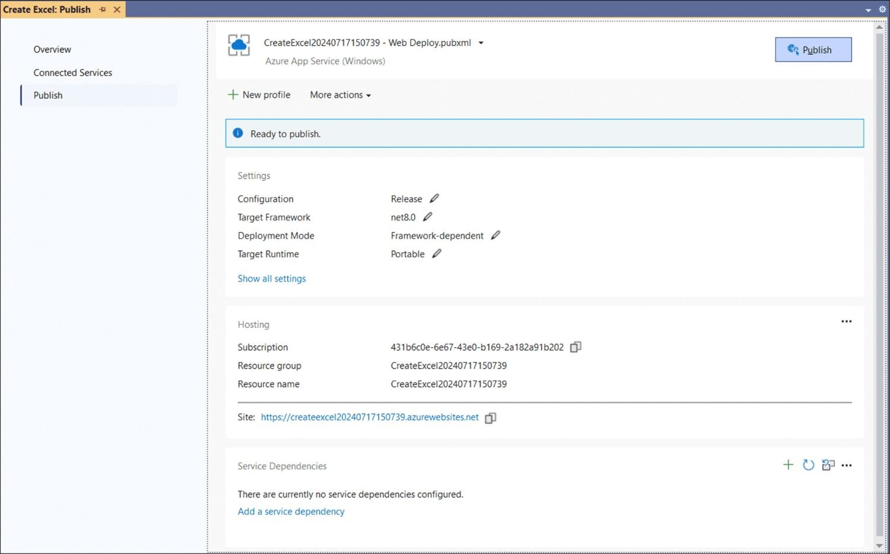

Step 9: Now, Publish has been succeeded.

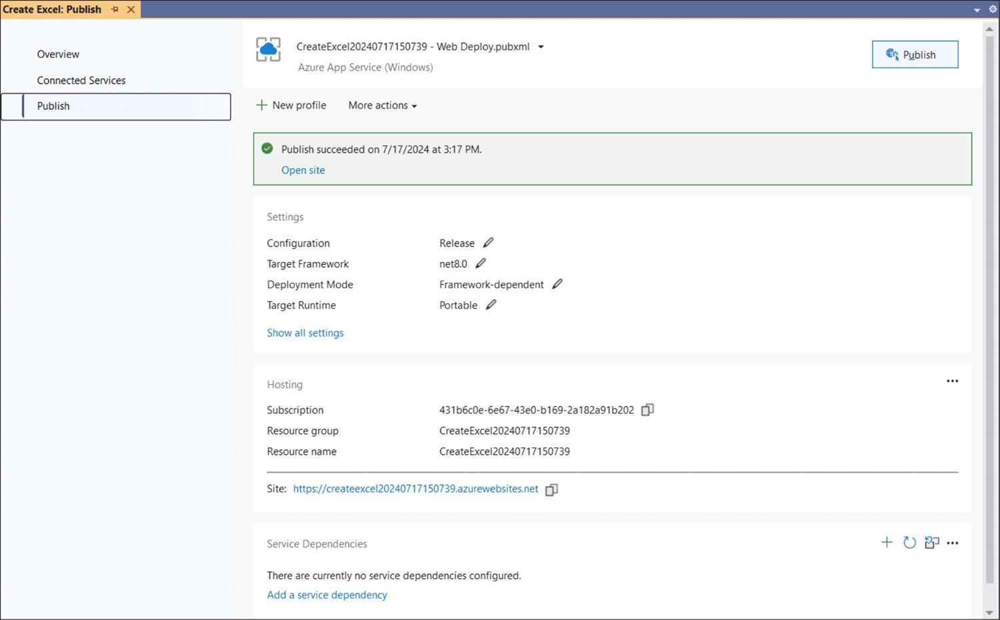

Step 10: Now, the published webpage will open in the browser. 

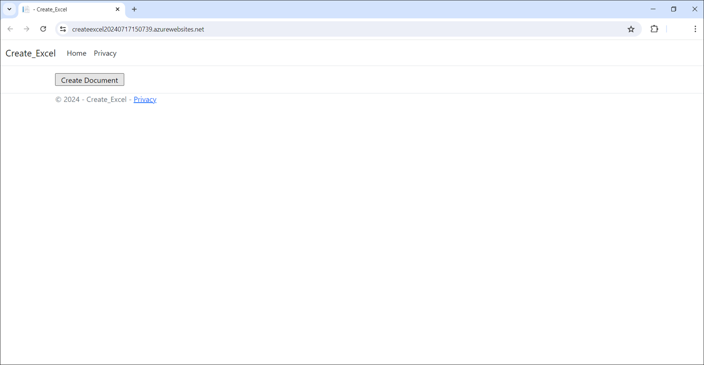

Step 11: Click **Create Document** to create a simple Excel document. You will get the output Excel document as follows.

A complete working example of how to create an Excel file in Azure App Service on Windows in C# is present on [this GitHub page](https://github.com/SyncfusionExamples/XlsIO-Examples/tree/master/Getting%20Started/ASP.NET%20Core/Create%20Excel).

## Read and Edit Excel file

The below code snippet illustrates how to read and edit an Excel file in Azure App Service on Windows.



//New instance of ExcelEngine is created 
//Equivalent to launching Microsoft Excel with no workbooks open
//Instantiate the spreadsheet creation engine
ExcelEngine excelEngine = new ExcelEngine();

//Instantiate the Excel application object
IApplication application = excelEngine.Excel;

//Assigns default application version
application.DefaultVersion = ExcelVersion.Xlsx;

//A existing workbook is opened.             
FileStream sampleFile = new FileStream("Sample.xlsx", FileMode.Open);
IWorkbook workbook = application.Workbooks.Open(sampleFile);

//Access first worksheet from the workbook.
IWorksheet worksheet = workbook.Worksheets[0];

//Set Text in cell A3.
worksheet.Range["A3"].Text ="Hello World";

//Access a cell value from Excel
var value = worksheet.Range["A1"].Value;

//Defining the ContentType for excel file.
string ContentType = "Application/msexcel";

//Define the file name.
string fileName = "Output.xlsx";

//Creating stream object.
MemoryStream stream = new MemoryStream();

//Saving the workbook to stream in XLSX format
workbook.SaveAs(stream);

stream.Position = 0;

//Closing the workbook.
workbook.Close();

//Dispose the Excel engine
excelEngine.Dispose();

//Creates a FileContentResult object by using the file contents, content type, and file name.
return File(stream, ContentType, fileName);



A complete working example of how to read and edit an Excel file in Azure App Service on Windows in C# is present on [this GitHub page](https://github.com/SyncfusionExamples/XlsIO-Examples/tree/master/Getting%20Started/ASP.NET%20Core/Create%20Excel).

Click [here](https://www.syncfusion.com/document-processing/excel-framework/net-core) to explore the rich set of Syncfusion Excel library (XlsIO) features.

An online sample link to [create an Excel document](https://ej2.syncfusion.com/aspnetcore/Excel/Create#/material3) in ASP.NET Core.