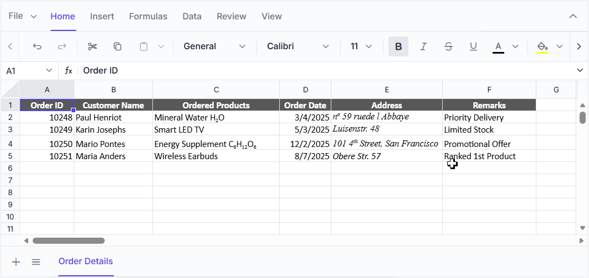

# Formatting in ASP.NET Core Spreadsheet

Formatting options make data easier to view and understand. The Spreadsheet supports the following formatting options:

* Number Formatting
* Text Formatting
* Cell Formatting
* Conditional Formatting
* Rich Text Formatting

## Number Formatting

Number formatting controls how data is displayed in the Spreadsheet. Use the [`allowNumberFormatting`](https://help.syncfusion.com/cr/aspnetcore-js2/Syncfusion.EJ2.Spreadsheet.Spreadsheet.html#Syncfusion_EJ2_Spreadsheet_Spreadsheet_AllowNumberFormatting) property to enable or disable the number formatting option in the Spreadsheet. The Spreadsheet supports the following number formats:

| Types | Format Code | Format ID |
|---------|---------|---------|
| General (default) | NA | 0 |
| Number | `0.00` | 2 |
| Currency | `$#,##0.00` | NA |
| Accounting | `_($* #,##0.00_);_($* (#,##0.00);_($* "-"??_);_(@_)` | 44 |
| ShortDate | `m/d/yyyy` | 14 |
| LongDate | `dddd, mmmm dd, yyyy` | NA |
| Time | `h:mm:ss AM/PM` | NA |
| Percentage | `0.00%` | 10 |
| Fraction | `# ?/?` | 12 |
| Scientific |`0.00E+00`  | 11 |
| Text | `@` | 49 |

Number formatting can be applied in following ways,
* Using the `format` property in `cell`, you can set the desired format to each cell at initial load.
* Use the `numberFormat` method to apply a number format to a cell or range of cells.
* Selecting the number format option from ribbon toolbar.

### Custom Number Formatting

The Spreadsheet supports custom number formats for displaying numbers, dates, times, percentages, and currency values. If the pre-defined number formats do not meet your needs, you can set your own custom formats using custom number formats dialog or `numberFormat` method.

The different types of custom number format populated in the custom number format dialog are,

| Type | Format Code | Format ID |
|-------|---------|---------|
| General(default) | NA | 0 |
| Number | `0` | 1 |
| Number | `0.00` | 2 |
| Number | `#,##0` | 3 |
| Number | `#,##0.00` | 4 |
| Number | `#,##0_);(#,##0)` | 37 |
| Number | `#,##0_);[Red](#,##0)` | 38 |
| Number | `#,##0.00_);(#,##0.00)` | 39 |
| Number | `#,##0.00_);[Red](#,##0.00)` | 40 |
| Currency | `$#,##0_);($#,##0)` | 5 |
| Currency | `$#,##0_);[Red]($#,##0)` | 6 |
| Currency | `$#,##0.00_);($#,##0.00)` | 7 |
| Currency | `$#,##0.00_);[Red]($#,##0.00)` | 8 |
| Percentage | `0%` | 9 |
| Percentage | `0.00%` | 10 |
| Scientific |`0.00E+00`  | 11 |
| Scientific |`##0.0E+0`  | 48 |
| Fraction | `# ?/?` | 12 |
| Fraction | `# ??/??` | 13 |
| ShortDate | `m/d/yyyy` | 14 |
| Custom | `d-mmm-yy` | 15 |
| Custom | `d-mmm` | 16 |
| Custom | `mmm-yy` | 17 |
| Custom | `h:mm AM/PM` | 18 |
| Custom | `h:mm:ss AM/PM` | 19 |
| Custom | `h:mm` | 20 |
| Custom | `h:mm:ss` | 21 |
| Custom | `m/d/yyyy h:mm` | 22 |
| Custom | `mm:ss` | 45 |
| Custom | `mm:ss.0` | 47 |
| Text | `@` | 49 |
| Custom | `[h]:mm:ss` | 46 |
| Accounting | `_($* #,##0_);_($* (#,##0);_($* "-"_);_(@_)` | 42 |
| Accounting | `_(* #,##0_);_(* (#,##0);_(* "-"_);_(@_)` | 41 |
| Accounting | `_($* #,##0.00_);_($* (#,##0.00);_($* "-"??_);_(@_)` | 44 |
| Accounting | `_(* #,##0.00_);_(* (#,##0.00);_(* "-"??_);_(@_)` | 43 |

Custom number formatting can be applied in the following ways:
* Use the `numberFormat` method to apply a custom number format to a cell or range of cells.
* Select the required cells, open the number format options from the Ribbon, and choose **Custom Number Format**. Select an available format or enter a custom format code, and then click **Apply**.

The following code example shows the number formatting in cell data.










After running the sample, verify that the selected cells display values using the configured number format.

## Configure culture-based custom formats

Previously, the custom format dialog always displayed formats using the English settings (group separator, decimal separator, and currency symbol were not updated based on the applied culture). Starting from version `27.1.*`, the custom format dialog will now display formats according to the applied culture. You can select a culture-based number format from the dialog or enter your own format using the culture-specific decimal separator, group separator, and currency symbol. Then, click "Apply" to apply the culture-specific custom format to the selected cells.

The spreadsheet allows customization of formats in the custom format dialog using the `configureLocalizedFormat` method. In this method, you need to pass a collection containing the default number format IDs and their corresponding format codes as arguments. Based on this collection, the custom format dialog will display the customized formats. You can refer to the [default number format IDs](https://learn.microsoft.com/en-us/dotnet/api/documentformat.openxml.spreadsheet.numberingformat?view=openxml-2.8.1) from the Excel built-in number format reference.

Compared to Excel, the date, time, currency, and accounting formats vary across different cultures. For example, when an Excel file with the date format `'m/d/yyyy'` is imported in the `en-US` culture, the spreadsheet displays the date in that format. However, when the same file is imported in the German culture, the date format changes to `'dd.MM.yyyy'`, which is the default for that region. The default number format ID for the date is 14. To customize the date format based on the culture, you should map the default number format ID to the appropriate culture-specific format code, like this: `{ id: 14, code: 'dd.MM.yyyy' }` in the `configureLocalizedFormat` method.

> The format code should use the default decimal separator (.) and group separator (,).

Obtain the Spreadsheet instance after the component is rendered, and pass it with the collection of localized format codes to the `configureLocalizedFormat` method. The `spreadsheet` parameter represents the rendered Spreadsheet instance, and the `deLocaleFormats` parameter contains the format IDs and their corresponding culture-specific format codes.

The code below illustrates how culture-based format codes are mapped to their corresponding number format ID for the `German` culture.

```csharp
List<object> deLocaleFormats = new List<object>()
{
    new { id = 37, code = @"#,##0;-#,##0" },
    new { id = 38, code = @"#,##0;[Red]-#,##0" },
    new { id = 39, code = @"#,##0.00;-#,##0.00" },
    new { id = 40, code = @"#,##0.00;[Red]-#,##0.00" },
    new { id = 5, code = @"#,##0 ""€"";-#,##0 ""€""" },
    new { id = 6, code = @"#,##0 ""€"";[Red]-#,##0 ""€""" },
    new { id = 7, code = @"#,##0.00 ""€"";-#,##0.00 ""€""" },
    new { id = 8, code = @"#,##0.00 ""€"";[Red]-#,##0.00 ""€""" },
    new { id = 41, code = @"_-* #,##0_-;-* #,##0_-;_-* ""-""_-;_-@_-" },
    new { id = 42, code = @"_-* #,##0 ""€""_-;-* #,##0 ""€""_-;_-* ""-"" ""€""_-;_-@_-" },
    new { id = 43, code = @"_-* #,##0.00_-;-* #,##0.00_-;_-* ""-""??_-;_-@_-" },
    new { id = 44, code = @"_-* #,##0.00 ""€""_-;-* #,##0.00 ""€""_-;_-* ""-""?? ""€""_-;_-@_-" },
    new { id = 14, code = @"dd.MM.yyyy" },
    new { id = 15, code = @"dd. MMM yy" },
    new { id = 16, code = @"dd. MMM" },
    new { id = 17, code = @"MMM yy" },
    new { id = 20, code = @"hh:mm" },
    new { id = 21, code = @"hh:mm:ss" },
    new { id = 22, code = @"dd.MM.yyyy hh:mm" }
};
ViewBag.deLocaleFormats = deLocaleFormats;

<script>
    var deLocaleFormats = @Html.Raw(Json.Serialize(deLocaleFormats));
    // Mapping culture-based number formats for the "de" culture: The "spreadsheet" parameter is an instance of the spreadsheet component, and the "deLocaleFormats" parameter is an array containing format codes and their corresponding format IDs for the "de" culture.
    ej.spreadsheet.configureLocalizedFormat(spreadsheet, deLocaleFormats);
</script>
```

To configure culture-based custom formats:

1. Create a collection containing the default number format IDs and their corresponding culture-specific format codes.
2. Pass the collection from the controller to the razor view.
3. Obtain the rendered Spreadsheet instance.
4. Pass the Spreadsheet instance and the format collection to the `configureLocalizedFormat` method.
5. Open the custom number format dialog and verify that the culture-specific formats are displayed.

The following code example demonstrates how to configure culture-based formats for different cultures in the spreadsheet.










After running the sample, open the custom number format dialog and verify that the configured culture-specific number formats are displayed.

## Text and cell formatting

Text and cell formatting improve the appearance of cells and helps highlight a specific cell or range in a workbook. You can apply formats like font size, font family, font color, text alignment, border etc. to a cell or range of cells. Use the [`allowCellFormatting`](https://help.syncfusion.com/cr/aspnetcore-js2/Syncfusion.EJ2.Spreadsheet.Spreadsheet.html#Syncfusion_EJ2_Spreadsheet_Spreadsheet_AllowCellFormatting) property to enable or disable the text and cell formatting option in Spreadsheet. You can apply text and cell formatting in the following ways:
* Using the `style` property, you can set formats to each cell at initial load.
* Using the `cellFormat` method, you can set formats to a cell or range of cells.
* You can also apply by clicking the desired format option from the ribbon toolbar.

### Fonts

Various font formats supported in the spreadsheet are font-family, font-size, bold, italic, strike-through, underline and font color.

### Text Alignment

You can align text in a cell either vertically or horizontally using the  `textAlign` and `verticalAlign` property.

### Indents

To enhance the appearance of text in a cell, you can change the indentation of a cell content using `textIndent` property.

### Fill color

To highlight cell or range of cells from whole workbook you can apply background color for a cell using `backgroundColor` property.

### Borders

You can add borders around a cell or range of cells to define a section of worksheet or a table. The different types of border options available in the spreadsheet are,

| Types | Actions |
|-------|---------|
| Top Border | Specifies the top border of a cell or range of cells.|
| Left Border | Specifies the left border of a cell or range of cells.|
| Right Border | Specifies the right border of a cell or range of cells.|
| Bottom Border | Specifies the bottom border of a cell or range of cells.|
| No Border | Used to clear the border from a cell or range of cells.|
| All Border | Specifies all border of a cell or range of cells.|
| Horizontal Border | Specifies the top and bottom border of a cell or range of cells.|
| Vertical Border | Specifies the left and right border of a cell or range of cells.|
| Outside Border | Specifies the outside border of a range of cells.|
| Inside Border | Specifies the inside border of a range of cells.|

You can also change the color, size, and style of the border. The size and style supported in the spreadsheet are,

| Types | Actions |
|-------|---------|
| Thin | Specifies the `1px` border size (default).|
| Medium | Specifies the `2px` border size.|
| Thick | Specifies the `3px` border size.|
| Solid | Used to create the `solid` border (default).|
| Dashed | Used to create the `dashed` border.|
| Dotted | Used to create the `dotted` border.|
| Double | Used to create the `double` border.|

Borders can be applied in the following ways,
* Using the  `border`, `borderLeft`, `borderRight`, `borderBottom` properties, you can set the desired border to each cell at initial load.
* Using the `setBorder` method, you can set various border options to a cell or range of cells.
* Selecting the border options from ribbon toolbar.

The following code example shows the style formatting in text and cells of the spreadsheet.










## Text Overflow

When cell content exceeds the column width, the Spreadsheet automatically displays the overflowing text across adjacent empty cells. This preserves readability without altering the column width.

Text overflows only into adjacent empty cells. If a neighboring cell contains a value, formula, or merged range, the text is clipped at the cell boundary.

Text overflow is supported for plain text, rich text, hyperlinks, and RTL (right-to-left) layouts, and updates automatically whenever cell content, formatting, or column widths change.

The following code example demonstrates text overflow in the Spreadsheet.











### Limitations of Formatting

The following features are not supported in Formatting:

* Insert row/column between the formatting applied cells.
* Formatting support for row/column.
* Text overflow across freeze pane boundaries and for right-aligned cells.

## Conditional Formatting

Conditional formatting helps you to format a cell or range of cells based on the conditions applied. You can enable or disable conditional formats by using the `allowConditionalFormat` property.

N> * The default value for the `allowConditionalFormat` property is `true`.

### Apply Conditional Formatting

You can apply conditional formatting by using one of the following ways,

* Select the conditional formatting icon in the Ribbon toolbar under the Home Tab.
* Using the `conditionalFormat` method to define the condition.
* Using the `conditionalFormats` in sheets model.

Conditional formatting has the following types in the spreadsheet,

### Highlight cells rules

Highlight cells rules option in the conditional formatting enables you to highlight cells with a preset color depending on the cell's value.

The following options can be given for the highlight cells rules as type,

N>* 'GreaterThan', 'LessThan', 'Between', 'EqualTo', 'ContainsText', 'DateOccur', 'Duplicate', 'Unique'.

The following preset colors can be used for formatting styles,

>* `"RedFT"` - Light Red Fill with Dark Red Text,
>* `"YellowFT"` - Yellow Fill with Dark Yellow Text,
>* `"GreenFT"` - Green Fill with Dark Green Text,
>* `"RedF"` - Red Fill,
>* `"RedT"` - Red Text.

### Top bottom rules

Top bottom rules option in the conditional formatting allows you to apply formatting to the cells that satisfy a statistical condition with other cells in the range.

The following options can be given for the top bottom rules as type,

N>* 'Top10Items', 'Bottom10Items', 'Top10Percentage', 'Bottom10Percentage', 'BelowAverage', 'AboveAverage'.

### Data Bars

You can apply data bars to represent the data graphically inside a cell. The longest bar represents the highest value and the shorter bars represent the smaller values.

The following options can be given for the data bars as type,

N>* 'BlueDataBar', 'GreenDataBar', 'RedDataBar', 'OrangeDataBar', 'LightBlueDataBar', 'PurpleDataBar'.

### Color Scales

Using color scales, you can format your cells with two or three colors, where different color shades represent the different cell values. In the Green-Yellow-Red(GYR) Color Scale, the cell that holds the minimum value is colored as red. The cell that holds the median is colored as yellow, and the cell that holds the maximum value is colored as green. All other cells are colored proportionally.

The following options can be given for the color scales as type,

N>* 'GYRColorScale', 'RYGColorScale', 'GWRColorScale', 'RWGColorScale', 'BWRColorScale', 'RWBColorScale', 'WRColorScale', 'RWColorScale', 'GWColorScale', 'WGColorScale', 'GYColorScale', 'YGColorScale'.

### Icon Sets

Icon sets will help you to visually represent your data with icons. Every icon represents a range of values. In the Three Arrows(colored) icon, the green arrow icon represents the values greater than 67%, the yellow arrow icon represents the values between 33% to 67%, and the red arrow icon represents the values less than 33%.

The following options can be given for the icon sets as type,

N>* 'ThreeArrows', 'ThreeArrowsGray', 'FourArrowsGray', 'FourArrows', 'FiveArrowsGray', 'FiveArrows', 'ThreeTrafficLights1', 'ThreeTrafficLights2', 'ThreeSigns', 'FourTrafficLights', 'FourRedToBlack', 'ThreeSymbols', 'ThreeSymbols2', 'ThreeFlags', 'FourRating', 'FiveQuarters', 'FiveRating', 'ThreeTriangles', 'ThreeStars', 'FiveBoxes'.

### Formula-based Conditional Format

Formula-based Conditional Formatting allows you to apply custom formatting rules using formulas through the `conditionalFormats` property in the sheet model or the [`conditionalFormat()`](https://ej2.syncfusion.com/documentation/api/spreadsheet#conditionalformat) method.

When the specified formula rule evaluates to `TRUE`, the defined formatting is automatically applied to the target cells. This allows you to create advanced highlighting scenarios based on values from other cells or ranges within the worksheet.

### Custom Format

Using custom format for conditional formatting you can set cell styles like color, background color, font style, font weight and underline.

In the MAY and JUN columns, we have applied conditional formatting custom format.

N> * In the Conditional format, custom format supported for Highlight cells rules and Top bottom rules.

### Clear Rules

You can clear the defined rules by using one of the following ways,

* Using the “Clear Rules” option in the Conditional Formatting button of HOME Tab in the ribbon to clear the rule from selected cells.
* Using the `clearConditionalFormat` method to clear the defined rules.











### Limitations of Conditional formatting

The following features have some limitations in Conditional Formatting:

* Insert row/column between the conditional formatting.
* User Interface support for formula-based conditional formatting.
* Copy and paste the conditional formatting applied cells.
* Custom rule support.

## Rich Text Formatting

Rich text formatting allows you to apply different styles to specific portions of text within a single cell to improve readability and presentation. Each text segment can have its own formatting, enabling you to combine multiple styles within a single cell.

In the **ASP.NET Core Spreadsheet**, rich text formatting is supported through the `richText` property of the cell model.

Each `richText` segment contains:

- `text` – Specifies the content of the segment  
- `style` – Defines formatting using the cell style model  

Rich text formatting supports the following style options through the `style` property of each `richText` segment:

## Font Family

You can change the font family of individual rich text segments using the `fontFamily` property. This allows different portions of text within the same cell to be displayed using different typefaces such as `Calibri`, `Arial`, and `Georgia`.

## Font Size

You can customize the size of individual rich text segments using the `fontSize` property to emphasize specific content within a cell.

## Font Weight

You can apply font weight formatting using the `fontWeight` property. This is typically used to display specific text segments in bold.

## Font Style

You can apply font style formatting using the `fontStyle` property. This property supports values such as `normal` and `italic`.

## Text Decoration

You can apply text decorations to individual rich text segments using the `textDecoration` property. Supported decorations include `underline` and `line-through`.

## Font Color

You can customize the color of specific text segments using the `color` property to improve visibility or highlight important information.

## Subscript and Superscript

You can apply subscript and superscript formatting to individual text segments using the `verticalAlign` property.

- Use `verticalAlign: 'sub'` to display text as subscript.
- Use `verticalAlign: 'super'` to display text as superscript.

### How to Apply Rich Text Formatting

You can apply rich text formatting in following ways:

1. Select the desired portion of text within a cell, then use the available formatting options in the ribbon such as font family, font size, bold, italic, underline, strikethrough, font color, subscript, or superscript.



2. You can define the `richText` property directly while initializing the Spreadsheet. This is useful when you want the formatting to be applied when the data is loaded.

```csharp
cells: new List<object>()
{
    new {
        value: "Annual Sales Report 2026 Highlights",
        richText = new List<object>()
        {
            new { text = 'Annual Sales Report ', style = new { fontWeight: 'bold' } },
            new { text = '2026', style = new { color: '#0078D4' } },
            new { text = ' Highlights', style = new { textDecoration: 'underline' } },
            new { text = ' (Draft)', style = new { fontStyle: 'italic' } }
        }
    }
}
```

3. You can also apply formatting dynamically using the `updateCell` method.

```js
    spreadsheet.updateCell({
        richText: [
            { text: 'Premium Membership ', style: { fontWeight: 'bold', color: '#2E7D32' } },
            { text: 'valid until ', style: { fontStyle: 'italic' } },
            { text: '31', style: { textDecoration: 'underline' } },
            { text: 'st', style: { verticalAlign: 'super' } },
            { text: ' Dec 2026' }
        ]
    }, 'A5');
```

The following code example shows how to apply multiple rich text formats in cells of the Spreadsheet.










## Limitations
* **Edit mode requirement:** Formatting can be applied only while the cell is in edit mode. Selecting text outside of edit mode does not support subscript or superscript formatting.

## See Also

* [Rows and columns](./rows-and-columns)
* [Hyperlink](./link)
* [Sorting](./sort)
* [Filtering](./filter)
* [`Ribbon customization`](./ribbon#ribbon-customization)
