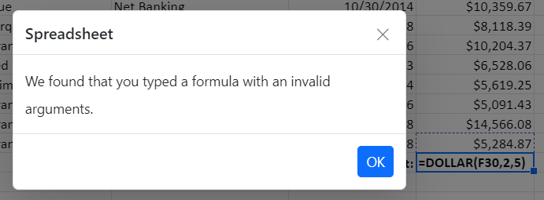

# Formulas in ASP.NET Core Spreadsheet

Formulas are used to calculate data in a worksheet. A formula can reference cells in the same worksheet or in other worksheets.

## Usage

You can set a formula for a cell in the following ways:

* Use the `formula` property of a cell to set a formula or expression during the initial rendering.
* Set the formula or expression through data binding.
* Set a formula by [`editing`](./editing) a cell.
* Using the `updateCell` method, you can set or update the cell formula.

## Culture-Based Argument Separator

Previously, formulas in imported culture-based Excel files were not calculated correctly because culture-based argument separators and formatted numeric values were not supported as formula arguments. Starting with version 25.1.35, the Spreadsheet supports importing culture-based Excel files with these values.

> Before importing culture-based Excel files, ensure that the Spreadsheet control is rendered with the corresponding culture. Additionally, launch the import/export services with the same culture to ensure compatibility.

When loading spreadsheet data with culture-based formula argument separators using cell data binding, local/remote data, or JSON, ensure to set the [listSeparator](https://help.syncfusion.com/cr/aspnetcore-js2/syncfusion.ej2.spreadsheet.spreadsheet.html#Syncfusion_EJ2_Spreadsheet_Spreadsheet_ListSeparator) property value as the culture-based list separator from your end. Additionally, note that when importing an Excel file, the [listSeparator](https://help.syncfusion.com/cr/aspnetcore-js2/syncfusion.ej2.spreadsheet.spreadsheet.html#Syncfusion_EJ2_Spreadsheet_Spreadsheet_ListSeparator) property will be updated based on the culture of the launched import/export service.

In the example below, the Spreadsheet control is rendered with the `German culture` [`de`]. Additionally, you can find references on how to set the culture-based argument separator and culture-based formatted numeric value as arguments to the formulas.










After running the sample, verify that formulas containing culture-specific argument separators and formatted numeric values are calculated correctly.

## Create User Defined Functions / Custom Functions

The Spreadsheet includes a number of built-in formulas. For your convenience, a list of supported formulas can be found [here](https://help.syncfusion.com/document-processing/excel/spreadsheet/asp-net-core/formulas#supported-formulas).

You can define and use a custom formula that is not built into the Spreadsheet by using the `addCustomFunction` method. A custom formula should return a single value. If a user-defined/custom formula returns an array, it will be time-consuming to update adjacent cell values.

To create and use a custom function:

1. Define a function that accepts the required arguments and returns a single value.
2. Register the function using the `addCustomFunction` method.
3. Use the registered function in a cell formula.
4. Verify that the target cell displays the expected result.

The following code example shows an unsupported formula in the spreadsheet.










After running the sample, verify that the registered custom function returns the expected value in the target cell.

## Compute a formula or expression

Use the `computeExpression` method to directly evaluate a built-in or custom formula or expression. This method works with both built-in and custom formulas.

The following code example shows how to use `computeExpression` method in the spreadsheet.










After running the sample, verify that the formula or expression is evaluated and returns the expected result.

## Formula bar

The formula bar allows you to enter or edit cell data more easily. By default, the formula bar is enabled in the Spreadsheet. Use the [`showFormulaBar`](https://help.syncfusion.com/cr/aspnetcore-js2/Syncfusion.EJ2.Spreadsheet.Spreadsheet.html#Syncfusion_EJ2_Spreadsheet_Spreadsheet_ShowFormulaBar) property to enable or disable the formula bar.

## Named Ranges

You can define a meaningful name for a cell range and use it in the formula for calculation. It makes your formula much easier to understand and maintain. You can add named ranges to the Spreadsheet in the following ways,

* Using the [`definedNames`](https://help.syncfusion.com/cr/aspnetcore-js2/Syncfusion.EJ2.Spreadsheet.Spreadsheet.html#Syncfusion_EJ2_Spreadsheet_Spreadsheet_DefinedNames) collection, you can add multiple named ranges at initial load.
* Use the `addDefinedName` method to add a named range dynamically.
* You can remove an added named range dynamically using the `removeDefinedName` method.
* Select the range of cells, and then enter the name for the selected range in the name box.

The following code example shows the usage of named ranges support.










## Calculation Mode

The Spreadsheet provides a `Calculation Mode` feature like the calculation options in online Excel. This feature allows you to control when and how formulas are recalculated in the spreadsheet. The available modes are:

* `Automatic`: Formulas are recalculated instantly whenever a change occurs in the dependent cells.
* `Manual`: Formulas are recalculated only when triggered explicitly by the user using options like `Calculate Sheet` or `Calculate Workbook`.

You can configure the calculate mode using the [`calculationMode`](https://help.syncfusion.com/cr/aspnetcore-js2/Syncfusion.EJ2.Spreadsheet.Spreadsheet.html#Syncfusion_EJ2_Spreadsheet_Spreadsheet_CalculationMode) property of the Spreadsheet. These modes offer flexibility to balance real-time updates and performance optimization.

### Automatic Mode

In Automatic Mode, formulas are recalculated instantly whenever a dependent cell is modified. This mode is perfect for scenarios where real-time updates are essential, ensuring that users see the latest results without additional actions.

For example, consider a spreadsheet where cell `C1` contains the formula `=A1+B1`. When the value in `A1` or `B1` changes, `C1` updates immediately without requiring any user intervention. You can enable this mode by setting the [`calculationMode`](https://help.syncfusion.com/cr/aspnetcore-js2/Syncfusion.EJ2.Spreadsheet.Spreadsheet.html#Syncfusion_EJ2_Spreadsheet_Spreadsheet_CalculationMode) property to `Automatic`.

The following code example demonstrates how to set the Automatic calculation mode in a Spreadsheet.










After running the sample, modify a dependent cell and verify that the formula result is recalculated automatically.

### Manual Mode

In Manual Mode, formulas are not recalculated automatically when cell values are modified. Instead, recalculations must be triggered explicitly. This mode is ideal for scenarios where performance optimization is a priority, such as working with large datasets or computationally intensive formulas.

For example, imagine a spreadsheet where cell `C1` contains the formula `=A1+B1`. When the value in `A1` or `B1` changes, the value in `C1` will not update automatically. Instead, the recalculation must be initiated manually using either the `Calculate Sheet` or `Calculate Workbook` option. To manually initiate recalculation, use one of the following options:

* `Calculate Sheet`: Recalculates formulas for the active sheet only.
* `Calculate Workbook`: Recalculates formulas across all sheets in the workbook.

The following code example demonstrates how to set the Manual calculation mode in a Spreadsheet.










After running the sample, modify a dependent cell and verify that the formula result remains unchanged until **Calculate Sheet** or **Calculate Workbook** is selected.

## Built-in Formulas and Functions in ASP.NET Core Spreadsheet

The Spreadsheet component supports a comprehensive set of built-in formulas organized by category. These formulas can be used to perform calculations, analyze data, manipulate text, process dates and times, evaluate logical conditions, retrieve information, and work with financial, engineering, and database data.

### Math & Trigonometry

| Formula | Description |
|---------|-------------|
| ABS | Returns the value of a number without its sign. |
| ACOS | Returns the arccosine of a number. |
| ACOSH | Returns the inverse hyperbolic cosine of a number. |
| ASIN | Returns the arcsine of a number. |
| ASINH | Returns the inverse hyperbolic sine of a number. |
| ATAN | Returns the arctangent of a number. |
| ATAN2 | Returns the arctangent from x- and y-coordinates. |
| ATANH | Returns the inverse hyperbolic tangent of a number. |
| CEILING | Rounds a number up to the nearest multiple of a given factor. |
| COMBIN | Returns the number of combinations for a given number of objects. |
| COS | Returns the cosine of an angle. |
| COSH | Returns the hyperbolic cosine of a number. |
| DECIMAL | Converts a text representation of a number in a given base into a decimal number. |
| DEGREES | Converts radians to degrees. |
| ECMA.CEILING | Rounds a number up, away from zero, to the nearest multiple of significance. |
| EVEN | Rounds a positive number up and negative number down to the nearest even integer. |
| EXP | Returns e raised to the power of the given number. |
| FACT | Returns the factorial of a number. |
| FACTDOUBLE | Returns the double factorial of a number. |
| FLOOR | Rounds a number down to the nearest multiple of a given factor. |
| GCD | Returns the greatest common divisor. |
| INT | Rounds a number down to the nearest integer. |
| ISO.CEILING | Rounds a number up to the nearest integer or multiple of significance. |
| LCM | Returns the least common multiple. |
| LN | Returns the natural logarithm of a number. |
| LOG | Returns the logarithm of a number to the base that you specify. |
| LOG10 | Returns the base-10 logarithm of a number. |
| MDETERM | Returns the matrix determinant of an array. |
| MINVERSE | Returns the matrix inverse of an array. |
| MMULT | Returns the matrix product of two arrays. |
| MOD | Returns a remainder after a number is divided by divisor. |
| MROUND | Returns a number rounded to the desired multiple. |
| MULTINOMIAL | Returns the multinomial of a set of numbers. |
| ODD | Rounds a positive number up and negative number down to the nearest odd integer. |
| PERMUT | Returns the number of permutations for a given number of objects. |
| PI | Returns the value of pi. |
| POWER | Returns the result of a number raised to power. |
| PRODUCT | Multiplies a series of numbers and/or cells. |
| QUOTIENT | Returns the integer portion of a division. |
| RADIANS | Converts degrees into radians. |
| RAND | Returns a random number between 0 and 1. |
| RANDBETWEEN | Returns a random integer based on specified values. |
| ROMAN | Converts an Arabic numeral to Roman, as text. |
| ROUND | Rounds a number to the specified number of digits. |
| ROUNDDOWN | Rounds a number down, toward zero. |
| ROUNDUP | Rounds a number up, away from zero. |
| SERIESSUM | Returns the sum of a power series. |
| SIGN | Returns the sign of a number. |
| SIN | Returns the sine of an angle. |
| SINH | Returns the hyperbolic sine of a number. |
| SQRT | Returns the square root of a positive number. |
| SQRTPI | Returns the square root of a number multiplied by pi. |
| SUMSQ | Returns the sum of the squares of the arguments. |
| SUMX2MY2 | Returns the sum of the difference of squares of corresponding values in two arrays. |
| SUMX2PY2 | Returns the sum of the sum of squares of corresponding values in two arrays. |
| SUMXMY2 | Returns the sum of squares of differences of corresponding values in two arrays. |
| TAN | Returns the tangent of an angle. |
| TANH | Returns the hyperbolic tangent of a number. |
| TRANSPOSE | Returns the transpose of an array. |
| TRUNC | Truncates a supplied number to a specified number of decimal places. |

### Statistical & Aggregate

| Formula | Description |
|---------|-------------|
| AVEDEV | Returns the average of the absolute deviations of data points from their mean. |
| AVERAGE | Calculates average for the series of numbers and/or cells excluding text. |
| AVERAGEA | Calculates the average for the cells evaluating TRUE as 1, text and FALSE as 0. |
| AVERAGEIF | Calculates the average of cells that meet a specified condition. |
| AVERAGEIFS | Calculates average for cells based on multiple specified conditions. |
| BETADIST | Returns the beta cumulative distribution function. |
| BETAINV | Returns the inverse of the beta cumulative distribution function. |
| BINOMDIST | Returns the individual term binomial distribution probability. |
| CHIDIST | Returns the one-tailed probability of the chi-squared distribution. |
| CHIINV | Returns the inverse of the one-tailed probability of the chi-squared distribution. |
| CHITEST | Returns the test for independence. |
| CONFIDENCE | Returns the confidence interval for a population mean. |
| CORREL | Returns the correlation coefficient between two data sets. |
| COUNT | Counts the cells that contain numeric values in a range. |
| COUNTA | Counts the cells that contain values in a range. |
| COUNTBLANK | Returns the number of empty cells in a specified range of cells. |
| COUNTIF | Counts the cells based on a specified condition. |
| COUNTIFS | Counts the cells based on multiple specified conditions. |
| COVAR | Returns covariance, the average of the products of paired deviations. |
| CRITBINOM | Returns the smallest value for which the cumulative binomial distribution is less than or equal to a criterion value. |
| DEVSQ | Returns the sum of squares of deviations. |
| EXPONDIST | Returns the exponential distribution. |
| FDIST | Returns the F probability distribution. |
| FINV | Returns the inverse of the F probability distribution. |
| FISHER | Returns the Fisher transformation. |
| FISHERINV | Returns the inverse of the Fisher transformation. |
| FORECAST | Returns a value along a linear trend. |
| FREQUENCY | Returns a frequency distribution as a vertical array (first bin when spill unavailable). |
| FTEST | Returns the result of an F-test. |
| GAMMADIST | Returns the gamma distribution. |
| GAMMAINV | Returns the inverse of the gamma cumulative distribution. |
| GAMMALN | Returns the natural logarithm of the gamma function. |
| GEOMEAN | Returns the geometric mean of a given array or range of positive data. |
| GROWTH | Returns y values along an exponential growth trend (first predicted value when spill unavailable). |
| HARMEAN | Returns the harmonic mean. |
| HYPGEOMDIST | Returns the hypergeometric distribution. |
| INTERCEPT | Calculates the point of the Y-intercept line via linear regression. |
| KURT | Returns the kurtosis of a data set. |
| LARGE | Returns the `k-th` largest value in a given array. |
| LINEST | Returns statistics that describe a linear trend (slope when spill unavailable). |
| LOGEST | Returns statistics that describe an exponential curve (first coefficient when spill unavailable). |
| LOGINV | Returns the inverse of the log-normal cumulative distribution. |
| LOGNORMDIST | Returns the cumulative log-normal distribution. |
| MAX | Returns the largest number of the given arguments. |
| MAXA | Returns the maximum value in a list of arguments, including text and logicals. |
| MAXIFS | Returns the maximum value among cells specified by criteria. |
| MEDIAN | Returns the median of the given set of numbers. |
| MIN | Returns the smallest number of the given arguments. |
| MINA | Returns the minimum value in a list of arguments, including text and logicals. |
| MINIFS | Returns the minimum value among cells specified by criteria. |
| MODE | Returns the most common value in a data set. |
| NEGBINOMDIST | Returns the negative binomial distribution. |
| NORMDIST | Returns the normal cumulative distribution. |
| NORMINV | Returns the inverse of the normal cumulative distribution. |
| NORMSDIST | Returns the standard normal cumulative distribution. |
| NORMSINV | Returns the inverse of the standard normal cumulative distribution. |
| PEARSON | Returns the Pearson product moment correlation coefficient. |
| PERCENTILE | Returns the k-th percentile of values in a range. |
| PERCENTRANK | Returns the percentage rank of a value in a data set. |
| POISSON | Returns the Poisson distribution. |
| PROB | Returns the probability that values in a range are between two limits. |
| QUARTILE | Returns the quartile of a data set. |
| RANK | Returns the rank of a number in a list of numbers. |
| RSQ | Returns the square of the Pearson product moment correlation coefficient based on data points. |
| SKEW | Returns the skewness of a distribution. |
| SLOPE | Returns the slope of the line from linear regression of the data points. |
| SMALL | Returns the `k-th` smallest value in a given array. |
| STANDARDIZE | Returns a normalized value from a distribution. |
| STDEV | Estimates standard deviation based on a sample. |
| STDEVA | Estimates standard deviation based on a sample, including text and logicals. |
| STDEVP | Calculates standard deviation based on the entire population. |
| STDEVPA | Calculates standard deviation based on the entire population, including text and logicals. |
| STEYX | Returns the standard error of the predicted y-value for each x in the regression. |
| SUBTOTAL | Returns subtotal for a range using the given function number. |
| SUM | Adds a series of numbers and/or cells. |
| SUMIF | Adds the cells based on a specified condition. |
| SUMIFS | Adds the cells based on multiple specified conditions. |
| SUMPRODUCT | Returns the sum of the products of corresponding arrays in given arrays. |
| TDIST | Returns the Student t-distribution. |
| TINV | Returns the inverse of the Student t-distribution. |
| TREND | Returns y values along a linear trend (first predicted value when spill unavailable). |
| TRIMMEAN | Returns the mean of the interior of a data set. |
| TTEST | Returns the probability associated with a Student t-test. |
| VAR | Estimates variance based on a sample. |
| VARA | Estimates variance based on a sample, including text and logicals. |
| VARP | Calculates variance based on the entire population. |
| VARPA | Calculates variance based on the entire population, including text and logicals. |
| WEIBULL | Returns the Weibull distribution. |
| ZTEST | Returns the one-tailed probability-value of a z-test. |

### Logical

| Formula | Description |
|---------|-------------|
| AND | Returns TRUE if all the arguments are TRUE, otherwise returns FALSE. |
| FALSE | Returns the logical value FALSE. |
| IF | Returns value based on the given expression. |
| IFERROR | Returns value if no error found; else returns specified value. |
| IFNA | Returns the value you specify if the expression resolves to #N/A; otherwise returns the result of the expression. |
| IFS | Returns value based on multiple given expressions. |
| NOT | Returns the inverse of a given logical expression. |
| OR | Returns TRUE if any of the arguments are TRUE, otherwise returns FALSE. |
| SWITCH | Evaluates an expression against a list of values and returns the result corresponding to the first matching value. |
| TRUE | Returns the logical value TRUE. |
| XOR | Returns a logical exclusive OR of all arguments. |

### Text

| Formula | Description |
|---------|-------------|
| ARRAYTOTEXT | Returns the text representation of an array. |
| ASC | Changes full-width characters to half-width. |
| CHAR | Returns the character from the specified number. |
| CLEAN | Removes all nonprintable characters from text. |
| CODE | Returns the numeric code for the first character in a given string. |
| CONCAT | Concatenates a list or a range of text strings. |
| CONCATENATE | Combines two or more strings together. |
| DOLLAR | Converts the number to currency formatted text. |
| EXACT | Checks whether two text strings are exactly the same and returns TRUE or FALSE. |
| FIND | Returns the position of a string within another string (case sensitive). |
| FINDB | Finds text within another string (byte-count alias of FIND). |
| FIXED | Formats a number as text with a fixed number of decimals. |
| LEFT | Returns the leftmost characters from a text value. |
| LEFTB | Returns the leftmost characters from a text value (byte count alias). |
| LEN | Returns the number of characters in a given string. |
| LENB | Returns the length of a text string (byte-count alias of LEN). |
| LOWER | Converts text to lowercase. |
| MID | Returns a specific number of characters from a text string starting at the position you specify. |
| MIDB | Returns characters from a text string (byte count alias). |
| PROPER | Converts text to proper case (first letter capitalized). |
| REPLACE | Replaces characters within text. |
| REPLACEB | Replaces characters within text (byte count alias). |
| REPT | Repeats text a given number of times. |
| RIGHT | Returns the rightmost characters from a text value. |
| RIGHTB | Returns the rightmost characters from a text value (byte count alias). |
| SEARCH | Finds one text value within another (not case-sensitive). |
| SEARCHB | Finds one text value within another (byte count alias). |
| SUBSTITUTE | Substitutes new text for old text in a text string. |
| T | Checks whether a value is text or not and returns the text. |
| TEXT | Converts the supplied value into text by using the user-specified format. |
| TEXTBEFORE | Returns text before a given character or string. |
| TEXTJOIN | Combines text from multiple ranges/strings with a delimiter. |
| TEXTSPLIT | Splits text into rows or columns using delimiters. |
| TRIM | Removes spaces from text except for single spaces between words. |
| UPPER | Converts text to uppercase. |
| USDOLLAR | Converts a number to text using currency format (US dollar). |
| VALUE | Converts a text argument to a number. |
| VALUETOTEXT | Returns text from any specified value. |

### Date & Time

| Formula | Description |
|---------|-------------|
| DATE | Returns the date based on given year, month, and day. |
| DATEDIF | Calculates the number of days, months, or years between two dates. |
| DATEVALUE | Converts a date string into date value. |
| DAY | Returns the day from the given date. |
| DAYS | Returns the number of days between two dates. |
| DAYS360 | Calculates the number of days between two dates based on a 360-day year. |
| EDATE | Returns a date with given number of months before or after the specified date. |
| EOMONTH | Returns the last day of the month that is a specified number of months before or after a start date. |
| HOUR | Returns the number of hours in a specified time string. |
| MINUTE | Returns the number of minutes in a specified time string. |
| MONTH | Returns the number of months in a specified date string. |
| NETWORKDAYS | Returns the number of whole workdays between two dates. |
| NETWORKDAYS.INTL | Returns workdays between dates for a custom weekend. |
| NOW | Returns the current date and time. |
| SECOND | Returns the number of seconds in a specified time string. |
| TIME | Converts hours, minutes, seconds to the time formatted text. |
| TIMEVALUE | Converts a time in the form of text to a serial number. |
| TODAY | Returns the current date. |
| WEEKDAY | Returns the day of the week for a specified date. |
| WEEKNUM | Converts a serial number to a number representing where the week falls numerically within a year. |
| WORKDAY | Returns the serial number of the date before or after a specified number of workdays. |
| WORKDAY.INTL | Returns the date before or after a number of workdays with a custom weekend. |
| YEAR | Converts a serial number to a year. |
| YEARFRAC | Returns the year fraction representing the number of whole days between start_date and end_date. |

### Lookup & Reference

| Formula | Description |
|---------|-------------|
| ADDRESS | Returns a cell reference as text, given specified row and column numbers. |
| AREAS | Returns the number of areas in a reference. |
| CHOOSE | Returns a value from list of values, based on index number. |
| CHOOSECOLS | Returns the specified columns from an array. |
| CHOOSEROWS | Returns the specified rows from an array. |
| COLUMN | Returns the column number of a reference. |
| COLUMNS | Returns the number of columns in a reference. |
| FORMULATEXT | Returns the formula in a cell as text. |
| HLOOKUP | Looks for a value in the top row of an array and returns a value in the same column from a specified row. |
| HYPERLINK | Creates a shortcut that opens a document on a network server, intranet, or Internet. |
| INDEX | Returns a value of the cell in a given range based on row and column number. |
| INDIRECT | Returns a reference indicated by a text value. |
| LOOKUP | Looks for a value in a one-row or one-column range, then returns a value from the same position in another range. |
| MATCH | Returns the relative position of a specified value in a given range. |
| OFFSET | Returns a reference offset from a given reference. |
| ROW | Returns the row number of a reference. |
| ROWS | Returns the number of rows in a reference. |
| SORT | Sorts the contents of a column, range, or array in ascending or descending order. |
| TOCOL | Returns the array in a single column (joined when spill is unavailable). |
| TOROW | Returns the array in a single row (joined when spill is unavailable). |
| UNIQUE | Returns unique values from a range or array. |
| VLOOKUP | Looks for a value in the first column of a lookup range and returns a corresponding value from a different column. |
| XLOOKUP | Searches a range for a match and returns the corresponding item. |
| XMATCH | Returns the relative position of an item in an array. |

### Financial

| Formula | Description |
|---------|-------------|
| ACCRINT | Returns the accrued interest for a security that pays periodic interest. |
| ACCRINTM | Returns the accrued interest for a security that pays interest at maturity. |
| AMORDEGRC | Returns the depreciation for each accounting period using a depreciation coefficient. |
| AMORLINC | Returns the depreciation for each accounting period. |
| COUPDAYBS | Returns the number of days from the beginning of the coupon period to the settlement date. |
| COUPDAYS | Returns the number of days in the coupon period that contains the settlement date. |
| COUPDAYSNC | Returns the number of days from the settlement date to the next coupon date. |
| COUPNCD | Returns the next coupon date after the settlement date. |
| COUPNUM | Returns the number of coupons payable between settlement and maturity. |
| COUPPCD | Returns the previous coupon date before the settlement date. |
| CUMIPMT | Returns the cumulative interest paid between two periods. |
| CUMPRINC | Returns the cumulative principal paid on a loan between two periods. |
| DB | Returns the depreciation of an asset for a period using fixed-declining balance. |
| DDB | Returns the depreciation of an asset for a period using double-declining balance. |
| DISC | Returns the discount rate for a security. |
| DOLLARDE | Converts a dollar price expressed as a fraction into a decimal number. |
| DOLLARFR | Converts a dollar price expressed as a decimal number into a fraction. |
| DURATION | Returns the annual duration of a security with periodic interest payments. |
| EFFECT | Returns the effective annual interest rate. |
| FV | Returns the future value of an investment. |
| FVSCHEDULE | Returns the future value of an initial principal after applying compound interest rates. |
| INTRATE | Returns the interest rate for a fully invested security. |
| IPMT | Returns the interest payment for an investment for a given period. |
| IRR | Returns the internal rate of return for a series of cash flows. |
| ISPMT | Returns the interest paid during a specific period of an investment. |
| MDURATION | Returns the modified Macauley duration for a security with an assumed par value of $100. |
| MIRR | Returns the modified internal rate of return for cash flows. |
| NOMINAL | Returns the nominal annual interest rate. |
| NPER | Returns the number of periods for an investment. |
| NPV | Returns the net present value of an investment based on periodic cash flows. |
| ODDFPRICE | Returns the price per $100 face value of a security with an odd first period. |
| ODDFYIELD | Returns the yield of a security with an odd first period. |
| ODDLPRICE | Returns the price per $100 face value of a security with an odd last period. |
| ODDLYIELD | Returns the yield of a security with an odd last period. |
| PMT | Returns the periodic payment for an annuity. |
| PPMT | Returns the payment on the principal for an investment for a given period. |
| PRICE | Returns the price per $100 face value of a security that pays periodic interest. |
| PRICEDISC | Returns the price per $100 face value of a discounted security. |
| PRICEMAT | Returns the price per $100 face value of a security that pays interest at maturity. |
| PV | Returns the present value of an investment. |
| RATE | Returns the interest rate per period of an annuity. |
| RECEIVED | Returns the amount received at maturity for a fully invested security. |
| SLN | Returns the straight-line depreciation of an asset for one period. |
| SYD | Returns the sum-of-years digits depreciation for a specified period. |
| TBILLEQ | Returns the bond-equivalent yield for a Treasury bill. |
| TBILLPRICE | Returns the price per $100 face value for a Treasury bill. |
| TBILLYIELD | Returns the yield for a Treasury bill. |
| VDB | Returns the depreciation of an asset for a period using the declining balance method. |
| XIRR | Returns the internal rate of return for a schedule of cash flows that is not necessarily periodic. |
| XNPV | Returns the net present value for a schedule of cash flows that is not necessarily periodic. |
| YIELD | Returns the yield on a security that pays periodic interest. |
| YIELDDISC | Returns the annual yield for a discounted security. |
| YIELDMAT | Returns the annual yield of a security that pays interest at maturity. |

### Engineering

| Formula | Description |
|---------|-------------|
| BESSELI | Returns the modified Bessel function In(x). |
| BESSELJ | Returns the Bessel function Jn(x). |
| BESSELK | Returns the modified Bessel function Kn(x). |
| BESSELY | Returns the Bessel function Yn(x). |
| BIN2DEC | Converts a binary number to decimal. |
| BIN2HEX | Converts a binary number to hexadecimal. |
| BIN2OCT | Converts a binary number to octal. |
| COMPLEX | Converts real and imaginary coefficients into a complex number. |
| CONVERT | Converts a number from one measurement system to another. |
| DEC2BIN | Converts a decimal number to binary. |
| DEC2HEX | Converts a decimal number to hexadecimal. |
| DEC2OCT | Converts a decimal number to octal. |
| DELTA | Tests whether two values are equal. |
| ERF | Returns the error function. |
| ERFC | Returns the complementary error function. |
| GESTEP | Tests whether a number is greater than a threshold. |
| HEX2BIN | Converts a hexadecimal number to binary. |
| HEX2DEC | Converts a hexadecimal number to decimal. |
| HEX2OCT | Converts a hexadecimal number to octal. |
| IMABS | Returns the absolute value (modulus) of a complex number. |
| IMAGINARY | Returns the imaginary coefficient of a complex number. |
| IMARGUMENT | Returns the argument theta of a complex number in radians. |
| IMCONJUGATE | Returns the complex conjugate of a complex number. |
| IMCOS | Returns the cosine of a complex number. |
| IMDIV | Returns the quotient of two complex numbers. |
| IMEXP | Returns the exponential of a complex number. |
| IMLN | Returns the natural logarithm of a complex number. |
| IMLOG10 | Returns the base-10 logarithm of a complex number. |
| IMLOG2 | Returns the base-2 logarithm of a complex number. |
| IMPOWER | Returns a complex number raised to an integer power. |
| IMPRODUCT | Returns the product of complex numbers. |
| IMREAL | Returns the real coefficient of a complex number. |
| IMSIN | Returns the sine of a complex number. |
| IMSQRT | Returns the square root of a complex number. |
| IMSUB | Returns the difference between two complex numbers. |
| IMSUM | Returns the sum of complex numbers. |
| OCT2BIN | Converts an octal number to binary. |
| OCT2DEC | Converts an octal number to decimal. |
| OCT2HEX | Converts an octal number to hexadecimal. |

### Database

| Formula | Description |
|---------|-------------|
| DAVERAGE | Averages the values in a column of a list or database that match criteria. |
| DCOUNT | Counts the cells that contain numbers in a column of a list or database that match criteria. |
| DCOUNTA | Counts nonblank cells in a column of a list or database that match criteria. |
| DGET | Extracts a single value from a column of a list or database that matches criteria. |
| DMAX | Returns the maximum value from a column of a list or database that matches criteria. |
| DMIN | Returns the minimum value from a column of a list or database that matches criteria. |
| DPRODUCT | Multiplies values in a column of a list or database that match criteria. |
| DSTDEV | Estimates the standard deviation of a population based on a sample of entries that match criteria. |
| DSTDEVP | Calculates the standard deviation of a population based on entries that match criteria. |
| DSUM | Adds the numbers in the field column of records in the database that match the criteria. |
| DVAR | Estimates variance based on a sample of entries that match criteria. |
| DVARP | Calculates variance based on the entire population of entries that match criteria. |

### Information

| Formula | Description |
|---------|-------------|
| CELL | Returns information about the formatting, location, or contents of a cell. |
| ERROR.TYPE | Returns a number corresponding to an error type. |
| INFO | Returns information about the current operating environment. |
| ISBLANK | Returns TRUE if the value is blank. |
| ISERR | Returns TRUE if the value is any error value except #N/A. |
| ISERROR | Returns TRUE if the value is any error value. |
| ISEVEN | Returns TRUE if the number is even. |
| ISLOGICAL | Returns TRUE if the value is a logical value. |
| ISNA | Returns TRUE if the value is the #N/A error value. |
| ISNONTEXT | Returns TRUE if the value is not text. |
| ISNUMBER | Returns true when the value parses as a numeric value; otherwise returns false. |
| ISODD | Returns TRUE if the number is odd. |
| ISREF | Returns TRUE if the value is a reference. |
| ISTEXT | Returns TRUE if the value is text. |
| N | Returns a value converted to a number. |
| NA | Returns the error value #N/A. |
| TYPE | Returns a number indicating the data type of a value. |

## Formula Error Dialog

If an invalid formula is entered in a cell, an error dialog displays the corresponding error message. For example, an error occurs when a formula contains an incorrect number of arguments or missing parentheses.

| Error Message | Reason |
|-------|---------|
| We found that you typed a formula with invalid arguments | Occurs when passing an argument even though it wasn't needed. |
| We found that you typed a formula with an empty expression | Occurs when passing an empty expression in the argument. |
| We found that you typed a formula with one or more missing opening or closing parentheses | Occurs when an open parenthesis or a close parenthesis is missing. |
| We found that you typed a formula which is improper | Occurs when passing a single reference but a range was needed. |
| We found that you typed a formula with a wrong number of arguments | Occurs when the required arguments were not passed. |
| We found that you typed a formula which requires 3 arguments | Occurs when the required 3 arguments were not passed. |
| We found that you typed a formula with mismatched quotes | Occurs when passing an argument with mismatched quotes. |
| We found that you typed a formula with a circular reference | Occurs when passing a formula with circular cell reference. |
| We found that you typed a formula which is invalid | Except in the cases mentioned above, all other errors will fall into this broad category. |

## See Also

* [Editing](./editing)
* [Formatting](./formatting)
* [Open](./open-save#open)
* [Save](./open-save#save)
