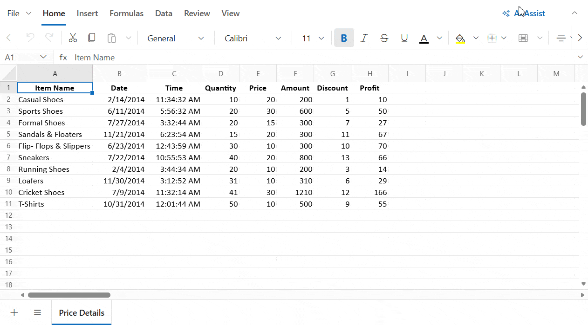

# AI Assist in ASP.NET MVC Spreadsheet Control

**AI Assist** brings AI-powered capabilities directly into the spreadsheet. Instead of manually applying formatting, writing formulas, or organizing data, you can describe what you want in plain English — and the AI Assist performs the action for you.

## Integration

AI Assist integrates seamlessly into your ASP.NET MVC Spreadsheet application with minimal configuration. This includes enabling the feature, configuring the backend server connection, handling events, and exploring the full range of supported prompts.

For complete setup instructions, how-to guides, API references, and prompt examples, see [AI Assist Integration](./integration).

After completing the integration, open the AI Assist panel, submit a prompt, and verify that the requested operation is applied to the active worksheet.

## How AI Assist Works in the spreadsheet

Understanding how AI Assist processes your request helps you write better prompts and get more reliable results.

### The Three-Step Process

When you submit a prompt in the AI Assist panel, the following process occurs:

- **Intent Recognition**
Your prompt is sent to the AI server, which reads it and determines what type of action you want — for example, formatting, editing, generating a report, or creating a chart. This step figures out the *what*.

- **Command Generation**
Once the intent is known, the spreadsheet's current data and the identified action are sent back to the AI. The AI then generates a precise set of instructions — such as which cells to update, what styles to apply, or what chart data to use. This step figures out the *how*.

- **Execution**
The generated instructions are applied directly to the spreadsheet. The result appears instantly in the grid, and a confirmation message is shown in the AI panel. Every change is also added to the undo history, so nothing is permanent.

## Supported Features

AI Assist supports a wide range of spreadsheet operations through natural language prompts:

| Feature | Description |
|---|---|
| **Data Analysis** | Generate insights including summaries, KPIs, top records, and visual suggestions. |
| **Data Operations** | Edit cell values, apply AutoFill, and manage content. |
| **Rules & Validation** | Apply conditional formatting and data validation rules. |
| **Formatting** | Apply styles such as bold, italic, font color, background color, number formats, and wrap text. |
| **Structure Management** | Insert/delete rows and columns, merge cells, and freeze panes. |
| **Clipboard Actions** | Perform cut, copy, and paste operations through AI commands. |
| **Navigation** | Perform sorting, filtering, and find & replace operations. |
| **Visualization** | Insert charts with multiple types, themes, titles, and sizing options. |

### Writing effective prompts

AI responses are only as good as the prompt you provide. Vague requests like *"fix this"* give the AI very little context. More specific prompts like *"highlight all values in column B that are greater than 500 in red"* produce reliable, accurate results.

### Scope

AI Assist only operates on the **currently active sheet**. It cannot read from or apply changes across multiple sheets in a single prompt.

## Limitations

* **Backend server is required**: AI Assist relies on a running backend service to process prompts. You must configure a valid `requestUrl` that points to an active Node.js or ASP.NET Web API server.

* **Operates on the active sheet only**: AI actions are scoped to the sheet that is currently open and selected. If you need the same change applied to multiple sheets, you must submit a separate prompt for each sheet individually.

* **Prompt clarity affects result quality**: The AI interprets your request as written, so the quality of the output depends on how clearly the prompt is phrased. Broad or ambiguous prompts such as *"fix this"* may not produce the intended result. For consistent and accurate outcomes, use specific instructions — for example, *"bold the header row and apply a blue background to cells A1 through E1"*.

## See Also

* [Open-Save](../open-save)
* [Data Binding](../data-binding)
