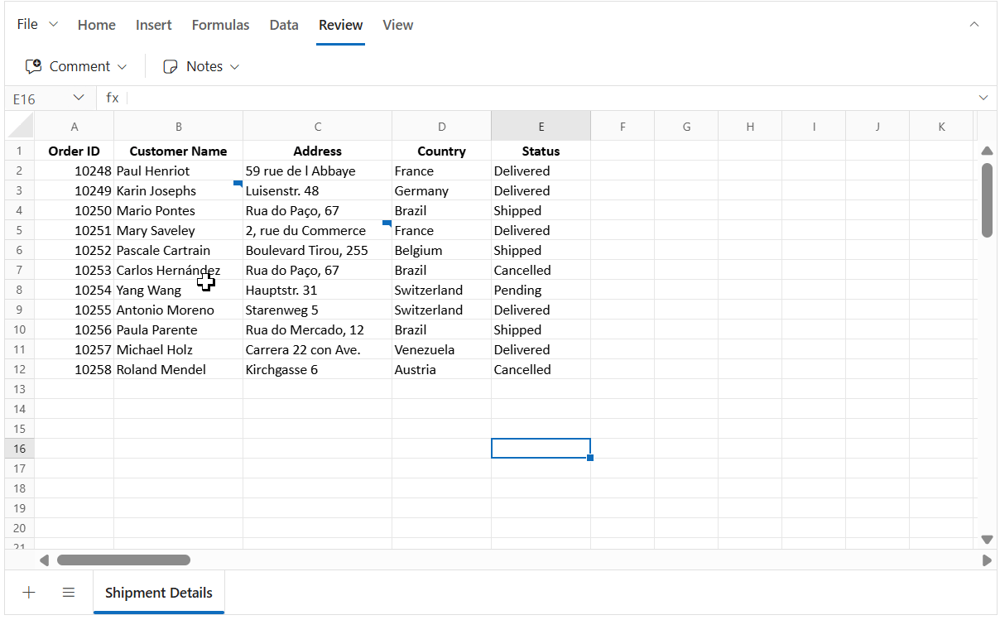

# Comment in EJ2 ASP.NET MVC Spreadsheet control
The **Comment** feature allows you to add feedback to cells without changing their values, enabling contextual discussions through threaded **replies**. Unlike [Notes](./notes), Comment include advanced review tools such as **resolve** and **reopen** to track status, plus an optional **Comments Review Pane** for browsing and managing threads.

Cells with comment display a small comment indicator; hover to preview the comment editor. This provides a clear, collaborative workflow while keeping data intact.


## Author identity
The Syncfusion Spreadsheet does not automatically track user identity. To tag new comments and replies with an author name, set the `author` property when initializing the Spreadsheet.

```js
    @(Html.EJ2().Spreadsheet("spreadsheet")
        .Author("Place the Author Name Here")
        .Render()
    )
```
>If the author property is not set, "Guest User" will be displayed as the author for comment and replies by default.

## Adding a comment
You can add a **comment** to a cell in several ways:
* **Context menu**: Right-click the target cell and select **"New Comment"**.
* **Ribbon**: Go to **Review > Comment > New Comment**.
* **Keyboard shortcut**: Press <kbd>Ctrl</kbd> + <kbd>Shift</kbd> + <kbd>F2</kbd> to open the comment editor for the active cell.
* **Programmatically**: 
    * Use the `updateCell` method with the comment model to add a comment to a specific cell.
    * Bind comments via code-behind during initial load by associating the comment model with the cell model.

The image below shows that once a comment is posted, the cell displays an indicator, and the comment can be previewed on hover.


## Adding a reply
You can add one or more replies to an existing comment to provide additional details or answers:
* **Context menu**: Right-click the cell that already has a comment, select **Comment > New Reply**, enter your reply, and click **Post**.
* **Ribbon**: Go to **Review > Comment > New Comment** on a cell that contains a comment. This opens the comment editor in **reply mode**.
* **Comment editor**: Open the comment editor by hovering over the comment indicator, type your reply, and click **Post**.
* **Keyboard shortcut**: Press <kbd>Ctrl</kbd> + <kbd>Shift</kbd> + <kbd>F2</kbd> on a cell that contains a comment to open the comment editor in reply mode.

After posting, the replies appear under the first comment in the comment editor.


## Editing a comment
You can edit the content of a comment or its replies directly within the comment editor.

* **Edit first comment**: In the comment editor. Click the **"⋯" (More thread actions)** menu in the header, select the **Edit Comment**, modify the text and click **Post**.
* **Edit a reply comment**: In the comment editor, hover over the specific reply, click the **"⋯" (More actions)**, select the **Edit Comment**, modify the text and click **Post**.


## Resolve and Reopen
The **Resolve thread** option marks a comment thread as completed when the discussion or issue is addressed. When a thread is resolved, its background color changes to indicate the resolved state, and the reply input box and reply menu actions are hidden. Use **Reopen** to restore the comment if further discussion is needed.

### Resolve a comment
* In the comment editor, click the **"⋯" (More thread actions)** menu in the header and select **Resolve Thread**. 

### Reopen a comment
* In the comment editor, click the **Reopen** button in the header to make the thread active again.



You can also use the `isResolved` property in the comment model when initializing or updating comments programmatically.

**Example: Using `isResolved` property in the comment model with the `updateCell` method**

```ts
// Update a cell with a comment using the updateCell method
    spreadsheet.updateCell({
        comment: {
            author: 'Chistoper', text: 'Are you completed the report',
            createdTime: 'January 03, 2026 at 5:00 PM',
            // Set to true to mark the thread as resolved; false keeps it active
            isResolved: false,
            replies: [{ author: 'John', text: 'Yes, completed',
            createdTime: 'January 03, 2026 at 7:00 PM' }]
        }
    }, 'Sheet1!D5');

```

## Deleting a comment or reply
You can delete either a specific reply or an entire comment thread (including all replies) using the following options:

### Deleting a comment thread
* **Context menu**: Right-click the cell that contains the comment and select **Comment > Delete Comment**.
* **Ribbon**: Go to **Review > Comment > Delete Comment** on a cell that contains the comment.
* **Comment editor**: In the comment editor, click the **"⋯" (More thread actions)** menu in the header and select **Delete Thread** for an active comment or use the **Delete Thread** button in header for a resolved comment.

Deleting a thread removes the comment and all its replies from the cell.


### Delete a reply
In the comment editor, hover over the reply and click the **"⋯" (More actions)** menu then select **Delete Comment**.


## Next and Previous Comment
The **Review > Comment > Next Comment and Previous Comment** options in the ribbon allow you to quickly navigate between cells that contain comments:

* **Next Comment**: Moves to the next cell with a comment.
* **Previous Comment**: Moves to the previous cell with a comment.

Navigation starts within the active sheet. When all comments in the active sheet have been visited (end or start reached), the navigation automatically continues to the next or previous sheet that contains comments. This ensures you can review all comments across the workbook without manually switching sheets.


## Comments review pane
The **"Comments" review pane** provides a centralized view of all comments in the active sheet, making it easier to manage discussions without switching between individual cells. It offers filtering, inline actions, and navigation, ensuring an efficient review workflow across the workbook.

You can show or hide the "Comments" review pane using:

* **Ribbon**: Go to **Review > Comment > Show Comments**.
* **Property**: Set the `showCommentsPane` property to true when initializing the Spreadsheet. By default, this property is **false**.


### Features of the comments review pane
The "Comments" review pane is rendered within the spreadsheet interface to provide a dedicated space for managing comments efficiently. It acts as a centralized hub where you can view all comment threads, perform actions, and keep discussions organized without navigating cell by cell.

The "Comments" review pane allows you to:

* Add new comment using the **New** button.
* Filter comments by **All**, **Active**, or **Resolved** to view specific comment threads.
* Navigate between comments and synchronize selection with the corresponding cells.
* Perform actions such as:
  * **Reply** – Add replies directly from the review pane.
  * **Edit** – Modify the text of a comment or reply.
  * **Delete** – Remove a reply or an entire thread.
  * **Resolve/Reopen** – Change the status of a comment.

When the review pane is open, all actions performed in the review pane or in the cell’s comment editor are synchronized:

* Selecting a comment in the review pane highlights the corresponding cell in the sheet.
* Selecting a cell with a comment focuses the respective comment thread in the review pane.
* Actions such as **Reply**, **Edit**, **Delete**, and **Resolve/Reopen** update both the pane and the cell comment editor instantly, ensuring consistency across the UI.
* The review pane dynamically updates when comments are added, deleted, or resolved, so you always see the latest state without refreshing.

## Saving a Workbook with Comments
You can save spreadsheet data along with **comments** using **File > Save As > Microsoft Excel(.xlsx)**.
- **MS Excel (.xlsx)** - Preserves all **threaded comments** (modern comments).

> Comments are **not included** when exporting to **.xls**, **.csv**, and **.pdf**.

### Why comments are not saved in `.xls`
The **.xls** format is based on the older Excel binary structure (BIFF8), which does not support modern features like **threaded comments**.
Threaded comments introduced in newer Excel versions require the **Open XML** structure used by `.xlsx`.  

> To retain threaded comments, always save the workbook in **.xlsx** format.

## Bind Comments via code-behind
You can bind **comment thread** to cells at initial load by providing a `comment` object in the cell model. Each cell supports **per comment thread**, which can include:
- **Comment**: `author`, `text`, `createdTime`, `isResolved`
- **Replies**: A collection of replies. Each reply is an object containing its `author`, `text`, and `createdTime` (no nested replies-of-replies).

In the below sample, comments are added to a specific cell using cell data binding. The "Comments" review pane is shown initially by enabling the `showCommentsPane` property, and comments are added using `updateCell` method in the `created` event.










### Important Notes
* **One thread per cell**: Attach a single `comment` object per cell. New remarks should be added as replies inside the existing thread.
* **Author Identity**: The author name for each comment and reply is static once set. When exporting, the author information is preserved for all comments, even if multiple authors exist in the workbook.
* **New comment**: When the "Comments" review pane is enabled, adding a new comment renders the drafted comment editor directly in the "Comments" review pane.

## Limitations
* **Un-posted comments are not stored**: If you type in the comment editor and close it without clicking **Post**, the entered text is not saved and will not appear when you reopen the editor. Only posted content is persisted in the comment model.
* **Comments and Notes cannot coexist**: When a cell contains comment, notes cannot be added. Similarly, if a cell already has a notes, comment cannot be added.
* **Comments in Print**: Comments are not included in print output.
* **Non-collaborative**: Real-time multi-user synchronization is not supported. However, when exporting and re-importing the workbook, the author information for each comment and reply is preserved.

## See Also
* [Notes](./notes)
* [Hyperlink](./link)