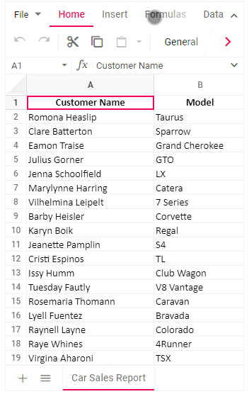

# Mobile Responsiveness in ASP.NET MVC Syncfusion Spreadsheet Control

The Spreadsheet control rendered in desktop mode will be adaptive in all mobile devices where the layout gets adjusted based on their parent element’s dimensions to accommodate any resolution.

Use touch or swipe actions to access overflow items in the Ribbon header, Ribbon content, and sheet tabs. A right navigation arrow appears at the end of the Ribbon content and allows you to navigate to the overflow items. When you reach the rightmost item, the right navigation arrow changes to a left navigation arrow, allowing you to navigate back through the Ribbon content.

