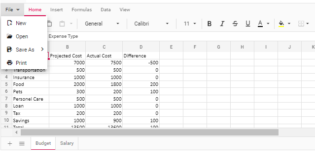
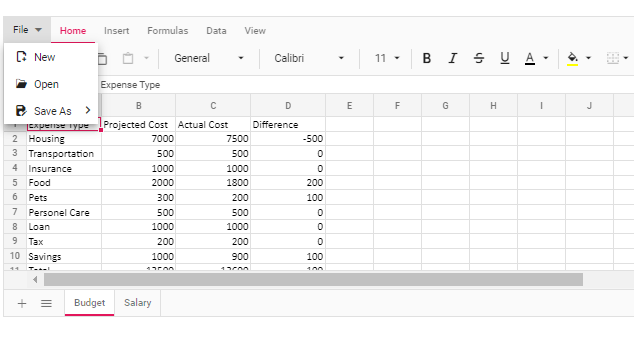

# Print in ASP.NET MVC Spreadsheet control

The printing functionality allows end-users to print all contents, such as tables, charts, images, and formatted contents, available in the active worksheet or entire workbook in the Spreadsheet. You can enable or disable print functionality by using the `allowPrint` property, which defaults to **true**.

## Default printing

To print the active worksheet:

1. Ensure that the Spreadsheet is in focus.
2. Open the **File** menu in the Ribbon and choose **Print**. Alternatively, press `Ctrl + P`.
3. Review the active worksheet in the browser's print dialog.
4. Select the printer and configure the available browser print settings.
5. Start the print operation.

By default, only data from the active worksheet is printed. Row headers, column headers, and gridlines are excluded.

## Custom printing

Use the `print` method to print the active worksheet or the entire workbook with customized options. The method accepts a `printOptions` object containing the following properties:

| Property | Description |
|----------|-------------|
| `type` | Specifies whether to print the active worksheet or the entire workbook. The supported values are `ActiveSheet` and `Workbook`. |
| `allowGridLines` | Specifies whether gridlines are included in the printed output. Set this property to `true` to include gridlines or `false` to exclude them. |
| `allowRowColumnHeader` | Specifies whether row and column headers are included in the printed output. Set this property to `true` to include the headers or `false` to exclude them. |

> When the `print` method is called without any parameters, the default printing will be performed.










## Disable printing

Set the [`allowPrint`](https://help.syncfusion.com/cr/aspnetcore-js2/Syncfusion.EJ2.Spreadsheet.Spreadsheet.html#Syncfusion_EJ2_Spreadsheet_Spreadsheet_AllowPrint) property to `false` to disable printing. When printing is disabled:

* The **Print** option is not displayed in the **File** menu.
* The Spreadsheet print keyboard shortcut is unavailable.










## Limitations

* Changing the page orientation to landscape is not supported by the `print` method or through the browser's print preview dialog.
* The styles provided for the data validation functionality will not be available in the printed copy of the document.
* The content added to the cell templates, such as HTML elements, Syncfusion&reg; controls, and others, will not be available in the printed copy of the document.
