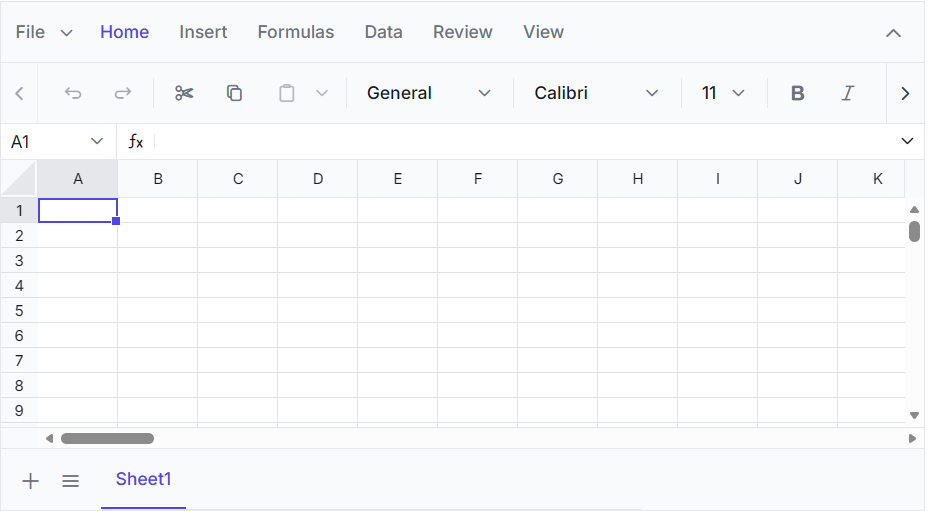

# Getting Started with Angular Spreadsheet Component

This section explains how to create a simple Angular application and add the [Angular Spreadsheet Editor](https://www.syncfusion.com/spreadsheet-editor-sdk/angular-spreadsheet-editor) component with the minimum required setup.

## Prerequisites

[System requirements for Syncfusion® Angular components](https://ej2.syncfusion.com/angular/documentation/system-requirement)

## Create an Angular application

Use [Angular CLI](https://angular.dev/installation) to create a new Angular application, as it provides a standardized project structure, built-in testing tools, and simplified deployment.

Install Angular CLI globally, using the following command:

```
npm install -g @angular/cli
```

Create a new Angular application using the following commands:

```
ng new spreadsheet-app
cd spreadsheet-app
```

> **Note:** When prompted during project creation, select the default options: **CSS** for stylesheet, **No** for SSR/SSG, and **None** for AI tools.

## Install the Syncfusion® Angular Spreadsheet package

The [Angular Spreadsheet Editor](https://www.npmjs.com/package/@syncfusion/ej2-angular-spreadsheet) package uses the Ivy-based Angular library distribution [format](https://angular.dev/tools/libraries/angular-package-format) and is compatible with `Angular 12` and above. Use the following command to install the package:

```
npm install @syncfusion/ej2-angular-spreadsheet
```

For `Angular versions below 12`, use the legacy `ngcc` package instead:

```
npm install @syncfusion/ej2-angular-spreadsheet@ngcc
```

## Register a Syncfusion License Key

Before initializing the Syncfusion Angular Spreadsheet component, generate a Syncfusion license key and register it in the application.

- [Generate a Syncfusion License Key](https://help.syncfusion.com/document-processing/licensing/how-to-generate)
- [Register a Syncfusion License Key in an Angular Application](https://help.syncfusion.com/document-processing/licensing/how-to-register-in-an-application#angular)

## Add CSS references

Add the following Spreadsheet and dependent component styles to `src/styles.css` file. Replace the existing content with the theme import code below.

```css
@import '../node_modules/@syncfusion/ej2-base/styles/tailwind3.css';
@import '../node_modules/@syncfusion/ej2-inputs/styles/tailwind3.css';
@import '../node_modules/@syncfusion/ej2-buttons/styles/tailwind3.css';
@import '../node_modules/@syncfusion/ej2-splitbuttons/styles/tailwind3.css';
@import '../node_modules/@syncfusion/ej2-lists/styles/tailwind3.css';
@import '../node_modules/@syncfusion/ej2-navigations/styles/tailwind3.css';
@import '../node_modules/@syncfusion/ej2-popups/styles/tailwind3.css';
@import '../node_modules/@syncfusion/ej2-dropdowns/styles/tailwind3.css';
@import '../node_modules/@syncfusion/ej2-grids/styles/tailwind3.css';
@import '../node_modules/@syncfusion/ej2-angular-spreadsheet/styles/tailwind3.css';
```

> **Note:** This example uses the `Tailwind 3` theme. To use a different built-in theme, replace the `tailwind3.css` references with the corresponding theme stylesheets. Refer to the [Themes documentation](https://ej2.syncfusion.com/angular/documentation/appearance/overview) for information about the available themes and the different ways to include theme styles in an Angular application.

## Add the Syncfusion® Angular Spreadsheet component

Import and render the `Spreadsheet` in `src/app/app.ts`. Replace the existing content with the following code.



import { SpreadsheetAllModule } from '@syncfusion/ej2-angular-spreadsheet'
import { Component } from '@angular/core';

@Component({
  imports: [SpreadsheetAllModule],
  standalone: true,
  selector: 'app-root',
  template: '<ejs-spreadsheet openUrl="https://document.syncfusion.com/web-services/spreadsheet-editor/api/spreadsheet/open" saveUrl="https://document.syncfusion.com/web-services/spreadsheet-editor/api/spreadsheet/save"></ejs-spreadsheet>'
})
export class App { }



> **Note:** The [`openUrl`](https://ej2.syncfusion.com/angular/documentation/api/spreadsheet/index-default#openurl) and [`saveUrl`](https://ej2.syncfusion.com/angular/documentation/api/spreadsheet/index-default#saveurl) endpoints used in this example are provided only for demonstration purposes. For development and production use, we strongly recommend configuring your own local or hosted web service for the Open and Save actions instead of relying on the online demo service. For more information, refer to the [`Host Spreadsheet Open and Save Services`](https://www.syncfusion.com/blogs/post/host-spreadsheet-open-and-save-services).

## Run the application

Run the following command to start the development server:

```
ng serve
```

After the application starts, open the localhost URL shown in the terminal to view the Angular Spreadsheet Editor in the browser. The output will appear as follows:


You can also explore the Spreadsheet interactively using the live sample below.
 


> [View Sample in GitHub](https://github.com/SyncfusionExamples/getting-started-with-the-angular-spreadsheet-component).

## Video tutorial

To get started quickly with Angular Spreadsheet, you can watch this video:




## See also

* [Open and Save](./open-save)
* [Data Binding](./data-binding)
