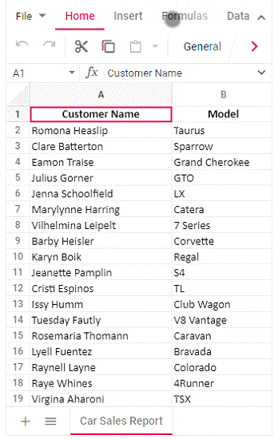

# Mobile responsiveness in Angular Spreadsheet 

The Spreadsheet control rendered in desktop mode will be adaptive in all mobile devices where the layout gets adjusted based on their parent element’s dimensions to accommodate any resolution.

You can see the overflowed items of the ribbon header, ribbon content, and sheet tab using touch and swipe actions. A right navigation arrow is added at the end of the ribbon content through which the user can navigate towards overflowed items. Once you reach the rightmost end of the ribbon content, the right navigation arrow changes to a left navigation arrow through which you can navigate to the left of the ribbon content.

## Note

You can refer to our [Angular Spreadsheet Editor](https://www.syncfusion.com/spreadsheet-editor-sdk/angular-spreadsheet-editor) feature tour page for its groundbreaking feature representations. You can also explore our [Angular Spreadsheet example](https://document.syncfusion.com/demos/spreadsheet-editor/angular/#/bootstrap5/spreadsheet/default) to knows how to present and manipulate data.