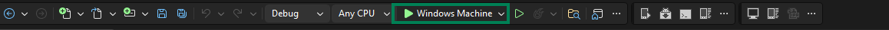
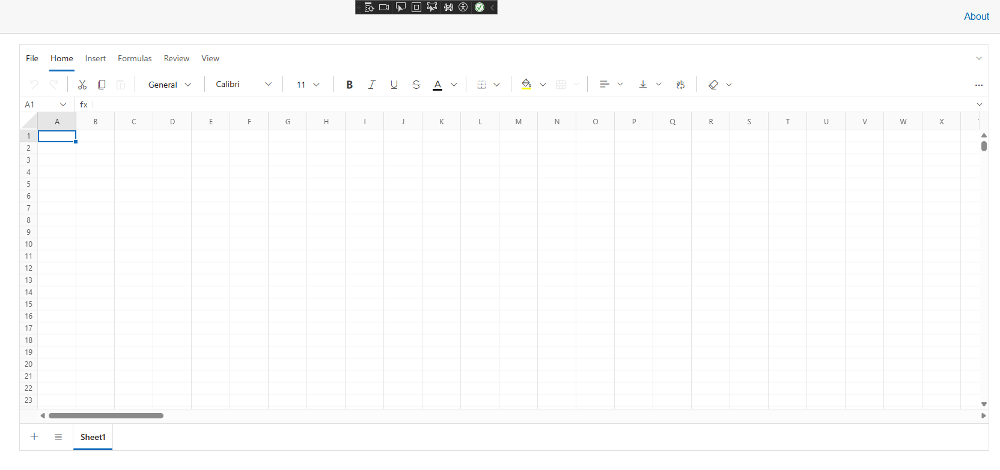
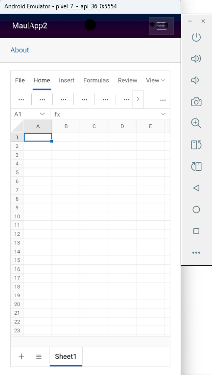

# Getting Started with .NET MAUI Blazor Hybrid App

This section explains how to create and run a .NET MAUI Blazor Hybrid application using the [Blazor Spreadsheet Editor](https://www.syncfusion.com/blazor-components/blazor-spreadsheet) component.

## Prerequisites

To use the .NET MAUI project templates, install the Mobile development with .NET workload for Visual Studio 2022 (version 17.8 or later). For installation details, see the Microsoft documentation: [Install .NET MAUI](https://learn.microsoft.com/en-us/dotnet/MAUI/get-started/installation?tabs=vswin).

N> If you are using Visual Studio Code or the .NET CLI on macOS/Linux, install the .NET MAUI workload using the command `dotnet workload install maui`. For more information, see [.NET MAUI workload installation](https://learn.microsoft.com/en-us/dotnet/maui/get-started/installation).

## Create a new Blazor MAUI App in Visual Studio

Create a **Blazor MAUI App** using Visual Studio via [Microsoft Templates](https://learn.microsoft.com/en-us/aspnet/core/blazor/hybrid/tutorials/maui?view=aspnetcore-8.0).

## Install Blazor Spreadsheet NuGet Packages

To add **Syncfusion Blazor Spreadsheet** component in the app, open the NuGet package manager in Visual Studio (*Tools → NuGet Package Manager → Manage NuGet Packages for Solution*), search and install:

* [Syncfusion.Blazor.Spreadsheet](https://www.nuget.org/packages/Syncfusion.Blazor.Spreadsheet)
* [Syncfusion.Blazor.Themes](https://www.nuget.org/packages/Syncfusion.Blazor.Themes/)

Alternatively, you can utilize the following package manager command to achieve the same.




Install-Package Syncfusion.Blazor.Spreadsheet -Version {{ site.releaseversion }}
Install-Package Syncfusion.Blazor.Themes -Version {{ site.releaseversion }}




## Add import namespaces

After the packages are installed, open the **_Imports.razor** file and import the `Syncfusion.Blazor` and `Syncfusion.Blazor.Spreadsheet` namespaces.




@using Syncfusion.Blazor
@using Syncfusion.Blazor.Spreadsheet




## Register Syncfusion Blazor Service

Register the Blazor Service in the **MauiProgram.cs** file.




using Syncfusion.Blazor;

public static class MauiProgram
{
    public static MauiApp CreateMauiApp()
    {
        // Register Syncfusion Blazor service
        builder.Services.AddSyncfusionBlazor();
        
        return builder.Build();
    }
}




N> `AddSyncfusionBlazor()` accepts optional configuration options such as enabling script isolation. See the [Blazor service registration](https://help.syncfusion.com/cr/blazor/Syncfusion.Blazor.GlobalOptions.html) topic for available configuration options.

## Register Syncfusion License Key

Register the Syncfusion license key in your application startup to avoid a license warning at runtime. Add the following line in the **MauiProgram.cs** file, after the `AddSyncfusionBlazor()` call:




// Register Syncfusion license key
Syncfusion.Licensing.SyncfusionLicenseProvider.RegisterLicense("YOUR_LICENSE_KEY");




N> Replace `YOUR_LICENSE_KEY` with your actual Syncfusion license key. For details on generating and registering a license key, see [Licensing](https://blazor.syncfusion.com/documentation/licensing).

## Add stylesheet resource

The theme stylesheet can be accessed from NuGet through [Static Web Assets](https://blazor.syncfusion.com/documentation/appearance/themes#static-web-assets). Include the stylesheet in the `<head>` of the **wwwroot/index.html** file to apply proper layout and theme styling.




<head>
    <!-- Syncfusion Blazor components theme -->
    <link href="_content/Syncfusion.Blazor.Themes/bootstrap5.css" rel="stylesheet" />
</head>




## Add script resource

The Spreadsheet Editor script can be accessed from NuGet through [Static Web Assets](https://blazor.syncfusion.com/documentation/appearance/themes#static-web-assets). Include the script at the end of the `<body>` in the **wwwroot/index.html** file to enable component functionality.




<body>
    <!-- Syncfusion Blazor Spreadsheet Editor script -->
    
</body>



N> Check out the [Blazor Themes](https://blazor.syncfusion.com/documentation/appearance/themes) topic to explore supported ways (such as static assets, CDN, and CRG) to apply themes in your Blazor application. Also, check out the [Adding Script Reference](https://blazor.syncfusion.com/documentation/common/adding-script-references) topic to learn different approaches for adding script references in your Blazor application.

## Add Blazor Spreadsheet component

Add the Blazor Spreadsheet component in any Razor file. In this example, the Spreadsheet component is added to the **Components/Pages/Home.razor** page.




@page "/"
@using Syncfusion.Blazor.Spreadsheet

<SfSpreadsheet>
    <SpreadsheetRibbon></SpreadsheetRibbon>
</SfSpreadsheet>




N> `SpreadsheetRibbon` is the optional ribbon toolbar child component of `SfSpreadsheet`. Omit it if you want to render the spreadsheet without the ribbon UI.

N> .NET MAUI Blazor Hybrid apps run components natively on the device; no interactive render mode (such as `InteractiveServer` or `InteractiveWebAssembly`) is required.

## Run on Windows

In the Visual Studio toolbar, click the **Windows Machine** to build and run the app. Ensure the run profile is set to `Windows Machine` before starting the app.

After the application launches, the output will appear as shown below:

## Run on Android

To run the Spreadsheet on Android using the Android emulator, follow these steps:

1. Refer to [Android Device Manager on Windows](https://learn.microsoft.com/en-us/dotnet/maui/android/emulator/device-manager#android-device-manager-on-windows) to install and launch the Android emulator.
2. In the Visual Studio toolbar, select the **Android Emulators** run profile.
3. Click the **Android Emulators** button (or press <kbd>F5</kbd>) to build and deploy the app to the emulator.

N> If any errors occur while using the Android Emulator, see [Troubleshooting Android Emulator](https://learn.microsoft.com/en-us/dotnet/maui/android/emulator/troubleshooting).

N> To run the app on iOS or Mac Catalyst, see [Publish a .NET MAUI app for iOS](https://learn.microsoft.com/en-us/dotnet/maui/ios/deployment/overview) and [Publish a .NET MAUI app for Mac Catalyst](https://learn.microsoft.com/en-us/dotnet/maui/mac-catalyst/deployment/?view=net-maui-10.0).

To learn how to open workbooks, bind data, or save files in the Spreadsheet component, see [Open and Save](open-and-save).

N> [View sample in GitHub](https://github.com/SyncfusionExamples/syncfusion-maui-blazor-spreadsheet-integration). Looking for the full Blazor Spreadsheet Editor component overview, features, pricing, and documentation? Visit the [Blazor Spreadsheet Editor](https://www.syncfusion.com/spreadsheet-editor-sdk/blazor-spreadsheet-editor) page

## See Also

- [Getting started with the Blazor Spreadsheet in a Blazor WebAssembly App](./getting-started)
- [Getting started with the Blazor Spreadsheet in a Blazor Web App](./getting-started-webapp)