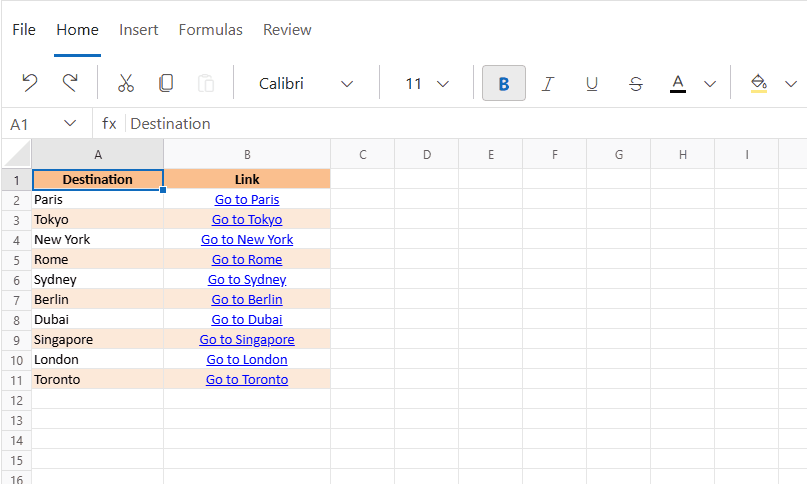
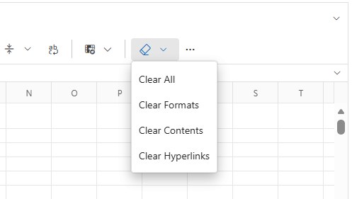

# Managing Cell Ranges in the Blazor Spreadsheet Component

A cell range is a set of selected cells in a Spreadsheet, typically specified using A1 notation (for example, `A1:B10`). A range may be a single cell or a contiguous block of cells that can be manipulated or processed collectively.

## Cell formatting

The Spreadsheet component supports a wide range of cell-formatting operations—including text styling (font family, size, color, and weight), cell fill, borders, alignment, number formats, and conditional formatting—that can be applied to a single cell, a selected range, or the entire worksheet. For more details, refer to the [Text and Cell Formatting](./formatting#text-and-cell-formatting) documentation.

## Autofill

The Autofill feature automatically populates adjacent cells with data that follows a pattern or extends values from the source cells. It helps avoid entering repetitive data manually. The [AllowAutofill](https://help.syncfusion.com/cr/blazor/Syncfusion.Blazor.Spreadsheet.SfSpreadsheet.html#Syncfusion_Blazor_Spreadsheet_SfSpreadsheet_AllowAutofill) property can be used to enable or disable this feature.

* The default value of the [AllowAutofill](https://help.syncfusion.com/cr/blazor/Syncfusion.Blazor.Spreadsheet.SfSpreadsheet.html#Syncfusion_Blazor_Spreadsheet_SfSpreadsheet_AllowAutofill) property is **true**.

To enable or disable autofill declaratively, set the `AllowAutofill` property on the `SfSpreadsheet` component. For example:




@using Syncfusion.Blazor.Spreadsheet

<SfSpreadsheet AllowAutofill="true">
    <SpreadsheetRibbon></SpreadsheetRibbon>
</SfSpreadsheet>




Autofill can be performed in one of the following ways:

*   Select the source cell or range, then drag and drop the selection using the fill handle element to extend the values to adjacent cells.
*   Use the [AutofillAsync()](https://help.syncfusion.com/cr/blazor/Syncfusion.Blazor.Spreadsheet.SfSpreadsheet.html#Syncfusion_Blazor_Spreadsheet_SfSpreadsheet_AutofillAsync_System_String_System_String_) method programmatically.

### Autofill options

Autofill supports multiple behaviors that control how adjacent cells are populated when using the fill handle. After dragging the fill handle, the **AutoFillOptions** menu appears as a popup near the destination range. You can also right-click the destination range and select **AutoFillOptions** to access the same options. The available options are:

- Copy Cells
- Fill Series
- Fill Formatting Only
- Fill Without Formatting

#### Copy Cells

Copies the source cell content and formatting to the selected destination range. After dragging the fill handle from the selection to the target area, choose **Copy Cells** from the **AutoFillOption** menu to replicate both values and presentation. When the source contains formulas, relative references are adjusted to match the destination.

#### Fill Series

Extends a recognizable pattern—such as numbers (1, 2, 3), days or months (Mon, Tue; Jan, Feb), or dates—into the destination range while preserving the source formatting. Drag the fill handle to the target cells and choose **Fill Series** in the **AutoFillOptions** menu to continue the detected sequence.

#### Fill Formatting Only

Applies only the source styling—number format, font, fill color, borders, and alignment—to the destination range, leaving existing values unchanged. Drag the fill handle over the target cells and select **Fill Formatting Only** from the **AutoFillOptions** menu to unify appearance without altering data.

#### Fill Without Formatting

Continues the detected series into the destination range but retains the destination's existing formatting. After dragging the fill handle, choose **Fill Without Formatting** from the **AutoFillOptions** menu to apply only the new values while keeping the target style intact.

The following illustration demonstrates the use of autofill in the Spreadsheet component.

The [AutofillAsync()](https://help.syncfusion.com/cr/blazor/Syncfusion.Blazor.Spreadsheet.SfSpreadsheet.html#Syncfusion_Blazor_Spreadsheet_SfSpreadsheet_AutofillAsync_System_String_System_String_) method accepts string parameters in A1 notation for `fillRange` and `dataRange`. The following table lists the available parameters:

| Parameter | Type | Description |
| -- | -- | -- |
| fillRange | string | Specifies the fill range in A1 notation (e.g., "A1:A5"). |
| dataRange | string | Specifies the source data range in A1 notation (e.g., "B1:B5"). |
| direction | string | Specifies the direction to be filled ("Up", "Right", "Down", or "Left"). |

### Implementing autofill programmatically




@page "/"
@using Syncfusion.Blazor.Spreadsheet

<button @onclick="AutofillRangeHandler">Autofill</button>
<SfSpreadsheet @ref="SpreadsheetInstance" DataSource="DataSourceBytes">
    <SpreadsheetRibbon></SpreadsheetRibbon>
</SfSpreadsheet>

@code {
    public byte[] DataSourceBytes { get; set; }
    public SfSpreadsheet SpreadsheetInstance;

    protected override void OnInitialized()
    {
        string filePath = "wwwroot/Sample.xlsx";
        DataSourceBytes = File.ReadAllBytes(filePath);
    }

    public async Task AutofillRangeHandler()
    {
	    // Basic usage with only the fill range parameter.
        await SpreadsheetInstance.AutofillAsync("B7:B8");
    }
}




## Autofill Events

The Blazor Spreadsheet provides events that are triggered during autofill operations, such as [AutofillActionBegin](https://help.syncfusion.com/cr/blazor/Syncfusion.Blazor.Spreadsheet.AutofillActionBeginEventArgs.html) and [AutofillActionEnd](https://help.syncfusion.com/cr/blazor/Syncfusion.Blazor.Spreadsheet.AutofillActionEndEventArgs.html). These events enable the execution of custom actions before and after an autofill operation, allowing for validation, customization, and response handling.

### AutofillActionBegin

The [AutofillActionBegin](https://help.syncfusion.com/cr/blazor/Syncfusion.Blazor.Spreadsheet.AutofillActionBeginEventArgs.html) event is triggered before an autofill operation is performed. This event provides an opportunity to validate the autofill operation and apply restrictions based on custom logic, such as preventing the operation under specific conditions.

**Purpose**

This event is useful for scenarios where autofill behavior needs to be controlled dynamically—such as restricting autofill in specific ranges or preventing autofill based on certain conditions.

**Event Arguments**

The event uses the [AutofillActionBeginEventArgs](https://help.syncfusion.com/cr/blazor/Syncfusion.Blazor.Spreadsheet.AutofillActionBeginEventArgs.html) class, which includes the following properties:

| Event Arguments | Type | Description |
|---|---|---|
| FillRange (read-only) | string | The address of the target range for the autofill operation (e.g., "Sheet1!A2:A5"). |
| DataRange (read-only) | string | The source data range for the autofill operation (e.g., "Sheet1!A1:A1"). |
| Direction (read-only) | string | The direction of the autofill operation ("Down", "Right", "Up", or "Left"). |
| Cancel | bool | A boolean value to cancel the autofill operation. |




@page "/"
@using Syncfusion.Blazor.Spreadsheet

<SfSpreadsheet DataSource="DataSourceBytes" AutofillActionBegin="OnAutofillActionBegin">
    <SpreadsheetRibbon></SpreadsheetRibbon>
</SfSpreadsheet>

@code {
    public byte[] DataSourceBytes { get; set; }
    
    protected override void OnInitialized()
    {
        string filePath = "wwwroot/Sample.xlsx";
        DataSourceBytes = File.ReadAllBytes(filePath);
    }

    public void OnAutofillActionBegin(AutofillActionBeginEventArgs args)
    {
        // Prevent autofill for a specific range.
        if (args.FillRange == "A1:A10")
        {
            args.Cancel = true;
        }

        // Prevent autofill when dragging upward.
        if (args.Direction == "Up")
        {
            args.Cancel = true;
        }
    }
}




### AutofillActionEnd

The [AutofillActionEnd](https://help.syncfusion.com/cr/blazor/Syncfusion.Blazor.Spreadsheet.AutofillActionEndEventArgs.html) event is triggered after an autofill operation has been successfully completed. This event provides detailed information about the completed autofill action, enabling further processing or logging if required.

**Purpose**

This event is useful for scenarios where actions after the autofill are needed, such as logging the autofill operation, updating related data, or triggering additional UI updates.

**Event Arguments**

The event uses the [AutofillActionEndEventArgs](https://help.syncfusion.com/cr/blazor/Syncfusion.Blazor.Spreadsheet.AutofillActionEndEventArgs.html) class, which includes the following properties:

| Event Arguments | Type | Description |
|---|---|---|
| FillRange (read-only) | string | The address of the target range where the autofill was applied (e.g., "Sheet1!A2:A5"). |
| DataRange (read-only) | string | The source data range used for the autofill operation (e.g., "Sheet1!A1:A1"). |
| Direction (read-only) | string | The direction of the autofill operation ("Down", "Right", "Up", or "Left"). |




@page "/"
@using Syncfusion.Blazor.Spreadsheet

<SfSpreadsheet DataSource="DataSourceBytes" AutofillActionEnd="OnAutofillActionEnd">
    <SpreadsheetRibbon></SpreadsheetRibbon>
</SfSpreadsheet>

@code {
    public byte[] DataSourceBytes { get; set; }
    
    protected override void OnInitialized()
    {
        string filePath = "wwwroot/Sample.xlsx";
        DataSourceBytes = File.ReadAllBytes(filePath);
    }

    public void OnAutofillActionEnd(AutofillActionEndEventArgs args)
    {
        // Log or process the completed autofill operation.
        Console.WriteLine($"Autofill completed for range: {args.FillRange}");
    }
}




## Clear

The Clear functionality removes cell contents (formulas and data), formats (including number formats), and hyperlinks from a selected range.

### Applying the clear functionality

Clearing can be performed through the user interface (UI) using any of the following methods:

**Using the Ribbon**

- Select a cell or a range of cells to clear.
- In the **Home** tab of the **Ribbon**, click the **Clear** drop-down arrow.
- Select one of the following options from the drop-down menu:

| Option | Use |
| -- | -- |
| **Clear All** | Clears all contents, formats, and hyperlinks. |
| **Clear Formats** | Clears only the formatting from the selected cells. |
| **Clear Contents** | Clears only the contents (formulas and data) from the selected cells. |
| **Clear Hyperlinks** | Clears only the hyperlinks from the selected cells. |

The following image displays the clear options available in the Ribbon toolbar under the **Home** tab of the Blazor Spreadsheet.

**Using the Context Menu**

- Select a cell or a range of cells to clear.
- Right-click the selected range to open the context menu.
- Select **Clear Contents** to remove only the formulas and data from the current selection.

### Clear programmatically

The [ClearAsync()](https://help.syncfusion.com/cr/blazor/Syncfusion.Blazor.Spreadsheet.SfSpreadsheet.html#Syncfusion_Blazor_Spreadsheet_SfSpreadsheet_ClearAsync_Syncfusion_Blazor_Spreadsheet_ClearOperationType_System_String_) method clears contents, formatting, hyperlinks, or all aspects of the specified range or current selection in the spreadsheet.

The available parameters are:

| Parameter | Type | Description |
| -- | -- | -- |
| options | Enum | Specifies the type of clear operation to perform. The available values are: `ClearContents`, `ClearFormats`, `ClearHyperlinks`, and `ClearAll`|
| range | string | The A1-style range to clear |

**Remarks**

* The method parses the provided `range` and resolves the target worksheet and range before performing the clear operation.
* If `range` is `null` or empty, the operation is applied to the current selection.




@page "/"
@using Syncfusion.Blazor.Spreadsheet

<SfButton OnClick="ClearHandler" Content="Clear Cells"></SfButton>

<SfSpreadsheet @ref="SpreadsheetInstance" DataSource="DataSourceBytes">
    <SpreadsheetRibbon></SpreadsheetRibbon>
</SfSpreadsheet>

@code {
    public byte[] DataSourceBytes { get; set; }
    public SfSpreadsheet SpreadsheetInstance { get; set; }

    protected override void OnInitialized()
    {
        string filePath = "wwwroot/Sample.xlsx";
        DataSourceBytes = File.ReadAllBytes(filePath);
    }

    public async Task ClearHandler()
    {
        // Clears only contents from range A1:A10 on Sheet1.
        await SpreadsheetInstance.ClearAsync(ClearOperationType.ClearContents, "Sample!A1:A10");

        // Clears only formats from the current selection.
        await SpreadsheetInstance.ClearAsync(ClearOperationType.ClearFormats);
    }
}


