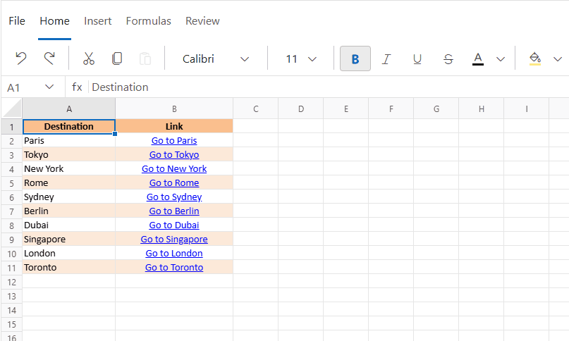

# Managing Cell Ranges in Blazor Spreadsheet component
A cell range is a set of selected cells in a Spreadsheet, typically specified using A1 notation (for example, `A1:B10`). A range may be a single cell or a contiguous block of cells that can be manipulated or processed collectively.

## Cell formatting

Cell formatting enhances the visual presentation of data by applying styles such as font changes, colors, borders, and alignment to individual cells or cell ranges. This helps organize content and emphasize important information for faster interpretation.

Cell formatting options include:

* **Bold** - Applies a heavier font weight to make the text stand out in the Spreadsheet.

* **Italic** - Slants the text to give it a distinct look, often used for emphasis or to highlight differences.

*   **Underline** - Adds a line below the text, commonly used for emphasis or to indicate hyperlinks.

*   **Strikethrough** - Draws a line through the text, often used to show completed tasks or outdated information.

*   **Font Family** - Changes the typeface of the text (e.g., Arial, Calibri, Times New Roman, and more) to enhance readability or visual appeal.

*   **Font Size** - Adjusts the size of the text to create visual hierarchy or improve readability in the Spreadsheet.

*   **Font Color** - Changes the color of the text to improve visual hierarchy or to organize information using color codes.

*   **Fill Color** - Adds color to the cell background to visually organize data or highlight important information.

*  **Horizontal Alignment** - Controls the position of text from left to right within a cell. Options include:
    * **Left** - Default for text
    * **Center** - Useful for headings
    * **Right** - Default for numbers

*   **Vertical Alignment** - Controls the position of text from top to bottom within a cell. Options include:
    * **Top** – Aligns content to the top of the cell
    * **Middle** – Centers content vertically
    * **Bottom** – Default alignment

*   **Wrap Text** - Displays long content on multiple lines within a single cell, preventing it from overflowing into adjacent cells.

Cell formatting can be applied or removed from a cell or range by using the options available in the component's built-in **Ribbon** under the **Home** tab.

## Autofill

Autofill is used to fill cells with data that follows a pattern or is based on data in other cells. It helps avoid entering repetitive data manually. The [AllowAutofill](https://help.syncfusion.com/cr/blazor/Syncfusion.Blazor.Spreadsheet.SfSpreadsheet.html#Syncfusion_Blazor_Spreadsheet_SfSpreadsheet_AllowAutofill) property can be used to enable or disable this feature.

* The default value of the `AllowAutofill` property is **true**.

Autofill can be performed in one of the following ways:

*   Drag and drop the cell using the fill handle element.
*   Use the [AutofillAsync()](https://help.syncfusion.com/cr/blazor/Syncfusion.Blazor.Spreadsheet.SfSpreadsheet.html#Syncfusion_Blazor_Spreadsheet_SfSpreadsheet_AutofillAsync_System_String_System_String_) method programmatically.

The `AutofillAsync()` method accepts string parameters in A1 notation for `fillRange` and `dataRange`. The available parameters are:

| Parameter | Type | Description |
| -- | -- | -- |
| fillRange | string | Specifies the fill range in A1 notation (e.g., "A1:A5"). |
| dataRange | string | Specifies the source data range in A1 notation (e.g., "B1:B5"). |
| direction | string | Specifies the direction to be filled ("Up", "Right", "Down", or "Left"). |

### Implementing autofill programmatically




@using Syncfusion.Blazor.Spreadsheet

<button @onclick="AutofillRangeHandler">Autofill</button>
<SfSpreadsheet @ref="spreadsheetObj" DataSource="DataSourceBytes">
    <SpreadsheetRibbon></SpreadsheetRibbon>
</SfSpreadsheet>

@code {
    public byte[] DataSourceBytes { get; set; }
    public SfSpreadsheet spreadsheetObj;

    protected override void OnInitialized()
    {
        string filePath = "wwwroot/Sample.xlsx";
        DataSourceBytes = File.ReadAllBytes(filePath);
    }

    public async Task AutofillRangeHandler()
    {
	    // Basic usage with only the fill range parameter.
        await spreadsheetObj.AutofillAsync("B7:B8");
    }
}




The following illustration demonstrates the use of autofill in the Spreadsheet component.

## Clear

The clear functionality helps remove cell contents (formulas and data), formats (including number formats), and hyperlinks from a selected range.

### Applying the clear functionality

The clear support can be applied using the following way:

You can apply the clear functionality by selecting the **Clear** icon in the **Ribbon** under the **Home** tab.

| Option | Use |
| -- | -- |
| **Clear All** | Clears all contents, formats, and hyperlinks. |
| **Clear Formats** | Clears only the formatting from the selected cells. |
| **Clear Contents** | Clears only the contents (formulas and data) from the selected cells. |
| **Clear Hyperlinks** | Clears only the hyperlinks from the selected cells. |

The following image displays the clear options available in the Ribbon toolbar under the **Home** tab of the Blazor Spreadsheet.

