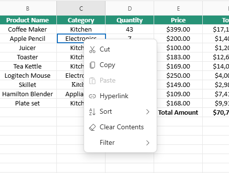
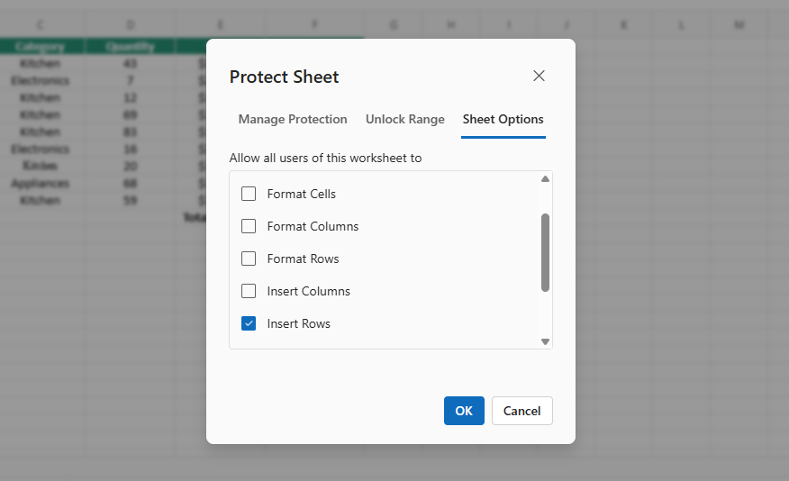
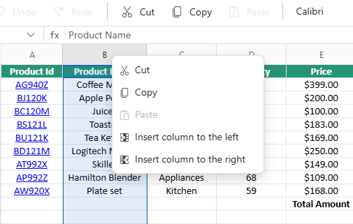
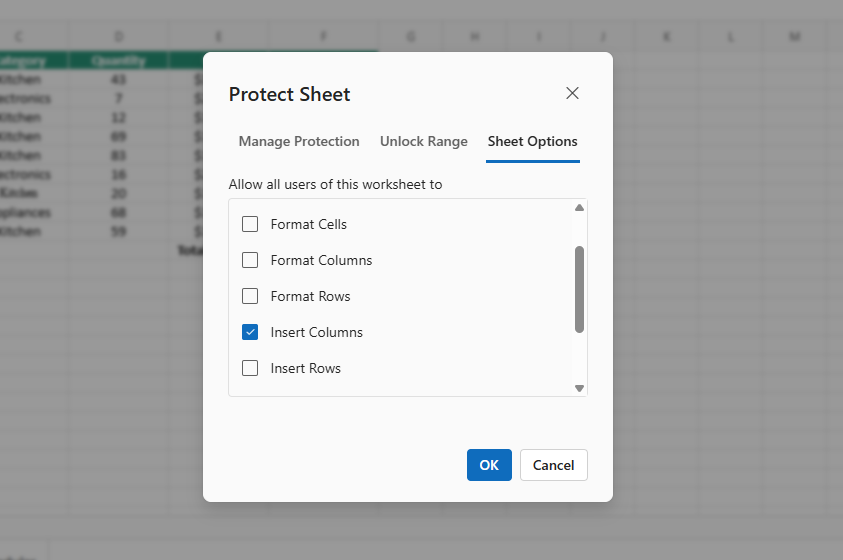
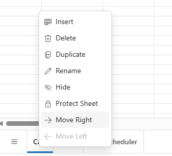

# Context Menu in Blazor Spreadsheet component

The context menu enhances interaction with the Syncfusion Blazor Spreadsheet component by displaying a popup with relevant operations when a right-click is performed on elements such as **cells**, **column headers**, **row headers**, or **sheet tabs**. Its visibility can be controlled via the [`EnableContextMenu`](https://help.syncfusion.com/cr/blazor/Syncfusion.Blazor.Spreadsheet.SfSpreadsheet.html#Syncfusion_Blazor_Spreadsheet_SfSpreadsheet_EnableContextMenu) property, which is set to **true** by default, enabling the context menu automatically.

N> When the `EnableContextMenu` property is set to **false**, the context menu does not appear upon right-clicking any element in the component.

## Context Menu options categorized by Element

The context menu options are dynamically adjusted based on the specific element in the Spreadsheet that is right-clicked. Each element displays context-specific functionality relevant to its type.

### Cell context menu options

When a cell or range of cells is right-clicked, the context menu displays the following options:

| Options | Action |
| -- | -- |
| Cut | Removes data from the selected cells and temporarily stores it on the clipboard for reuse within the Spreadsheet or in an external application. |
| Copy | Copies data from the selected cells and temporarily stores it on the clipboard for reuse within the Spreadsheet or in an external application. |
| Paste | Inserts data from the clipboard into the currently selected cells. |
| Hyperlink | Creates a navigational link to a web address or a cell reference within the current sheet or other sheets in the Spreadsheet. To know more about Hyperlink, refer [here](./hyperlink). |
| Sort | Sorts the selected range of cells in ascending or descending order using sub-options. To know more about sorting, refer [here](./sorting). |
| Clear Contents | Removes all data from the selected cells while retaining formatting properties. |
| Filter | Applies a filter to the selected cells based on the value of the active cell. To know more about filtering, refer [here](./filtering). |

When a sheet is protected, the **Cut**, **Paste**, and **Clear Contents** functions are restricted to unlocked cells. The **Hyperlink**, **Sort**, and **Filter** options are available only when explicitly enabled in the protection sheet option settings and applied to unlocked cells.

### Row header context menu options

When right-clicking a single row header or a range of selected row headers, the context menu displays the following options:

| Options | Action |
| -- | -- |
| Cut | Removes data from the selected rows and temporarily stores it on the clipboard for reuse within the Spreadsheet or in an external application. |
| Copy | Copies data from the selected rows and temporarily stores it on the clipboard for reuse within the Spreadsheet or in an external application. |
| Paste | Inserts data from the clipboard into the Spreadsheet at the current selection. |
| Insert Rows Above | Adds new rows above the selected rows. The number of rows inserted matches the number of rows selected. |
| Insert Rows Below | Adds new rows below the selected rows. The number of rows inserted matches the number of rows selected. |

When a sheet is protected, **Insert Rows Above** and **Insert Rows Below** options are accessible only when the **Insert Rows** permission is enabled in the protection sheet option settings.

### Column header context menu options

When right-clicking a single column header or a range of selected column headers, the context menu displays options specific to column-level operations.

| Options | Action |
| -- | -- |
| Cut | Removes data from the selected columns and temporarily stores it on the clipboard for reuse within the Spreadsheet or in an external application. |
| Copy | Copies data from the selected columns and temporarily stores it on the clipboard for reuse within the Spreadsheet or in an external application. |
| Paste | Inserts data from the clipboard into the Spreadsheet at the current selection. |
| Insert column to the left |  Adds a new column to the left of the selected column. The number of columns inserted matches the number of columns selected. |
| Insert column to the right | Adds a new column to the right of the selected column. The number of columns inserted matches the number of columns selected. |

When a sheet is protected, **Insert column to the left** and **Insert column to the right** options are accessible only when the **Insert Columns** permission is enabled in the protection sheet option settings.

### Sheet tab context menu options

When right-clicking on a sheet tab located at the bottom of the Spreadsheet, the context menu displays options specific to sheet-level operations.

| Options | Action |
| -- | -- |
| Insert |  Inserts a new sheet immediately after the currently active sheet. |
| Delete | Deletes the selected sheet from the Spreadsheet. This option is disabled when only one sheet exists. |
| Duplicate | Creates an exact copy of the selected sheet, including content, formatting, and settings. The duplicate is positioned immediately after the current sheet. |
| Rename | Opens a dialog box to modify the name of the selected sheet. |
| Protect Sheet / Unprotect Sheet | The **Protect Sheet** / **Unprotect Sheet** option dynamically switches based on the current protection status of the sheet. When the sheet is unprotected, the context menu displays **Protect Sheet** to restrict editing. Once protection is applied, the option changes to **Unprotect Sheet**, allowing removal of those restrictions. |
| Move Right | Moves the selected sheet one position to the right in the tab sequence. Disabled when only one sheet is visible or when the last sheet is selected. |
| Move Left | Moves the selected sheet one position to the left in the tab sequence. Disabled when only one sheet is visible or when the first sheet is selected. |
| Hide | Hides the selected sheet within the Spreadsheet. This option is disabled when only one sheet is visible. |

Sheet tab context menu behavior is controlled by workbook-level protection. In a protected workbook, only the **Protect Sheet** or **Unprotect Sheet** option remains active. All other options like **Insert**, **Delete**, **Rename**, **Move Right**, **Move Left**, **Hide**, and **Duplicate** are disabled to preserve workbook structure.

## Properties that influence context menu options

These properties control specific context menu functionality:

| Property | Default | Effect when set to "false" |
| -- | -- | -- |
| `EnableClipboard` | true | Removes the **Cut**, **Copy**, and **Paste** options from all context menus throughout the Spreadsheet |
| `AllowSorting` | true | Removes the **Sort** option from the context menu, preventing sorting operations. |
| `AllowFiltering` | true | Removes the **Filter** option from the context menu, disabling filtering capabilities. |
| `AllowHyperlink` | true | Removes all hyperlink-related options from the context menu, preventing hyperlink operations. |




@using Syncfusion.Blazor.Spreadsheet

<SfSpreadsheet DataSource="DataSourceBytes" AllowFiltering="false" AllowSorting="false" EnableClipboard="false" AllowHyperlink="false">
    <SpreadsheetRibbon></SpreadsheetRibbon>
</SfSpreadsheet>

@code {
    public byte[] DataSourceBytes { get; set; }

    protected override void OnInitialized()
    {
        string filePath = "wwwroot/Sample.xlsx";
        DataSourceBytes = File.ReadAllBytes(filePath);
    }
}


