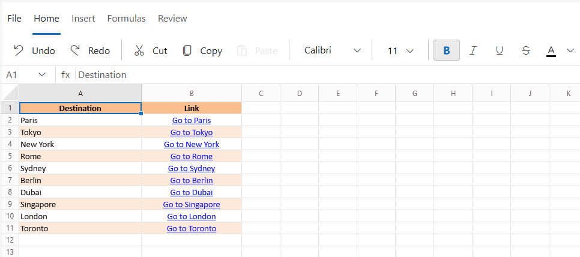
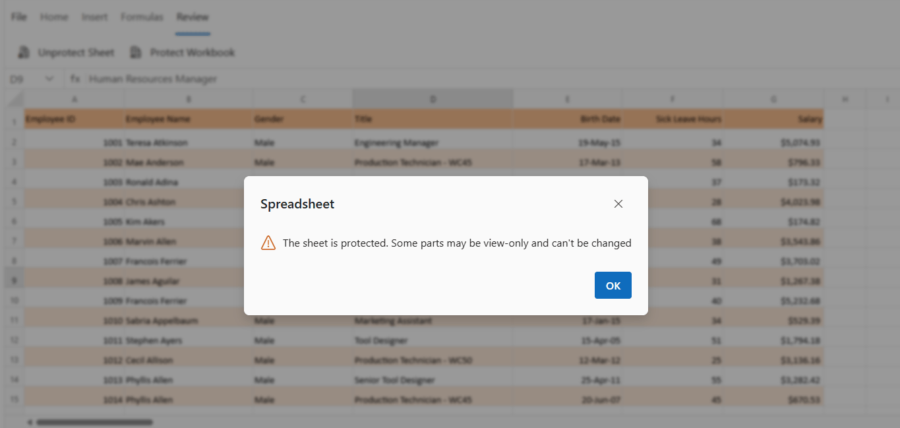

# Cell editing in the Blazor Spreadsheet component

Cell editing in the Blazor Spreadsheet component enables modification of cell content either directly within the spreadsheet or through the formula bar. This feature is enabled by default  but can be disabled by setting the [AllowEditing](https://help.syncfusion.com/cr/blazor/Syncfusion.Blazor.Spreadsheet.SfSpreadsheet.html#Syncfusion_Blazor_Spreadsheet_SfSpreadsheet_AllowEditing) property. To disable or enable cell editing, set the value of this property accordingly.

## Edit cell

Cell editing can be initiated directly through the UI using any of the following options:

- **Double-click** a cell to enter edit mode.  
- Press **F2** to activate editing for the selected cell.  
- Use the **formula bar** to modify the cell's contents.  
- Press **BACKSPACE** or **SPACE** to clear the cell and begin editing.

> For additional keyboard shortcuts related to cell editing, refer to the [Keyboard Shortcuts](./accessibility#keyboard-shortcuts) documentation.

## Update cell

When a cell is in an editable state, the updated content can be saved using one of the following methods:

* **Click** any cell other than the one currently being edited.
* Press **Enter** or **Tab** to save changes and move the selection.

### Update cell programmatically

Cell updates can be performed programmatically using the `UpdateCellAsync` method, which supports values such as strings, numbers, booleans, and formulas. This method modifies the content of a designated cell and is suitable for tasks requiring precise changes, such as updating statuses or values in specific locations. The cell address must include the sheet name—for example, **Sheet1!A1**—to enable updates across different sheets within the same workbook.

If a cell address is incorrectly formatted, refers to a non-existent sheet, or lies outside the valid range, the update is skipped without triggering an error. When a range is specified, such as **A1:B5**, the method automatically assigns the provided value to each cell within that range, allowing efficient batch updates.

| Parameter     | Type   | Description |
|---------------|--------|-------------|
| cellAddress | string | Specifies the address of the cell to update, including the sheet name (e.g., **Sheet1!A1**). Updates can be performed across different sheets. Invalid addresses—such as those referencing non-existent sheets or using improperly formatted cell references—are skipped without error. |
| cellValue | object | Defines the new value to assign to the cell. Supported types include strings, numbers, booleans, and formulas (e.g., `=SUM(A1:B1)`). When a range is specified (e.g., **A1:B5**), the value is automatically applied to all cells within the range. |




@using Syncfusion.Blazor.Spreadsheet
@inject HttpClient Http
<button @onclick="UpdateCell">Update Cell</button>

<SfSpreadsheet @ref=SpreadsheetRef DataSource="DataSourceBytes">
    <SpreadsheetRibbon></SpreadsheetRibbon>
</SfSpreadsheet>

@code {

    public byte[] DataSourceBytes { get; set; }
    public SfSpreadsheet SpreadsheetRef;

    protected override void OnInitialized()
    {
        string filePath = "wwwroot/Sample.xlsx";
        DataSourceBytes = File.ReadAllBytes(filePath);
    }

    private async Task UpdateCell()
    {
        // Updates cell A3 with a product name.
        await SpreadsheetRef.UpdateCellAsync("Sheet1!A3", "Tablet");

        // Updates cell B3 with a numeric value.
        await SpreadsheetRef.UpdateCellAsync("Sheet1!B3", 799);

        // Updates cell C3 with a formula.
        await SpreadsheetRef.UpdateCellAsync("Sheet1!C3", "=SUM(A3:B3)");
    }
}




## Cancel editing

To exit edit mode without saving changes, press the **ESCAPE** key. This action restores the original content of the cell and cancels any modifications made during editing.

## Events

The Blazor Spreadsheet provides events that are triggered during editing operations, such as [CellEditing](https://help.syncfusion.com/cr/blazor/Syncfusion.Blazor.Spreadsheet.CellEditingEventArgs.html) and [CellSaved](https://help.syncfusion.com/cr/blazor/Syncfusion.Blazor.Spreadsheet.CellSavedEventArgs.html). These events enable the execution of custom actions before and after a cell edit, allowing for validation, customization, and response handling.

### CellEditing

The `CellEditing` event is triggered before a cell enters edit mode, allowing for validation or cancellation of the edit operation.

**Purpose**

This event is useful for scenarios where cell editing needs to be controlled dynamically, such as restricting editing in specific ranges or preventing editing based on certain conditions.

**Event Arguments**

The event uses the [CellEditingEventArgs](https://help.syncfusion.com/cr/blazor/Syncfusion.Blazor.Spreadsheet.CellEditingEventArgs.html) class, which includes the following properties:

| Event Arguments | Description |
|---|---|
| RowIndex | The zero-based row index of the cell being edited. |
| ColIndex | The zero-based column index of the cell being edited. |
| Address | The address of the cell being edited (e.g., "A1"). |
| Value | The current value of the cell before editing. |
| Cancel | Set to `true` to cancel the editing operation. |




@using Syncfusion.Blazor.Spreadsheet

<SfSpreadsheet DataSource="DataSourceBytes" CellEditing="OnCellEditing">
<SpreadsheetRibbon></SpreadsheetRibbon>
</SfSpreadsheet>

@code {
    public byte[] DataSourceBytes { get; set; }
    
    protected override void OnInitialized()
    {
        string filePath = "wwwroot/Sample.xlsx";
        DataSourceBytes = File.ReadAllBytes(filePath);
    }

    private void OnCellEditing(CellEditingEventArgs args)
    {
        // Prevents editing in the first row.
        if (args.RowIndex == 0)
        {
            args.Cancel = true;
        }
    }
}



### CellSaved

The `CellSaved` event is raised after a cell's value has been successfully saved, providing details about the change and the action that triggered it.

**Purpose**

This event is useful for scenarios where post-editing actions are needed, such as logging the cell change, updating related data, or triggering additional UI updates.

**Event Arguments**

The event uses the [CellSavedEventArgs](https://help.syncfusion.com/cr/blazor/Syncfusion.Blazor.Spreadsheet.CellSavedEventArgs.html) class, which includes the following properties:

| Event Arguments | Description |
|---|---|
| Address | The address of the cell whose value was saved (e.g., "A1"). |
| Value | The new value of the cell after saving. |
| OldValue | The original value of the cell before saving. |
| Action | The action that triggered the save (e.g., "Edit", "Cut", "Paste", "Autofill"). |




@using Syncfusion.Blazor.Spreadsheet

<SfSpreadsheet DataSource="DataSourceBytes" CellSaved="OnCellSaved">
<SpreadsheetRibbon></SpreadsheetRibbon>
</SfSpreadsheet>

@code {
    public byte[] DataSourceBytes { get; set; }
    
    protected override void OnInitialized()
    {
        string filePath = "wwwroot/Sample.xlsx";
        DataSourceBytes = File.ReadAllBytes(filePath);
    }
    private void OnCellSaved(CellSavedEventArgs args)
    {
        // Log the cell change, including the action that triggered it.
        Console.WriteLine($"Cell {args.Address} changed from '{args.OldValue}' to '{args.Value}' by {args.Action}.");
    }
}



## Cell editing in protected sheet

In a protected sheet, only unlocked ranges can be edited based on the sheet's protection settings. Attempting to modify a locked range triggers an error message, as shown below:

N> For more information on worksheet protection, refer to the [Worksheet Protection](./protection) documentation.
