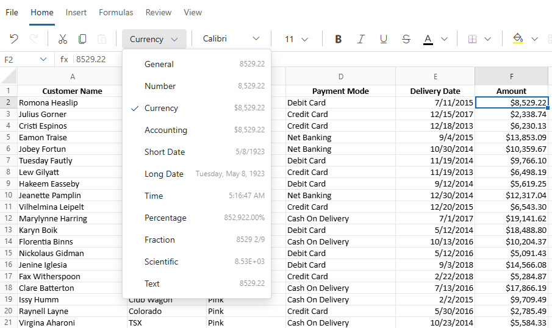
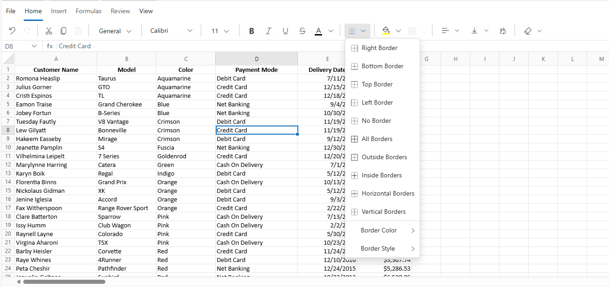

# Formatting in Blazor Spreadsheet Component

Formatting options improve data readability and presentation. The Blazor Spreadsheet component provides various formatting options, which can be categorized into:

* Number Formatting
* Text Formatting
* Cell Formatting

The entire formatting functionality can be globally enabled or disabled using the [`AllowCellFormatting`](https://help.syncfusion.com/cr/blazor/Syncfusion.Blazor.Spreadsheet.SfSpreadsheet.html#Syncfusion_Blazor_Spreadsheet_SfSpreadsheet_AllowCellFormatting) property. By default, `AllowCellFormatting` is set to **true**.

## Number Formatting

Number formatting in the Blazor Spreadsheet component controls how numeric, date, and time values are displayed without altering their underlying data. The component offers Excel-like number formats that are culture-aware, integrate with undo/redo operations, and respect worksheet protection settings. These formats can be applied through the Ribbon toolbar or programmatically.

The number formatting functionality can be globally enabled or disabled using the [`AllowNumberFormatting`](https://help.syncfusion.com/cr/blazor/Syncfusion.Blazor.Spreadsheet.SfSpreadsheet.html#Syncfusion_Blazor_Spreadsheet_SfSpreadsheet_AllowNumberFormatting) property. By default, `AllowNumberFormatting` is set to **true**.

### Supported Categories

The Blazor Spreadsheet component provides several built-in number format categories to control how numeric, date, and time values are displayed. These formats are culture-aware and ensure proper rendering of decimal separators, currency symbols, and date/time patterns.

| Category | Example Format String | Result Example |
|---|---|---|
| General | `General` | 1234.567 |
| Number | `#,##0.00` | 1234.57 |
| Currency | `$#,##0.00` | $1,234.57 |
| Accounting | `_($* #,##0.00_);_($* (#,##0.00);_($* "-"??_);_(@_)` | $ 1,234.57 |
| Percentage | `0.00%` | 8.90% |
| Scientific | `0.00E+00` | 1.23E+03 |
| Fraction | `# ?/?` | 123 1/2 |
| Short Date | `m/d/yyyy` | 03/15/2025 |
| Long Date | `dddd, mmmm dd, yyyy` | Saturday, March 15, 2025 |
| Time | `h:mm:ss AM/PM` | 3:45:30 PM |

### Applying Number Formats via the UI

Number formats can be applied through the UI using the following method:

*   **Ribbon**: Navigate to the **Home** tab and use the **Number Format** dropdown. This dropdown displays previews of built-in formats based on the current culture.

### Applying Number Formats Programmatically

Number formats can be applied programmatically to the current selection or a specified range using the [NumberFormatAsync](https://help.syncfusion.com/cr/blazor/Syncfusion.Blazor.Spreadsheet.SfSpreadsheet.html#Syncfusion_Blazor_Spreadsheet_SfSpreadsheet_NumberFormatAsync_System_String_System_String_) method. This method accepts a format string and an optional cell address.

| Parameter | Type | Description |
| -- | -- | -- |
| format | string | The built-in format or a supported custom pattern. |
| cellAddress | string (Optional) | The address of the target range where the number format was applied (e.g., `"Sheet1!A2:A5"` or `"A2:A5"`).When cellAddress is omitted, the current selection is formatted. |




@using Syncfusion.Blazor.Spreadsheet

<button @onclick="ApplyFormat">Apply number format</button>
<SfSpreadsheet @ref="SpreadsheetInstance" DataSource="DataSourceBytes">
    <SpreadsheetRibbon></SpreadsheetRibbon>
</SfSpreadsheet>

@code {
    public SfSpreadsheet SpreadsheetInstance;
    public byte[] DataSourceBytes { get; set; }

    protected override void OnInitialized()
    {
        string filePath = "wwwroot/Sample.xlsx";
        DataSourceBytes = File.ReadAllBytes(filePath);
    }

    private async Task ApplyFormat()
    {
        // Apply custom percentage format to range A2:A5
        await SpreadsheetInstance.NumberFormatAsync("0.00%", "A2:A5");
        // Apply custom short date format to cell D1 on Sheet2
        await SpreadsheetInstance.NumberFormatAsync("mm/dd/yyyy", "Sheet2!D1");
    }
}



If the built-in formats do not meet specific requirements, custom patterns can be applied programmatically using the `NumberFormatAsync` method. Currently, a dedicated UI dialog for defining custom formats is not available. They are exclusively supported through the API. Patterns must be compatible with Excel-style format strings.

## Text and Cell Formatting

Text and cell formatting enhances the visual presentation of data by applying styles such as font changes, colors, borders, and alignment to individual cells or cell ranges. This helps organize content and emphasize important information for faster interpretation.

### Text and cell formatting options include:

*   **Bold** - Applies a heavier font weight to make the text stand out in the Spreadsheet.

*   **Italic** - Slants the text to give it a distinct look, often used for emphasis or to highlight differences.

*   **Underline** - Adds a line below the text, commonly used for emphasis or to indicate hyperlinks.

*   **Strikethrough** - Draws a line through the text, often used to show completed tasks or outdated information.

*   **Font Family** - Changes the typeface of the text (e.g., Arial, Calibri, Times New Roman, and more) to enhance readability or visual appeal.

*   **Font Size** - Adjusts the size of the text to create visual hierarchy or improve readability in the Spreadsheet.

*   **Font Color** - Changes the color of the text to improve visual hierarchy or to organize information using color codes.

*   **Fill Color** - Adds color to the cell background to visually organize data or highlight important information.

*   **Horizontal Alignment** - Controls the position of text from left to right within a cell. Options include:
    *   **Left** - Default for text
    *   **Center** - Useful for headings
    *   **Right** - Default for numbers

*   **Vertical Alignment** - Controls the position of text from top to bottom within a cell. Options include:
    *   **Top** – Aligns content to the top of the cell
    *   **Middle** – Centers content vertically
    *   **Bottom** – Default alignment

*   **Wrap Text** - Displays long content on multiple lines within a single cell, preventing it from overflowing into adjacent cells. To enable text wrapping:
    1.  Select the target cell or range (e.g., C5).
    2.  Go to the Home tab.
    3.  Click Wrap Text in the ribbon to toggle text wrapping for the selected cells.

Text and cell formatting can be applied or removed from a cell or range by using the options available in the component's built-in **Ribbon** under the **Home** tab.

### Borders

Borders visually separate cells and define tables or sections within a worksheet. The Blazor Spreadsheet component supports various border types, styles, colors, and sizes. The available border options are:

| Border Type | Description |
|-------------|-------------|
| Top Border | Applies a border to the top edge of a cell or range of cells. |
| Left Border | Applies a border to the left edge of a cell or range of cells. |
| Right Border | Applies a border to the right edge of a cell or range of cells. |
| Bottom Border | Applies a border to the bottom edge of a cell or range of cells. |
| No Border | Removes all borders from a cell or range of cells. |
| All Border | Applies borders to all sides of a cell or range of cells. |
| Horizontal Border | Applies borders to the top and bottom edges of a cell or range. |
| Vertical Border | Applies borders to the left and right edges of a cell or range. |
| Outside Border | Applies borders to the outer edges of a range of cells. |
| Inside Border | Applies borders to the inner edges of a range of cells |

Border color, size, and style can also be customized. The supported sizes and styles are:

| Type   | Description                      |
|--------|----------------------------------|
| Thin   | Specifies a `1px` border size (default). |
| Medium | Specifies a `2px` border size.       |
| Thick  | Specifies a `3px` border size.       |
| Solid  | Creates a `solid` border (default).  |
| Dashed | Creates a `dashed` border.|
| Dotted | Creates a `dotted` border.|
| Double | Creates a `double` border.|

### Applying Borders via the UI

Borders can be applied through the UI using the following method:

*   **Ribbon**: Navigate to the **Home** tab in the Ribbon toolbar and select the **Borders** dropdown. Styling options such as color, size, and style are available within the same menu.

### Applying Borders Programmatically

Borders can be applied programmatically to a specific cell or range of cells using the [SetBordersAsync](https://help.syncfusion.com/cr/blazor/Syncfusion.Blazor.Spreadsheet.SfSpreadsheet.html#Syncfusion_Blazor_Spreadsheet_SfSpreadsheet_SetBordersAsync_Syncfusion_Blazor_Spreadsheet_BorderType_Syncfusion_XlsIO_ExcelLineStyle_System_String_System_String) method. The available parameters in the `SetBordersAsync` method are:

| Parameter | Type | Description |
| -- | -- | -- |
| borderType | BorderType | Specifies the type of border to apply (e.g., `BorderType.OutsideBorders`, `BorderType.AllBorders`, `BorderType.TopBorder`). |
| lineStyle | Syncfusion.XlsIO.ExcelLineStyle | Defines the line style of the border (e.g., `Syncfusion.XlsIO.ExcelLineStyle.Thin`, `Syncfusion.XlsIO.ExcelLineStyle.Medium`, `Syncfusion.XlsIO.ExcelLineStyle.Dashed`). |
| borderColor | string | The border color in hexadecimal or named CSS color format (e.g., `"#000000"`, `"red"`, `"#2196F3"`). |
| cellAddress | string (Optional) | The address of the target cell or range (e.g., `"A1"`, `"A1:C5"`, or `"Sheet2!B2:D4"`). If omitted, the operation targets the current selection. |



@using Syncfusion.Blazor.Spreadsheet
@using Syncfusion.XlsIO

<button @onclick="ApplyBorders">Apply Borders</button>
<SfSpreadsheet @ref="SpreadsheetInstance" DataSource="DataSourceBytes"></SfSpreadsheet>

@code {
    public SfSpreadsheet SpreadsheetInstance { get; set; }
    public byte[] DataSourceBytes { get; set; }

    protected override void OnInitialized()
    {
        string filePath = "wwwroot/Sample.xlsx";
        DataSourceBytes = File.ReadAllBytes(filePath);
    }
    public async Task ApplyBorders()
    {
        await SpreadsheetInstance.SetBordersAsync(BorderType.OutsideBorders, ExcelLineStyle.Medium, "#FF0000", "A1:C5");
        await SpreadsheetInstance.SetBordersAsync(BorderType.AllBorders, ExcelLineStyle.Dashed, "#0000FF", "B2:D4");
    }
}



### Limitations

*   Conditional formatting is currently not supported in the Blazor Spreadsheet component.
*   A custom number format UI dialog is not available, custom formats must be applied using the API.