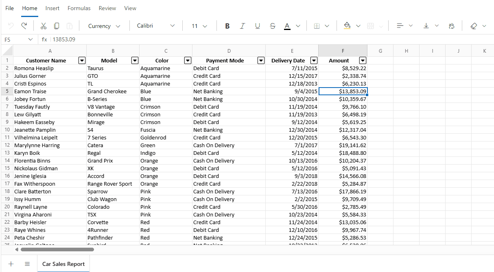
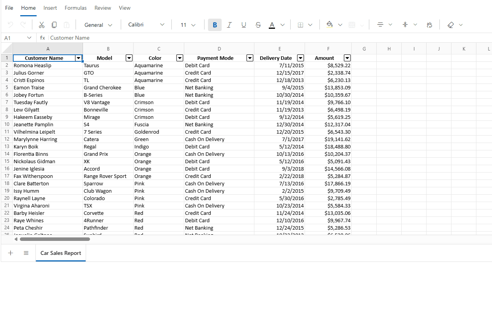

# Formatting in Blazor Spreadsheet Component

Formatting options improve data readability and presentation. The [Blazor Spreadsheet Editor](https://www.syncfusion.com/spreadsheet-editor-sdk/blazor-spreadsheet-editor) component provides various formatting options, which can be categorized into:

* Number Formatting
* Text Formatting
* Cell Formatting

The entire formatting functionality can be globally enabled or disabled using the [AllowCellFormatting](https://help.syncfusion.com/cr/blazor/Syncfusion.Blazor.Spreadsheet.SfSpreadsheet.html#Syncfusion_Blazor_Spreadsheet_SfSpreadsheet_AllowCellFormatting) property. By default, [AllowCellFormatting](https://help.syncfusion.com/cr/blazor/Syncfusion.Blazor.Spreadsheet.SfSpreadsheet.html#Syncfusion_Blazor_Spreadsheet_SfSpreadsheet_AllowCellFormatting) is set to **true**.

## Number Formatting

Number formatting in the Blazor Spreadsheet component controls how numeric, date, and time values are displayed without altering their underlying data. The component offers Excel-like number formats that are culture-aware, integrate with undo/redo operations, and respect worksheet protection settings. These formats can be applied through the Ribbon toolbar or programmatically.

The number formatting functionality can be globally enabled or disabled using the [AllowNumberFormatting](https://help.syncfusion.com/cr/blazor/Syncfusion.Blazor.Spreadsheet.SfSpreadsheet.html#Syncfusion_Blazor_Spreadsheet_SfSpreadsheet_AllowNumberFormatting) property. By default, [AllowNumberFormatting](https://help.syncfusion.com/cr/blazor/Syncfusion.Blazor.Spreadsheet.SfSpreadsheet.html#Syncfusion_Blazor_Spreadsheet_SfSpreadsheet_AllowNumberFormatting) is set to **true**.

### Supported Categories

The Blazor Spreadsheet component provides several built-in number format categories to control how numeric, date, and time values are displayed. These formats are culture-aware and ensure proper rendering of decimal separators, currency symbols, and date/time patterns.

| Category | Example Format String | Result Example |
|---|---|---|
| General | `General` | 1234.567 |
| Number | `#,##0.00` | 1234.57 |
| Currency | `$#,##0.00` | $1,234.57 |
| Accounting | `_($* #,##0.00_);_($* (#,##0.00);_($* "-"??_);_(@_)` | $ 1,234.57 |
| Percentage | `0.00%` | 8.90% |
| Scientific | `0.00E+00` | 1.23E+03 |
| Fraction | `# ?/?` | 123 1/2 |
| Short Date | `m/d/yyyy` | 03/15/2025 |
| Long Date | `dddd, mmmm dd, yyyy` | Saturday, March 15, 2025 |
| Time | `h:mm:ss AM/PM` | 3:45:30 PM |

### Applying Number Formats via UI

Number formats can be applied through the UI using the following method:

* Click the **Home** tab in the Ribbon.
* Open the **Number Format** dropdown.
* The dropdown displays previews of built-in formats based on the current culture.

### Applying Number Formats Programmatically

Number formats can be applied programmatically to the current selection or a specified range using the [NumberFormatAsync()](https://help.syncfusion.com/cr/blazor/Syncfusion.Blazor.Spreadsheet.SfSpreadsheet.html#Syncfusion_Blazor_Spreadsheet_SfSpreadsheet_NumberFormatAsync_System_String_System_String_) method. This method accepts a format string and an optional cell address.

| Parameter | Type | Description |
| -- | -- | -- |
| format | string | The built-in format or a supported custom pattern. |
| cellAddress | string (Optional) | The address of the target range where the number format is applied (e.g., `"Sheet1!A2:A5"` or `"A2:A5"`). If the sheet name is not specified, the number format is applied to the specified range in the active sheet. When cellAddress is omitted, the current selection is formatted. |




@page "/"
@using Syncfusion.Blazor.Spreadsheet

<button @onclick="ApplyFormat">Apply number format</button>
<SfSpreadsheet @ref="SpreadsheetInstance" DataSource="DataSourceBytes">
    <SpreadsheetRibbon></SpreadsheetRibbon>
</SfSpreadsheet>

@code {
    public SfSpreadsheet SpreadsheetInstance;
    public byte[] DataSourceBytes { get; set; }

    protected override void OnInitialized()
    {
        string filePath = "wwwroot/Sample.xlsx";
        DataSourceBytes = File.ReadAllBytes(filePath);
    }

    private async Task ApplyFormat()
    {
        // Apply custom percentage format to range A2:A5
        await SpreadsheetInstance.NumberFormatAsync("0.00%", "A2:A5");
        // Apply custom short date format to cell D1 on Sheet2
        await SpreadsheetInstance.NumberFormatAsync("mm/dd/yyyy", "Sheet2!D1");
    }
}



N> If the built-in formats do not meet specific requirements, custom patterns can be applied programmatically using the [NumberFormatAsync()](https://help.syncfusion.com/cr/blazor/Syncfusion.Blazor.Spreadsheet.SfSpreadsheet.html#Syncfusion_Blazor_Spreadsheet_SfSpreadsheet_NumberFormatAsync_System_String_System_String_) method. Patterns must be compatible with Excel-style format strings.

## Text and Cell Formatting

Text and cell formatting enhances the visual presentation of data by applying styles such as font changes, colors, borders, and alignment to individual cells or cell ranges. This helps organize content and emphasize important information for faster interpretation.

### Text Formatting

Text formatting options include:

*   **Bold** - Applies a heavier font weight to make the text stand out in the Spreadsheet.

*   **Italic** - Slants the text to give it a distinct look, often used for emphasis or to highlight differences.

*   **Underline** - Adds a line below the text, commonly used for emphasis or to indicate hyperlinks.

*   **Strikethrough** - Draws a line through the text, often used to show completed tasks or outdated information.

*   **Font Family** - Changes the typeface of the text (e.g., Arial, Calibri, Times New Roman, and more) to enhance readability or visual appeal.

*   **Font Size** - Adjusts the size of the text to create visual hierarchy or improve readability in the Spreadsheet.

*   **Font Color** - Changes the color of the text to improve visual hierarchy or to organize information using color codes.

### Cell Formatting

Cell formatting options include:

*   **Fill Color** - Adds color to the cell background to visually organize data or highlight important information.

*   **Horizontal Alignment** - Controls the position of text from left to right within a cell. Options include:
    *   **Left**: Default for text.
    *   **Center**: Useful for headings.
    *   **Right**: Default for numbers.

*   **Vertical Alignment** - Controls the position of text from top to bottom within a cell. Options include:
    *   **Top**: Aligns content to the top of the cell.
    *   **Middle**: Centers content vertically.
    *   **Bottom**: Default alignment.

*   **Wrap Text** - Displays long content on multiple lines within a single cell, preventing it from overflowing into adjacent cells. To enable text wrapping:
    1.  Select the target cell or range (e.g., C5).
    2.  Go to the **Home** tab.
    3.  Click **Wrap Text** in the ribbon to toggle text wrapping.

Text and cell formatting can be applied or removed from a cell or range by using the options available in the component's built-in **Ribbon** under the **Home** tab.

### Borders

Borders visually separate cells and define tables or sections within a worksheet. The Blazor Spreadsheet component supports various border types, styles, colors, and sizes. The available border options are:

| Border Type | Description |
|-------------|-------------|
| Top Border | Applies a border to the top edge of a cell or range of cells. |
| Left Border | Applies a border to the left edge of a cell or range of cells. |
| Right Border | Applies a border to the right edge of a cell or range of cells. |
| Bottom Border | Applies a border to the bottom edge of a cell or range of cells. |
| No Border | Removes all borders from a cell or range of cells. |
| All Border | Applies borders to all sides of a cell or range of cells. |
| Horizontal Border | Applies borders to the top and bottom edges of a cell or range. |
| Vertical Border | Applies borders to the left and right edges of a cell or range. |
| Outside Border | Applies borders to the outer edges of a range of cells. |
| Inside Border | Applies borders to the inner edges of a range of cells. |

Border color, size, and style can also be customized. The supported sizes and styles are:

| Type | Description |
|--------|----------------------------------|
| Thin | Specifies a `1px` border size. |
| Medium | Specifies a `2px` border size. |
| Thick | Specifies a `3px` border size. |
| Solid | Creates a `solid` border. |
| Dashed | Creates a `dashed` border. |
| Dotted | Creates a `dotted` border. |
| Double | Creates a `double` border. |

### Applying Borders via UI

Borders can be applied through the UI using the following method:

* Click the **Home** tab in the Ribbon.
* In the **Font** group, open the **Borders** dropdown.
* Select the desired border style, color, and size from the dropdown.

### Applying Borders Programmatically

Borders can be applied programmatically to a specific cell or range of cells using the [SetBordersAsync()](https://help.syncfusion.com/cr/blazor/Syncfusion.Blazor.Spreadsheet.SfSpreadsheet.html#Syncfusion_Blazor_Spreadsheet_SfSpreadsheet_SetBordersAsync_Syncfusion_Blazor_Spreadsheet_BorderType_Syncfusion_XlsIO_ExcelLineStyle_System_String_System_String_) method. The available parameters in the [SetBordersAsync()](https://help.syncfusion.com/cr/blazor/Syncfusion.Blazor.Spreadsheet.SfSpreadsheet.html#Syncfusion_Blazor_Spreadsheet_SfSpreadsheet_SetBordersAsync_Syncfusion_Blazor_Spreadsheet_BorderType_Syncfusion_XlsIO_ExcelLineStyle_System_String_System_String_) method are:

| Parameter | Type | Description |
| -- | -- | -- |
| borderType | BorderType | Specifies the type of border to apply (e.g., `BorderType.OutsideBorders`, `BorderType.AllBorders`, `BorderType.TopBorder`). |
| lineStyle | Syncfusion.XlsIO.ExcelLineStyle | Defines the line style of the border (e.g., `Syncfusion.XlsIO.ExcelLineStyle.Thin`, `Syncfusion.XlsIO.ExcelLineStyle.Medium`, `Syncfusion.XlsIO.ExcelLineStyle.Dashed`). |
| borderColor | string | The border color in hexadecimal or named CSS color format (e.g., `"#000000"`, `"red"`, `"#2196F3"`). |
| cellAddress | string (Optional) | The address of the target cell or range (e.g., `"A1"`, `"A1:C5"`, or `"Sheet2!B2:D4"`). If omitted, the operation targets the current selection. |



@page "/"
@using Syncfusion.Blazor.Spreadsheet
@using Syncfusion.XlsIO

<button @onclick="ApplyBorders">Apply Borders</button>
<SfSpreadsheet @ref="SpreadsheetInstance" DataSource="DataSourceBytes"></SfSpreadsheet>

@code {
    public SfSpreadsheet SpreadsheetInstance { get; set; }
    public byte[] DataSourceBytes { get; set; }

    protected override void OnInitialized()
    {
        string filePath = "wwwroot/Sample.xlsx";
        DataSourceBytes = File.ReadAllBytes(filePath);
    }
    public async Task ApplyBorders()
    {
        await SpreadsheetInstance.SetBordersAsync(BorderType.OutsideBorders, ExcelLineStyle.Medium, "#FF0000", "A1:C5");
        await SpreadsheetInstance.SetBordersAsync(BorderType.AllBorders, ExcelLineStyle.Dashed, "#0000FF", "B2:D4");
    }
}



## Conditional Formatting

Conditional formatting enables automatic visual formatting of cells based on specified conditions, helping to highlight data patterns, identify outliers, and improve data interpretation. The Blazor Spreadsheet component provides comprehensive conditional formatting capabilities including color scales, data bars, icon sets, and custom formatting rules. These formats are Excel-compatible, respect worksheet protection settings, and integrate seamlessly with undo/redo operations. To control this functionality, use the [AllowConditionalFormat](https://help.syncfusion.com/cr/blazor/Syncfusion.Blazor.Spreadsheet.SfSpreadsheet.html#Syncfusion_Blazor_Spreadsheet_SfSpreadsheet_AllowConditionalFormat) property, which enables or disables conditional formatting support in the Spreadsheet. The default value of the [AllowConditionalFormat](https://help.syncfusion.com/cr/blazor/Syncfusion.Blazor.Spreadsheet.SfSpreadsheet.html#Syncfusion_Blazor_Spreadsheet_SfSpreadsheet_AllowConditionalFormat) property is **true**.




@page "/"
@using Syncfusion.Blazor.Spreadsheet

<SfSpreadsheet AllowConditionalFormat="false">
    <SpreadsheetRibbon></SpreadsheetRibbon>
</SfSpreadsheet>




### Applying Conditional Formatting

Conditional formatting can be applied through the UI or programmatically.

### Conditional formatting via UI

To apply conditional formatting through the UI:

1.  Select the target cell range.
2.  Click the **Conditional Formatting** button in the **Home** tab of the Ribbon.
3.  Choose the desired formatting rule type and configure the conditions.

### Conditional formatting programmatically

Apply conditional formatting using the [ConditionalFormatAsync()](https://help.syncfusion.com/cr/blazor/Syncfusion.Blazor.Spreadsheet.SfSpreadsheet.html#Syncfusion_Blazor_Spreadsheet_SfSpreadsheet_ConditionalFormatAsync_Syncfusion_Blazor_Spreadsheet_ConditionalFormatRule_) method with a [ConditionalFormatRule](https://help.syncfusion.com/cr/blazor/Syncfusion.Blazor.Spreadsheet.ConditionalFormatRule.html) object to define the condition, format type, range, and styling.

The following table lists the commonly used properties of `ConditionalFormatRule`:

| Property | Type | Description |
| -- | -- | -- |
| [ConditionalFormatType](https://help.syncfusion.com/cr/blazor/Syncfusion.Blazor.Spreadsheet.ConditionalFormatType.html) | enum | Specifies the rule type (for example, `GreaterThan`, `Top10Items`, `BlueDataBar`). |
| PrimaryValue | string | The primary value used to evaluate the condition (for example, the threshold for `GreaterThan`). |
| SecondaryValue | string (Optional) | The secondary value used by rules that need a range, such as `Between`. |
| Range | string | The cell range the rule applies to (for example, `"B2:B50"`). |
| [ConditionalFormatColor](https://help.syncfusion.com/cr/blazor/Syncfusion.Blazor.Spreadsheet.ConditionalFormatColor.html) | enum | The preset color style for the rule. Applies only to Highlight Cells Rules and Top/Bottom Rules. |
| FontColor | string | The font color used when custom styling is enabled. |
| BackgroundColor | string | The cell background color used when custom styling is enabled. |
| FontStyle | string | The italic style for the matching cells, such as `"italic"`. |
| FontWeight | string | The font weight for the matching cells, such as `"bold"`. |
| Underline | bool | When **true**, applies an underline decoration to the matching cells. |

**Code Example**



@page "/"
@using Syncfusion.Blazor.Spreadsheet

<button @onclick="HighlightHighScores">Highlight Scores greater than 80</button>
<SfSpreadsheet @ref="SpreadsheetInstance" DataSource="DataSourceBytes">
    <SpreadsheetRibbon></SpreadsheetRibbon>
</SfSpreadsheet>

@code {
    public SfSpreadsheet SpreadsheetInstance { get; set; }
    public byte[] DataSourceBytes { get; set; }

    protected override void OnInitialized()
    {
        string filePath = "wwwroot/StudentScores.xlsx";
        DataSourceBytes = File.ReadAllBytes(filePath);
    }

    private async Task HighlightHighScores()
    {
        var rule = new ConditionalFormatRule
        {
            ConditionalFormatType = ConditionalFormatType.GreaterThan,
            PrimaryValue = "80",
            Range = "B2:B50",
            ConditionalFormatColor = ConditionalFormatColor.GreenFillWithDarkGreenText
        };

        await SpreadsheetInstance.ConditionalFormatAsync(rule);
    }
}



### Highlight Cells Rules

Highlight cells rules apply preset color formatting based on cell values or text content. This rule type is ideal for quickly identifying cells that meet specific value-based conditions. The highlighting uses combinations of fill colors and text colors to ensure visibility while maintaining readability.

**Supported Highlight Cell Rule Types**

| ConditionalFormatType | Description |
|---|---|
| `GreaterThan` | Highlights cells with values greater than a specified threshold. |
| `LessThan` | Highlights cells with values less than a specified threshold. |
| `Between` | Highlights cells with values falling within a specified range. |
| `EqualTo` | Highlights cells with values equal to a specified value. |
| `ContainsText` | Highlights cells containing specified text. |
| `DateOccur` | Highlights cells containing dates matching a specified time period. |
| `Duplicate` | Highlights cells with duplicate values within the evaluated range. |
| `Unique` | Highlights cells with unique values within the evaluated range. |

**Available Preset Color Styles**

| ConditionalFormatColor | Background Color | Text Color |
|---|---|---|
| `GreenFillWithDarkGreenText` | Green | Dark Green |
| `YellowFillWithDarkYellowText` | Yellow | Dark Yellow |
| `RedFillWithDarkRedText` | Red | Dark Red |
| `RedFill` | Red | Default |
| `RedText` | Default | Red |

N> The [ConditionalFormatColor](https://help.syncfusion.com/cr/blazor/Syncfusion.Blazor.Spreadsheet.ConditionalFormatColor.html) enum applies only to **Highlight Cells Rules** and **Top/Bottom Rules**. Data bars, color scales, and icon sets control color through the `ConditionalFormatType` itself (for example, `BlueDataBar`, `GreenYellowRedColorScale`, `ThreeTrafficLights1`).

**Code Example**



@page "/"
@using Syncfusion.Blazor.Spreadsheet

<button @onclick="HighlightHighScores">Highlight Scores greater than 80</button>
<SfSpreadsheet @ref="SpreadsheetInstance" DataSource="DataSourceBytes">
    <SpreadsheetRibbon></SpreadsheetRibbon>
</SfSpreadsheet>

@code {
    public SfSpreadsheet SpreadsheetInstance { get; set; }
    public byte[] DataSourceBytes { get; set; }

    protected override void OnInitialized()
    {
        string filePath = "wwwroot/StudentScores.xlsx";
        DataSourceBytes = File.ReadAllBytes(filePath);
    }

    private async Task HighlightHighScores()
    {
        var rule = new ConditionalFormatRule
        {
            ConditionalFormatType = ConditionalFormatType.GreaterThan,
            PrimaryValue = "80",
            Range = "B2:B50",
            ConditionalFormatColor = ConditionalFormatColor.GreenFillWithDarkGreenText
        };

        await SpreadsheetInstance.ConditionalFormatAsync(rule);
    }
}



### Top/Bottom Rules

Top/Bottom rules apply formatting based on statistical rankings and averages within a range. This rule type is beneficial for identifying performance outliers, top performers, or values that deviate from the average. These rules are particularly useful for large datasets where manual identification would be time-consuming.

**Supported Top/Bottom Rule Types**

| ConditionalFormatType | Description |
|---|---|
| `Top10Items` | Highlights the top N items in the range by value rank. |
| `Bottom10Items` | Highlights the bottom N items in the range by value rank. |
| `Top10Percentage` | Highlights the top N percent of items in the range by value. |
| `Bottom10Percentage` | Highlights the bottom N percent of items in the range by value. |
| `AboveAverage` | Highlights cells with values above the average of the range. |
| `BelowAverage` | Highlights cells with values below the average of the range. |

**Code Example**



@page "/"
@using Syncfusion.Blazor.Spreadsheet

<button @onclick="HighlightTopPerformers">Highlight Top 10 Sales</button>
<SfSpreadsheet @ref="SpreadsheetInstance" DataSource="DataSourceBytes">
    <SpreadsheetRibbon></SpreadsheetRibbon>
</SfSpreadsheet>

@code {
    public SfSpreadsheet SpreadsheetInstance { get; set; }
    public byte[] DataSourceBytes { get; set; }

    protected override void OnInitialized()
    {
        string filePath = "wwwroot/SalesData.xlsx";
        DataSourceBytes = File.ReadAllBytes(filePath);
    }

    private async Task HighlightTopPerformers()
    {
        var rule = new ConditionalFormatRule
        {
            ConditionalFormatType = ConditionalFormatType.Top10Items,
            Range = "C2:C100",
            ConditionalFormatColor = ConditionalFormatColor.GreenFillWithDarkGreenText
        };

        await SpreadsheetInstance.ConditionalFormatAsync(rule);
    }
}



### Data Bars

Data bars provide in-cell graphical representation of values, where the bar length corresponds to the cell value relative to the range. The longest bar represents the highest value, while shorter bars represent lower values. Data bars are particularly effective for visualizing trends and comparing values across a large dataset without requiring separate chart elements.

**Supported Data Bar Types**

| ConditionalFormatType | Bar Color |
|---|---|
| `BlueDataBar` | Blue |
| `GreenDataBar` | Green |
| `RedDataBar` | Red |
| `OrangeDataBar` | Orange |
| `LightBlueDataBar` | Light Blue |
| `PurpleDataBar` | Purple |

**Code Example**



@page "/"
@using Syncfusion.Blazor.Spreadsheet

<button @onclick="ApplyRevenueDataBars">Visualize Revenue</button>
<SfSpreadsheet @ref="SpreadsheetInstance" DataSource="DataSourceBytes">
    <SpreadsheetRibbon></SpreadsheetRibbon>
</SfSpreadsheet>

@code {
    public SfSpreadsheet SpreadsheetInstance { get; set; }
    public byte[] DataSourceBytes { get; set; }

    protected override void OnInitialized()
    {
        string filePath = "wwwroot/FinancialData.xlsx";
        DataSourceBytes = File.ReadAllBytes(filePath);
    }

    private async Task ApplyRevenueDataBars()
    {
        var rule = new ConditionalFormatRule
        {
            ConditionalFormatType = ConditionalFormatType.GreenDataBar,
            Range = "D2:D25"
        };

        await SpreadsheetInstance.ConditionalFormatAsync(rule);
    }
}



### Color Scales

Color scales apply a gradient of colors to cells based on their values within the range. The color intensity corresponds to the cell value: minimum values receive one color, maximum values receive another color, and intermediate values receive proportional color blends. This approach provides intuitive visual representation of value distributions across a dataset.

**Supported Color Scale Formats**

**Three-Color Scales (Min → Mid → Max)**

| ConditionalFormatType | Scale |
|---|---|
| `GreenYellowRedColorScale` | Green → Yellow → Red |
| `RedYellowGreenColorScale` | Red → Yellow → Green |
| `GreenWhiteRedColorScale` | Green → White → Red |
| `RedWhiteGreenColorScale` | Red → White → Green |

**Two-Color Scales (Min → Max)**

| ConditionalFormatType | Scale |
|---|---|
| `BlueWhiteRedColorScale` | Blue → White → Red |
| `RedWhiteBlueColorScale` | Red → White → Blue |
| `GreenWhiteColorScale` | Green → White |
| `WhiteGreenColorScale` | White → Green |
| `RedWhiteColorScale` | Red → White |
| `WhiteRedColorScale` | White → Red |
| `GreenYellowColorScale` | Green → Yellow |
| `YellowGreenColorScale` | Yellow → Green |

**Code Example**



@page "/"
@using Syncfusion.Blazor.Spreadsheet

<button @onclick="ApplyTemperatureScale">Apply Temperature Color Scale</button>
<SfSpreadsheet @ref="SpreadsheetInstance" DataSource="DataSourceBytes">
    <SpreadsheetRibbon></SpreadsheetRibbon>
</SfSpreadsheet>

@code {
    public SfSpreadsheet SpreadsheetInstance { get; set; }
    public byte[] DataSourceBytes { get; set; }

    protected override void OnInitialized()
    {
        string filePath = "wwwroot/TemperatureData.xlsx";
        DataSourceBytes = File.ReadAllBytes(filePath);
    }

    private async Task ApplyTemperatureScale()
    {
        var rule = new ConditionalFormatRule
        {
            ConditionalFormatType = ConditionalFormatType.BlueWhiteRedColorScale,
            Range = "B2:B30"
        };

        await SpreadsheetInstance.ConditionalFormatAsync(rule);
    }
}



### Icon Sets

Icon sets display symbolic representations of cell values, where different icons or icon variations indicate value ranges or performance levels. Each icon represents a percentile range or performance tier, making it easy to quickly identify value categories at a glance. Icon sets are effective for status reporting, performance ratings, and categorical analysis.

**Supported Icon Sets by Category**

**Arrow Icons (Directional Indicators)**

| ConditionalFormatType | Color | Levels |
|---|---|---|
| `ThreeArrows` | Colored (↑ ↔ ↓) | 3 |
| `ThreeArrowsGray` | Grayscale (↑ ↔ ↓) | 3 |
| `FourArrows` | Colored (↑↑ ↑ ↓ ↓↓) | 4 |
| `FourArrowsGray` | Grayscale (↑↑ ↑ ↓ ↓↓) | 4 |
| `FiveArrows` | Colored (↑↑ ↑ ↔ ↓ ↓↓) | 5 |
| `FiveArrowsGray` | Grayscale (↑↑ ↑ ↔ ↓ ↓↓) | 5 |

**Traffic Light Icons (Status Indicators)**

| ConditionalFormatType | Style | Levels |
|---|---|---|
| `ThreeTrafficLights1` | Standard Lights | 3 |
| `ThreeTrafficLights2` | Alternate Lights | 3 |
| `FourTrafficLights` | Four Lights | 4 |

**Symbol and Sign Icons (Status and Warning)**

| ConditionalFormatType | Icon Type | Levels |
|---|---|---|
| `ThreeSigns` | Caution Signs | 3 |
| `ThreeSymbols` | Colored Symbols (✓ ○ ✗) | 3 |
| `ThreeSymbols2` | Alternative Symbols | 3 |

**Rating and Quality Icons**

| ConditionalFormatType | Icon Type | Levels |
|---|---|---|
| `FourRating` | Stars (☆☆☆☆ to ★★★★) | 4 |
| `FiveRating` | Stars (☆☆☆☆☆ to ★★★★★) | 5 |
| `FiveBoxes` | Boxes/Quarters | 5 |
| `FiveQuarters` | Quarter Blocks | 5 |

**Categorical Icons**

| ConditionalFormatType | Icon Type | Levels |
|---|---|---|
| `ThreeFlags` | Flag Symbols | 3 |
| `ThreeTriangles` | Triangles | 3 |
| `ThreeStars` | Stars | 3 |
| `FourRedToBlack` | Progressive Colors | 4 |

**Code Example**



@page "/"
@using Syncfusion.Blazor.Spreadsheet

<button @onclick="ApplyPerformanceRating">Apply Performance Icons</button>
<SfSpreadsheet @ref="SpreadsheetInstance" DataSource="DataSourceBytes">
    <SpreadsheetRibbon></SpreadsheetRibbon>
</SfSpreadsheet>

@code {
    public SfSpreadsheet SpreadsheetInstance { get; set; }
    public byte[] DataSourceBytes { get; set; }

    protected override void OnInitialized()
    {
        string filePath = "wwwroot/EmployeePerformance.xlsx";
        DataSourceBytes = File.ReadAllBytes(filePath);
    }

    private async Task ApplyPerformanceRating()
    {
        var rule = new ConditionalFormatRule
        {
            ConditionalFormatType = ConditionalFormatType.FiveRating,
            Range = "E2:E50"
        };

        await SpreadsheetInstance.ConditionalFormatAsync(rule);
    }
}



### Custom Format

Custom formatting allows advanced styling of cells that meet specific conditions by directly setting properties such as font color, background color, font style, font weight, and underline effects. This provides fine-grained control over visual appearance beyond preset color schemes.

N> Custom format styling is supported only for **Highlight Cells Rules** and **Top/Bottom Rules** rule types. Data bars, color scales, and icon sets do not support custom formatting.

**Supported Custom Format Properties**

- **FontColor**: Font/text color
- **BackgroundColor**: Cell background fill color
- **FontStyle**: Italic styling (for example, `"italic"`)
- **FontWeight**: Bold styling (for example, `"bold"`)
- **Underline**: Text underline decoration (set to `true` to enable)

**Code Example**



@page "/"
@using Syncfusion.Blazor.Spreadsheet

<button @onclick="ApplyCustomFormat">Apply Custom Format Rule</button>
<SfSpreadsheet @ref="SpreadsheetInstance" DataSource="DataSourceBytes">
    <SpreadsheetRibbon></SpreadsheetRibbon>
</SfSpreadsheet>

@code {
    public SfSpreadsheet SpreadsheetInstance { get; set; }
    public byte[] DataSourceBytes { get; set; }

    protected override void OnInitialized()
    {
        string filePath = "wwwroot/SalesData.xlsx";
        DataSourceBytes = File.ReadAllBytes(filePath);
    }

    private async Task ApplyCustomFormat()
    {
        var rule = new ConditionalFormatRule
        {
            ConditionalFormatType = ConditionalFormatType.GreaterThan,
            PrimaryValue = "50000",
            Range = "B2:B100",
            // Custom styling properties
            FontColor = "#FFFFFF",         // White text
            BackgroundColor = "#0070C0"    // Blue background
        };

        await SpreadsheetInstance.ConditionalFormatAsync(rule);
    }
}



### Clearing Conditional Formats

Conditional formatting rules can be removed from cells when no longer needed. This allows for dynamic rule management and prevents formatting conflicts when rules need to be updated or replaced.

Conditional formatting can be cleared through the UI or programmatically.

### Clearing conditional formats via UI

1.  Select the cell range containing the conditional formats to remove.
2.  Click the **Conditional Formatting** button in the **Home** tab.
3.  Select **Clear Rules** and choose:
    - **Clear Rules from Selected Cells**: Remove rules only from the selected range.
    - **Clear Rules from Entire Sheet**: Remove all conditional formatting from the worksheet.

### Clearing conditional format programmatically

Use the [ClearConditionalFormatsAsync()](https://help.syncfusion.com/cr/blazor/Syncfusion.Blazor.Spreadsheet.SfSpreadsheet.html#Syncfusion_Blazor_Spreadsheet_SfSpreadsheet_ClearConditionalFormatsAsync_System_String_) method to remove conditional formatting rules from specific cells or ranges.

| Parameter | Type | Description |
| -- | -- | -- |
| cellAddress | string (Optional) | The address of the target cell or range (e.g., `"A1:B10"`). If omitted, rules are cleared from the current selection. |

**Code Example**



@page "/"
@using Syncfusion.Blazor.Spreadsheet

<button @onclick="ApplyHighlightRule">Highlight Values</button>
<button @onclick="ClearFormatting">Clear Formatting</button>
<SfSpreadsheet @ref="SpreadsheetInstance" DataSource="DataSourceBytes">
    <SpreadsheetRibbon></SpreadsheetRibbon>
</SfSpreadsheet>

@code {
    public SfSpreadsheet SpreadsheetInstance { get; set; }
    public byte[] DataSourceBytes { get; set; }

    protected override void OnInitialized()
    {
        string filePath = "wwwroot/Sample.xlsx";
        DataSourceBytes = File.ReadAllBytes(filePath);
    }

    private async Task ApplyHighlightRule()
    {
        var rule = new ConditionalFormatRule
        {
            ConditionalFormatType = ConditionalFormatType.GreaterThan,
            PrimaryValue = "100",
            Range = "A1:A10",
            ConditionalFormatColor = ConditionalFormatColor.GreenFillWithDarkGreenText
        };

        await SpreadsheetInstance.ConditionalFormatAsync(rule);
    }

    private async Task ClearFormatting()
    {
        // Clear conditional formatting from the specified range
        await SpreadsheetInstance.ClearConditionalFormatsAsync("A1:A10");
    }
}



### Conditional Formatting Limitations

The following operations have limitations when working with conditional formatting in the Blazor Spreadsheet component:

- **Row/Column Insertion**: Inserting rows or columns within a range containing conditional formatting may not automatically expand the formatting to include the new rows/columns.
- **Formula-Based Rules**: Formula-based conditional formatting rules are not currently supported; rules must be based on static values or built-in rule types.
- **Cut and Paste**: Conditional formatting rules applied to cells are not copied when performing cut and paste operations on those cells.
- **Custom Rule Definitions**: Creating fully custom rule types beyond the predefined rule types is not supported.

## General Formatting Limitations

*  A custom number format UI dialog is not available; custom formats must be applied using the API.
*  After inserting a row or column, border expansion is not currently supported.