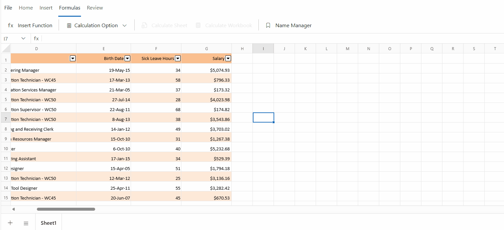
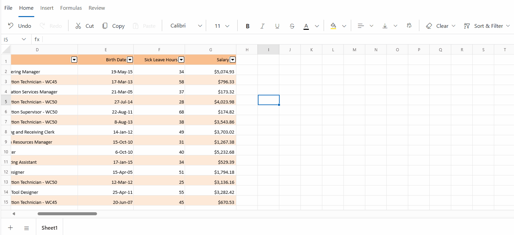
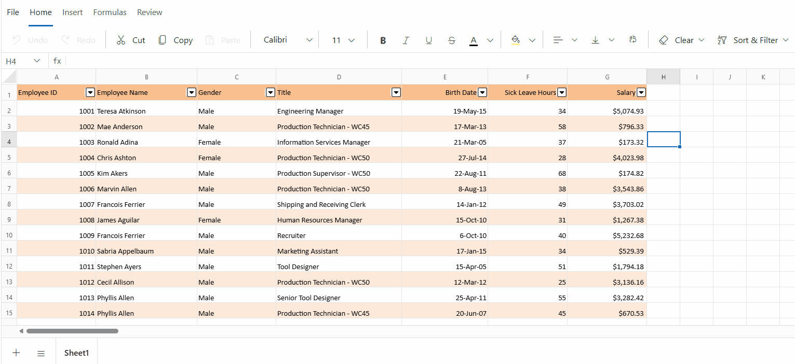
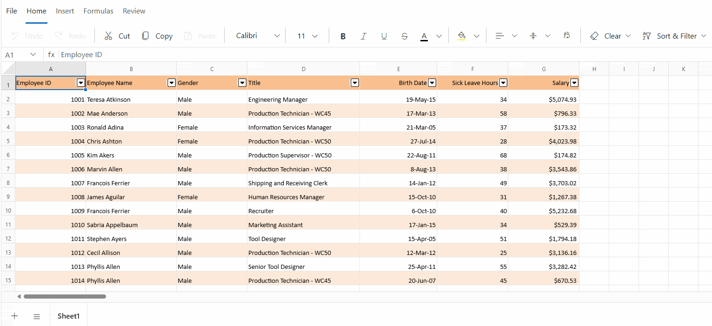
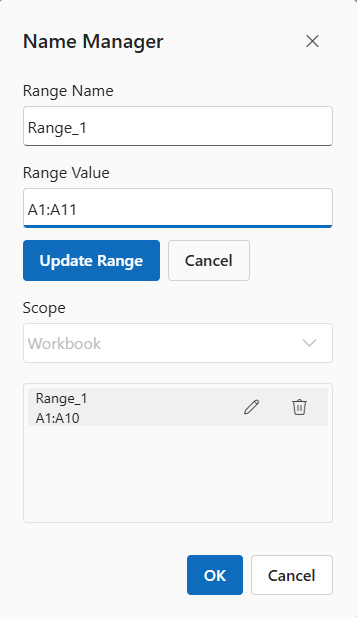

# Formulas in Blazor Spreadsheet Component

**Formulas** enable calculations within a worksheet by referencing cells from either the same worksheet or other worksheets in the workbook.

## Formula Bar

The **Formula Bar** simplifies editing or entering cell data. The [ShowFormulaBar](https://help.syncfusion.com/cr/blazor/Syncfusion.Blazor.Spreadsheet.SfSpreadsheet.html#Syncfusion_Blazor_Spreadsheet_SfSpreadsheet_ShowFormulaBar) property is used to enable or disable the **Formula Bar**. The default value of the `ShowFormulaBar` property is **true**.

### Working With Formulas via The UI

Formulas in the Syncfusion Blazor Spreadsheet can be accessed and inserted using the following methods:

*   Select **Insert Function** from the **Formulas** tab in the Ribbon toolbar. In the **Insert Function** dialog, choose a category, then select the desired function to insert it into the selected cell.

    

*   Type **(=)** in a cell or the **Formula Bar** to display a list of available functions. Select a function from the list to insert it into the cell.

    

*   Click the **Insert Function** button next to the **Formula Bar** to open the **Insert Function** dialog, which provides the same categorized function list and insertion options as the Ribbon toolbar.

    

## Calculation Mode

The Spreadsheet includes **Calculation Option** functionality, similar to Excel's calculation settings, which controls when and how formulas are recalculated. The available modes are:

*   **Automatic**: Formulas recalculate instantly when any dependent cell changes.

*   **Manual**: Formulas recalculate only when explicitly triggered using the **Calculate Sheet** or **Calculate Workbook** options.

### Automatic

In **Automatic Mode**, formulas are recalculated instantly whenever a dependent cell is modified. This mode is ideal for scenarios requiring real-time updates, ensuring the most current results are displayed without manual intervention.

**Example:**

If cell **C1** contains the formula **=A1 + B1**, and the value in **A1** or **B1** changes, **C1** will automatically update to reflect the new result.

### Manual

In **Manual Mode**, formulas are not recalculated automatically when cell values change. Instead, recalculations must be triggered manually. This mode is especially useful for improving performance when working with large datasets or complex formulas, where automatic updates might slow down the Spreadsheet.

**Example:**

If cell **C1** contains the formula **=A1 + B1**, and the value in **A1** or **B1** changes, **C1** will not update until a manual recalculation is performed. The Spreadsheet provides two options for manual recalculation:

**Calculate Sheet:** Recalculates formulas for the active sheet only.

**Calculate Workbook:** Recalculates formulas across all sheets in the workbook.

## Named Ranges

The **Named Ranges** support allows you to assign a meaningful name to a specific cell or range of cells. This simplifies referencing and managing data within the Spreadsheet. Named Ranges can also be used in formulas, making them easier to read, understand, and maintain.

N> Named Ranges can be defined only for cells or ranges that contain values.

### Creating Named Ranges via The UI

**Named Ranges** can be created using the following methods:

*   Select the desired range of cells and enter a name in the **Name Box**.

*   Select the range of cells, then click the **Name Manager** button in the Ribbon toolbar under the **Formulas** tab.

    

### Editing Or Deleting Named Ranges

**Named Ranges** are managed through the **Name Manager** dialog, which supports editing and deletion.

To edit a Named Range:

*   Open the **Name Manager** dialog.

*   Select the Named Range to be edited.

*   Click the **Edit** icon.

*   Modify the name, range, or scope as needed.

* Click the **Update Range** button, then click **OK** button to save changes.

To delete a Named Range:
  
1.  Open the **Name Manager** dialog.

2.  Select the Named Range to be deleted.

3.  Click the **Delete** icon, then click the **OK** button to confirm.

N> Deleting a Named Range used in formulas may cause formula errors. Ensure the Named Range is not referenced before deleting it.

## Supported Formulas

The Spreadsheet component supports a wide range of built-in formulas, enabling powerful data analysis and manipulation. Below is the list of formulas supported in the Spreadsheet component:

<table>
<tr>
<th>
Functions  </th><th>
Description  </th></tr>
<tbody>
<tr>
<td>
ABS  </td><td>
Returns the absolute value of a number  </td></tr>
<tr>
<td>
ACOS  </td><td>
Returns the arccosine of a number  </td></tr>
<tr>
<td>
ACOSH  </td><td>
Returns the inverse hyperbolic cosine of a number  </td></tr>
<tr>
<td>
ADDRESS  </td><td>
Returns a reference as text to a single cell in a worksheet  </td></tr>
<tr>
<td>
AND  </td><td>
Returns TRUE if all of its arguments are TRUE  </td></tr>
<tr>
<td>
AREAS  </td><td>
Returns the number of areas in a reference  </td></tr>
<tr>
<td>
ARRAYTOTEXT  </td><td>
Returns the text representation of an array, though calculation of this formula result is not supported in XlsIO  </td></tr>
<tr>
<td>
ASC  </td><td>
Changes full-width (double-byte) English letters or katakana within a character string to half-width (single-byte) characters  </td></tr>
<tr>
<td>
ASIN  </td><td>
Returns the arcsine of a number  </td></tr>
<tr>
<td>
ASINH  </td><td>
Returns the inverse hyperbolic sine of a number  </td></tr>
<tr>
<td>
ATAN  </td><td>
Returns the arctangent of a number  </td></tr>
<tr>
<td>
ATAN2  </td><td>
Returns the arctangent from x- and y-coordinates  </td></tr>
<tr>
<td>
ATANH  </td><td>
Returns the inverse hyperbolic tangent of a number  </td></tr>
<tr>
<td>
AVEDEV  </td><td>
Returns the average of the absolute deviations of data points from their mean  </td></tr>
<tr>
<td>
AVERAGE  </td><td>
Returns the average of its arguments  </td></tr>
<tr>
<td>
AVERAGEA  </td><td>
Returns the average of its arguments, including numbers, text, and logical values  </td></tr>
<tr>
<td>
AVERAGEIF  </td><td>
Returns the average (arithmetic mean) of all the cells in a range that meet a given criterion  </td></tr>
<tr>
<td>
AVERAGEIFS  </td><td>
Returns the average (arithmetic mean) of all cells that meet multiple criteria  </td></tr>
<tr>
<td>
BESSELI  </td><td>
Returns the modified Bessel function In(x)  </td></tr>
<tr>
<td>
BESSELJ  </td><td>
Returns the Bessel function Jn(x)  </td></tr>
<tr>
<td>
BESSELK  </td><td>
Returns the modified Bessel function Kn(x)  </td></tr>
<tr>
<td>
BESSELY  </td><td>
Returns the Bessel function Yn(x)  </td></tr>
<tr>
<td>
BIN2DEC  </td><td>
Converts a binary number to decimal  </td></tr>
<tr>
<td>
BIN2HEX  </td><td>
Converts a binary number to hexadecimal  </td></tr>
<tr>
<td>
BIN2OCT  </td><td>
Converts a binary number to octal  </td></tr>
<tr>
<td>
BINOMDIST  </td><td>
Returns the individual term binomial distribution probability  </td></tr>
<tr>
<td>
BYCOL  </td><td>
Applies a LAMBDA to each column and returns an array of the results  </td></tr>
<tr>
<td>
BYROW  </td><td>
Applies a LAMBDA to each row and returns an array of the results  </td></tr>
<tr>
<td>
CEILING  </td><td>
Rounds a number to the nearest integer or to the nearest multiple of significance  </td></tr>
<tr>
<td>
CELL  </td><td>
Returns information about the formatting, location, or contents of a cell  </td></tr>
<tr>
<td>
CHAR  </td><td>
Returns the character specified by the code number  </td></tr>
<tr>
<td>
CHIDIST  </td><td>
Returns the one-tailed probability of the chi-squared distribution  </td></tr>
<tr>
<td>
CHIINV  </td><td>
Returns the inverse of the one-tailed probability of the chi-squared distribution  </td></tr>
<tr>
<td>
CHITEST  </td><td>
Returns the test for independence  </td></tr>
<tr>
<td>
CHOOSE  </td><td>
Chooses a value from a list of values  </td></tr>
<tr>
<td>
CHOOSECOLS  </td><td>
Returns specified columns from an array  </td></tr>
<tr>
<td>
CHOOSEROWS  </td><td>
Returns specified rows from an array  </td></tr>
<tr>
<td>
CLEAN  </td><td>
Removes all non-printable characters from text  </td></tr>
<tr>
<td>
CODE  </td><td>
Returns a numeric code for the first character in a text string  </td></tr>
<tr>
<td>
COLUMN  </td><td>
Returns the column number of a reference  </td></tr>
<tr>
<td>
COLUMNS  </td><td>
Returns the number of columns in a reference  </td></tr>
<tr>
<td>
COMBIN  </td><td>
Returns the number of combinations for a given number of objects  </td></tr>
<tr>
<td>
COMPLEX  </td><td>
Converts real and imaginary coefficients into a complex number  </td></tr>
<tr>
<td>
CONCAT  </td><td>
Combines the text from multiple ranges and/or strings  </td></tr>
<tr>
<td>
CONCATENATE  </td><td>
Joins several text items into one text item  </td></tr>
<tr>
<td>
CONFIDENCE  </td><td>
Returns the confidence interval for a population mean  </td></tr>
<tr>
<td>
CONVERT  </td><td>
Converts a number from one measurement system to another  </td></tr>
<tr>
<td>
CORREL  </td><td>
Returns the correlation coefficient between two data sets  </td></tr>
<tr>
<td>
COS  </td><td>
Returns the cosine of a number  </td></tr>
<tr>
<td>
COSH  </td><td>
Returns the hyperbolic cosine of a number  </td></tr>
<tr>
<td>
COUNT  </td><td>
Counts how many numbers are in the list of arguments  </td></tr>
<tr>
<td>
COUNTA  </td><td>
Counts how many values are in the list of arguments  </td></tr>
<tr>
<td>
COUNTBLANK  </td><td>
Counts the number of blank cells within a range  </td></tr>
<tr>
<td>
COUNTIF  </td><td>
Counts the number of non-blank cells within a range that meet the given criteria  </td></tr>
<tr>
<td>
COVAR  </td><td>
Returns covariance, the average of the products of paired deviations  </td></tr>
<tr>
<td>
CRITBINOM  </td><td>
Returns the smallest value for which the cumulative binomial distribution is less than or equal to a criterion value  </td></tr>
<tr>
<td>
CUMIPMT  </td><td>
Returns the cumulative interest paid between two periods  </td></tr>
<tr>
<td>
CUMPRINC  </td><td>
Returns the cumulative principal paid on a loan between two periods  </td></tr>
<tr>
<td>
DATE  </td><td>
Returns the serial number of a particular date  </td></tr>
<tr>
<td>
DATEVALUE  </td><td>
Converts a date in the form of text to a serial number  </td></tr>
<tr>
<td>
DAY  </td><td>
Converts a serial number to a day of the month  </td></tr>
<tr>
<td>
DAYS360  </td><td>
Calculates the number of days between two dates based on a 360-day year  </td></tr>
<tr>
<td>
DB  </td><td>
Returns the depreciation of an asset for a specified period by using the fixed-declining balance method  </td></tr>
<tr>
<td>
DDB  </td><td>
Returns the depreciation of an asset for a specified period by using the double-declining balance method or some other method that you specify  </td></tr>
<tr>
<td>
DEC2BIN  </td><td>
Converts a decimal number to binary  </td></tr>
<tr>
<td>
DECHEX  </td><td>
Converts a decimal number to hexadecimal  </td></tr>
<tr>
<td>
DEC2OCT  </td><td>
Converts a decimal number to octal  </td></tr>
<tr>
<td>
DEGREES  </td><td>
Converts radians to degrees  </td></tr>
<tr>
<td>
DELTA  </td><td>
Tests whether two values are equal  </td></tr>
<tr>
<td>
DEVSQ  </td><td>
Returns the sum of squares of deviations  </td></tr>
<tr>
<td>
DISC  </td><td>
Returns the discount rate for a security  </td></tr>
<tr>
<td>
DOLLAR  </td><td>
Converts a number to text, using the $ (dollar) currency format  </td></tr>
<tr>
<td>
DOLLARDE  </td><td>
Converts a dollar price, expressed as a fraction, into a dollar price, expressed as a decimal number  </td></tr>
<tr>
<td>
DOLLARFR  </td><td>
Converts a dollar price, expressed as a decimal number, into a dollar price, expressed as a fraction  </td></tr>
<tr>
<td>
DURATION  </td><td>
Returns the annual duration of a security with periodic interest payments  </td></tr>
<tr>
<td>
EDATE  </td><td>
Returns the serial number of the date that is the indicated number of months before or after the start date  </td></tr>
<tr>
<td>
EFFECT  </td><td>
Returns the effective annual interest rate  </td></tr>
<tr>
<td>
EOMONTH  </td><td>
Returns the serial number of the last day of the month before or after a specified number of months  </td></tr>
<tr>
<td>
ERF  </td><td>
Returns the error function  </td></tr>
<tr>
<td>
ERFC  </td><td>
Returns the complementary error function  </td></tr>
<tr>
<td>
ERROR.TYPE  </td><td>
Returns a number corresponding to an error type  </td></tr>
<tr>
<td>
EVEN  </td><td>
Rounds a number up to the nearest even integer  </td></tr>
<tr>
<td>
EXACT  </td><td>
Checks to see if two text values are identical  </td></tr>
<tr>
<td>
EXP  </td><td>
Returns {{'__e__ '| markdownify }}raised to the power of a given number  </td></tr>
<tr>
<td>
EXPONDIST  </td><td>
Returns the exponential distribution  </td></tr>
<tr>
<td>
FACT  </td><td>
Returns the factorial of a number  </td></tr>
<tr>
<td>
FACTDOUBLE  </td><td>
Returns the double factorial of a number  </td></tr>
<tr>
<td>
FDIST  </td><td>
Returns the F probability distribution  </td></tr>
<tr>
<td>
FIND, FINDB  </td><td>
Finds one text value within another (case-sensitive)  </td></tr>
<tr>
<td>
FINV  </td><td>
Returns the inverse of the F probability distribution  </td></tr>
<tr>
<td>
FISHER  </td><td>
Returns the Fisher transformation  </td></tr>
<tr>
<td>
FISHER  </td><td>
Returns the inverse of the Fisher transformation  </td></tr>
<tr>
<td>
FIXED  </td><td>
Formats a number as text with a fixed number of decimals  </td></tr>
<tr>
<td>
FLOOR  </td><td>
Rounds a number down, toward zero  </td></tr>
<tr>
<td>
FORECAST  </td><td>
Returns a value along a linear trend  </td></tr>
<tr>
<td>
FV  </td><td>
Returns the future value of an investment  </td></tr>
<tr>
<td>
FVSCHEDULE  </td><td>
Returns the future value of an initial principal after applying a series of compound interest rates  </td></tr>
<tr>
<td>
GAMMADIST  </td><td>
Returns the gamma distribution  </td></tr>
<tr>
<td>
GAMMAINV  </td><td>
Returns the inverse of the gamma cumulative distribution  </td></tr>
<tr>
<td>
GAMMALIN  </td><td>
Returns the natural logarithm of the gamma function, Γ(x)  </td></tr>
<tr>
<td>
GCD  </td><td>
Returns the greatest common divisor  </td></tr>
<tr>
<td>
GEOMEAN  </td><td>
Returns the geometric mean  </td></tr>
<tr>
<td>
GESTEP  </td><td>
Tests whether a number is greater than a threshold value  </td></tr>
<tr>
<td>
GROWTH  </td><td>
Returns values along an exponential trend  </td></tr>
<tr>
<td>
HARMEAN  </td><td>
Returns the harmonic mean  </td></tr>
<tr>
<td>
HEX2BIN  </td><td>
Converts a hexadecimal number to binary  </td></tr>
<tr>
<td>
HEX2DEC  </td><td>
Converts a hexadecimal number to decimal  </td></tr>
<tr>
<td>
HEX2OCT  </td><td>
Converts a hexadecimal number to octal  </td></tr>
<tr>
<td>
HLOOKUP  </td><td>
Looks in the top row of an array and returns the value of the indicated cell  </td></tr>
<tr>
<td>
HOUR  </td><td>
Converts a serial number to an hour  </td></tr>
<tr>
<td>
HYPERLINK  </td><td>
Creates a shortcut or jump that opens a document stored on a network server, an intranet, or the Internet  </td></tr>
<tr>
<td>
HYPGEOMDIST  </td><td>
Returns the hypergeometric distribution  </td></tr>
<tr>
<td>
IF  </td><td>
Specifies a logical test to perform  </td></tr>
<tr>
<td>
IFERROR  </td><td>
Returns a specified value if a formula evaluates to an error.  </td></tr>
<tr>
<td>
IFS  </td><td>
Checks whether one or more conditions are met and returns a value that corresponds to the first TRUE condition  </td></tr>
<tr>
<td>
IMABS  </td><td>
Returns the absolute value (modulus) of a complex number  </td></tr>
<tr>
<td>
IMAGINARY  </td><td>
Returns the imaginary coefficient of a complex number  </td></tr>
<tr>
<td>
IMARGUMENT  </td><td>
Returns the argument theta, an angle expressed in radians  </td></tr>
<tr>
<td>
IMCONJUGATE  </td><td>
Returns the complex conjugate of a complex number  </td></tr>
<tr>
<td>
IMCOS  </td><td>
Returns the cosine of a complex number  </td></tr>
<tr>
<td>
IMDIV  </td><td>
Returns the quotient of two complex numbers  </td></tr>
<tr>
<td>
IMEXP  </td><td>
Returns the exponential of a complex number  </td></tr>
<tr>
<td>
IMLN  </td><td>
Returns the natural logarithm of a complex number  </td></tr>
<tr>
<td>
IMLOG10  </td><td>
Returns the base-10 logarithm of a complex number  </td></tr>
<tr>
<td>
IMLOG2  </td><td>
Returns the base-2 logarithm of a complex number  </td></tr>
<tr>
<td>
IMPOWER  </td><td>
Returns a complex number raised to an integer power  </td></tr>
<tr>
<td>
IMPRODUCT  </td><td>
Returns the product of from 2 to 29 complex numbers  </td></tr>
<tr>
<td>
IMREAL  </td><td>
Returns the real coefficient of a complex number  </td></tr>
<tr>
<td>
IMSIN  </td><td>
Returns the sine of a complex number  </td></tr>
<tr>
<td>
IMSQRT  </td><td>
Returns the square root of a complex number  </td></tr>
<tr>
<td>
IMSUB  </td><td>
Returns the difference between two complex numbers  </td></tr>
<tr>
<td>
IMSUM  </td><td>
Returns the sum of complex numbers  </td></tr>
<tr>
<td>
INDEX  </td><td>
Uses an index to choose a value from a reference or array  </td></tr>
<tr>
<td>
INDIRECT  </td><td>
Returns a reference indicated by a text value  </td></tr>
<tr>
<td>
INFO  </td><td>
Returns information about the current operating environment  </td></tr>
<tr>
<td>
INT  </td><td>
Rounds a number down to the nearest integer  </td></tr>
<tr>
<td>
INTERCEPT  </td><td>
Returns the intercept of the linear regression line  </td></tr>
<tr>
<td>
INTRATE  </td><td>
Returns the interest rate for a fully invested security  </td></tr>
<tr>
<td>
IPMT  </td><td>
Returns the interest payment for an investment for a given period  </td></tr>
<tr>
<td>
IRR  </td><td>
Returns the internal rate of return for a series of cash flows  </td></tr>
<tr>
<td>
ISBLANK  </td><td>
Returns TRUE if the value is blank  </td></tr>
<tr>
<td>
ISERR  </td><td>
Returns TRUE if the value is any error value except #N/A  </td></tr>
<tr>
<td>
ISERROR  </td><td>
Returns TRUE if the value is any error value  </td></tr>
<tr>
<td>
ISEVEN  </td><td>
Returns TRUE if the number is even  </td></tr>
<tr>
<td>
ISLOGICAL  </td><td>
Returns TRUE if the value is a logical value  </td></tr>
<tr>
<td>
ISAN  </td><td>
Returns TRUE if the value is the #N/A error value  </td></tr>
<tr>
<td>
ISNONTEXT  </td><td>
Returns TRUE if the value is not text  </td></tr>
<tr>
<td>
ISNUMBER  </td><td>
Returns TRUE if the value is a number  </td></tr>
<tr>
<td>
ISODD  </td><td>
Returns TRUE if the number is odd  </td></tr>
<tr>
<td>
ISMPT  </td><td>
Calculates the interest paid during a specific period of an investment  </td></tr>
<tr>
<td>
ISREF  </td><td>
Returns TRUE if the value is a reference  </td></tr>
<tr>
<td>
ISTEXT  </td><td>
Returns TRUE if the value is text  </td></tr>
<tr>
<td>
KURT  </td><td>
Returns the kurtosis of a data set  </td></tr>
<tr>
<td>
LAMBDA   </td><td>
Allows to use own formula parameters and logic  </td></tr>
<tr>
<td>
LARGE  </td><td>
Returns the k-th largest value in a data set  </td></tr>
<tr>
<td>
LCM  </td><td>
Returns the least common multiple  </td></tr>
<tr>
<td>
LEFT, LEFTB  </td><td>
Returns the leftmost characters from a text value  </td></tr>
<tr>
<td>
LEN, LENB  </td><td>
Returns the number of characters in a text string  </td></tr>
<tr>
<td>
LET  </td><td>
Returns the result of a formula that can use variables. Calculating this formula result is not supported in XlsIO  </td></tr>
<tr>
<td>
LN  </td><td>
Returns the natural logarithm of a number  </td></tr>
<tr>
<td>
LOG  </td><td>
Returns the logarithm of a number to a specified base  </td></tr>
<tr>
<td>
LOG10  </td><td>
Returns the base-10 logarithm of a number  </td></tr>
<tr>
<td>
LOGEST  </td><td>
Returns the parameters of an exponential trend  </td></tr>
<tr>
<td>
LOGINV  </td><td>
Returns the inverse of the log-normal distribution  </td></tr>
<tr>
<td>
LOGNORMDIST  </td><td>
Returns the cumulative log-normal distribution  </td></tr>
<tr>
<td>
LOOKUP  </td><td>
Looks up values in a vector or array  </td></tr>
<tr>
<td>
LOWER  </td><td>
Converts text to lowercase  </td></tr>
<tr>
<td>
MATCH  </td><td>
Looks up values in a reference or array  </td></tr>
<tr>
<td>
MAX  </td><td>
Returns the maximum value in a list of arguments  </td></tr>
<tr>
<td>
MAXA  </td><td>
Returns the maximum value in a list of arguments, including numbers, text, and logical values  </td></tr>
<tr>
<td>
MAXIFS  </td><td>
Returns the maximum value among cells specified by a given set of conditions or criteria  </td></tr>
<tr>
<td>
MDETERM  </td><td>
Returns the matrix determinant of an array  </td></tr>
<tr>
<td>
MEDIAN  </td><td>
Returns the median of the given numbers  </td></tr>
<tr>
<td>
MID, MIDB  </td><td>
Returns a specific number of characters from a text string starting at the position you specify  </td></tr>
<tr>
<td>
MIN  </td><td>
Returns the minimum value in a list of arguments  </td></tr>
<tr>
<td>
MINA  </td><td>
Returns the smallest value in a list of arguments, including numbers, text, and logical values  </td></tr>
<tr>
<td>
MINIFS  </td><td>
Returns the minimum value among cells specified by a given set of conditions or criteria  </td></tr>
<tr>
<td>
MINUTE  </td><td>
Converts a serial number to a minute  </td></tr>
<tr>
<td>
MINVERSE  </td><td>
Returns the matrix inverse of an array  </td></tr>
<tr>
<td>
MIRR  </td><td>
Returns the internal rate of return where positive and negative cash flows are financed at different rates  </td></tr>
<tr>
<td>
MMULT  </td><td>
Returns the matrix product of two arrays  </td></tr>
<tr>
<td>
MOD  </td><td>
Returns the remainder from division  </td></tr>
<tr>
<td>
MODE  </td><td>
Returns the most common value in a data set  </td></tr>
<tr>
<td>
MMONTH  </td><td>
Converts a serial number to a month  </td></tr>
<tr>
<td>
MROUND  </td><td>
Returns a number rounded to the desired multiple  </td></tr>
<tr>
<td>
MULTINOMINAL  </td><td>
Returns the multinomial of a set of numbers  </td></tr>
<tr>
<td>
N  </td><td>
Returns a value converted to a number  </td></tr>
<tr>
<td>
NA  </td><td>
Returns the error value #N/A  </td></tr>
<tr>
<td>
NEGBINOMDIST  </td><td>
Returns the negative binomial distribution  </td></tr>
<tr>
<td>
NETWORKDAYS  </td><td>
Returns the number of whole workdays between two dates  </td></tr>
<tr>
<td>
NORMDIST  </td><td>
Returns the normal cumulative distribution  </td></tr>
<tr>
<td>
NORMINV  </td><td>
Returns the inverse of the normal cumulative distribution  </td></tr>
<tr>
<td>
NORMSDIST  </td><td>
Returns the standard normal cumulative distribution  </td></tr>
<tr>
<td>
NORMSINV  </td><td>
Returns the inverse of the standard normal cumulative distribution  </td></tr>
<tr>
<td>
NOT  </td><td>
Reverses the logic of its argument  </td></tr>
<tr>
<td>
NOW  </td><td>
Returns the serial number of the current date and time  </td></tr>
<tr>
<td>
NPER  </td><td>
Returns the number of periods for an investment  </td></tr>
<tr>
<td>
NPV  </td><td>
Returns the net present value of an investment based on a series of periodic cash flows and a discount rate  </td></tr>
<tr>
<td>
OCT2BIN  </td><td>
Converts an octal number to binary  </td></tr>
<tr>
<td>
OCT2DEC  </td><td>
Converts an octal number to decimal  </td></tr>
<tr>
<td>
OCT2HEX  </td><td>
Converts an octal number to hexadecimal  </td></tr>
<tr>
<td>
ODD  </td><td>
Rounds a number up to the nearest odd integer  </td></tr>
<tr>
<td>
OFFSET  </td><td>
Returns a reference offset from a given reference  </td></tr>
<tr>
<td>
OR  </td><td>
Returns TRUE if any argument is TRUE  </td></tr>
<tr>
<td>
PEARSON  </td><td>
Returns the Pearson product moment correlation coefficient  </td></tr>
<tr>
<td>
PERCENTILE  </td><td>
Returns the k-th percentile of values in a range  </td></tr>
<tr>
<td>
PERCENTRANK  </td><td>
Returns the percentage rank of a value in a data set  </td></tr>
<tr>
<td>
PERMUT  </td><td>
Returns the number of permutations for a given number of objects  </td></tr>
<tr>
<td>
PI  </td><td>
Returns the value of pi  </td></tr>
<tr>
<td>
PMT  </td><td>
Returns the periodic payment for an annuity  </td></tr>
<tr>
<td>
POISSON  </td><td>
Returns the Poisson distribution  </td></tr>
<tr>
<td>
POWER  </td><td>
Returns the result of a number raised to a power  </td></tr>
<tr>
<td>
PPMT  </td><td>
Returns the payment on the principal for an investment for a given period  </td></tr>
<tr>
<td>
PROB  </td><td>
Returns the probability that values in a range are between two limits  </td></tr>
<tr>
<td>
PRODUCT  </td><td>
Multiplies its arguments  </td></tr>
<tr>
<td>
PROPER  </td><td>
Capitalizes the first letter in each word of a text value  </td></tr>
<tr>
<td>
PV  </td><td>
Returns the present value of an investment  </td></tr>
<tr>
<td>
QUARTILE  </td><td>
Returns the quartile of a data set  </td></tr>
<tr>
<td>
QUOTIENT  </td><td>
Returns the integer portion of a division  </td></tr>
<tr>
<td>
RADIANS  </td><td>
Converts degrees to radians  </td></tr>
<tr>
<td>
RAND  </td><td>
Returns a random number between 0 and 1  </td></tr>
<tr>
<td>
RANDBETWEEN  </td><td>
Returns a random number between the numbers you specify  </td></tr>
<tr>
<td>
RANK  </td><td>
Returns the rank of a number in a list of numbers  </td></tr>
<tr>
<td>
RATE  </td><td>
Returns the interest rate per period of an annuity  </td></tr>
<tr>
<td>
RECEIVED  </td><td>
Returns the amount received at maturity for a fully invested security  </td></tr>
<tr>
<td>
REPLACE, REPLACEB  </td><td>
Replaces characters within text  </td></tr>
<tr>
<td>
REPT  </td><td>
Repeats text a given number of times  </td></tr>
<tr>
<td>
RIGHT, RIGHTB  </td><td>
Returns the rightmost characters from a text value  </td></tr>
<tr>
<td>
ROMAN  </td><td>
Converts an Arabic numeral to roman, as text  </td></tr>
<tr>
<td>
ROUND  </td><td>
Rounds a number to a specified number of digits  </td></tr>
<tr>
<td>
ROUNDDOWN  </td><td>
Rounds a number down, toward zero  </td></tr>
<tr>
<td>
ROUNDUP  </td><td>
Rounds a number up, away from zero  </td></tr>
<tr>
<td>
ROW  </td><td>
Returns the row number of a reference  </td></tr>
<tr>
<td>
ROWS  </td><td>
Returns the number of rows in a reference  </td></tr>
<tr>
<td>
RSQ  </td><td>
Returns the square of the Pearson product moment correlation coefficient  </td></tr>
<tr>
<td>
SEARCH, SEARCHB  </td><td>
Finds one text value within another (not case-sensitive)  </td></tr>
<tr>
<td>
SECOND  </td><td>
Converts a serial number to a second  </td></tr>
<tr>
<td>
SERIESSUM  </td><td>
Returns the sum of a power series based on the formula  </td></tr>
<tr>
<td>
SIGN  </td><td>
Returns the sign of a number  </td></tr>
<tr>
<td>
SIN  </td><td>
Returns the sine of the given angle  </td></tr>
<tr>
<td>
SINH  </td><td>
Returns the hyperbolic sine of a number  </td></tr>
<tr>
<td>
SKEW  </td><td>
Returns the skewness of a distribution  </td></tr>
<tr>
<td>
SLN  </td><td>
Returns the straight-line depreciation of an asset for one period  </td></tr>
<tr>
<td>
SLOPE  </td><td>
Returns the slope of the linear regression line  </td></tr>
<tr>
<td>
SORT  </td><td>
Returns the cell range values in ascending or descending order  </td></tr>
<tr>
<td>
SMALL  </td><td>
Returns the k-th smallest value in a data set  </td></tr>
<tr>
<td>
SQRT  </td><td>
Returns a positive square root  </td></tr>
<tr>
<td>
SQRTPI  </td><td>
Returns the square root of (number * pi)  </td></tr>
<tr>
<td>
STANDARDIZE  </td><td>
Returns a normalized value  </td></tr>
<tr>
<td>
STDEV  </td><td>
Estimates standard deviation based on a sample  </td></tr>
<tr>
<td>
STDEVA  </td><td>
Estimates standard deviation based on a sample, including numbers, text, and logical values  </td></tr>
<tr>
<td>
STDEVP  </td><td>
Calculates standard deviation based on the entire population  </td></tr>
<tr>
<td>
STDEVPA  </td><td>
Calculates standard deviation based on the entire population, including numbers, text, and logical values  </td></tr>
<tr>
<td>
STEYX  </td><td>
Returns the standard error of the predicted y-value for each x in the regression  </td></tr>
<tr>
<td>
SUBSTITUTE  </td><td>
Substitutes new text for old text in a text string  </td></tr>
<tr>
<td>
SUBTOTAL  </td><td>
Returns a subtotal in a list or database  </td></tr>
<tr>
<td>
SUM  </td><td>
Adds its arguments  </td></tr>
<tr>
<td>
SUMIF  </td><td>
Adds the cells specified by a given criteria  </td></tr>
<tr>
<td>
SUMPRODUCT  </td><td>
Returns the sum of the products of corresponding array components  </td></tr>
<tr>
<td>
SUMSQ  </td><td>
Returns the sum of the squares of the arguments  </td></tr>
<tr>
<td>
SUMX2MY2  </td><td>
Returns the sum of the difference of squares of corresponding values in two arrays  </td></tr>
<tr>
<td>
SUMX2PY2  </td><td>
Returns the sum of the sum of squares of corresponding values in two arrays  </td></tr>
<tr>
<td>
SUMXMY2  </td><td>
Returns the sum of squares of differences of corresponding values in two arrays  </td></tr>
<tr>
<td>
SWITCH  </td><td>
Evaluates an expression against a list of values and returns the result corresponding to the first matching value. If there is no match, an optional default value may be returned.  </td></tr>
<tr>
<td>
SYD  </td><td>
Returns the sum-of-years'digits depreciation of an asset for a specified period  </td></tr>
<tr>
<td>
T  </td><td>
Converts its arguments to text  </td></tr>
<tr>
<td>
TAN  </td><td>
Returns the tangent of a number  </td></tr>
<tr>
<td>
TANH  </td><td>
Returns the hyperbolic tangent of a number  </td></tr>
<tr>
<td>
TEXT  </td><td>
Formats a number and converts it to text  </td></tr>
<tr>
<td>
TEXTBEFORE  </td><td>
Returns text that occurs before a given character  </td></tr>
<tr>
<td>
TEXTJOIN  </td><td>
Combines the text from multiple ranges and/or strings with a delimiter you specify between each text value that will be combined  </td></tr>
<tr>
<td>
TEXTSPLIT  </td><td>
Splits the cell text across rows or columns  </td></tr>
<tr>
<td>
TIME  </td><td>
Returns the serial number of a particular time  </td></tr>
<tr>
<td>
TIMEVALUE  </td><td>
Converts a time in the form of text to a serial number  </td></tr>
<tr>
<td>
TOCOL  </td><td>
Transforms an array into a single column  </td></tr>
<tr>
<td>
TODAY  </td><td>
Returns the serial number of today's date  </td></tr>
<tr>
<td>
TOROW  </td><td>
Transforms an array into a single row  </td></tr>
<tr>
<td>
TRANSPORSE  </td><td>
Returns the transpose of an array  </td></tr>
<tr>
<td>
TRIM  </td><td>
Removes spaces from text  </td></tr>
<tr>
<td>
TRIMMEAN  </td><td>
Returns the mean of the interior of a data set  </td></tr>
<tr>
<td>
TRUNC  </td><td>
Truncates a number to an integer  </td></tr>
<tr>
<td>
TYPE  </td><td>
Returns a number indicating the data type of a value  </td></tr>
<tr>
<td>
UNIQUE  </td><td>
Returns the list of unique values present inside a list or range. Calculating the formula result in XlsIO is not supported.   </td></tr>
<tr>
<td>
UPPER  </td><td>
Converts text to uppercase  </td></tr>
<tr>
<td>
VALUE  </td><td>
Converts a text argument to a number  </td></tr>
<tr>
<td>
VALUETOTEXT  </td><td>
Returns the text from any specified value. Calculating this formula result is not supported in XlsIO.  </td></tr>
<tr>
<td>
VAR  </td><td>
Estimates variance based on a sample  </td></tr>
<tr>
<td>
VARA  </td><td>
Estimates variance based on a sample, including numbers, text, and logical values  </td></tr>
<tr>
<td>
VARP  </td><td>
Calculates variance based on the entire population  </td></tr>
<tr>
<td>
VARPA  </td><td>
Calculates variance based on the entire population, including numbers, text, and logical values  </td></tr>
<tr>
<td>
VDB  </td><td>
Returns the depreciation of an asset for a specified or partial period by using a declining balance method  </td></tr>
<tr>
<td>
VLOOKUP  </td><td>
Looks in the first column of an array and moves across the row to return the value of a cell  </td></tr>
<tr>
<td>
WEEKDAY  </td><td>
Converts a serial number to a day of the week  </td></tr>
<tr>
<td>
WEEKNUM  </td><td>
Converts a serial number to a number representing where the week falls numerically with a year  </td></tr>
<tr>
<td>
WEIBULL  </td><td>
Returns the Weibull distribution  </td></tr>
<tr>
<td>
WORKDAY  </td><td>
Returns the serial number of the date before or after a specified number of workdays  </td></tr>
<tr>
<td>
XIRR  </td><td>
Returns the internal rate of return for a schedule of cash flows that is not necessarily periodic  </td></tr>
<tr>
<td>
XLOOKUP  </td><td>
Returns the value corresponding to the first match it finds else returns the next approximate match. Calculating this formula result is not supported in XlsIO.  </td></tr>
<tr>
<td>
XMATCH  </td><td>
Returns the position of a value in a list, table or cell range. Calculating this formula result is not supported in XlsIO.  </td></tr>
<tr>
<td>
YEAR  </td><td>
Converts a serial number to a year  </td></tr>
<tr>
<td>
YEARFRAC  </td><td>
Returns the year fraction representing the number of whole days between start_date and end_date  </td></tr>
<tr>
<td>
ZTEST  </td><td>
Returns the one-tailed probability-value of a z-test  </td></tr>
<tr>
<td>
FALSE  </td><td>
Returns the logical value FALSE  </td></tr>
<tr>
<td>
TRUE  </td><td>
Returns the logical value TRUE  </td></tr>
</tbody>
</table>
