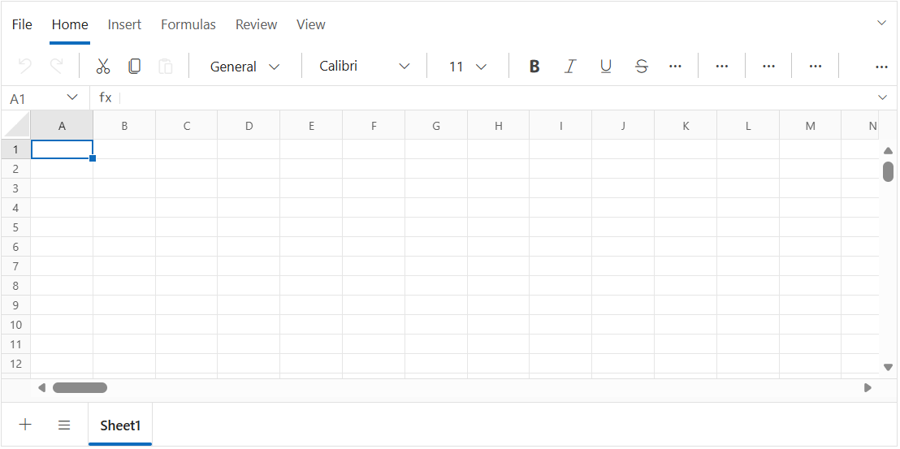

# Getting Started with the Blazor Spreadsheet in Blazor Web App

This section briefly explains how to include the [Blazor Spreadsheet Editor](https://www.syncfusion.com/blazor-components/blazor-spreadsheet) component in a Blazor Web App using [Visual Studio](https://visualstudio.microsoft.com/vs/), [Visual Studio Code](https://code.visualstudio.com/), and the [.NET CLI](https://learn.microsoft.com/en-us/dotnet/core/tools/).





## Prerequisites

* [System requirements for Blazor components](https://blazor.syncfusion.com/documentation/system-requirements)

## Create a New Blazor Web App in Visual Studio

Create a **Blazor Web App** using Visual Studio 2022 via [Microsoft Templates](https://learn.microsoft.com/en-us/aspnet/core/blazor/tooling?view=aspnetcore-8.0) or the [Syncfusion® Blazor Extension](https://blazor.syncfusion.com/documentation/visual-studio-integration/template-studio).

N> Configure the appropriate [Interactive render mode](https://learn.microsoft.com/en-us/aspnet/core/blazor/components/render-modes?view=aspnetcore-10.0#render-modes) and [Interactivity location](https://learn.microsoft.com/en-us/aspnet/core/blazor/tooling?view=aspnetcore-10.0&pivots=vs) while creating a Blazor Web App. For detailed information, refer to the [interactive render mode documentation](https://blazor.syncfusion.com/documentation/common/interactive-render-mode).

## Install Blazor Spreadsheet NuGet Packages

If you utilize `WebAssembly` or `Auto` render modes in the Blazor Web App, you need to install the Blazor components NuGet packages within the client project.

To add **Syncfusion Blazor Spreadsheet** component in the app, open the NuGet package manager in Visual Studio (*Tools → NuGet Package Manager → Manage NuGet Packages for Solution*), search and install:

* [Syncfusion.Blazor.Spreadsheet](https://www.nuget.org/packages/Syncfusion.Blazor.Spreadsheet)
* [Syncfusion.Blazor.Themes](https://www.nuget.org/packages/Syncfusion.Blazor.Themes/)

Alternatively, you can utilize the following package manager command to achieve the same.




Install-Package Syncfusion.Blazor.Spreadsheet -Version {{ site.releaseversion }}
Install-Package Syncfusion.Blazor.Themes -Version {{ site.releaseversion }}








## Prerequisites

* [System requirements for Blazor components](https://blazor.syncfusion.com/documentation/system-requirements)

## Create a New Blazor Web App in Visual Studio Code

Create a **Blazor Web App** using Visual Studio Code via [Microsoft Templates](https://learn.microsoft.com/en-us/aspnet/core/blazor/tooling?view=aspnetcore-8.0&pivots=vsc) or the [Blazor Extension](https://blazor.syncfusion.com/documentation/visual-studio-code-integration/create-project).

N> Configure the appropriate [Interactive render mode](https://learn.microsoft.com/en-us/aspnet/core/blazor/components/render-modes?view=aspnetcore-10.0#render-modes) and [Interactivity location](https://learn.microsoft.com/en-us/aspnet/core/blazor/tooling?view=aspnetcore-10.0&pivots=vs) while creating a Blazor Web App. For detailed information, refer to the [interactive render mode documentation](https://blazor.syncfusion.com/documentation/common/interactive-render-mode).

For example, in a Blazor Web App with the `Auto` interactive render mode, use the following commands.




dotnet new blazor -o BlazorWebApp -int Auto
cd BlazorWebApp
cd BlazorWebApp.Client




N> For more information on creating a Blazor Web App with various interactive modes and locations, see [Render interactive modes](https://blazor.syncfusion.com/documentation/getting-started/blazor-web-app?tabcontent=visual-studio-code#render-interactive-modes).

N> If you selected the `Server` interactive render mode (no client project is created), skip the `cdn BlazorWebApp.Client` command and run package commands from the server project directory.

## Install Blazor Spreadsheet NuGet Packages

If you utilize `WebAssembly` or `Auto` render modes in the Blazor Web App, you need to install the Blazor components NuGet packages within the client project.

* Press <kbd>Ctrl</kbd>+<kbd>`</kbd> to open the integrated terminal in Visual Studio Code.
* Ensure you’re in the project root directory where your `.csproj` file is located.
* Run the following command to install a [Syncfusion.Blazor.Spreadsheet](https://www.nuget.org/packages/Syncfusion.Blazor.Spreadsheet) and [Syncfusion.Blazor.Themes](https://www.nuget.org/packages/Syncfusion.Blazor.Themes/) NuGet package and ensure all dependencies are installed.





dotnet add package Syncfusion.Blazor.Spreadsheet -v {{ site.releaseversion }}
dotnet add package Syncfusion.Blazor.Themes -v {{ site.releaseversion }}
dotnet restore





N> After running `dotnet restore`, ensure there are no error messages in the terminal. If restore fails, verify your NuGet source (`https://api.nuget.org/v3/index.json`) is configured, clear the local cache with `dotnet nuget locals all --clear`, and retry.





## Prerequisites

Install the latest version of [.NET SDK](https://dotnet.microsoft.com/en-us/download). If you previously installed the SDK, you can determine the installed version by executing the following command in a command prompt (Windows) or terminal (macOS) or command shell (Linux). Also, review the [System requirements for Blazor components](https://blazor.syncfusion.com/documentation/system-requirements).




dotnet --version




## Create a Blazor Web App using .NET CLI

Run the following command to create a new Blazor Web App in a command prompt (Windows) or terminal (macOS) or command shell (Linux). For detailed instructions, refer to the [Blazor Web App Getting Started](https://blazor.syncfusion.com/documentation/getting-started/blazor-web-app?tabcontent=.net-cli) documentation.

For example, in a Blazor Web App with the `Auto` interactive render mode, use the following commands:




dotnet new blazor -o BlazorWebApp -int Auto
cd BlazorWebApp
cd BlazorWebApp.Client




N> If you selected the `Server` interactive render mode (no client project is created), skip the `cdn BlazorWebApp.Client` command and run package commands from the server project directory.

## Install Syncfusion® Blazor Spreadsheet and Themes NuGet in the App

If you utilize `WebAssembly` or `Auto` render modes in the Blazor Web App, you need to install the Blazor components NuGet packages within the client project.

* Open a command prompt, terminal, or shell.
* Ensure you’re in the project root directory where your `.csproj` file is located (or the Client project if applicable).
* Run the following command to install a [Syncfusion.Blazor.Spreadsheet](https://www.nuget.org/packages/Syncfusion.Blazor.Spreadsheet) and [Syncfusion.Blazor.Themes](https://www.nuget.org/packages/Syncfusion.Blazor.Themes/) NuGet package and ensure all dependencies are installed.





dotnet add package Syncfusion.Blazor.Spreadsheet -v {{ site.releaseversion }}
dotnet add package Syncfusion.Blazor.Themes -v {{ site.releaseversion }}
dotnet restore





N> After running `dotnet restore`, ensure there are no error messages in the terminal. If restore fails, verify your NuGet source (`https://api.nuget.org/v3/index.json`) is configured, clear the local cache with `dotnet nuget locals all --clear`, and retry.





## Add import namespaces

After the packages are installed, open the **_Imports.razor** file (typically located at `Components/_Imports.razor` in Blazor Web App templates; in older templates or WebAssembly apps it may be at the project root) and import the `Syncfusion.Blazor` and `Syncfusion.Blazor.Spreadsheet` namespaces.




@using Syncfusion.Blazor
@using Syncfusion.Blazor.Spreadsheet




## Register Syncfusion® Blazor Service

Register the Syncfusion Blazor service in the **Program.cs** file of your Blazor Web App.




using Syncfusion.Blazor;

// Register Syncfusion Blazor service
builder.Services.AddSyncfusionBlazor();




N> If the **Interactive Render Mode** is set to `WebAssembly` or `Auto`, register the Blazor service in **Program.cs** files of both the server and client projects in your Blazor Web App. For `Server` render mode, register it in the server project's **Program.cs** only.

N> `AddSyncfusionBlazor()` accepts optional configuration options such as enabling script isolation. See the [Blazor service registration](https://help.syncfusion.com/cr/blazor/Syncfusion.Blazor.GlobalOptions.html) topic for available configuration options.

## Register Syncfusion License Key

Register the Syncfusion license key in your application startup to avoid a license warning at runtime. Add the following line in the **Program.cs** file of your Blazor Web App (and in the client project's **Program.cs** for `WebAssembly`/`Auto` render modes), after the `AddSyncfusionBlazor()` call:




// Register Syncfusion license key
Syncfusion.Licensing.SyncfusionLicenseProvider.RegisterLicense("YOUR_LICENSE_KEY");




N> Replace `YOUR_LICENSE_KEY` with your actual Syncfusion license key. For details on generating and registering a license key, see [Licensing](https://blazor.syncfusion.com/documentation/licensing).

## Add stylesheet resource

The theme stylesheet can be accessed from NuGet through [Static Web Assets](https://blazor.syncfusion.com/documentation/appearance/themes#static-web-assets). Include the stylesheet at the end of the `<head>` section in the **Components/App.razor** file to apply proper layout and theme styling.




<!-- Syncfusion Blazor components theme -->
<link href="_content/Syncfusion.Blazor.Themes/bootstrap5.css" rel="stylesheet" />




## Add script resource

The Spreadsheet Editor script can be accessed from NuGet through [Static Web Assets](https://blazor.syncfusion.com/documentation/appearance/themes#static-web-assets). Include the required script at the end of the `<body>` section in the **Components/App.razor** file to enable component functionality.




<!-- Syncfusion Blazor Spreadsheet Editor script -->




N> Check out the [Blazor Themes](https://blazor.syncfusion.com/documentation/appearance/themes) topic to explore supported ways (such as static assets, CDN, and CRG) to apply themes in your Blazor application. Also, check out the [Adding Script Reference](https://blazor.syncfusion.com/documentation/common/adding-script-references) topic to learn different approaches for adding script references in your Blazor application.

## Add Blazor Spreadsheet component

Add the Syncfusion Blazor Spreadsheet component in the **Components/Pages/Home.razor** file (the default page template). If the interactivity location is set to `Per page/component` in the Web App, define a render mode at the top of the `Components/Pages/Home.razor` file. (For example, `InteractiveServer`, `InteractiveWebAssembly` or `InteractiveAuto`).

N> If the **Interactivity Location** is set to `Global` with `Auto` or `WebAssembly`, the render mode is automatically configured in the `App.razor` file by default and does not need to be specified on the page.




@page "/"
@using Syncfusion.Blazor.Spreadsheet

<SfSpreadsheet>
    <SpreadsheetRibbon></SpreadsheetRibbon>
</SfSpreadsheet>




N> `SpreadsheetRibbon` is the optional ribbon toolbar child component of `SfSpreadsheet`. Omit it if you want to render the spreadsheet without the ribbon UI.

Press <kbd>Ctrl</kbd>+<kbd>F5</kbd> (Windows) or <kbd>⌘</kbd>+<kbd>F5</kbd> (macOS) to launch the application. This will render the Syncfusion Blazor Spreadsheet in your default web browser. The output will appear as follows:

You can also experiment directly using the interactive playground below for a quick demo:



To learn how to open workbooks, bind data, or save files in the Spreadsheet component, see [Open and Save](open-and-save).

N> [View Sample In GitHub](https://github.com/SyncfusionExamples/Blazor-Getting-Started-Examples/tree/main/Spreadsheet).

N> Looking for the full Blazor Spreadsheet Editor component overview, features, pricing, and documentation? Visit the [Blazor Spreadsheet Editor](https://www.syncfusion.com/spreadsheet-editor-sdk/blazor-spreadsheet-editor) page

## Video tutorial

To get started quickly with Blazor Spreadsheet, you can watch this video:



## See Also

- [Getting started with the Blazor Spreadsheet in a Blazor WebAssembly App](./getting-started)
- [Getting Started with .NET MAUI Blazor Hybrid App](./blazor-hybrid-maui-app)