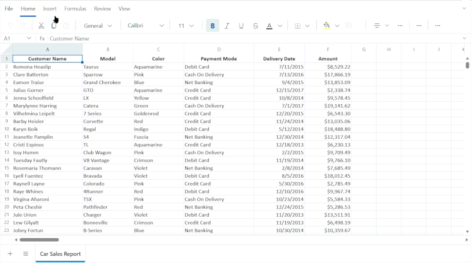

# Images in Blazor Spreadsheet Component

The [Blazor Spreadsheet Editor](https://www.syncfusion.com/spreadsheet-editor-sdk/blazor-spreadsheet-editor) component lets you insert images into a worksheet to enhance visual presentation and provide additional context alongside data. Images such as logos, screenshots, diagrams, can be placed within a sheet, positioned as needed, resized, selected, or removed.

Image support is controlled by the [AllowImage](https://help.syncfusion.com/cr/blazor/Syncfusion.Blazor.Spreadsheet.SfSpreadsheet.html#Syncfusion_Blazor_Spreadsheet_SfSpreadsheet_AllowImage) property, which is enabled by default.

## Disabling image support

The example below shows how to disable image support across the Spreadsheet:




@page "/"
@using Syncfusion.Blazor.Spreadsheet

<SfSpreadsheet AllowImage="false">
    <SpreadsheetRibbon></SpreadsheetRibbon>
</SfSpreadsheet>




## Overview of Image Operations

The The [Blazor Spreadsheet Editor](https://www.syncfusion.com/spreadsheet-editor-sdk/blazor-spreadsheet-editor) component also provides a range of features for working with images. Below is a quick overview of each feature.

* **Insert and Position Images**: Add images to your spreadsheet and place them at the desired location.

* **Resize Images**: Change the height and width of images to fit your needs.

* **Delete Images**: Remove images that are no longer required from your spreadsheet.

* **Position Images**: Select one or multiple images for further actions or deselect them as needed.

## Limitations of Image

The following limitations apply to the image support in the [Blazor Spreadsheet Editor](https://www.syncfusion.com/spreadsheet-editor-sdk/blazor-spreadsheet-editor):

* Corner resize handles are not available on inserted images. Resizing must be performed using edge handles.
* Copying and pasting external images is not supported. 
* Programmatic operations for image manipulation are currently not available.
