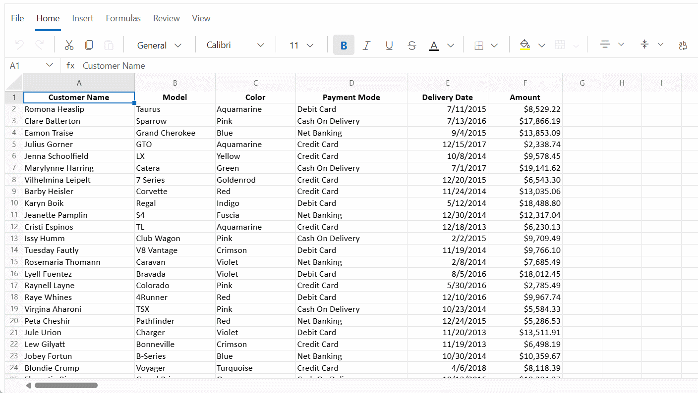
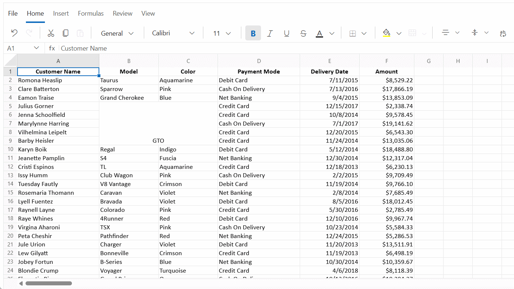
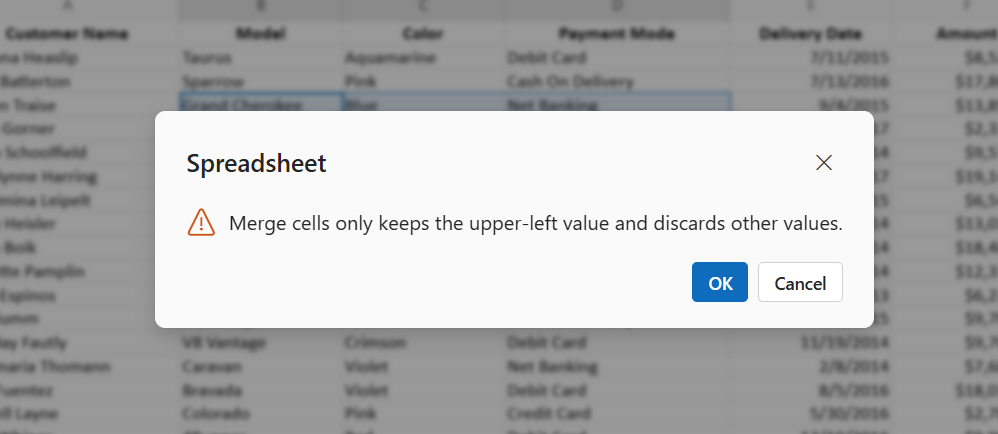
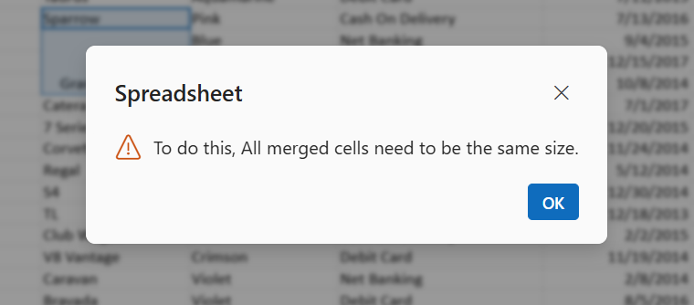

# Merge cells in Blazor Spreadsheet component

Cell merging combines adjacent cells into one larger cell. This is used to create headings, section labels, or grouped content for better readability. The Blazor Spreadsheet offers multiple merge actions, including merging an entire selection into one cell, merging across each row, and unmerging previously merged regions. The merge feature is enabled by default. To disable or enable merging, set the **AllowMerge** property to **false** or **true** as required.

## Merge operations

The following merge actions are available:

| Operation       | Description |
| -- | -- |
| Merge cells     | Merges the selected range into one cell. The top-left cell value is retained. |
| Merge & center  | Merges the selected range and centers the content horizontally. The top-left cell value is retained. |
| Merge across    | Merges cells across columns in each row of the selection. The first cell value in each row is retained. |
| Unmerge cells   | Splits a merged region into individual cells. |

N> The **Merge Cell** button is disabled when a single unmerged cell is selected. Merge options are also unavailable when the sheet is protected.

## Merge Cells

### Merge cell via UI

- Select a range.
- Click on **Merge Cell** drop-down in the ribbon.
- Choose one of the following options: **Merge & Center**, **Merge Across** or **Merge Cells**.

N> Clicking the **Merge Cells** button (not the drop-down) applies the default action. If the selection is not merged, the cells are merged into a single cell. If the selection includes or intersects a merged range, that merged range is unmerged.

### Merge cells programmatically

The [MergeAsync]() method merges cells based on the specified merge type. If the **cellRange** parameter is not provided, the current selection is used. This method provides a programmatic way to merge cells without using the UI. The available parameters in the `MergeAsync` method are:

| Parameter | Type | Description |
| -- | -- | -- |
| mergeType | `MergeType` | Specifies the merge behavior.   Default **MergeType** is `MergeType.Cells`. Supported values:  - `Cells` - Merge the entire selection into one cell and preserve the top-left value;  - `Center` - Merge the entire selection and horizontally center the resulting cell’s content;  - `Across` - For each row in the selection, merge the cells across columns and preserve each row’s first cell value. |
| cellRange | string (optional) | A1-style address of the target range (e.g., `"A1:C3"`). Leave it empty or pass `null` to use the current selection. |




@using Syncfusion.Blazor.Spreadsheet

<button class="e-btn" @onclick="MergeSelection">Merge cells</button>
<button class="e-btn" @onclick="MergeAcrossRange">Merge across</button>
<button class="e-btn" @onclick="MergeAndCenterRange">Merge & center</button>

<SfSpreadsheet @ref="SpreadsheetInstance" DataSource="DataSourceBytes">
    <SpreadsheetRibbon></SpreadsheetRibbon>
</SfSpreadsheet>

@code {
    public byte[] DataSourceBytes { get; set; }
    public SfSpreadsheet SpreadsheetInstance;

    protected override void OnInitialized()
    {
        string filePath = "wwwroot/Sample.xlsx";
        DataSourceBytes = File.ReadAllBytes(filePath);
    }

    private async Task MergeSelection()
    {
        // Merge the current selection into a single cell
        await SpreadsheetInstance.MergeAsync(MergeType.Cells);
    }

    private async Task MergeAcrossRange()
    {
        // For each row in the range, merge across its columns
        await SpreadsheetInstance.MergeAsync(MergeType.Across, "C2:E6");
    }

    private async Task MergeAndCenterRange()
    {
        // Merge the range and center-align the merged cell’s content
        await SpreadsheetInstance.MergeAsync(MergeType.Center, "A1:D1");
    }
    
}




## Unmerge Cells

### Unmerge cell via UI

- Select a range.
- Click on **Unmerge Cells** drop-down in the ribbon.
- Choose **Unmerge Cells** option.

### Unmerge cell programmatically.

The [UnmergeAsync]() method splits merged cells back into individual cells. If the **cellRange** parameter is not provided, the current selection cell is unmerged. This method provides a programmatic way to unmerge cells without using the UI. The available parameters in the `UnmergeAsync` method are:

| Parameter | Type | Description |
| -- | -- | -- |
| cellRange | string (optional) | A1-style address of the range to unmerge. Leave it empty or pass `null` to target the current selection. |




@using Syncfusion.Blazor.Spreadsheet

<button class="e-btn" @onclick="UnmergeRange">Unmerge</button>

<SfSpreadsheet @ref="SpreadsheetInstance" DataSource="DataSourceBytes">
    <SpreadsheetRibbon></SpreadsheetRibbon>
</SfSpreadsheet>

@code {
    public byte[] DataSourceBytes { get; set; }
    public SfSpreadsheet SpreadsheetInstance;

    protected override void OnInitialized()
    {
        string filePath = "wwwroot/Sample.xlsx";
        DataSourceBytes = File.ReadAllBytes(filePath);
    }

    private async Task UnmergeRange()
    {
        // Unmerge the specified merged region
        await SpreadsheetInstance.UnmergeAsync("A1:D1");
    }
}




### Merge cell validation messages

When perform merge cell in the Blazor Spreadsheet, validation messages are displayed in specific scenarios to inform about merge cell constraints:

- **Merge cells value retention message** - When merging cells through the user interface, a validation dialog is displayed to inform that only the upper-left cell value will be retained and other values will be discarded.

- **Sorting with merged cells** - When sorting a range that contains merged cells, a validation dialog appears to indicate that sorting cannot proceed unless all merged cells are consistent in size.

- **Autofill on merged cells** - When performing autofill and dropping the fill handle onto merged cells, a validation dialog appears to indicate that autofill requires all merged cells to be the same size.

