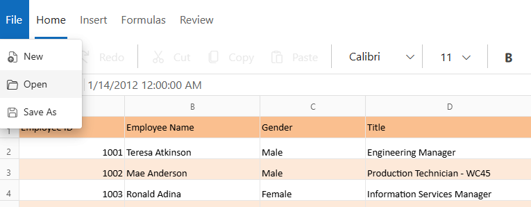
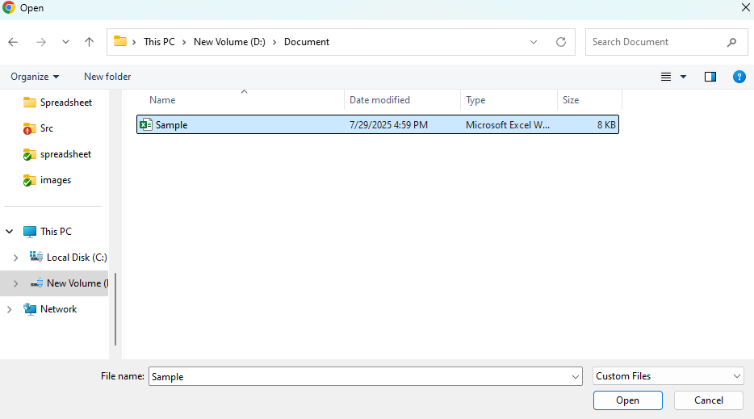
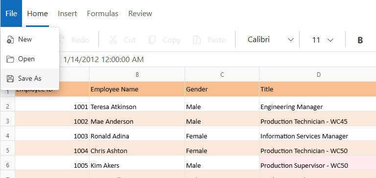
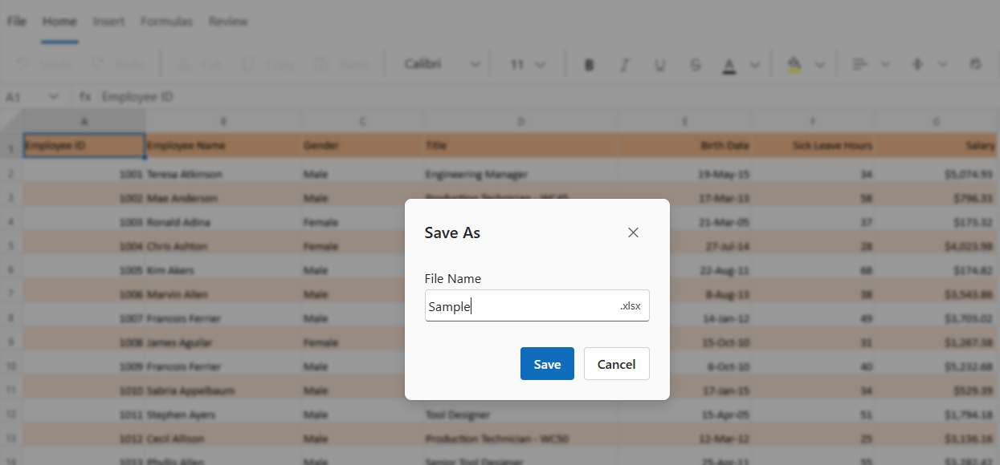
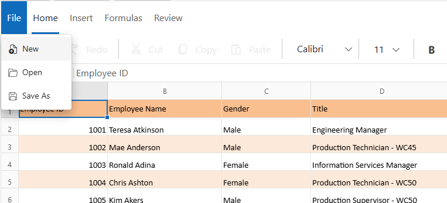

# Open and Save in Blazor Spreadsheet Component

The **Open** and **Save** functionalities in the Blazor Spreadsheet component allow for efficient management of Excel files. You can open existing Excel files for analysis and modification, and save new or modified spreadsheets in a compatible format.

## Open
The Blazor Spreadsheet component preserves all data, cell styles, formatting, and other spreadsheet elements when opening Excel files. These files can be loaded through the user interface action or programmatic methods.

### Open an Excel file via UI

To open an Excel document using the interface, select the **File > Open** option from the **Ribbon**. A file explorer dialog will appear, allowing selection of the desired Excel file for loading into the component.





### Open an Excel file from a local path
To load Excel files programmatically, they can be converted into byte arrays. This approach is particularly effective when files are retrieved from a backend service.




@using Syncfusion.Blazor.Spreadsheet

<SfSpreadsheet DataSource="DataSourceBytes" >
    <SpreadsheetRibbon></SpreadsheetRibbon>
</SfSpreadsheet>

@code {
    public byte[] DataSourceBytes { get; set; }

    protected override void OnInitialized()
    {
        string filePath = "wwwroot/Sample.xlsx";
        DataSourceBytes = File.ReadAllBytes(filePath);
    }
}




### Open an Excel file from a Base64 string
An Excel file encoded as a Base64 string can be loaded into the Spreadsheet component by converting the string into a byte array and then into a stream. This method is effective when retrieving file data from a database or an API.




@using Syncfusion.Blazor.Spreadsheet

 <SfSpreadsheet DataSource="DataSourceBytes" >
    <SpreadsheetRibbon></SpreadsheetRibbon>
 </SfSpreadsheet>

@code {
    public byte[] DataSourceBytes { get; set; }

    protected override void OnInitialized()
    {
        string base64String = "Enter the base64 string data here";
        DataSourceBytes = Convert.FromBase64String(base64String);     
    }
}




### Open an Excel file from JSON data

The Blazor Spreadsheet component accepts data only as a byte array through the [DataSource](https://help.syncfusion.com/cr/blazor/Syncfusion.Blazor.Spreadsheet.SfSpreadsheet.html#Syncfusion_Blazor_Spreadsheet_SfSpreadsheet_DataSource) property. To load JSON data into the Spreadsheet, convert the JSON data into an Excel file format using [XlsIO](https://help.syncfusion.com/file-formats/xlsio/overview), then convert it to a byte array. This approach allows importing JSON data from a local file or a remote URL.

#### Load an Excel file from a local JSON file

JSON data can be loaded from a local JSON file, converted to Excel format using XlsIO, and displayed in the Spreadsheet component. This approach is useful when working with static JSON data files within the application. The implementation reads the JSON file, converts it to Excel format using XlsIO, and binds it to the Spreadsheet as a byte array.




@using System.Text.Json
@using Syncfusion.XlsIO
@using Syncfusion.Blazor.Spreadsheet

<SfSpreadsheet DataSource="@DataSourceBytes">
    <SpreadsheetRibbon></SpreadsheetRibbon>
</SfSpreadsheet>

@code {
    public byte[] DataSourceBytes { set; get; }

    protected override void OnInitialized()
    {
        // Construct the full path to the JSON file
        var jsonFilePath = Path.Combine(Directory.GetCurrentDirectory(), "wwwroot", "sample.json");

        // Read the entire JSON file content as a string
        var jsonContent = File.ReadAllText(jsonFilePath);

        // Convert the JSON content to an Excel byte array for Spreadsheet binding
        DataSourceBytes = ConvertJsonToExcelBytes(jsonContent);
    }

    // Converts a JSON string into an Excel workbook byte array using Syncfusion XlsIO
    private byte[] ConvertJsonToExcelBytes(string jsonContent)
    {
        // Parse the JSON string into a JsonDocument for processing
        using var jsonDocument = JsonDocument.Parse(jsonContent);
        var rootElement = jsonDocument.RootElement;

        // Normalize the JSON structure into a list of row dictionaries
        var dataRows = NormalizeJsonToRows(rootElement);

        // Extract all unique column headers (keys) from all rows
        var columnHeaders = dataRows.SelectMany(row => row.Keys).Distinct().ToList();

        // Initialize the Excel engine
        using var excelEngine = new ExcelEngine();
        var excelApplication = excelEngine.Excel;

        // Create a new workbook with one worksheet
        var workbook = excelApplication.Workbooks.Create(1);
        var worksheet = workbook.Worksheets[0];

        // Write header row with column names
        for (int columnIndex = 0; columnIndex < columnHeaders.Count; columnIndex++)
        {
            var headerCell = worksheet.Range[1, columnIndex + 1];
            headerCell.Text = columnHeaders[columnIndex];
            headerCell.CellStyle.Font.Bold = true;
        }

        // Write data rows starting from the second row
        int rowIndex = 2;
        foreach (var dataRow in dataRows)
        {
            for (int columnIndex = 0; columnIndex < columnHeaders.Count; columnIndex++)
            {
                var columnKey = columnHeaders[columnIndex];

                // Write cell value if the key exists in the current row
                if (dataRow.TryGetValue(columnKey, out var cellValue))
                {
                    worksheet.Range[rowIndex, columnIndex + 1].Value2 = cellValue;
                }
            }
            rowIndex++;
        }

        // Save the workbook to a memory stream and return as byte array
        using var memoryStream = new MemoryStream();
        workbook.SaveAs(memoryStream);
        return memoryStream.ToArray();
    }

    // Normalizes various JSON structures (array, object, or single value) into a uniform list of row dictionaries
    private List<Dictionary<string, JsonElement>> NormalizeJsonToRows(JsonElement rootElement)
    {
        // Case 1: JSON is an array - convert each element to a dictionary
        if (rootElement.ValueKind == JsonValueKind.Array)
        {
            return rootElement.EnumerateArray()
                .Select(ConvertJsonElementToDictionary)
                .ToList();
        }

        // Case 2: JSON is an object
        if (rootElement.ValueKind == JsonValueKind.Object)
        {
            // Check if the object contains array properties (wrapper pattern)
            foreach (var property in rootElement.EnumerateObject())
            {
                if (property.Value.ValueKind == JsonValueKind.Array)
                {
                    return property.Value.EnumerateArray()
                        .Select(ConvertJsonElementToDictionary)
                        .ToList();
                }
            }

            // Single object record - wrap in a list
            return new List<Dictionary<string, JsonElement>> { ConvertJsonElementToDictionary(rootElement) };
        }

        // Case 3: Fallback for primitive values - wrap in a dictionary with "value" key
        return new List<Dictionary<string, JsonElement>>
        {
            new Dictionary<string, JsonElement> { ["value"] = rootElement }
        };
    }

    // Converts a JsonElement to a dictionary of property names and values
    private Dictionary<string, JsonElement> ConvertJsonElementToDictionary(JsonElement jsonElement)
    {
        // If not an object, wrap the value in a dictionary with "value" key
        if (jsonElement.ValueKind != JsonValueKind.Object)
        {
            return new Dictionary<string, JsonElement> { ["value"] = jsonElement };
        }

        // Create a case-insensitive dictionary for robust property access
        var propertyDictionary = new Dictionary<string, JsonElement>(StringComparer.OrdinalIgnoreCase);

        // Enumerate all properties and add to dictionary
        foreach (var property in jsonElement.EnumerateObject())
        {
            propertyDictionary[property.Name] = property.Value;
        }

        return propertyDictionary;
    }
}




#### Load an Excel file from a remote JSON URL

This approach enables loading JSON data from a remote URL into the Spreadsheet component. HttpClient retrieves the JSON data asynchronously, which is then converted to Excel format using XlsIO and bound to the Spreadsheet as a byte array. This method is particularly useful for integrating real-time data from REST APIs or other web services.




@using System.Text.Json
@using Syncfusion.Blazor.Spreadsheet
@using Syncfusion.XlsIO
@inject HttpClient HttpClient

@if (IsDataLoaded)
{
    <SfSpreadsheet DataSource="DataSourceBytes">
        <SpreadsheetRibbon></SpreadsheetRibbon>
    </SfSpreadsheet>
}

@code {

    public byte[] DataSourceBytes{ set; get; }

    // Flag to indicate whether the data has been loaded
    public bool IsDataLoaded { get; set; }

    protected override async Task OnInitializedAsync()
    {
        // URL of the online JSON file
        string jsonUrl = "https://jsonplaceholder.typicode.com/todos";

        // Download JSON data from the online source
        string jsonContent = await DownloadJsonFromUrl(jsonUrl);

        // Convert the JSON string into a byte array
        DataSourceBytes = ConvertJsonToByteArray(jsonContent);

        // Set flag to indicate data is loaded
        IsDataLoaded = true;
    }

    // Method to download JSON from an online URL
    public async Task<string> DownloadJsonFromUrl(string url)
    {
        try
        {
            // Send HTTP GET request to download the JSON content
            var response = await HttpClient.GetAsync(url);

            // Ensure the request was successful
            response.EnsureSuccessStatusCode();

            // Read and return the JSON content as a string
            string jsonContent = await response.Content.ReadAsStringAsync();
            return jsonContent;
        }
        catch (Exception ex)
        {
            Console.WriteLine($"Error downloading JSON: {ex.Message}");
            throw;
        }
    }

    // Method to convert JSON string to Excel byte array using XlsIO
    public byte[] ConvertJsonToByteArray(string jsonContent)
    {
        // Deserialize JSON string into a list of dictionaries
        var records = JsonSerializer.Deserialize<List<Dictionary<string, object>>>(jsonContent);

        using (ExcelEngine excelEngine = new ExcelEngine())
        {
            // Get the Excel application instance and set the version
            IApplication excelApp = excelEngine.Excel;
            excelApp.DefaultVersion = ExcelVersion.Xlsx;

            // Create a new workbook with one worksheet
            IWorkbook workbook = excelApp.Workbooks.Create(1);
            IWorksheet worksheet = workbook.Worksheets[0];

            // Extract column headers from the first record
            var columnHeaders = records.First().Keys.ToList();

            // Get the column and row count
            int columnCount = columnHeaders.Count;
            int rowCount = records.Count;

            // Get the worksheet range to access cells
            IRange worksheetRange = worksheet.Range;

            // Add headers to the first row
            for (int columnIndex = 0; columnIndex < columnCount; columnIndex++)
            {
                worksheetRange[1, columnIndex + 1].Text = columnHeaders[columnIndex];
            }

            // Add data rows starting from the second row
            for (int rowIndex = 0; rowIndex < rowCount; rowIndex++)
            {
                var rowData = records[rowIndex];

                for (int columnIndex = 0; columnIndex < columnCount; columnIndex++)
                {
                    // Write the cell value (row index starts from 2 as row 1 has headers)
                    worksheetRange[rowIndex + 2, columnIndex + 1].Value2 = rowData[columnHeaders[columnIndex]];
                }
            }

            // Save the workbook to a memory stream and convert to byte array
            using (MemoryStream memoryStream = new MemoryStream())
            {
                workbook.SaveAs(memoryStream);
                return memoryStream.ToArray();
            }
        }
    }
}




### Open an Excel file from Google Drive
To load an Excel file from `Google Drive` in the Blazor Spreadsheet, follow the steps below.

**Prerequisites:**
- [Google Cloud project](https://developers.google.com/workspace/guides/create-project) in the Google Cloud Console.
- [Service account](https://cloud.google.com/iam/docs/service-accounts-create) within the GCP project.
- [Service account key](https://cloud.google.com/iam/docs/keys-create-delete) (JSON) available on disk.
- [Google Drive API enabled](https://console.cloud.google.com/apis/library/drive.googleapis.com) for the project.
- [Google Drive account](https://drive.google.com/) with access to the file to download.
- [Google.Apis.Drive.v3](https://www.nuget.org/packages/Google.Apis.Drive.v3) NuGet package installed in your project to access Google Drive API.

**Step 1:** Install required NuGet packages

To use Google Drive with the Blazor Spreadsheet, install the following packages:

- [Google.Apis.Drive.v3](https://www.nuget.org/packages/Google.Apis.Drive.v3) — to access the Google Drive API
- [Syncfusion.Blazor.Spreadsheet](https://www.nuget.org/packages/Syncfusion.Blazor.Spreadsheet) — to use the Syncfusion Blazor Spreadsheet component

**Step 2:** Include the following namespaces in the **Index.razor** file

Import the required namespaces at the top of the file:

```
@using Google.Apis.Auth.OAuth2;
@using Google.Apis.Drive.v3;
@using Google.Apis.Services;
@using Syncfusion.Blazor.Spreadsheet;
@using System.IO;
```

**Step 3:** Download the Excel file, convert to bytes, and prepare for binding

Add the below code example to download the `Google Drive` file using the Drive API, convert the stream to a byte array, and bind it to the [DataSource](https://help.syncfusion.com/cr/blazor/Syncfusion.Blazor.Spreadsheet.SfSpreadsheet.html#Syncfusion_Blazor_Spreadsheet_SfSpreadsheet_DataSource) property.




@page "/"

@if (IsSpreadsheetDataLoaded)
{
    <SfSpreadsheet DataSource="DataSourceBytes">
        <SpreadsheetRibbon></SpreadsheetRibbon>
    </SfSpreadsheet>
}
@code{
 
    public byte[] DataSourceBytes { get; set; }
 
    // Flag to indicate whether the spreadsheet data has been loaded and is ready for rendering
    public bool IsSpreadsheetDataLoaded { get; set; }
 
    protected override async Task OnInitializedAsync()
    {
        //Download the document from Google Drive
        MemoryStream stream = await GetDocumentFromGoogleDrive();

        //Set the position as '0'
        stream.Position = 0;

        // Convert the MemoryStream to a byte array to be used as the DataSource
        DataSourceBytes = stream.ToArray();
 
        // Set the flag to true to indicate that the spreadsheet data is ready
        IsSpreadsheetDataLoaded = true;
    }
 
    // Download file from Google Drive
    public async Task<MemoryStream> GetDocumentFromGoogleDrive()
    {
        //Define the path to the service account key file
        string serviceAccountKeyPath = "Your_service_account_key_path";

        //Specify the file ID of the file to download
        string fileID = "Your_file_id";
 
        try
        {
            //Authenticate the Google Drive API access using the service account key
            GoogleCredential credential = GoogleCredential.FromFile(serviceAccountKeyPath).CreateScoped(DriveService.ScopeConstants.Drive);
 
            //Create the Google Drive service
            DriveService service = new DriveService(new BaseClientService.Initializ()
            {
                HttpClientInitializer = credential
            });
 
            //Create a request to get the file from Google Drive
            var request = service.Files.Get(fileID);
 
            //Download the file into a MemoryStream
            MemoryStream stream = new MemoryStream();
            await request.DownloadAsync(stream);
 
            return stream;
        }
        catch (Exception ex)
        {
            Console.WriteLine($"Error retrieving document from Google Drive: {ex.Message}");
            throw;
        }
    }
}




N> Replace **Your_file_id** with the actual Google Drive file ID, and **Your_service_account_key_path** with the actual path to your service account key JSON file.

N> The **FileID** is the unique identifier for a Google Drive file. For example, if the file URL is: `https://drive.google.com/file/d/abc123xyz456/view?usp=sharing`, then the file ID is `abc123xyz456`.

### Supported file formats
The Spreadsheet component supports opening the following file formats:
* Microsoft Excel Workbook (.xlsx)
* Microsoft Excel 97-2003 (.xls)

## Save
The Spreadsheet component allows you to save data, styles, formatting, and other content as an Excel file. This functionality ensures that all modifications are preserved in a compatible format.

### Save an Excel file using UI
To save the Spreadsheet content through the user interface, select the **File > Save As** option from the **Ribbon**.You can then specify the file name and format in the save dialog.





### Saving file with active protection settings
When a protected sheet or workbook is saved or downloaded, all associated settings - such as the protection password, unlocked cell ranges, and sheet options - are preserved in the Excel file. These settings remain active and are consistently maintained when the file is opened in other viewers like **Microsoft Excel** or **Google Sheets**, ensuring seamless protection across viewers. To know more about protection, refer [here](./protection#protect-sheet).

### Supported file formats
The Spreadsheet component supports saving files in the Microsoft Excel (.xlsx) format.

## New
To create a new, blank workbook through the UI, select **File > New** from the **Ribbon**. This action initializes a blank spreadsheet component, ready for data entry or formatting. If unsaved changes are present, a confirmation dialog will appear, indicating that these changes will be lost. The dialog presents options to proceed with creating the new workbook by selecting **OK**, or to cancel the operation by selecting **Cancel**.


