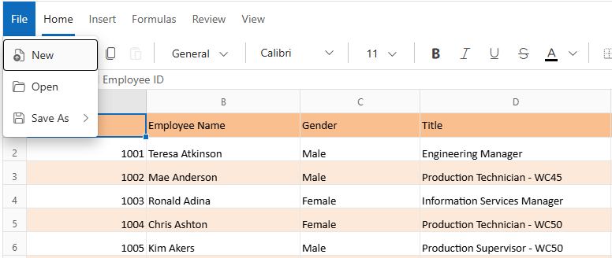
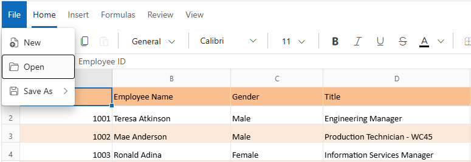
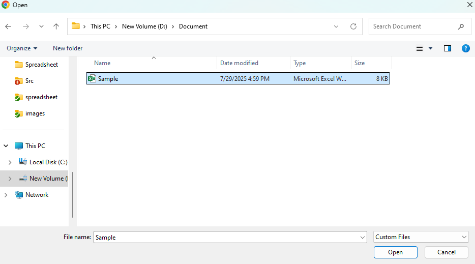
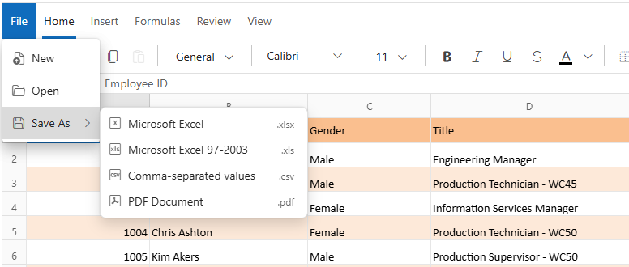
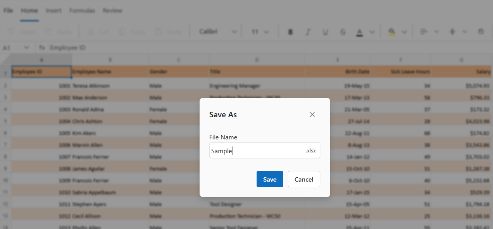

# Open and Save in Blazor Spreadsheet Component

The **Open** and **Save** functionalities in the Blazor Spreadsheet component allow for efficient management of Excel files. You can open existing Excel files for analysis and modification, and save new or modified spreadsheets in a compatible format.

## New
To create a new, blank workbook through the UI, select **File > New** from the **Ribbon**. This action initializes a blank spreadsheet component, ready for data entry or formatting. If unsaved changes are present, a confirmation dialog will appear, indicating that these changes will be lost. The dialog presents options to proceed with creating the new workbook by selecting **OK**, or to cancel the operation by selecting **Cancel**.



## Open
The [Blazor Spreadsheet Editor](https://www.syncfusion.com/spreadsheet-editor-sdk/blazor-spreadsheet-editor) component preserves all data, cell styles, formatting, and other spreadsheet elements when opening Excel files. These files can be loaded through the user interface action or programmatic methods.

### Open an Excel file via UI

To open an Excel document using the interface, select the **File > Open** option from the **Ribbon**. A file explorer dialog will appear, allowing selection of the desired Excel file for loading into the component.





### Open an Excel file from a local path
To load Excel files programmatically, they can be converted into byte arrays. This approach is particularly effective when files are retrieved from a backend service.

N> In Blazor WebAssembly, File.ReadAllBytes is not supported due to browser security limitations. To work with Excel files, use a [Base64-encoded Excel files](#open-an-excel-file-from-a-base64-string) instead.




@using Syncfusion.Blazor.Spreadsheet

<SfSpreadsheet DataSource="DataSourceBytes" >
    <SpreadsheetRibbon></SpreadsheetRibbon>
</SfSpreadsheet>

@code {
    public byte[] DataSourceBytes { get; set; }

    protected override void OnInitialized()
    {
        string filePath = "wwwroot/Sample.xlsx";
        DataSourceBytes = File.ReadAllBytes(filePath);
    }
}




### Open an Excel file from a Base64 string
An Excel file encoded as a Base64 string can be loaded into the Spreadsheet component by converting the string into a byte array and then into a stream. This method is effective when retrieving file data from a database or an API.




@using Syncfusion.Blazor.Spreadsheet

 <SfSpreadsheet DataSource="DataSourceBytes" >
    <SpreadsheetRibbon></SpreadsheetRibbon>
 </SfSpreadsheet>

@code {
    public byte[] DataSourceBytes { get; set; }

    protected override void OnInitialized()
    {
        string base64String = "Enter the base64 string data here";
        DataSourceBytes = Convert.FromBase64String(base64String);     
    }
}




### Open an Excel file from JSON data

The Blazor Spreadsheet component accepts data only as a byte array through the [DataSource](https://help.syncfusion.com/cr/blazor/Syncfusion.Blazor.Spreadsheet.SfSpreadsheet.html#Syncfusion_Blazor_Spreadsheet_SfSpreadsheet_DataSource) property. To load JSON data into the Spreadsheet, convert the JSON data into an Excel file format using [XlsIO](https://help.syncfusion.com/file-formats/xlsio/overview), then convert it to a byte array. This approach allows importing JSON data from a local file or a remote URL.

N> To run the following examples, install the [Syncfusion.XlsIORenderer.Net.Core](https://www.nuget.org/packages/Syncfusion.XlsIORenderer.Net.core) NuGet package in your project to access the XlsIO APIs used for converting JSON data to Excel format.

#### Load an Excel file from a local JSON file

JSON data can be loaded from a local JSON file, converted to Excel format using XlsIO, and displayed in the Spreadsheet component. This approach is useful when working with static JSON data files within the application. The implementation reads the JSON file, converts it to Excel format using XlsIO, and binds it to the Spreadsheet as a byte array.




@using System.Text.Json
@using Syncfusion.XlsIO
@using Syncfusion.Blazor.Spreadsheet

<SfSpreadsheet DataSource="DataSourceBytes">
	<SpreadsheetRibbon></SpreadsheetRibbon>
</SfSpreadsheet>

@code {

	public byte[] DataSourceBytes { get; set; }

	protected override void OnInitialized()
	{
		// Build the file path to the JSON data source
		// Note: Replace "wwwroot" and "sample.json" with the actual folder and file name where your JSON is stored.
		string jsonFilePath = Path.Combine(Directory.GetCurrentDirectory(), "wwwroot", "sample.json");

		// Read the entire JSON file content as a string
		string jsonData = File.ReadAllText(jsonFilePath);

		// Convert the JSON content to an Excel byte array for Spreadsheet binding
		DataSourceBytes = ConvertJsonToExcel(jsonData);
	}

	// Converts a JSON string into an Excel workbook byte array using Syncfusion XlsIO
	private byte[] ConvertJsonToExcel(string jsonData)
	{
		// Parse the JSON string into a JsonDocument for processing
		using JsonDocument jsonDocument = JsonDocument.Parse(jsonData);
		JsonElement rootJsonElement = jsonDocument.RootElement;

		// Normalize the JSON structure into a list of row dictionaries
		List<Dictionary<string, JsonElement>> dataRows = NormalizeJsonToRows(rootJsonElement);

		// Extract all unique column headers (keys) from all rows
		List<string> columnHeaders = dataRows
			.SelectMany(row => row.Keys)
			.Distinct()
			.ToList();

		// Initialize the Excel engine
		using ExcelEngine excelEngine = new ExcelEngine();
		IApplication excelApplication = excelEngine.Excel;

		// Create a new workbook with one worksheet
		IWorkbook workbook = excelApplication.Workbooks.Create(1);
		IWorksheet worksheet = workbook.Worksheets[0];

		// Write header row with column names
		int columnCount = columnHeaders.Count;
		for (int columnIndex = 0; columnIndex < columnCount; columnIndex++)
		{
			IRange headerCell = worksheet.Range[1, columnIndex + 1];
			headerCell.Text = columnHeaders[columnIndex];
			headerCell.CellStyle.Font.Bold = true;
		}

		// Write data rows starting from the second row
		int currentRowIndex = 2;
		foreach (var dataRow in dataRows)
		{
			for (int columnIndex = 0; columnIndex < columnCount; columnIndex++)
			{
				string columnKey = columnHeaders[columnIndex];

				// Write cell value if the key exists in the current row
				if (dataRow.TryGetValue(columnKey, out var cellValue))
				{
					worksheet.Range[currentRowIndex, columnIndex + 1].Value2 = cellValue;
				}
			}
			currentRowIndex++;
		}

		// Save the workbook to a memory stream and return as byte array
		using MemoryStream memoryStream = new MemoryStream();
		workbook.SaveAs(memoryStream);
		return memoryStream.ToArray();
	}

	// Normalizes various JSON structures (array, object, or single value) into a uniform list of row dictionaries
	private List<Dictionary<string, JsonElement>> NormalizeJsonToRows(JsonElement rootJsonElement)
	{
		// Case 1: JSON is an array - convert each element to a dictionary
		if (rootJsonElement.ValueKind == JsonValueKind.Array)
		{
			return rootJsonElement.EnumerateArray()
				.Select(JsonToDictionaryList)
				.ToList();
		}

		// Case 2: JSON is an object
		if (rootJsonElement.ValueKind == JsonValueKind.Object)
		{
			// Check if the object contains array properties (wrapper pattern)
			foreach (var property in rootJsonElement.EnumerateObject())
			{
				if (property.Value.ValueKind == JsonValueKind.Array)
				{
					return property.Value.EnumerateArray()
						.Select(JsonToDictionaryList)
						.ToList();
				}
			}

			// Single object record - wrap in a list
			return new List<Dictionary<string, JsonElement>>
			{
				JsonToDictionaryList(rootJsonElement)
			};
		}

		// Case 3: Fallback for primitive values - wrap in a dictionary with "value" key
		return new List<Dictionary<string, JsonElement>>
		{
			new Dictionary<string, JsonElement> { ["value"] = rootJsonElement }
		};
	}

	// Converts a JsonElement to a dictionary of property names and values
	private Dictionary<string, JsonElement> JsonToDictionaryList(JsonElement jsonElement)
	{
		// If not an object, wrap the value in a dictionary with "value" key
		if (jsonElement.ValueKind != JsonValueKind.Object)
		{
			return new Dictionary<string, JsonElement> { ["value"] = jsonElement };
		}

		// Enumerate all properties and convert to dictionary
		return jsonElement.EnumerateObject()
			.ToDictionary(
				property => property.Name,
				property => property.Value,
				StringComparer.OrdinalIgnoreCase
			);
	}
}




#### Load an Excel file from a remote JSON URL

Remote JSON data can be integrated into the Spreadsheet component by converting it into an Excel-compatible format. The process begins with asynchronous retrieval of JSON from the specified endpoint using HttpClient. The fetched data is then transformed into an Excel workbook through XlsIO, and the resulting byte array is passed to the Spreadsheet for rendering. This approach is particularly useful for integrating real-time data from REST APIs or other web services.

N> Before using HttpClient, register it in the **Program.cs** file of your application. For Blazor WebAssembly, add `builder.Services.AddHttpClient();` before `await builder.Build().RunAsync();`. For Blazor Server, add `builder.Services.AddHttpClient();` in the service configuration section.




@using System.Text.Json
@using Syncfusion.XlsIO
@using Syncfusion.Blazor.Spreadsheet
@inject HttpClient HttpClient

@if (IsDataLoaded)
{
	<SfSpreadsheet DataSource="DataSourceBytes">
		<SpreadsheetRibbon></SpreadsheetRibbon>
	</SfSpreadsheet>
}
@code {

	public byte[] DataSourceBytes { get; set; }

	// Flag to indicate whether the data has been loaded
	public bool IsDataLoaded { get; set; }

	protected override async Task OnInitializedAsync()
	{
		// Define the remote JSON URL
		// Note: Replace with your actual JSON endpoint URL
		string jsonUrl = "https://jsonplaceholder.typicode.com/todos";

		// Fetch JSON data from the remote URL
		string jsonData = await HttpClient.GetStringAsync(jsonUrl);

		// Transform the JSON data to an Excel byte array for Spreadsheet binding
		DataSourceBytes = ConvertJsonToExcel(jsonData);

		// Set flag to indicate data is loaded
		IsDataLoaded = true;
	}

	// Transforms a JSON string into an Excel workbook byte array using Syncfusion XlsIO
	private byte[] ConvertJsonToExcel(string jsonData)
	{
		// Parse the JSON string into a JsonDocument for processing
		using JsonDocument jsonDocument = JsonDocument.Parse(jsonData);
		JsonElement rootJsonElement = jsonDocument.RootElement;

		// Normalize the JSON structure into a list of row dictionaries
		List<Dictionary<string, JsonElement>> dataRows = NormalizeJsonToRows(rootJsonElement);

		// Extract all unique column headers (keys) from all rows
		List<string> columnHeaders = dataRows
			.SelectMany(row => row.Keys)
			.Distinct()
			.ToList();

		// Initialize the Excel engine
		using ExcelEngine excelEngine = new ExcelEngine();
		IApplication excelApplication = excelEngine.Excel;

		// Create a new workbook with one worksheet
		IWorkbook workbook = excelApplication.Workbooks.Create(1);
		IWorksheet worksheet = workbook.Worksheets[0];

		// Write header row with column names
		int columnCount = columnHeaders.Count;
		for (int columnIndex = 0; columnIndex < columnCount; columnIndex++)
		{
			IRange headerCell = worksheet.Range[1, columnIndex + 1];
			headerCell.Text = columnHeaders[columnIndex];
		}

		// Write data rows starting from the second row
		int currentRowIndex = 2;
		foreach (var dataRow in dataRows)
		{
			for (int columnIndex = 0; columnIndex < columnCount; columnIndex++)
			{
				string columnKey = columnHeaders[columnIndex];

				// Write cell value if the key exists in the current row
				if (dataRow.TryGetValue(columnKey, out JsonElement cellValue))
				{
					worksheet.Range[currentRowIndex, columnIndex + 1].Value2 = cellValue;
				}
			}
			currentRowIndex++;
		}

		// Save the workbook to a memory stream and return as byte array
		using MemoryStream memoryStream = new MemoryStream();
		workbook.SaveAs(memoryStream);
		return memoryStream.ToArray();
	}

	// Normalizes various JSON structures (array, object, or single value) into a uniform list of row dictionaries
	private List<Dictionary<string, JsonElement>> NormalizeJsonToRows(JsonElement rootJsonElement)
	{
		// Case 1: JSON is an array - convert each element to a dictionary
		if (rootJsonElement.ValueKind == JsonValueKind.Array)
		{
			return rootJsonElement.EnumerateArray()
				.Select(JsonToDictionaryList)
				.ToList();
		}

		// Case 2: JSON is an object
		if (rootJsonElement.ValueKind == JsonValueKind.Object)
		{
			// Check if the object contains array properties (wrapper pattern)
			foreach (var property in rootJsonElement.EnumerateObject())
			{
				if (property.Value.ValueKind == JsonValueKind.Array)
				{
					return property.Value.EnumerateArray()
						.Select(JsonToDictionaryList)
						.ToList();
				}
			}

			// Single object record - wrap in a list
			return new List<Dictionary<string, JsonElement>>
			{
				JsonToDictionaryList(rootJsonElement)
			};
		}

		// Case 3: Fallback for primitive values - wrap in a dictionary with "value" key
		return new List<Dictionary<string, JsonElement>>
		{
			new Dictionary<string, JsonElement> { ["value"] = rootJsonElement }
		};
	}

	// Parses a JsonElement into a dictionary of property names and values
	private Dictionary<string, JsonElement> JsonToDictionaryList(JsonElement jsonElement)
	{
		// If not an object, wrap the value in a dictionary with "value" key
		if (jsonElement.ValueKind != JsonValueKind.Object)
		{
			return new Dictionary<string, JsonElement> { ["value"] = jsonElement };
		}

		// Enumerate all properties and convert to dictionary
		return jsonElement.EnumerateObject()
			.ToDictionary(
				property => property.Name,
				property => property.Value,
				StringComparer.OrdinalIgnoreCase
			);
	}
}




### Open an Excel file from Google Drive
To load an Excel file from `Google Drive` in the Blazor Spreadsheet, follow the steps below.

**Prerequisites:**
- [Google Cloud project](https://developers.google.com/workspace/guides/create-project) in the Google Cloud Console.
- [Service account](https://cloud.google.com/iam/docs/service-accounts-create) within the GCP project.
- [Service account key](https://cloud.google.com/iam/docs/keys-create-delete) (JSON) available on disk.
- [Google Drive API enabled](https://developers.google.com/drive/api/guides/enable-drive-api) for the project.
- [Google Drive account](https://drive.google.com/) with access to the file to download.
- [Google.Apis.Drive.v3](https://www.nuget.org/packages/Google.Apis.Drive.v3) NuGet package installed in your project to access Google Drive API.

**Step 1:** Install required NuGet packages

To use Google Drive with the Blazor Spreadsheet, install the following packages:

- [Google.Apis.Drive.v3](https://www.nuget.org/packages/Google.Apis.Drive.v3) — to access the Google Drive API
- [Syncfusion.Blazor.Spreadsheet](https://www.nuget.org/packages/Syncfusion.Blazor.Spreadsheet) — to use the Syncfusion Blazor Spreadsheet component

**Step 2:** Include the following namespaces in the **Index.razor** file

Import the required namespaces at the top of the file:

```
@using Google.Apis.Auth.OAuth2;
@using Google.Apis.Drive.v3;
@using Google.Apis.Services;
@using Syncfusion.Blazor.Spreadsheet;
@using System.IO;
```

**Step 3:** Download the Excel file, convert to bytes, and prepare for binding

Add the below code example to download the `Google Drive` file using the Drive API, convert the stream to a byte array, and bind it to the [DataSource](https://help.syncfusion.com/cr/blazor/Syncfusion.Blazor.Spreadsheet.SfSpreadsheet.html#Syncfusion_Blazor_Spreadsheet_SfSpreadsheet_DataSource) property.




@page "/"

@if (IsSpreadsheetDataLoaded)
{
    <SfSpreadsheet DataSource="DataSourceBytes">
        <SpreadsheetRibbon></SpreadsheetRibbon>
    </SfSpreadsheet>
}
@code{
 
    public byte[] DataSourceBytes { get; set; }
 
    // Flag to indicate whether the spreadsheet data has been loaded and is ready for rendering
    public bool IsSpreadsheetDataLoaded { get; set; }
 
    protected override async Task OnInitializedAsync()
    {
        //Download the document from Google Drive
        MemoryStream stream = await GetDocumentFromGoogleDrive();

        //Set the position as '0'
        stream.Position = 0;

        // Convert the MemoryStream to a byte array to be used as the DataSource
        DataSourceBytes = stream.ToArray();
 
        // Set the flag to true to indicate that the spreadsheet data is ready
        IsSpreadsheetDataLoaded = true;
    }
 
    // Download file from Google Drive
    public async Task<MemoryStream> GetDocumentFromGoogleDrive()
    {
        //Define the path to the service account key file
        string serviceAccountKeyPath = "Your_service_account_key_path";

        //Specify the file ID of the file to download
        string fileID = "Your_file_id";
 
        try
        {
            //Authenticate the Google Drive API access using the service account key
            GoogleCredential credential = GoogleCredential.FromFile(serviceAccountKeyPath).CreateScoped(DriveService.ScopeConstants.Drive);
 
            //Create the Google Drive service
            DriveService service = new DriveService(new BaseClientService.Initializ()
            {
                HttpClientInitializer = credential
            });
 
            //Create a request to get the file from Google Drive
            var request = service.Files.Get(fileID);
 
            //Download the file into a MemoryStream
            MemoryStream stream = new MemoryStream();
            await request.DownloadAsync(stream);
 
            return stream;
        }
        catch (Exception ex)
        {
            Console.WriteLine($"Error retrieving document from Google Drive: {ex.Message}");
            throw;
        }
    }
}




N> Replace **Your_file_id** with the actual Google Drive file ID, and **Your_service_account_key_path** with the actual path to your service account key JSON file.

N> The **FileID** is the unique identifier for a Google Drive file. For example, if the file URL is: `https://drive.google.com/file/d/abc123xyz456/view?usp=sharing`, then the file ID is `abc123xyz456`.

### Supported file formats
The Spreadsheet component supports opening the following file formats:
* Microsoft Excel Workbook (.xlsx)
* Microsoft Excel 97-2003 (.xls)

## Save
The Spreadsheet component allows you to save data, styles, formatting, and other content as an Excel file. This functionality ensures that all modifications are preserved in a compatible format.

### Save an Excel file using UI
To save the Spreadsheet content through the user interface, select the **File > Save As** option from the **Ribbon**. You can then specify the file name and format in the save dialog.





### Saving file with active protection settings
When a protected sheet or workbook is saved or downloaded, all associated settings - such as the protection password, unlocked cell ranges, and sheet options - are preserved in the Excel file. These settings remain active and are consistently maintained when the file is opened in other viewers like **Microsoft Excel** or **Google Sheets**, ensuring seamless protection across viewers. To know more about protection, refer [here](./protection#protect-sheet).

### Supported file formats
The Spreadsheet component supports saving files in the following formats:
* Microsoft Excel (.xlsx)
* Microsoft Excel 97-2003 (.xls)
* Comma Separated Values (.csv)
* Portable Document Format (.pdf)

### Save an Excel file programmatically

The Blazor Spreadsheet component provides two methods for saving Excel files programmatically:

- [SaveAsync()](https://help.syncfusion.com/cr/blazor/Syncfusion.Blazor.Spreadsheet.SfSpreadsheet.html#Syncfusion_Blazor_Spreadsheet_SfSpreadsheet_SaveAsync_Syncfusion_Blazor_Spreadsheet_SaveOptions_) – Saves the spreadsheet as an Excel file.
- [SaveAsStreamAsync()](https://help.syncfusion.com/cr/blazor/Syncfusion.Blazor.Spreadsheet.SfSpreadsheet.html#Syncfusion_Blazor_Spreadsheet_SfSpreadsheet_SaveAsStreamAsync) – Returns the spreadsheet content as a [MemoryStream](https://learn.microsoft.com/dotnet/api/system.io.memorystream) for further processing or storage.

#### Save as an Excel file

The [SaveAsync()](https://help.syncfusion.com/cr/blazor/Syncfusion.Blazor.Spreadsheet.SfSpreadsheet.html#Syncfusion_Blazor_Spreadsheet_SfSpreadsheet_SaveAsync_Syncfusion_Blazor_Spreadsheet_SaveOptions_) method saves the spreadsheet content as an Excel file programmatically and supports customization through the [SaveOptions](https://help.syncfusion.com/cr/blazor/Syncfusion.Blazor.Spreadsheet.SaveOptions.html) parameter.

| Parameter | Type | Description |
| -- | -- | -- |
| options | [SaveOptions](https://help.syncfusion.com/cr/blazor/Syncfusion.Blazor.Spreadsheet.SaveOptions.html) | Specifies settings for the save operation, such as the file name and file type (for example, XLSX). |

N> If options are not provided, the default settings are **FileName**: `"Spreadsheet"` (the downloaded file will be named `"Spreadsheet.xlsx"`) and **SaveType**: [SaveType.Xlsx](https://help.syncfusion.com/cr/blazor/Syncfusion.Blazor.Spreadsheet.SaveType.html).




@using Syncfusion.Blazor.Spreadsheet

<button OnClick="SaveWorkbookHandler">Save as Excel</button>
<SfSpreadsheet @ref="SpreadsheetInstance" DataSource="DataSourceBytes"></SfSpreadsheet>

@code {
    public byte[] DataSourceBytes { get; set; }
    public SfSpreadsheet SpreadsheetInstance { get; set; }

    protected override void OnInitialized()
    {
        string filePath = "wwwroot/Sample.xlsx";
        DataSourceBytes = File.ReadAllBytes(filePath);
    }

    public async Task SaveWorkbookHandler()
    {
        // Exports the workbook as "MonthlyReport.xlsx"
        await SpreadsheetInstance.SaveAsync(new SaveOptions
        {
            SaveType = SaveType.Xlsx,
            FileName = "MonthlyReport"
        });
    }
}



#### Save as a MemoryStream

The [SaveAsStreamAsync()](https://help.syncfusion.com/cr/blazor/Syncfusion.Blazor.Spreadsheet.SfSpreadsheet.html#Syncfusion_Blazor_Spreadsheet_SfSpreadsheet_SaveAsStreamAsync) method retrieves the spreadsheet content as a [MemoryStream](https://learn.microsoft.com/dotnet/api/system.io.memorystream) for further processing, such as saving to a database or cloud storage.

N> The following example uses `File.Create` to persist the stream to disk, which works only in Blazor Server (where the server has file system access). In Blazor WebAssembly, browser security prevents direct file system writes; use JavaScript interop (`IJSRuntime`) to trigger a client-side download, or send the stream to a backend API for storage.




@using Syncfusion.Blazor.Spreadsheet

<button OnClick="SaveToServer">Save to Server</button>
<SfSpreadsheet @ref="SpreadsheetInstance" DataSource="DataSourceBytes"></SfSpreadsheet>

@code {
    public byte[] DataSourceBytes { get; set; }
    public SfSpreadsheet SpreadsheetInstance { get; set; }

    protected override void OnInitialized()
    {
        string filePath = "wwwroot/Sample.xlsx";
        DataSourceBytes = File.ReadAllBytes(filePath);
    }

    public async Task SaveToServer()
    {
        var stream = await SpreadsheetInstance.SaveAsStreamAsync();
        // Example: Saves the stream to a file named "ServerReport.xlsx"
        using var fileStream = File.Create("wwwroot/ServerReport.xlsx");
        stream.CopyTo(fileStream);
    }
}



### Save in different file formats

The Blazor Spreadsheet component supports exporting spreadsheet data to multiple file formats, enabling flexibility in how data is shared and consumed. Each format has specific use cases and compatibility considerations, allowing developers to choose the optimal format based on downstream processing requirements or distribution needs.

**Supported Save Formats:**

| SaveType | File Extension | Description |
|---|---|---|
| `Xlsx` | `.xlsx` | Microsoft Excel 2007 and later format |
| `Xls` | `.xls` | Microsoft Excel 97-2003 format |
| `Csv` | `.csv` | Comma Separated Values format |
| `Pdf` | `.pdf` | Portable Document Format |

**Configuring File Format:**

Specify the desired export format using the `SaveType` property within the [SaveOptions](https://help.syncfusion.com/cr/blazor/Syncfusion.Blazor.Spreadsheet.SaveOptions.html) parameter. The format determines how the spreadsheet content is transformed and exported. Optional layout settings such as page orientation and scaling can be configured for PDF exports.

The following code example demonstrates saving the spreadsheet in different formats:




@using Syncfusion.Blazor.Spreadsheet

<button OnClick="SaveAsXlsx">Save as XLSX</button>
<button OnClick="SaveAsCsv">Save as CSV</button>

<SfSpreadsheet @ref="SpreadsheetInstance" DataSource="DataSourceBytes">
    <SpreadsheetRibbon></SpreadsheetRibbon>
</SfSpreadsheet>

@code {
    public byte[] DataSourceBytes { get; set; }
    public SfSpreadsheet SpreadsheetInstance { get; set; }

    protected override void OnInitialized()
    {
        string filePath = "wwwroot/Sample.xlsx";
        DataSourceBytes = File.ReadAllBytes(filePath);
    }

    // Save as Excel 2007 and later format (.xlsx)
    public async Task SaveAsXlsx()
    {
        await SpreadsheetInstance.SaveAsync(new SaveOptions
        {
            SaveType = SaveType.Xlsx,
            FileName = "Spreadsheet"
        });
    }

    // Save as Comma Separated Values format (.csv)
    public async Task SaveAsCsv()
    {
        await SpreadsheetInstance.SaveAsync(new SaveOptions
        {
            SaveType = SaveType.Csv,
            FileName = "Spreadsheet"
        });
    }
}




### Save as PDF with layout settings

PDF export from the Blazor Spreadsheet component supports customization of layout and presentation through the [PdfLayoutSettings](https://help.syncfusion.com/cr/blazor/Syncfusion.Blazor.Spreadsheet.PdfLayoutSettings.html) property. These settings control how spreadsheet content is rendered on PDF pages, including page orientation, scaling behavior, and content distribution. By default, PDF documents are created in portrait orientation with standard scaling.

**Available PDF Layout Settings:**

| Property | Type | Default | Description |
|---|---|---|---|
| `Orientation` | `PdfPageOrientation` | `Portrait` | Controls page orientation: `Portrait` (8.5" × 11") or `Landscape` (11" × 8.5"). Choose Portrait for standard letter-sized documents or Landscape for wide data ranges. |
| `FitSheetOnOnePage` | `bool` | `false` | Determines content scaling behavior: `true` scales content proportionally to fit entire sheet on single page; `false` allows content to span multiple pages using normal printing pagination. |

**Configuring PDF Layout Settings via BeforeSave Event:**

The [BeforeSaveEventArgs](https://help.syncfusion.com/cr/blazor/Syncfusion.Blazor.Spreadsheet.BeforeSaveEventArgs.html) class provides properties that can be used to customize the PDF layout settings during the save operation.

| Property | Type | Description |
|---|---|---|
| `SaveType` | Enum | Gets the export format specified in the [SaveOptions](https://help.syncfusion.com/cr/blazor/Syncfusion.Blazor.Spreadsheet.SaveOptions.html) during the save operation. Use this to apply conditional logic (for example, only configure PDF layout when `SaveType.Pdf` is detected). |
| `PdfLayoutSettings` | Class | Gets or sets the PDF layout configuration (page orientation and scaling behavior). Assign a `PdfLayoutSettings` instance to apply custom layout before the PDF is generated. |

**Layout Configuration Guide:**

**Orientation Selection:**
- **Portrait**: Default orientation, ideal for documents with standard column counts. Maximizes vertical space for data rows.
- **Landscape**: Recommended for spreadsheets with many columns or wide data ranges. Provides additional horizontal space.

**Scaling Behavior:**
- **FitSheetOnOnePage = true**: All spreadsheet content scales to fit on a single PDF page. Useful for summaries, executive reports, or when a one-page document is required. Text and content size may reduce.
- **FitSheetOnOnePage = false**: Content uses standard print scaling and may span multiple pages. Preserves readability and data size at the cost of multiple pages.


The following code example demonstrates saving the spreadsheet as PDF with different layout configurations:




@using Syncfusion.Blazor.Spreadsheet

<button OnClick="SaveAsPdf">Save as PDF</button>

<SfSpreadsheet @ref="SpreadsheetInstance" BeforeSave="OnBeforesave">
    <SpreadsheetRibbon></SpreadsheetRibbon>
</SfSpreadsheet>

@code {
    public SfSpreadsheet SpreadsheetInstance { get; set; }

    public async Task SaveAsPdf()
    {
        await SpreadsheetInstance.SaveAsync(new SaveOptions
        {
            SaveType = SaveType.Pdf,
            FileName = "Spreadsheet"
        });
    }

    public void OnBeforesave(BeforeSaveEventArgs args)
    {
        if (args.SaveType == SaveType.Pdf)
        {
            args.PdfLayoutSettings = new PdfLayoutSettings
            {
                FitSheetOnOnePage = true,
                Orientation = PdfPageOrientation.Landscape
            };
        }
    }
}





### Preserve fonts when saving PDF (Blazor WebAssembly)

In Blazor WebAssembly, to preserve fonts in exported PDF use the `CustomFonts` property of the SfSpreadsheet component. Provide local TrueType font (.ttf) files from wwwroot and reference them via the component.

**CustomFonts Parameter:**

| Property | Type | Description |
|---|---|---|
| `CustomFonts` | `List<string>` | Gets or sets the list of local TrueType font (.ttf) file paths (relative to `wwwroot`) that the WASM PDF exporter fetches and embeds in the generated PDF. Only local `.ttf` files are supported; remote URLs are not allowed.|

#### How to use
- Place .ttf files under wwwroot (for example: wwwroot/Arial.ttf).
- Mark each .ttf as Content so it is published to wwwroot.
- Set the SfSpreadsheet.CustomFonts list with paths relative to wwwroot (for example: `"Arial.ttf"`).
- Only local .ttf files are supported for WASM PDF export — do not use remote URLs.
- Verify file name casing; paths are effectively case-sensitive on some hosts.




@using Syncfusion.Blazor.Spreadsheet
     
<SfSpreadsheet @ref="SpreadsheetRef" CustomFonts="@CustomFonts">
    <SpreadsheetRibbon></SpreadsheetRibbon>
</SfSpreadsheet>

@code {
    public List<string> CustomFonts = new List<string>
    {
        "Arial.ttf",
        "Calibri.ttf",
        "Courier New.ttf",
        "Georgia.ttf"
    };
}




N> Only local TrueType (.ttf) files referenced in `CustomFonts` are fetched and embedded by the WASM PDF exporter. If a font used in the sheet is not provided, a default font will be used and the appearance may change.
