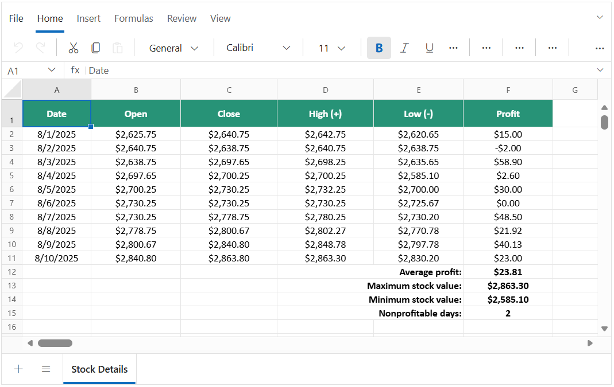

# Overview of the Blazor Spreadsheet Control

The [Syncfusion® Blazor Spreadsheet](https://www.syncfusion.com/spreadsheet-editor-sdk/blazor-spreadsheet-editor) is a user-interactive component designed to organize and analyze data in a tabular format with configuration options for customization. It will load data by importing an Excel file or from local file paths and Base64 string data. The populated data can be exported as Excel files in XLSX format.

## Key features

* [Editing](editing): Familiar Excel-like experience for faster productivity with seamless in-cell and formula bar input
* [Selection](selection): Flexible selection of cells, rows, columns, and ranges using mouse and keyboard
* [Open and save](open-and-save): Seamless support for Excel files (.xlsx, .xls) with local and Base64 operations
* [Clipboard](clipboard): Powerful cut, copy, and paste with cross-platform compatibility (Excel, Google Sheets)
* [Formulas](formulas): Advanced calculation engine with built-in functions and named ranges
* [Cell formatting](cell-range#cell-formatting): Rich cell formatting options including fonts, colors, borders, alignment, and styling
* [Sorting](sorting): Efficient data sorting in ascending and descending order for quick organization
* [Filtering](filtering): Advanced filtering with support for text, numbers, dates, and custom condition
* [Hyperlink](hyperlink): Easy navigation across web URLs and worksheets
* [Undo Redo](undo-redo): Fast error correction with history tracking up to 25 actions
* [Worksheet management](worksheet): Complete worksheet management including insert, delete, rename, move, duplicate, and hide/unhide
* [Protection](protection): Robust workbook and sheet protection with password, permissions, and selective locking
* [Context Menu](contextmenu): Speed up workflows with instant access to key actions via smart menus
* [Cell range](cell-range): Boost efficiency with auto-fill, wrap text, and quick content clearing
* [Accessibility](accessibility): Built-in accessibility support including keyboard navigation, ARIA attributes, and screen reader

## Related Links

* [Getting Started](getting-started-webapp)
* [API Reference](https://help.syncfusion.com/cr/blazor/syncfusion.blazor.spreadsheet.sfspreadsheet.html)
* [Online Demos](https://document.syncfusion.com/demos/spreadsheet-editor/blazor-server/spreadsheet/overview)
* [GitHub Samples](https://github.com/SyncfusionExamples/Blazor-Getting-Started-Examples)
* [Release Notes](https://help.syncfusion.com/document-processing/release-notes)
