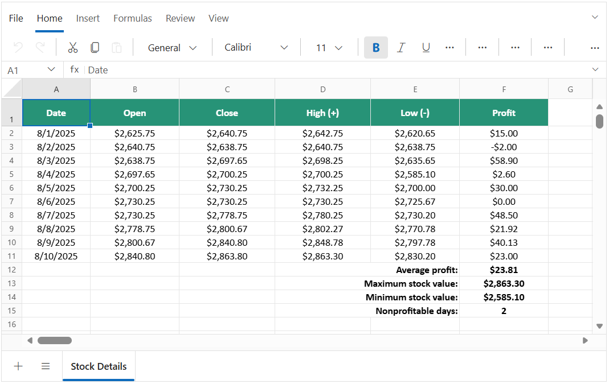

# About Syncfusion Blazor Spreadsheet Control

The [Blazor Spreadsheet Editor](https://www.syncfusion.com/spreadsheet-editor-sdk/blazor-spreadsheet-editor) is a user-interactive component designed to organize and analyze data in a tabular format with configuration options for customization. It will load data by importing an Excel file or from local file paths and Base64 string data. The populated data can be exported as Excel with xlsx, xls, CSV and PDF formats.

## Key features

* [Selection](selection): Flexible selection of cells, rows, columns, and ranges using mouse and keyboard
* [Editing](editing): Familiar Excel-like experience for faster productivity with seamless in-cell and formula bar input
* [Formulas](formulas): Advanced calculation engine with built-in functions and named ranges
* [Clipboard](clipboard): Powerful cut, copy, and paste with cross-platform compatibility (Excel, Google Sheets)
* [Cell formatting](cell-range#cell-formatting): Rich cell formatting options including fonts, colors, borders, alignment, and styling
* [Number formatting](formatting#number-formatting): Provides the option to format the cell value.
* [Open and save](open-and-save): Seamless support for Excel files (.xlsx, .xls) with local and Base64 operations
* [Sorting](sorting): Efficient data sorting in ascending and descending order for quick organization
* [Filtering](filtering): Advanced filtering with support for text, numbers, dates, and custom condition
* [Undo Redo](undo-redo): Fast error correction with history tracking up to 25 actions
* [Hyperlink](hyperlink): Easy navigation across web URLs and worksheets
* [Worksheet management](worksheet): Complete worksheet management including insert, delete, rename, move, duplicate, and hide/unhide
* [Wrap text](formatting): Provides the option to display the large content as multiple lines in a single cell.
* [Data validation](data-validation): Provides the option to validate edited values based on data validation rules defined for a cell or range of cells.
* [Find and replace](find-and-replace): Provides the option to find the data and replace it across all sheets in Spreadsheet.
* [Protection](protection): Robust workbook and sheet protection with password, permissions, and selective locking
* [Borders](formatting#borders): Provides the option to customize cell gridlines such as color and its style for enhanced UI.
* [Show/hide](worksheet#hide-sheet): Provides the option to show/hide sheets.
* [Insert](rows-and-columns): Provides the option to insert rows and columns.
* [Merge cells](merge-cell): Provides the option to combine two or more cells located in the same row or column into a single cell.
* [Conditional formatting](formatting#conditional-formatting): Provides the option to format a cell or range of cells based on conditions applied.
* [Autofill](cell-range#autofill): Provides the option to fill or copy a series or pattern of values and formats into adjacent cells in any direction.
* [Clear](cell-range#clear): Provides the option to clear the content, formats, and hyperlinks applied to a cell or range of cells in a Spreadsheet.
* [Aggregates](formulas#aggregates): Provides the option to check the sum, average, count, and more for the selected cells or range in the sheet.
* [Picture](illustrations): Allows you to view, insert, and modify a picture in a Spreadsheet with customizing options.
* [Chart](charts-and-visualization/overview): Transforms your Spreadsheet data to an intuitive overview for better understanding and to make smart business decisions.
* [Password protection](protection#workbook-protection): Allows you to protect the workbook with a password.
* [Cell range](cell-range): Boost efficiency with auto-fill, wrap text, and quick content clearing
* [Context Menu](contextmenu): Speed up workflows with instant access to key actions via smart menus
* [Accessibility](accessibility): Built-in accessibility support including keyboard navigation, ARIA attributes, and screen reader

## Related Links

* [Getting Started](getting-started-webapp)
* [API Reference](https://help.syncfusion.com/cr/blazor/syncfusion.blazor.spreadsheet.sfspreadsheet.html)
* [Online Demos](https://document.syncfusion.com/demos/spreadsheet-editor/blazor-server/spreadsheet/overview)
* [GitHub Samples](https://github.com/SyncfusionExamples/Blazor-Getting-Started-Examples/tree/main/Spreadsheet)
* [Release Notes](https://help.syncfusion.com/document-processing/release-notes)

