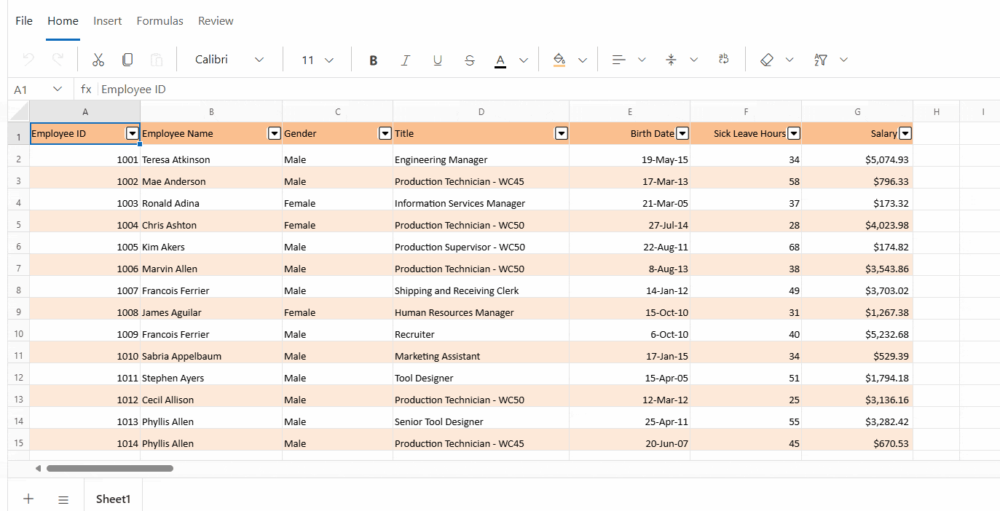
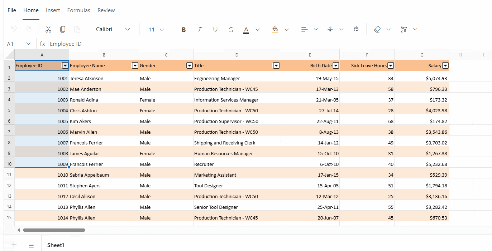
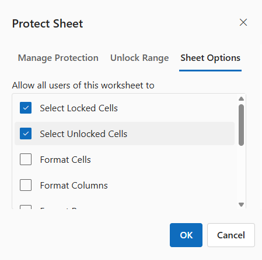
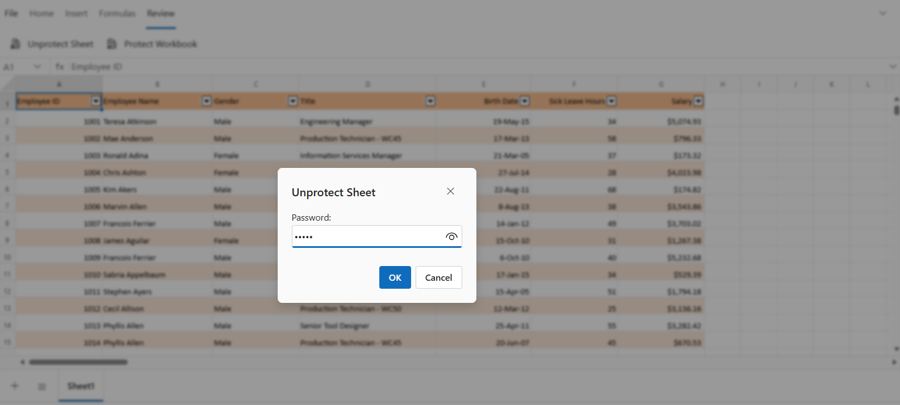
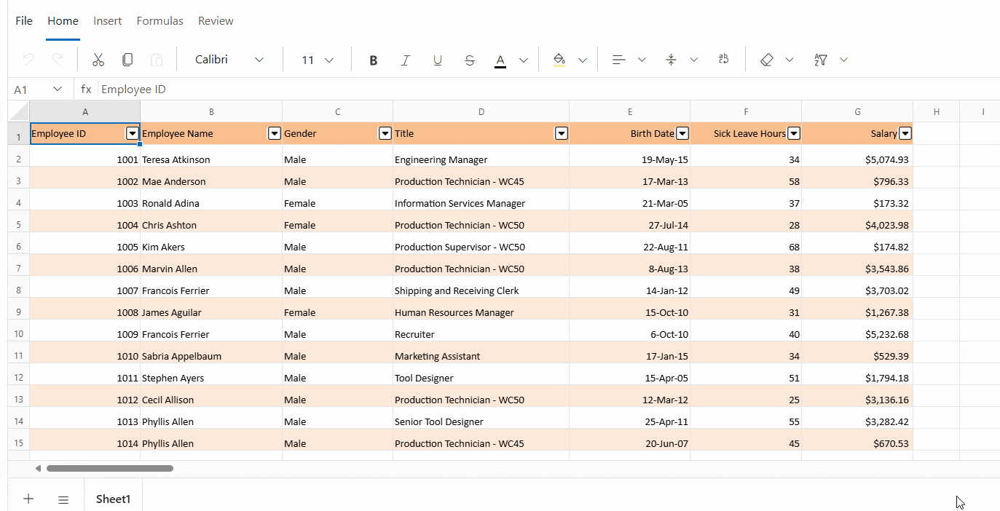
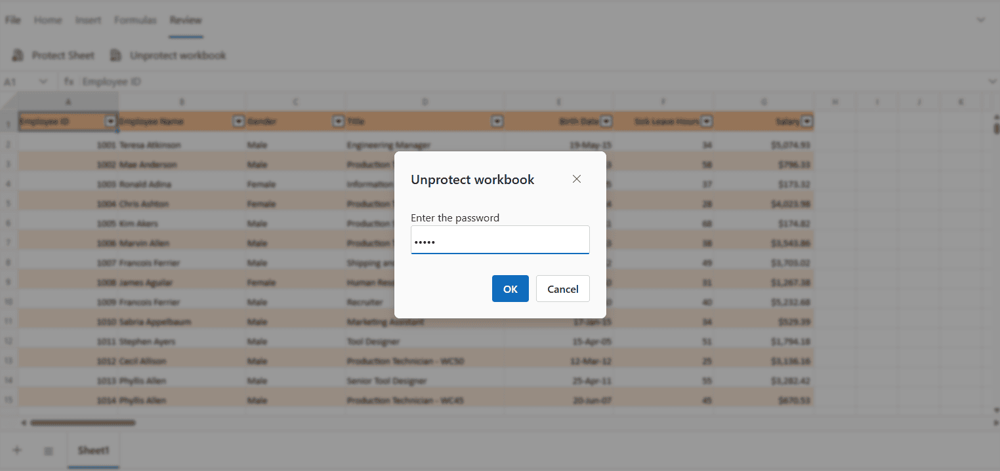

# Protect Sheet in Blazor Spreadsheet component

Sheet protection is used to prevent unauthorized modification of data within the sheet.

## Sheet Protection

The **Protect Sheet** support helps prevent accidental changes such as editing, moving, or deleting data. Protection can be applied with or without a password, depending on the level of security required.

### Protecting a sheet via the UI

The active sheet can be protected using any of the following ways:

*   Navigate to the **Review** tab in the Ribbon and select **Protect Sheet**.
*   Right-click the sheet's tab in the bottom bar and select **Protect Sheet** from the context menu.

In the **Protect Sheet** dialog, you can set a password and specify which actions users are allowed to perform.

### Unlock particular cell or ranges in the protected sheet via the UI

To allow editing of specific cells or ranges in a protected sheet:

* Open the **Protect Sheet** dialog.

* Navigate to the **Unlock Range** tab.

* Select the desired cell(s) or range(s) that should remain editable, even when the sheet is protected. These cells will not be locked and can be modified while other parts of the sheet remain restricted.

### Protection settings in a protected sheet

By default, when a sheet is protected, most actions such as formatting, inserting, sorting, and filtering are restricted, while selecting cells remains allowed.

To enable specific functionalities while the sheet is protected:

* Open the **Protect Sheet** dialog from the **Review** tab.

* In the dialog, navigate to the **Sheet Options** tab to view available protection settings.

* Select or deselect the desired options to allow or restrict specific actions.

* Click **OK** to apply the protection settings.

The available protection settings in Spreadsheet are:

| Options | Description |
|------------------------|---------|
| Select Cells | Allows cell selection. |
| Format Cells | Allows cell formatting. |
| Format Rows | Allows row formatting. |
| Format Columns | Allows column formatting. |
| Insert Columns | Allows inserting new columns. |
| Insert Rows | Allows inserting new rows. |
| Insert Hyperlinks | Allows adding hyperlinks. |
| Sort | Allows sorting data. |
| Filter | Allows filtering data. |

## Unprotect Sheet

The **Unprotect Sheet** support restores access to all actions that were previously restricted by sheet protection. Once unprotected, the sheet allows full interaction, including editing, formatting, inserting, and deleting content.

### Unprotecting sheets via the UI

In the active sheet, the sheet unprotection can be done by any of the following ways:

* Select **Unprotect Sheet** from the **Review** tab in the Ribbon toolbar.

* Right-click the sheet tab context menu option and select **Unprotect Sheet** from the context menu.

## Protect Workbook

The **Protect Workbook** support restricts structural modifications within a workbook. Actions such as inserting, deleting, renaming, or hiding sheets are disabled when this protection is enabled. Protection can be configured with or without a password, depending on the desired level of security.

### Protecting workbooks via the UI

To protect the workbook:

* Go to the **Review** tab in the Ribbon toolbar.

* Select **Protect Workbook**, enter and confirm the desired password, and then click **OK** to apply the protection.

## Unprotect Workbook

The **Unprotect Workbook** support enables structural modifications within a workbook. Once unprotected, actions such as inserting, deleting, renaming, moving, copying, hiding, or unhiding sheets become available.

### Unprotecting workbooks via the UI

To unprotect the workbook:

* Select **Unprotect Workbook** from the **Review** tab in the Ribbon toolbar.

* Enter the correct password in the dialog box, then click **OK**.

