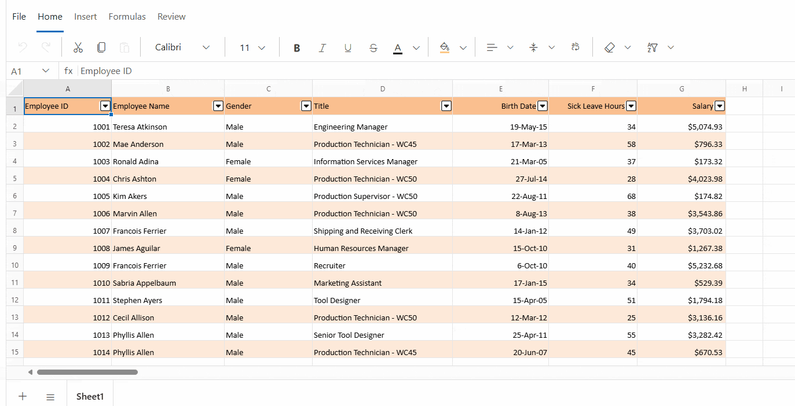
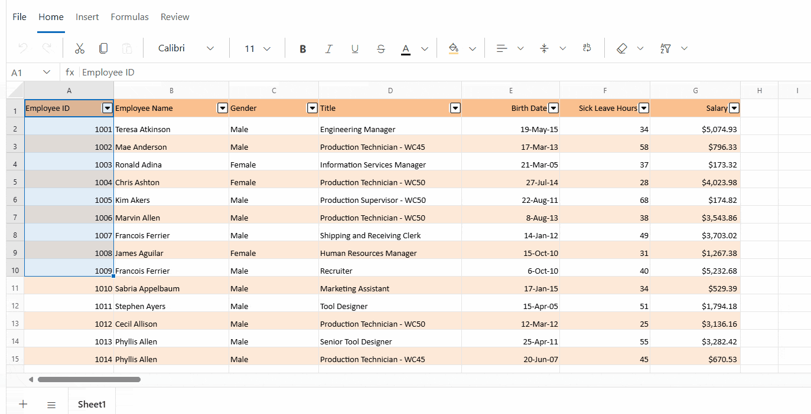
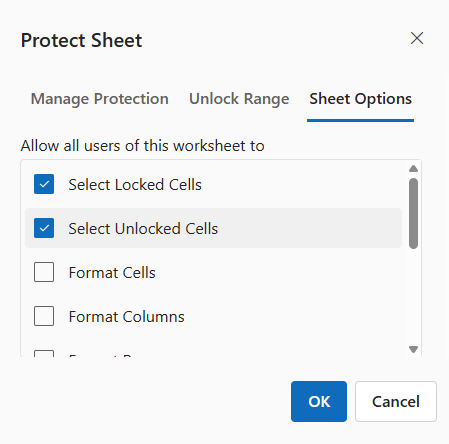
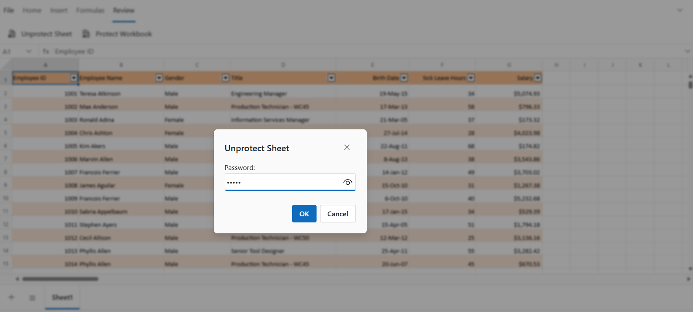
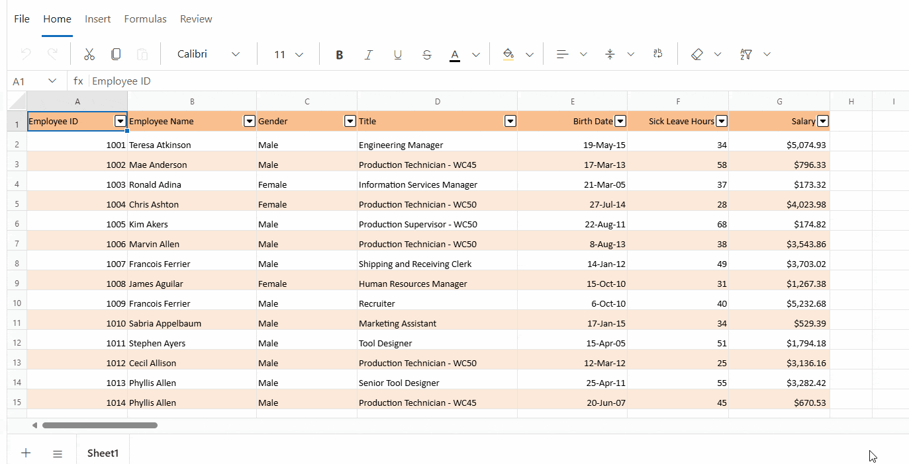
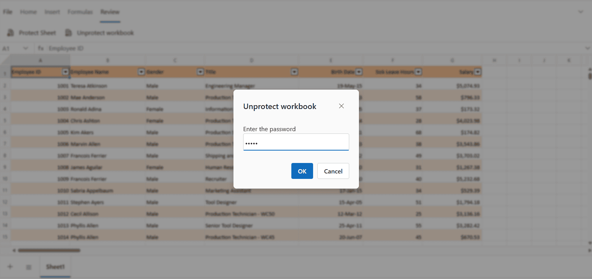

# Protection in Blazor Spreadsheet component

Sheet and workbook protection are used to prevent unauthorized modification of data within a sheet or the structure of a workbook.

## Sheet Protection

The **Protect Sheet** support helps prevent accidental changes such as editing, moving, or deleting data. Protection is applied using the default protection settings.

### Protecting a sheet via the UI

The active sheet can be protected using any of the following ways:

*   Navigate to the **Review** tab in the Ribbon and select **Protect Sheet**.
*   Right-click the sheet's tab in the bottom bar and select **Protect Sheet** from the context menu.

In the **Protect Sheet** dialog, perform the following steps:

1. Open the **Sheet Options** tab and select or deselect the actions that users are allowed to perform while the sheet is protected.
2. Click **OK** to apply the protection.



### Protecting a sheet programmatically

The Spreadsheet component supports protecting a specific worksheet through the [ProtectSheetAsync(string)](https://help.syncfusion.com/cr/blazor/Syncfusion.Blazor.Spreadsheet.SfSpreadsheet.html#Syncfusion_Blazor_Spreadsheet_SfSpreadsheet_ProtectSheetAsync_System_String_) method. This method protects a named sheet using the default protection settings. No password is applied, so any user with access to the workbook can unprotect the sheet.

**Declaration**

```csharp
public Task ProtectSheetAsync(string sheetName = null)
```

The available parameters are:

| Parameter   | Type   | Description |
|-------------|--------|-------------|
| sheetName   | string (optional, default **null**) | Specifies the name of the sheet to protect. Sheet name comparison is case-insensitive. If **null** or empty, the entire workbook (all sheets and the workbook structure) is protected instead. |

**Examples**




@page "/"
@using Syncfusion.Blazor.Spreadsheet
@using Syncfusion.Blazor.Buttons
@using System.IO

<SfButton OnClick="ProtectHandler" Content="Protect"></SfButton>

<SfSpreadsheet DataSource="DataSourceBytes" @ref="SpreadsheetRef">
    <SpreadsheetRibbon></SpreadsheetRibbon>
</SfSpreadsheet>

@code {

    public byte[] DataSourceBytes { get; set; }

    public SfSpreadsheet SpreadsheetRef { get; set; }

    protected override void OnInitialized()
    {
        string filePath = "wwwroot/Sample.xlsx";
        DataSourceBytes = File.ReadAllBytes(filePath);
    }

    public async Task ProtectHandler()
    {
        // Protect a specific sheet by name.
        await SpreadsheetRef.ProtectSheetAsync("Sheet1");

        // Protect multiple sheets individually.
        await SpreadsheetRef.ProtectSheetAsync("DataSheet");
        await SpreadsheetRef.ProtectSheetAsync("Summary");
    }
}




### Unlocking specific cells or ranges in a protected sheet via the UI

To allow editing of specific cells or ranges in a protected sheet:

* Open the **Protect Sheet** dialog.
* Navigate to the **Unlock Range** tab.
* Select **New** to add an unlocked range, and perform the following steps:
    1. Enter a unique **Range Name** for the unlocked range.
    2. Enter the cell reference (for example, `B2:D5`) in the **Refers to** field, or select the range directly on the sheet.
    3. Optionally, enter a password in the **Range Password** field to require authentication before the range can be edited. Re-enter the password to confirm.
    4. Click **OK** to add the unlocked range to the protected sheet.
* Select the desired unlocked range(s) in the dialog to keep them editable while the rest of the sheet remains restricted.



### Unlocking specific cells or ranges programmatically

Unlocked ranges for a protected sheet are configured through the protected-range APIs on the spreadsheet. Each unlocked range is associated with a name, a cell reference, and an optional password. 

### Protection settings in a protected sheet

By default, when a sheet is protected, the actions listed below are restricted while cell selection and navigation remain allowed. The allowed-action set can be customized per sheet from the **Sheet Options** tab of the **Protect Sheet** dialog.

To enable specific functionalities while the sheet is protected:

* Open the **Protect Sheet** dialog from the **Review** tab.
* In the dialog, navigate to the **Sheet Options** tab to view available protection settings.
* Select or deselect the desired options to allow or restrict specific actions.
* Click **OK** to apply the protection settings.

The available protection settings in the Spreadsheet are listed below. Each setting applies to the sheet that is currently protected; settings are not shared between sheets in a workbook.

| Options | Description |
|--------|-------------|
| Select Cells | Allows cell selection. |
| Format Cells | Allows cell formatting. |
| Format Rows | Allows row formatting. |
| Format Columns | Allows column formatting. |
| Insert Columns | Allows inserting new columns. |
| Insert Rows | Allows inserting new rows. |
| Insert Hyperlinks | Allows adding hyperlinks. |
| Sort | Allows sorting data. |
| Filter | Allows filtering data. |



## Unprotect Sheet

The **Unprotect Sheet** support restores access to all actions that were previously restricted by sheet protection. Once unprotected, users can edit, format, insert, and delete content.

### Unprotecting a sheet via the UI

In the active sheet, sheet unprotect can be performed using any of the following ways:

* Select **Unprotect Sheet** from the **Review** tab in the Ribbon toolbar.
* Right-click the sheet tab and select **Unprotect Sheet** from the context menu.

When the sheet is protected with a password, perform the following steps:

1. Select **Unprotect Sheet** from the Ribbon or the context menu to open the **Unprotect Sheet** dialog.
2. Enter the password that was set when the sheet was protected.
3. Click **OK** to unprotect.

When the sheet is protected without a password, no password entry is required and the sheet is unprotected immediately.



### Unprotecting a sheet programmatically

The [UnprotectSheetAsync(string)](https://help.syncfusion.com/cr/blazor/Syncfusion.Blazor.Spreadsheet.SfSpreadsheet.html#Syncfusion_Blazor_Spreadsheet_SfSpreadsheet_UnprotectSheetAsync_System_String_) method removes protection from a specific worksheet.

**Declaration**

```csharp
public Task UnprotectSheetAsync(string sheetName = null)
```

The available parameters are:

| Parameter   | Type   | Description |
|-------------|--------|-------------|
| sheetName   | string (optional, default **null**) | Specifies the name of the sheet to unprotect. Sheet name comparison is case-insensitive. If **null** or empty, the entire workbook protection (structure and all sheets) is removed instead. |

**Examples**




@page "/"
@using Syncfusion.Blazor.Spreadsheet
@using Syncfusion.Blazor.Buttons

<SfButton OnClick="UnprotectHandler" Content="Unprotect"></SfButton>

<SfSpreadsheet DataSource="DataSourceBytes" @ref="SpreadsheetRef">
    <SpreadsheetRibbon></SpreadsheetRibbon>
</SfSpreadsheet>

@code {

    public byte[] DataSourceBytes { get; set; }

    public SfSpreadsheet SpreadsheetRef { get; set; }

    protected override void OnInitialized()
    {
        string filePath = "wwwroot/Sample.xlsx";
        DataSourceBytes = File.ReadAllBytes(filePath);
    }

    public async Task UnprotectHandler()
    {
        // Unprotect a specific sheet by name.
        await SpreadsheetRef.UnprotectSheetAsync("Sheet1");

        // Unprotect multiple sheets individually.
        await SpreadsheetRef.UnprotectSheetAsync("DataSheet");
        await SpreadsheetRef.UnprotectSheetAsync("Summary");
    }
}




## Workbook Protection

The **Workbook Protection** support restricts structural modifications within a workbook. Actions such as inserting, deleting, renaming, or hiding sheets are disabled when this protection is enabled.

### Protecting a workbook via the UI

To protect the workbook:

* Go to the **Review** tab in the Ribbon toolbar.
* Select **Protect Workbook**, and then click **OK** to apply the protection.



### Protecting a workbook programmatically

Workbook protection is applied through the same [ProtectSheetAsync(string)](https://help.syncfusion.com/cr/blazor/Syncfusion.Blazor.Spreadsheet.SfSpreadsheet.html#Syncfusion_Blazor_Spreadsheet_SfSpreadsheet_ProtectSheetAsync_System_String_) method, called with a `null` or empty `sheetName` argument. When no sheet name is provided, the entire workbook (all sheets and the workbook structure) is protected using the default protection settings. No password is applied, so any user with access to the workbook can unprotect it.

**Examples**




@page "/"
@using Syncfusion.Blazor.Spreadsheet
@using Syncfusion.Blazor.Buttons
@using System.IO

<SfButton OnClick="ProtectWorkbookHandler" Content="Protect Workbook"></SfButton>

<SfSpreadsheet DataSource="DataSourceBytes" @ref="SpreadsheetRef">
    <SpreadsheetRibbon></SpreadsheetRibbon>
</SfSpreadsheet>

@code {

    public byte[] DataSourceBytes { get; set; }

    public SfSpreadsheet SpreadsheetRef { get; set; }

    protected override void OnInitialized()
    {
        string filePath = "wwwroot/Sample.xlsx";
        DataSourceBytes = File.ReadAllBytes(filePath);
    }

    public async Task ProtectWorkbookHandler()
    {
        // Protects the entire workbook (structure and all sheets) using the default protection settings.
        await SpreadsheetRef.ProtectSheetAsync();
    }
}




## Unprotect Workbook

The **Unprotect Workbook** support enables structural modifications within a workbook. Once unprotected, actions such as inserting, deleting, renaming, moving, copying, hiding, or unhiding sheets become available.

### Unprotecting a workbook via the UI

To unprotect the workbook:

* Select **Unprotect Workbook** from the **Review** tab in the Ribbon toolbar.
* When the workbook is protected with a password, perform the following steps:
    1. Enter the correct password in the **Unprotect Workbook** dialog.
    2. Click **OK** to apply the unprotection.
* When the workbook is protected without a password, no password entry is required and the workbook is unprotected immediately.



### Unprotecting a workbook programmatically

Workbook unprotection is applied through the same [UnprotectSheetAsync(string)](https://help.syncfusion.com/cr/blazor/Syncfusion.Blazor.Spreadsheet.SfSpreadsheet.html#Syncfusion_Blazor_Spreadsheet_SfSpreadsheet_UnprotectSheetAsync_System_String_) method, called with a `null` or empty `sheetName` argument. When no sheet name is provided, all workbook structure protection is removed.

**Examples**




@page "/"
@using Syncfusion.Blazor.Spreadsheet
@using Syncfusion.Blazor.Buttons

<SfButton OnClick="UnprotectWorkbookHandler" Content="Unprotect Workbook"></SfButton>

<SfSpreadsheet DataSource="DataSourceBytes" @ref="SpreadsheetRef">
    <SpreadsheetRibbon></SpreadsheetRibbon>
</SfSpreadsheet>

@code {

    public byte[] DataSourceBytes { get; set; }

    public SfSpreadsheet SpreadsheetRef { get; set; }

    protected override void OnInitialized()
    {
        string filePath = "wwwroot/Sample.xlsx";
        DataSourceBytes = File.ReadAllBytes(filePath);
    }

    public async Task UnprotectWorkbookHandler()
    {
        // Removes protection from the entire workbook (structure and all sheets).
        await SpreadsheetRef.UnprotectSheetAsync();
    }
}


