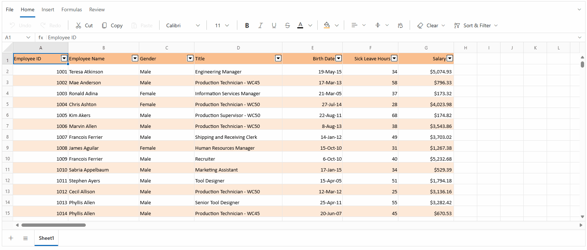

# Selection in Blazor Spreadsheet Component

The selection feature in the  [Blazor Spreadsheet Editor](https://www.syncfusion.com/spreadsheet-editor-sdk/blazor-spreadsheet-editor) enables interactive highlighting and manipulation of cells, rows, or columns for data analysis and editing operations. The component supports both mouse and keyboard interactions.

The [Blazor Spreadsheet Editor](https://www.syncfusion.com/spreadsheet-editor-sdk/blazor-spreadsheet-editor) provides the following selection options:

*  **Cell Selection**: Select individual cells or a range of cells.
*  **Row Selection**: Select entire rows.
*  **Column Selection**: Select entire columns.

## Selection via the UI

In the active sheet, selection can be performed in any of the following ways.

* **Mouse Interaction**:
    *   Click a cell to select it.
    *   Click and drag to select a range of cells.
    *   Click a row header to select that row.
    *   Click a column header to select that column.
    *   Click and drag across row headers to select adjacent rows.
    *   Click and drag across column headers to select adjacent columns.
    *   Hold **Ctrl** and click additional row or column headers to add non-adjacent rows or columns to the selection.

* **Keyboard Navigation**:
   * Use **Arrow** keys to navigate between cells.
   * Use **Shift + Arrow** keys for range selection.
   * Use **Ctrl + Click** for non-adjacent cell selections.

* **Name Box**: Enter a cell reference (for example, `C5`) or a range (for example, `A1:E5`) in the Name Box and press **Enter** to select the specified range.

N> When the active worksheet is protected, selection is restricted to the cells that have been marked as selectable in the worksheet protection configuration. For more details, refer to the [Worksheet Protection](./protection#protect-sheet) documentation.

## Cell Selection

The [Blazor Spreadsheet Editor](https://www.syncfusion.com/spreadsheet-editor-sdk/blazor-spreadsheet-editor) component allows selecting individual cells or ranges of cells for various data operations. Cell selection forms the foundation of most Spreadsheet interactions and is the basis for data entry and formatting.

* **Single cell selection** focuses on a specific cell for data entry or formatting tasks.
* **Range selection** enables multiple adjacent cells to be selected for batch operations such as formatting, data entry, or calculations.
* **Multiple range selection** selects non-adjacent cells or ranges, making it possible to apply operations to scattered data within the sheet.

**Selecting ranges via the UI**

To select non-adjacent ranges:

1. Select the first cell or range using any of the above methods.
2. Hold **Ctrl** and click additional cells, or drag to select additional ranges.
3. Each selected range is highlighted independently.
4. The **Name Box** displays the first selected cell reference.

## Row selection

The row selection feature allows entire rows to be selected for operations such as formatting or insertion. This selection type is especially useful when working with complete records or data entries.

**Selecting rows via the UI**

The row selection operation can be performed using the following methods:

* **Adjacent rows**: Click the first row header, then drag to the last desired row header.
* **Adjacent rows with keyboard**: Click the first row header, then hold **Shift** and click the last row header.
* **Non-adjacent rows**: Hold **Ctrl** while clicking individual row headers.
* **Range with keyboard**: Use **Shift + Arrow** keys after selecting the initial row.

## Column selection

The column selection feature allows entire columns to be selected for operations such as formatting and sorting. This selection type is essential for working with data fields or attributes.

**Selecting columns via the UI**

The column selection operation can be performed using the following methods:

* **Adjacent columns**: Click the first column header, then drag to the last desired column header.
* **Adjacent columns with keyboard**: Click the first column header, then hold **Shift** and click the last column header.
* **Non-adjacent columns**: Hold **Ctrl** while clicking individual column headers.
* **Range with keyboard**: Use **Shift + Arrow** keys after selecting the initial column.

## Programmatic Selection

The [Blazor Spreadsheet Editor](https://www.syncfusion.com/spreadsheet-editor-sdk/blazor-spreadsheet-editor) component supports programmatic selection for cells, rows, and columns using the [SelectRangeAsync()](https://help.syncfusion.com/cr/blazor/Syncfusion.Blazor.Spreadsheet.SfSpreadsheet.html#Syncfusion_Blazor_Spreadsheet_SfSpreadsheet_SelectRangeAsync_System_String_) method. This method accepts various range formats and selection patterns.




@page "/"
@using Syncfusion.Blazor.Spreadsheet
@using Syncfusion.Blazor.Buttons

<SfButton OnClick="SelectRangeHandler" Content="Select Range"></SfButton>

<SfSpreadsheet DataSource="DataSourceBytes" @ref="SpreadsheetInstance">
    <SpreadsheetRibbon></SpreadsheetRibbon>
</SfSpreadsheet>

@code {

    public byte[] DataSourceBytes { get; set; }

    public SfSpreadsheet SpreadsheetInstance { get; set; }

    protected override void OnInitialized()
    {
        string filePath = "wwwroot/Sample.xlsx";
        DataSourceBytes = File.ReadAllBytes(filePath);
    }

    public async Task SelectRangeOnSheet()
    {
        await SpreadsheetInstance.SelectRangeAsync("A5:GR5");
    }
}




The following image illustrates the comprehensive selection capabilities available in the Blazor Spreadsheet component, including cell, row, and column selection using both mouse and keyboard interactions.

N> Looking for the full Blazor Spreadsheet Editor component overview, features, pricing, and documentation? Visit the [Blazor Spreadsheet Editor](https://www.syncfusion.com/spreadsheet-editor-sdk/blazor-spreadsheet-editor) page

