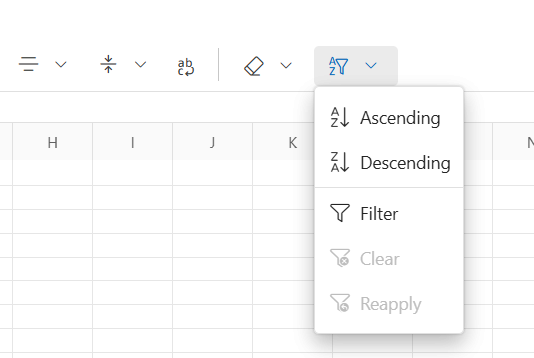
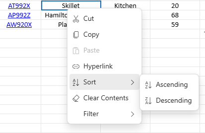
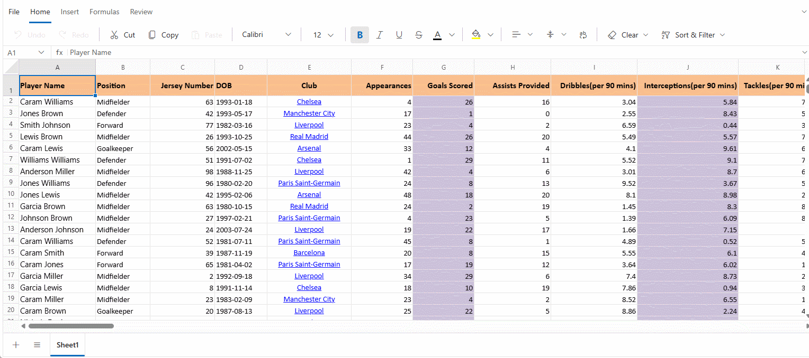

# Sorting in Blazor Spreadsheet Component

The Blazor Spreadsheet component provides built-in sorting functionality that enables users to organize worksheet data in either ascending or descending order. This feature helps improve readability and simplifies data analysis by arranging content according to selected columns. The sorting behavior is controlled by the [`AllowSorting`](https://help.syncfusion.com/cr/blazor/Syncfusion.Blazor.Spreadsheet.SfSpreadsheet.html#Syncfusion_Blazor_Spreadsheet_SfSpreadsheet_AllowSorting) property, which is set to `true` by default. When `AllowSorting` is set to `false`, all sorting options are removed from the interface, including the Ribbon and Context Menu, and related API methods become inactive. Additionally, sorting is disabled if the worksheet is protected. For more information on worksheet protection, refer to the [worksheet protection documentation](./protection#protect-sheet).

## Sort Operations

The component supports two types of sort orders that help organize data for analysis and presentation:

*   **Ascending**: Arranges data from lowest to highest (e.g., A to Z, 0 to 9).
*   **Descending**: Arranges data from highest to lowest (e.g., Z to A, 9 to 0).

### Sort via UI

Sorting can be performed through the user interface (UI) using any of the following methods:

**Using the Ribbon**

- Select a cell or range of cells to sort.
- Click the **Home** tab in the **Ribbon**.
- Click the **Sort & Filter** icon.
- Choose either **Sort Ascending** or **Sort Descending** from the dropdown menu.

**Using the Context Menu**

- Select a cell or a range of cells to sort.
- Right-click the selected range to open the context menu.
- Hover over the **Sort** option.
- Select either **Ascending** or **Descending** from the submenu.

**Using the Filter Dialog**

If filtering is enabled, sorting can also be performed using the filter dialog. This adds another layer of flexibility by allowing users to sort data directly through the filtered view. For more details on how filtering works in the Blazor Spreadsheet component, refer to the [filtering documentation](./filtering).

- Apply a **Filter** to the desired column.
- Click the filter icon in a column header.
- In the filter dialog, choose either **Sort Ascending** or **Sort Descending**.
- The sort operation is applied to the entire used range based on the selected column.

### Sort by active cell

When a sort operation is performed without an explicitly selected range, the component automatically identifies the **used range** of the worksheet. The used range includes all contiguous cells that contain data. Sorting is applied to this entire range using the column of the **active cell** as the sort key.

The **sort key** is the column whose values determine the order of the rows during sorting. It compares the values in this column and rearranges the rows accordingly.

This behavior ensures that the entire dataset is sorted cohesively, preserving row integrity and preventing data misalignment.

**Example**

If the **active cell** is located in **Column C** and no range is selected, it's sorts all rows within the used range based on the values in **Column C**.

### Sorting a Selected Range

When a specific cell range is selected, the sort operation is restricted to that range. The column of the active cell within the selected range is used as the sort key. This method allows for targeted sorting of a subset a data without affecting the rest of the worksheet.

**Example**

If the range **B2:D10** is selected and the active cell is in **Column D**, the component sorts only the rows within **B2:D10** based on the values in **Column D**.

### Sort via programmatically

The [SortRangeAsync](https://help.syncfusion.com/cr/blazor/Syncfusion.Blazor.Spreadsheet.SfSpreadsheet.html#Syncfusion_Blazor_Spreadsheet_SfSpreadsheet_SortRangeAsync_System_String_Syncfusion_Blazor_Spreadsheet_SortDirection_) method enables sorting of a specified range of cells based on the values in a specific column. This method provides a programmatic way to sort data without using the UI. The available parameters in the `SortRangeAsync` method are:

| **Parameter**     | **Type**                   | **Description** |
|-------------------|----------------------------|-----------------|
| selectedRange   | string *(optional)*       | Specifies the address of the cell range to sort. If not provided, the currently selected range in the active worksheet is used. The range must follow the standard Excel format (e.g., `"B2:C5"`). Sorting is based on the first column within the specified range. |
| sortDirection   | SortDirection *(optional)* | Defines the direction in which data is sorted. Accepts values from the `SortDirection` enumeration. If unspecified, the default is **SortDirection.Ascending**.  **Possible values:** • **SortDirection.Ascending** – Sorts data in ascending order. • **SortDirection.Descending** – Sorts data in descending order. |




@using Syncfusion.Blazor.Spreadsheet

<button @onclick="SortData">Sort</button>

<SfSpreadsheet @ref="SpreadsheetInstance" DataSource="DataSourceBytes">
    <SpreadsheetRibbon></SpreadsheetRibbon>
</SfSpreadsheet>

@code {
    public byte[] DataSourceBytes { get; set; }
    public SfSpreadsheet SpreadsheetInstance;

    protected override void OnInitialized()
    {
        string filePath = "wwwroot/Sample.xlsx";
        DataSourceBytes = File.ReadAllBytes(filePath);
    }

    public async Task SortData()
    {
        // Sorts the range B2:D5 in ascending order based on values in "Column B".
        await SpreadsheetInstance.SortRangeAsync("B2:D5", SortDirection.Ascending);
    }
}



