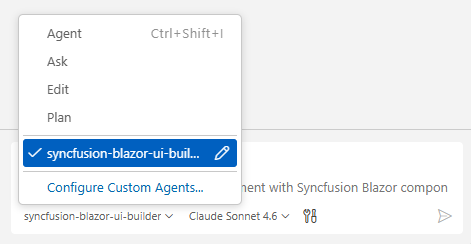

# Syncfusion® Blazor UI Builder Skill with Spreadsheet for AI Assistants

**Syncfusion® Blazor UI Builder Skill** is an AI-powered skill and companion agent that accelerates Blazor Spreadsheet application development by transforming natural-language UI requirements into production-ready components using Syncfusion® Blazor UI libraries. 

Integrated with your AI-powered IDE, it leverages deep knowledge of **Syncfusion® Spreadsheet** to deliver accurate and ready-to-use code.
By combining intelligent code generation with best practices, accessibility standards, and design-system consistency, Blazor UI Builder helps you rapidly build scalable spreadsheet applications and user interfaces without leaving your development workflow.

## Prerequisites

Before installing Blazor UI Builder Skill with Spreadsheet, ensure the following:

- Active **Blazor Project** (Blazor WebAssembly or Blazor Server) using .NET 8 or later
- Microsoft **.NET SDK 8.0 or later** with .NET CLI tools installed
- Required [Node.js](https://nodejs.org/en) version ≥ 18
- **Agent Package Manager** (APM) installed — follow [Installation Guidelines](https://microsoft.github.io/apm/quickstart/#1-install-apm)
- A supported AI agent or IDE that integrates with the Skills (VS Code, Cursor, Syncfusion® Code Studio, etc.)
- Active Syncfusion<sup style="font-size:70%">&reg;</sup> license (any of the following):  
  - [Commercial](https://www.syncfusion.com/sales/unlimitedlicense)  
  - [Community License](https://www.syncfusion.com/products/communitylicense)  
  - [Free Trial](https://www.syncfusion.com/account/manage-trials/start-trials)

## Key Benefits

### AI-Driven UI Generation
- Converts prompts into complete Blazor components—not just snippets
- Automatically selects appropriate Syncfusion® Spreadsheet features (formulas, formatting, data binding, etc.)
- Produces structured, maintainable code

### Component Usage & API Accuracy
- Uses correct Syncfusion® Spreadsheet APIs
- Injects required feature modules (sorting, filtering, number formatting, etc.)
- Avoids unsupported or deprecated patterns

### Patterns & Best Practices
- Recommended component composition and Blazor lifecycle integration
- Event handling aligned with Blazor standards
- Secure and scalable coding patterns for data-driven applications

### Accessibility & Responsiveness
- WCAG 2.1 AA–aligned output
- Semantic HTML with ARIA support
- Mobile-first responsive layouts

### Design-System Integration
- Supports Tailwind, Bootstrap, Material, or custom themes
- Ensures consistent Syncfusion® styling and theme usage

## Installation

Before installing Blazor UI Builder Skill with Spreadsheet, ensure that APM (Agent Package Manager) is installed and available in your environment.

### Verify APM Installation

Run the following command to confirm APM is installed:

```bash
apm --version
```

### Install the Syncfusion® Blazor UI Builder Skill with Spreadsheet package using APM

Use the APM CLI to install the Blazor UI Builder Skill with Spreadsheet for your preferred environment:




apm install syncfusion/blazor-ui-builder -t copilot

 



apm install syncfusion/blazor-ui-builder -t cursor





apm install syncfusion/blazor-ui-builder -t codex





apm install syncfusion/blazor-ui-builder -t claude




After installation, the following artifacts are added to your project for the GitHub Copilot target:

- `.agent/skills/` – contains the skill files
- `.github/agents/` – contains the agent configuration

Refer to the [documentation](https://microsoft.github.io/apm/reference/cli/targets/#detection-signals) for details about supported deployment targets.

N> For [Syncfusion® Code Studio](https://help.syncfusion.com/code-studio/reference/configure-properties/custom-agents#predefined-agents), use the Copilot command above to install the Blazor UI Builder.

After installing the skill, run `dotnet restore` to ensure all Syncfusion Blazor packages referenced by the generated components are available in your project.

## How the Syncfusion® Blazor UI Builder Skill Works with Spreadsheet

1. **Intent Analysis** - Parse the user's prompt to identify Spreadsheet features, data sources, and high-level layout intent.
2. **Project Detection** - Automatically detects project framework, package manager, existing themes, and Spreadsheet configuration.
3. **Component Mapping** - Map intent to Syncfusion® Spreadsheet components and their required feature modules.
4. **Theming & Design System**  
   Load required theming guidelines and confirm key design choices:
   - CSS framework (Tailwind, Bootstrap, Material, or Greenfield (custom theme)). If no themes detected in the existing project, Greenfield and Syncfusion Tailwind3 theme are shown as the default option—proceed with this or change the theme as preferred.
   - Syncfusion theme (Tailwind3, Bootstrap5, Material3, Fluent2)
   - Light and Dark Mode
   - Core design basics (colors, spacing, typography, responsiveness, accessibility)
5. **Code Generation** - Produce C# Blazor components with Spreadsheet, parameter interfaces, data models, and CSS/styling scaffolding.
6. **Dependency Management** - Recommend or install required Syncfusion® packages and peer dependencies.
7. **Validation** - Run accessibility and basic security checks, request confirmation for changes.
8. **Code Insertion** - Create files or patch existing files following project structure and conventions.

Key enforcement points:

- Adds correct theme and CSS imports for chosen Syncfusion® themes
- Injects only the feature modules required by generated components
- Generates semantic HTML with ARIA attributes and keyboard support
- Avoids unsupported or deprecated API usages for Syncfusion® Spreadsheet

N> The assistant handles most stages automatically and may request confirmation where required.

## Using the AI Assistant

After installing Blazor UI Builder Skill with Spreadsheet and APM, the relevant agent and skill files are added to your project under:

- `.agent/skills/` (skill files)
- `.github/agents/` (Blazor UI builder agent configuration, based on the selected target)

To start using the skill:

1. Open your supported IDE.
2. In the chat panel, select the `syncfusion-blazor-ui-builder-spreadsheet` agent from the **Agent dropdown**.

3. Start prompting the agent with a clear description of your Spreadsheet UI requirements.

N> For Syncfusion® Code Studio, if the UI Builder agent is not shown, ensure that the agent location is configured to use it in the chat, and refer to the [documentation](https://help.syncfusion.com/code-studio/reference/configure-properties/usersettings#agent-file-locations) to configure the agent location properly.

**Example Prompts:**



Build a financial dashboard spreadsheet with quarterly revenue data. Add custom formulas for totals and growth percentages. Use a professional layout with clearly labeled headers.


Create an employee directory using the [Blazor Spreadsheet Editor](https://www.syncfusion.com/spreadsheet-editor-sdk/blazor-spreadsheet-editor) component with columns for Name, Department, and Email. Populate with realistic sample data across departments. Maintain a clean, organized tabular layout with proper formatting, aligned columns, and consistent spacing.



* Generated code follows best practices with accessible, semantic HTML, responsive mobile-first layouts, strong C# typing, and built-in security measures such as input validation and avoidance of embedded secrets.

## Best Practices

Follow these guidelines to get the most out of UI Builder and ensure high-quality, production-ready results:

- **Stay consistent** - Maintain consistent file organization, naming conventions, and coding standards throughout your project.
- **Use advanced AI models** - For best results, use **Claude Sonnet 4.6 or higher** capability models to produce better code quality and more accurate implementations.
- **Review all content and assets before production** - Validate the data sources, formulas, and logic. Ensure compatibility with your existing systems and data models before deployment. Test edge cases and large datasets.

## Troubleshooting

- **APM installation failure**: Refer to this [documentation](https://microsoft.github.io/apm/getting-started/installation/#troubleshooting).

- **Skills not loading**: Ensure the **.agent/** and **.github/agents/** folders exist in your project and that the skill was installed successfully using APM. Verify that the correct agent is selected from the Agent dropdown in your IDE.

- **Component not rendering**: Retry generation using the specific component skill to resolve the issue, and ensure required Syncfusion® packages and themes are properly configured.

- **Syncfusion license banner appears**: Use the licensing skill to correctly register and validate your Syncfusion® license key in the application.


## FAQ

**Which agents/IDEs are supported?**
Any Skills-compatible agent that reads local skill files (Code Studio, VS Code, Cursor, etc.).

**Are skills loaded automatically?**  
Yes. Supported agents automatically load relevant skills based on your query.

**Can I customize the generated styles and formulas?**
Yes - the skill supports choosing Tailwind, Bootstrap, Material, or a custom theme; generated components include clear integration points for style adjustments and formula customization.

**Does it modify files automatically?**
The skill proposes changes and requires confirmation for insertion; automatic dependency installation may be offered depending on agent permissions.

## See also

- [Agent Skills Standards](https://agentskills.io/home)
- [Agent Package Manager](https://microsoft.github.io/apm/getting-started/quick-start/)
 